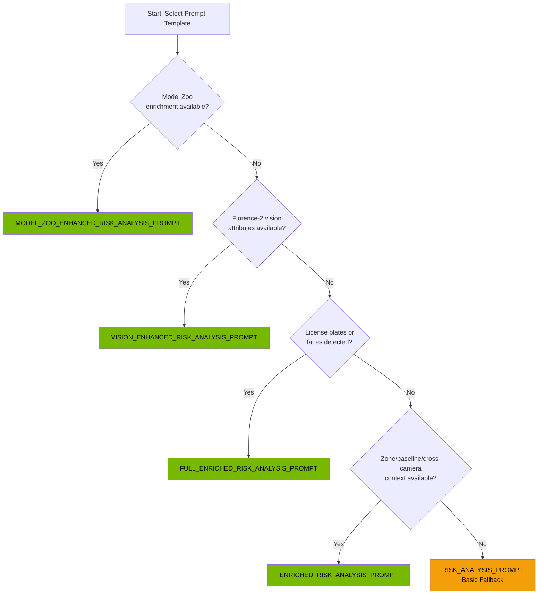

# Risk Analysis

> NVIDIA Nemotron LLM integration for risk scoring and event generation.

**Time to read:** ~15 min
**Prerequisites:** [Batching Logic](batching-logic.md)

---

## What NVIDIA Nemotron Does

[NVIDIA Nemotron](https://huggingface.co/nvidia/Nemotron-3-Nano-30B-A3B-GGUF) analyzes batched detections and generates:

1. Risk score (0-100)
2. Risk level (low/medium/high/critical)
3. Human-readable summary
4. Detailed reasoning explanation
5. Entity-level threat assessments (with enrichment)
6. Recommended actions

---

## Model Options

| Deployment      | Model                                                                                        | File                                    | VRAM     | Context |
| --------------- | -------------------------------------------------------------------------------------------- | --------------------------------------- | -------- | ------- |
| **Production**  | [NVIDIA Nemotron-3-Nano-30B-A3B](https://huggingface.co/nvidia/Nemotron-3-Nano-30B-A3B-GGUF) | `Nemotron-3-Nano-30B-A3B-Q4_K_M.gguf`   | ~14.7 GB | 131,072 |
| **Development** | [Nemotron Mini 4B Instruct](https://huggingface.co/bartowski/nemotron-mini-4b-instruct-GGUF) | `nemotron-mini-4b-instruct-q4_k_m.gguf` | ~3 GB    | 4,096   |

---

## Source Files

- `/ai/nemotron/AGENTS.md` - Comprehensive NVIDIA Nemotron documentation
- `/ai/nemotron/` - Model files and configuration
- `/backend/services/nemotron_analyzer.py` - Analysis service
- `/backend/services/prompts.py` - Prompt templates (5 tiers)

---

## Analysis Flow

```
Batch closed
      |
      v
Load detection details from DB
      |
      v
Format prompt with context
      |
      v
Call Nemotron /completion
      |
      v
Parse JSON response
      |
      v
Validate and normalize
      |
      v
Create Event record
      |
      v
Broadcast via WebSocket
```

---

## Prompt Engineering

### ChatML Format

NVIDIA Nemotron uses ChatML format with special delimiters. All prompts follow this structure:

```
<|im_start|>system
{system message}
<|im_end|>
<|im_start|>user
{user message with detection context}
<|im_end|>
<|im_start|>assistant
{model response begins here}
```

**Stop Tokens**: `["<|im_end|>", "<|im_start|>"]` - Model stops at these tokens.

### Prompt Templates (5 Tiers)

The backend automatically selects the appropriate prompt based on available enrichment data:

| Template          | Constant Name                             | When Used                                          |
| ----------------- | ----------------------------------------- | -------------------------------------------------- |
| **Basic**         | `RISK_ANALYSIS_PROMPT`                    | Fallback when no enrichment available              |
| **Enriched**      | `ENRICHED_RISK_ANALYSIS_PROMPT`           | Zone/baseline/cross-camera context available       |
| **Full Enriched** | `FULL_ENRICHED_RISK_ANALYSIS_PROMPT`      | Enriched + license plates/faces from pipeline      |
| **Vision**        | `VISION_ENHANCED_RISK_ANALYSIS_PROMPT`    | Florence-2 extraction + context enrichment         |
| **Model Zoo**     | `MODEL_ZOO_ENHANCED_RISK_ANALYSIS_PROMPT` | Full model zoo (violence, weather, clothing, etc.) |

### Prompt Template Selection Decision Tree



### Basic Prompt (Fallback)

Used when enrichment services are unavailable:

```python
RISK_ANALYSIS_PROMPT = """<|im_start|>system
You are a home security risk analyzer.
IMPORTANT: Output ONLY a valid JSON object...<|im_end|>
<|im_start|>user
Analyze these detections and output a JSON risk assessment.

Camera: {camera_name}
Time: {start_time} to {end_time}
Detections:
{detections_list}

Risk levels: low (0-29), medium (30-59), high (60-84), critical (85-100)

Output JSON:
{{"risk_score": N, "risk_level": "level", "summary": "text", "reasoning": "text"}}<|im_end|>
<|im_start|>assistant
"""
```

### Enriched Prompt

Adds contextual intelligence:

- **Zone Analysis**: Entry points, high-security areas
- **Baseline Comparison**: Expected vs. actual activity patterns
- **Deviation Score**: 0 (normal) to 1 (highly unusual)
- **Cross-Camera Correlation**: Activity seen on other cameras

### Full Enriched Prompt

All enriched context plus vision pipeline results:

- **License Plates**: Known vs. unknown vehicles
- **Face Detections**: Presence of identifiable faces
- **OCR Text**: Text recognized in images

### Vision Enhanced Prompt

Florence-2 vision-language model attributes:

- **Person Attributes**: Clothing, carrying items, actions
- **Vehicle Attributes**: Color, type, commercial markings
- **Re-Identification Context**: Track entities across cameras
- **Scene Analysis**: Environment description
- **Service Worker Detection**: Lower risk for delivery/utility workers

### Model Zoo Enhanced Prompt

Comprehensive enrichment from full model zoo:

- **Violence Detection**: ViT violence classifier alerts
- **Weather Context**: Visibility and weather conditions
- **Clothing Analysis**: FashionCLIP + SegFormer (suspicious attire, face coverings)
- **Vehicle Classification**: Type, commercial status, damage
- **Pet Detection**: False positive filtering for household pets
- **Pose Analysis**: Crouching, running, lying detection
- **Action Recognition**: Security-relevant behaviors
- **Image Quality**: Blur, noise, tampering indicators

---

## Context Provided to LLM

Depending on the prompt template selected, NVIDIA Nemotron receives:

**Basic Context:**

1. **Camera Name**: Human-readable identifier (e.g., "front_door")
2. **Time Window**: ISO format timestamps
3. **Detection List**: Timestamps, object types, confidence scores

**Enriched Context Additions:** 4. **Day of Week**: Weekday/weekend patterns 5. **Zone Analysis**: Which security zones triggered 6. **Baseline Comparison**: Historical activity patterns 7. **Deviation Score**: Statistical anomaly measure 8. **Cross-Camera Activity**: Correlated detections

**Vision Context Additions:** 9. **Detailed Attributes**: Per-detection clothing, colors, actions 10. **Re-ID Context**: Entity tracking across cameras 11. **Scene Analysis**: Environment and lighting description

**Model Zoo Context Additions:** 12. **Violence Alerts**: Explicit violence detection flags 13. **Weather/Visibility**: Environmental conditions 14. **Clothing Segmentation**: Face covering detection 15. **Vehicle Damage**: Security-relevant vehicle damage 16. **Pet Classifications**: False positive filtering

---

## API Call

**Endpoint:** `POST http://localhost:8091/completion`

**Request:**

```json
{
  "prompt": "<ChatML formatted prompt>",
  "temperature": 0.7,
  "top_p": 0.95,
  "max_tokens": 1536,
  "stop": ["<|im_end|>", "<|im_start|>"]
}
```

**Response:**

```json
{
  "content": "<think>Analyzing detections...</think>{\"risk_score\": 65, ...}",
  "model": "Nemotron-3-Nano-30B-A3B-Q4_K_M.gguf",
  "tokens_predicted": 287,
  "tokens_evaluated": 1245
}
```

**Note:** NVIDIA Nemotron-3-Nano outputs `<think>...</think>` reasoning blocks before the JSON response. The backend strips these before parsing.

---

## Output Format

The LLM produces JSON:

```json
{
  "risk_score": 65,
  "risk_level": "high",
  "summary": "Unknown person detected approaching front door at night",
  "reasoning": "Single person detection at 2:15 AM is unusual.
               The person appeared to be approaching the entrance.
               Time of day and approach pattern warrant elevated concern."
}
```

---

## Risk Level Mapping

| Score Range | Level      | Description                        |
| ----------- | ---------- | ---------------------------------- |
| 0-29        | `low`      | Normal activity, no concern        |
| 30-59       | `medium`   | Unusual but not threatening        |
| 60-84       | `high`     | Suspicious, needs attention        |
| 85-100      | `critical` | Potential threat, immediate action |

### Risk Level State Diagram

```mermaid
stateDiagram-v2
    direction LR

    [*] --> LOW: score 0-29
    [*] --> MEDIUM: score 30-59
    [*] --> HIGH: score 60-84
    [*] --> CRITICAL: score 85-100

    state LOW {
        note right of LOW
            Normal activity
            No concern
            No alert triggered
        end note
    }

    state MEDIUM {
        note right of MEDIUM
            Unusual activity
            Not threatening
            Optional notification
        end note
    }

    state HIGH {
        note right of HIGH
            Suspicious activity
            Needs attention
            Alert triggered
        end note
    }

    state CRITICAL {
        note right of CRITICAL
            Potential threat
            Immediate action
            Priority alert
        end note
    }

    LOW --> [*]: Event processed
    MEDIUM --> [*]: Event processed
    HIGH --> [*]: Event processed
    CRITICAL --> [*]: Event processed
```

---

## Validation and Normalization

The `_validate_risk_data()` method ensures valid output:

```python
def _validate_risk_data(self, data: dict) -> dict:
    # Validate risk_score (0-100, integer)
    risk_score = data.get("risk_score", 50)
    risk_score = max(0, min(100, int(risk_score)))

    # Validate risk_level
    valid_levels = ["low", "medium", "high", "critical"]
    risk_level = str(data.get("risk_level", "medium")).lower()

    if risk_level not in valid_levels:
        # Infer from risk_score
        if risk_score < 30:
            risk_level = "low"
        elif risk_score < 60:
            risk_level = "medium"
        elif risk_score < 85:
            risk_level = "high"
        else:
            risk_level = "critical"

    return {
        "risk_score": risk_score,
        "risk_level": risk_level,
        "summary": data.get("summary", "Risk analysis completed"),
        "reasoning": data.get("reasoning", "No detailed reasoning provided"),
    }
```

---

## JSON Extraction

LLM output may contain extra text. The analyzer extracts JSON using regex:

```python
json_pattern = r"\{[^{}]*(?:\{[^{}]*\}[^{}]*)*\}"
matches = re.findall(json_pattern, text, re.DOTALL)
```

---

## Fallback Behavior

When LLM analysis fails, default values are used:

```python
{
    "risk_score": 50,
    "risk_level": "medium",
    "summary": "Analysis unavailable - LLM service error",
    "reasoning": "Failed to analyze detections due to service error"
}
```

---

## Error Handling

| Error                  | Response           | Recovery      |
| ---------------------- | ------------------ | ------------- |
| Batch not found        | Raise `ValueError` | Skip batch    |
| Nemotron unreachable   | Use fallback       | Event created |
| Nemotron timeout (60s) | Use fallback       | Event created |
| Invalid LLM JSON       | Use fallback       | Event created |

---

## Performance

| Metric              | Production (30B)      | Development (4B)       |
| ------------------- | --------------------- | ---------------------- |
| Inference time      | 2-5 seconds per batch | 1-3 seconds per batch  |
| Token generation    | ~50-100 tokens/second | ~100-200 tokens/second |
| Context processing  | ~1000 tokens/second   | ~2000 tokens/second    |
| Concurrent requests | 1-2 (configured)      | 2-4 (configurable)     |
| VRAM usage          | ~14.7 GB              | ~3 GB                  |
| Context window      | 131,072 tokens (128K) | 4,096 tokens           |

The production 30B model enables analyzing significantly more context (hours of detection history vs. minutes with 4B).

---

## Event Database Model

```sql
CREATE TABLE events (
    id SERIAL PRIMARY KEY,
    batch_id VARCHAR NOT NULL,
    camera_id VARCHAR NOT NULL,
    started_at TIMESTAMP NOT NULL,
    ended_at TIMESTAMP NOT NULL,
    risk_score INTEGER NOT NULL,
    risk_level VARCHAR NOT NULL,
    summary TEXT,
    reasoning TEXT,
    detection_ids TEXT,  -- JSON array
    reviewed BOOLEAN DEFAULT FALSE,
    notes TEXT,
    is_fast_path BOOLEAN DEFAULT FALSE
);
```

---

## WebSocket Broadcast

After event creation, broadcast to all connected clients:

```python
await self.broadcaster.broadcast_event({
    "type": "new_event",
    "event": event.to_dict()
})
```

Clients receive:

```json
{
  "type": "new_event",
  "event": {
    "id": 42,
    "camera_id": "front_door",
    "risk_score": 65,
    "risk_level": "high",
    "summary": "Unknown person detected...",
    "started_at": "2025-12-28T14:30:00",
    "ended_at": "2025-12-28T14:31:30"
  }
}
```

---

## Next Steps

- [Pipeline Overview](pipeline-overview.md) - Full pipeline context
- [Batching Logic](batching-logic.md) - Batch aggregation details

---

## See Also

- [NVIDIA Nemotron AGENTS.md](/ai/nemotron/AGENTS.md) - Comprehensive model documentation
- [Risk Levels Reference](../reference/config/risk-levels.md) - Canonical risk level definitions
- [AI Overview](../operator/ai-overview.md) - NVIDIA Nemotron deployment
- [Alerts](alerts.md) - How risk scores trigger alerts
- [Understanding Alerts](../ui/understanding-alerts.md) - User-friendly risk level guide

## External Resources

- [NVIDIA Nemotron-3-Nano-30B-A3B on HuggingFace](https://huggingface.co/nvidia/Nemotron-3-Nano-30B-A3B-GGUF)
- [Nemotron Mini 4B Instruct on HuggingFace](https://huggingface.co/bartowski/nemotron-mini-4b-instruct-GGUF)
- [llama.cpp GitHub Repository](https://github.com/ggerganov/llama.cpp)

---

[Back to Developer Hub](README.md)
