# Contributing Guide

Thank you for contributing to Home Security Intelligence! This guide covers the development workflow, code standards, and review process.

## Code of Conduct

Be respectful, professional, and constructive in all interactions. Focus on the code, not the person.

## Getting Started

1. Set up your development environment following [setup.md](setup.md)
2. Read [CLAUDE.md](../../CLAUDE.md) for project rules and conventions
3. Review the [testing guide](testing.md) to understand test requirements

## Development Workflow

```mermaid
%%{init: {
  'theme': 'dark',
  'themeVariables': {
    'primaryColor': '#3B82F6',
    'primaryTextColor': '#FFFFFF',
    'primaryBorderColor': '#60A5FA',
    'secondaryColor': '#A855F7',
    'tertiaryColor': '#009688',
    'background': '#121212',
    'mainBkg': '#1a1a2e',
    'lineColor': '#666666'
  }
}}%%
flowchart LR
    subgraph Linear["Task Tracking"]
        CLAIM["Claim task<br/>In Progress"]
    end

    subgraph Local["Local Development"]
        BRANCH["Create branch"]
        CODE["Implement"]
        TEST["Write tests"]
        COMMIT["Commit"]
    end

    subgraph Remote["GitHub"]
        PUSH["Push"]
        PR["Create PR"]
        REVIEW["Review"]
        MERGE["Merge"]
    end

    CLAIM --> BRANCH --> CODE --> TEST --> COMMIT --> PUSH --> PR --> REVIEW --> MERGE

    style CLAIM fill:#76B900,stroke:#84CC16,color:#FFFFFF
    style TEST fill:#3B82F6,stroke:#60A5FA,color:#FFFFFF
    style REVIEW fill:#A855F7,stroke:#C084FC,color:#FFFFFF
    style MERGE fill:#16A34A,stroke:#22C55E,color:#FFFFFF
```



### 1. Claim a Task

This project uses **Linear** for issue tracking:

- **Workspace:** [nemotron-v3-home-security](https://linear.app/nemotron-v3-home-security)
- **Team:** NEM
- **Issue format:** NEM-123

```bash
# Find available work
# Visit: https://linear.app/nemotron-v3-home-security/team/NEM/active

# Filter by phase
# Visit: https://linear.app/nemotron-v3-home-security/team/NEM/label/phase-3

# View and claim tasks via Linear web interface or MCP tools
# Use mcp__linear__get_issue(issueId="NEM-123") to view details
# Use mcp__linear__update_issue(issueId="NEM-123", status="<In Progress UUID>") to claim
```

### One Task Per PR

**Each PR should address exactly ONE Linear issue.**

- PR title must reference the issue ID: `fix: description (NEM-123)`
- If you discover multiple issues, create separate Linear issues
- Commit messages should reference the issue: `fix(NEM-123): description`

See [CLAUDE.md](../../CLAUDE.md) for the complete one-task-one-PR policy.

### Closing a Task

**Before closing any issue, run validation:**

```bash
# Quick validation (recommended)
./scripts/validate.sh

# If all tests pass, mark as Done in Linear
# Use Linear web interface or MCP tools:
# mcp__linear__update_issue(issueId="NEM-123", status="38267c1e-4458-4875-aa66-4b56381786e9")
```

If tests fail, fix the issue and re-run before closing. See [CLAUDE.md](../../CLAUDE.md) for the complete closure checklist.

### 2. Create a Feature Branch

Branch naming convention:

```bash
# Feature branches
git checkout -b feature/camera-grid-pagination

# Bug fixes
git checkout -b fix/websocket-reconnect

# Refactoring
git checkout -b refactor/batch-aggregator

# Documentation
git checkout -b docs/api-reference
```

### 3. Make Changes

Follow TDD principles (RED-GREEN-REFACTOR):

1. **RED:** Write a failing test first (for `tdd` labeled tasks)
2. **GREEN:** Write minimum code to pass the test
3. **REFACTOR:** Improve code while keeping tests green

For complex features, use the `/superpowers:test-driven-development` skill.

See [testing-workflow.md](testing-workflow.md) for detailed TDD patterns by layer.

### 4. Commit Changes

#### Pre-commit Hooks

All commits must pass pre-commit hooks. **Never bypass them.**

| Hook        | Stage      | Purpose                |
| ----------- | ---------- | ---------------------- |
| ruff        | pre-commit | Python linting         |
| ruff-format | pre-commit | Python formatting      |
| mypy        | pre-commit | Python type checking   |
| eslint      | pre-commit | TypeScript linting     |
| prettier    | pre-commit | Code formatting        |
| hadolint    | pre-commit | Dockerfile linting     |
| semgrep     | pre-commit | Security scanning      |
| fast-test   | pre-push   | Unit tests before push |

```bash
# Hooks run automatically on commit
git commit -m "feat: add camera pagination"

# If hooks fail, fix the issues
ruff check --fix backend/
cd frontend && npm run lint:fix

# Run all pre-commit hooks manually
pre-commit run --all-files
```

**CRITICAL: Do NOT use:**

- `git commit --no-verify`
- `git push --no-verify`
- `SKIP=hook-name git commit` (except emergencies)

See [CLAUDE.md](../../CLAUDE.md) and [git-workflow.md](git-workflow.md) for the complete policy.

#### Commit Message Format

Use conventional commit format:

```
<type>(<scope>): <description>

[optional body]

[optional footer]
```

**Types:**

| Type       | Description                             |
| ---------- | --------------------------------------- |
| `feat`     | New feature                             |
| `fix`      | Bug fix                                 |
| `docs`     | Documentation only                      |
| `style`    | Formatting, no code change              |
| `refactor` | Code change that neither fixes nor adds |
| `perf`     | Performance improvement                 |
| `test`     | Adding or correcting tests              |
| `chore`    | Maintenance tasks                       |

**Examples:**

```bash
# Feature
git commit -m "feat(cameras): add pagination to camera list endpoint"

# Bug fix
git commit -m "fix(websocket): handle reconnection on network failure"

# Documentation
git commit -m "docs(api): add websocket channel documentation"

# Test
git commit -m "test(events): add integration tests for event filtering"
```

### 5. Push and Create PR

```bash
# Push to remote
git push -u origin feature/camera-grid-pagination

# Create PR using GitHub CLI
gh pr create --title "feat(cameras): add pagination" --body "..."
```

## Pull Request Process

### PR Requirements

Before submitting a PR:

- [ ] All pre-commit hooks pass
- [ ] All tests pass locally
- [ ] Code coverage meets thresholds (85% unit, 95% combined)
- [ ] No new linting warnings
- [ ] TypeScript compiles without errors
- [ ] Documentation updated if needed

### PR Template

```markdown
## Summary

Brief description of changes (1-2 sentences).

## Linear Issue Reference

- Issue ID: `NEM-123` (or N/A for trivial fixes)
- [ ] This PR addresses exactly ONE Linear issue

## Changes

- Added camera pagination endpoint
- Updated frontend to use paginated API
- Added unit and integration tests

## Test Plan

- [ ] Unit tests pass: `pytest backend/tests/unit/ -v`
- [ ] Integration tests pass: `pytest backend/tests/integration/ -v`
- [ ] Frontend tests pass: `cd frontend && npm test`
- [ ] Validation script passes: `./scripts/validate.sh`
- [ ] Manual testing completed

## Screenshots (if UI changes)

[Add screenshots here]

## Related Issues

Closes #123
```

### CI Checks

All CI jobs must pass before merge:

| Job                       | Required | Description            |
| ------------------------- | -------- | ---------------------- |
| Backend Lint              | Yes      | Ruff check and format  |
| Backend Type Check        | Yes      | MyPy                   |
| Backend Unit Tests        | Yes      | 85% coverage threshold |
| Backend Integration Tests | Yes      | Combined 95% threshold |
| Frontend Lint             | Yes      | ESLint                 |
| Frontend Type Check       | Yes      | TypeScript compilation |
| Frontend Tests            | Yes      | Vitest                 |
| Frontend E2E              | Yes      | Playwright             |
| Build Docker Images       | Yes      | Verify builds succeed  |
| Security Validation       | Yes      | Admin endpoint checks  |

### Code Review

#### For Authors

- Keep PRs focused and small (<400 lines preferred)
- Respond to feedback promptly
- Request re-review after making changes
- Don't merge until approved

#### For Reviewers

Focus on:

- **Correctness** - Does the code do what it claims?
- **Tests** - Are edge cases covered?
- **Performance** - Any obvious performance issues?
- **Security** - Any security concerns?
- **Maintainability** - Is the code readable and maintainable?

Use constructive language:

```markdown
# Good

Consider using `async with` here for proper cleanup.

# Avoid

This is wrong. Use `async with`.
```

## Code Standards

For comprehensive documentation on all code quality tools, configuration, and commands, see [Code Quality Tools](code-quality.md).

### Python (Backend)

Configuration in [pyproject.toml](../../pyproject.toml:7):

```toml
[tool.ruff]
target-version = "py314"
line-length = 100
src = ["backend"]

[tool.ruff.lint]
select = [
    "E",      # pycodestyle errors
    "W",      # pycodestyle warnings
    "F",      # Pyflakes
    "I",      # isort
    "B",      # flake8-bugbear
    "UP",     # pyupgrade
    "ASYNC",  # flake8-async
    "S",      # flake8-bandit (security)
]
```

Key rules:

- **Line length:** 100 characters
- **Imports:** Sorted by isort
- **Type hints:** Required for all public functions
- **Docstrings:** Required for modules, classes, and public functions
- **Async:** Use async/await for all I/O operations

### TypeScript (Frontend)

- **Line length:** 100 characters
- **Formatting:** Prettier
- **Linting:** ESLint with strict TypeScript rules
- **Components:** Functional components with hooks
- **Styling:** Tailwind CSS with design system

### Documentation

- Use Markdown for all documentation
- Include YAML frontmatter with `source_refs`
- Link to source code where relevant
- Follow [Diagram Style Guide](../style-guides/diagrams.md) for Mermaid conventions
- See [Visual Style Guide](../images/style-guide.md) for colors and design

## File Organization

### Backend

```
backend/
├── api/routes/        # FastAPI endpoints
├── api/schemas/       # Pydantic schemas
├── core/              # Infrastructure (config, database, redis)
├── models/            # SQLAlchemy models
├── services/          # Business logic
└── tests/
    ├── unit/          # Unit tests
    └── integration/   # Integration tests
```

### Frontend

```
frontend/
├── src/
│   ├── components/    # React components
│   ├── hooks/         # Custom hooks
│   ├── services/      # API client
│   └── types/         # TypeScript types
└── tests/
    └── e2e/           # Playwright tests
```

## Task Management

### Using Linear

```bash
# Session workflow
# 1. Find available work:
#    https://linear.app/nemotron-v3-home-security/team/NEM/active

# 2. Filter by phase:
#    https://linear.app/nemotron-v3-home-security/team/NEM/label/phase-N

# 3. Claim task (set to "In Progress"):
#    Use Linear web interface or MCP tools

# 4. Implement feature...

# 5. Complete task (set to "Done"):
#    Use Linear web interface or MCP tools

# 6. Push changes:
git push
```

### Task Labels

| Label     | Description                        |
| --------- | ---------------------------------- |
| `phase-1` | Project setup (P0)                 |
| `phase-2` | Database & layout foundation (P1)  |
| `phase-3` | Core APIs & components (P2)        |
| `phase-4` | AI pipeline (P3/P4)                |
| `phase-5` | Events & real-time (P4)            |
| `phase-6` | Dashboard components (P3)          |
| `phase-7` | Pages & modals (P4)                |
| `phase-8` | Integration & E2E (P4)             |
| `tdd`     | Test tasks (write tests alongside) |

## Git Safety

### NEVER DISABLE TESTING

This rule is non-negotiable:

- Do NOT disable test hooks
- Do NOT lower coverage thresholds
- Do NOT skip tests without documented reason
- Do NOT use `--no-verify` flags

**If tests fail, fix the code or fix the tests.**

See [git-workflow.md](git-workflow.md) for the complete Git safety protocol.

## Python Dependencies (uv)

This project uses **uv** for Python dependency management:

```bash
# Install uv
curl -LsSf https://astral.sh/uv/install.sh | sh

# Sync dependencies
uv sync --extra dev              # Install all dev dependencies
uv sync --group lint             # Install only lint tools
uv sync --group test             # Install only test tools

# Add dependencies
uv add httpx                     # Production dependency
uv add --dev pytest-sugar        # Dev dependency

# Run commands
uv run pytest backend/tests/     # Run tests
uv run ruff check backend/       # Run linter

# Update lock file
uv lock                          # After editing pyproject.toml
```

**Key Files:**

- `pyproject.toml` - Dependencies and tool configuration
- `uv.lock` - Locked dependency versions (commit this)
- `.python-version` - Python version (3.14)

**CI pins uv version `0.9.18`** for reproducibility.

## Security Guidelines

### Never Commit

- `.env` files with real credentials
- API keys or tokens
- Private keys or certificates
- Database connection strings with passwords

### Code Security

- Validate all user input
- Use parameterized queries (SQLAlchemy handles this)
- Sanitize file paths (prevent traversal)
- Rate limit API endpoints
- Log security-relevant events

## Getting Help

- **Documentation:** Start with AGENTS.md files in each directory
- **Issues:** Check existing issues before creating new ones
- **Discussions:** Use GitHub Discussions for questions

## Developer Tools

Setup guides for AI-assisted development and debugging tools.

| Document                                                            | Purpose                                        |
| ------------------------------------------------------------------- | ---------------------------------------------- |
| [Chrome DevTools MCP](../developer/contributing/chrome-devtools.md) | Browser debugging via Chrome DevTools Protocol |
| [GitHub Copilot Setup](../developer/contributing/copilot-setup.md)  | GitHub Copilot Free tier configuration         |
| [GitHub Models](../developer/contributing/github-models.md)         | GitHub Models API for AI-powered workflows     |
| [Linear Setup](../developer/contributing/linear-setup.md)           | Linear MCP server installation                 |
| [Linear-GitHub Sync](../developer/contributing/linear-github.md)    | Synchronizing Linear and GitHub Issues         |

## Related Documentation

| Document                                           | Purpose                              |
| -------------------------------------------------- | ------------------------------------ |
| [Setup Guide](setup.md)                            | Development environment setup        |
| [Testing Guide](testing.md)                        | Test strategy and patterns           |
| [Testing Workflow](testing-workflow.md)            | TDD workflow and patterns by layer   |
| [Code Quality Tools](code-quality.md)              | Linting, formatting, static analysis |
| [Code Patterns](patterns.md)                       | Key patterns and conventions         |
| [Git Workflow](git-workflow.md)                    | Git safety and pre-commit rules      |
| [Pre-commit Hooks](hooks.md)                       | Hook configuration and usage         |
| [Linear Integration](linear-integration.md)        | Linear MCP tools reference           |
| [Diagram Style Guide](../style-guides/diagrams.md) | Mermaid themes and conventions       |
| [Visual Style Guide](../images/style-guide.md)     | Colors and design principles         |
| [CLAUDE.md](../../CLAUDE.md)                       | Project instructions                 |
