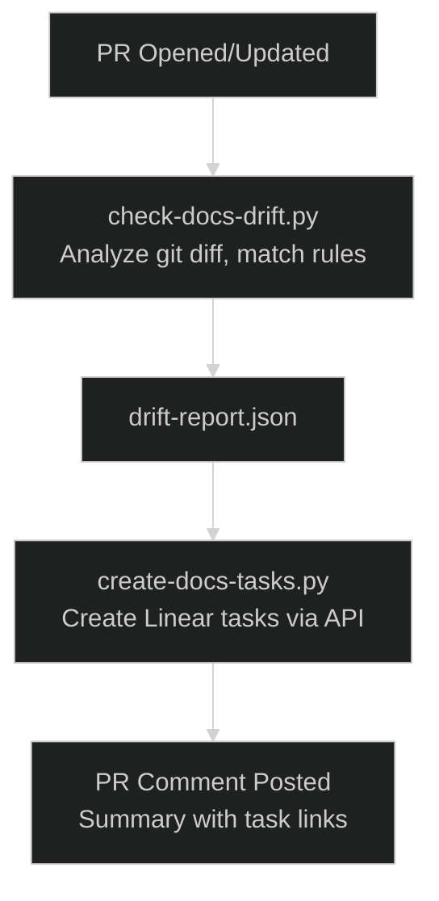

# Documentation Drift Detection

This document describes the automated system for detecting when code changes require documentation updates. The system analyzes git diffs, identifies documentation gaps, and creates non-blocking Linear tasks for follow-up.

## Overview

Documentation drift occurs when code changes without corresponding documentation updates. This system:

1. **Detects** code changes that typically require documentation
2. **Creates** detailed Linear tasks with full context
3. **Comments** on PRs with a summary of detected drift
4. **Does not block** development - tasks go to backlog

### Why This Matters

- Documentation stays synchronized with code
- New developers can find accurate information
- API consumers have up-to-date references
- Knowledge doesn't get lost when features are added

### Design Principles

| Principle    | Implementation                              |
| ------------ | ------------------------------------------- |
| Non-blocking | Never fails CI; creates backlog tasks       |
| Detailed     | Tasks include diff excerpts and context     |
| Deduplicated | Won't create duplicate tasks for same drift |
| Configurable | Rules in YAML, not hardcoded                |
| Integrated   | Uses existing Linear workflow               |

## How It Works

The documentation drift detection system runs in three stages:



### Stage 1: Detection

The `check-docs-drift.py` script:

1. Gets list of changed files between base and head commits
2. Matches each file against rules in `docs-drift-rules.yml`
3. For matching files, checks if content patterns match (if defined)
4. Determines which documentation files should exist or be updated
5. Outputs a structured JSON report

### Stage 2: Task Creation

The `create-docs-tasks.py` script:

1. Reads the drift report JSON
2. Generates a deterministic ID for each drift item (for deduplication)
3. Checks if a task with that drift ID already exists in Linear
4. Creates new tasks only for previously unseen drift
5. Applies appropriate labels and priority

### Stage 3: PR Comment

The GitHub Actions workflow:

1. Reads the drift report
2. Generates a markdown table summarizing detected drift
3. Posts a comment on the PR with priority indicators
4. Links are non-blocking - merging is still allowed

## Configuration

### Rules File

The detection rules are defined in `scripts/docs-drift-rules.yml`. This allows adding or modifying rules without changing Python code.

**Location:** `scripts/docs-drift-rules.yml`

### Rule Format

Each rule has the following fields:

| Field              | Type     | Required | Description                                      |
| ------------------ | -------- | -------- | ------------------------------------------------ |
| `id`               | string   | Yes      | Unique identifier for the rule                   |
| `description`      | string   | Yes      | Human-readable description                       |
| `file_patterns`    | string[] | Yes      | Glob patterns for files to watch                 |
| `content_patterns` | string[] | No       | Regex patterns to match within changed files     |
| `new_file_only`    | boolean  | No       | If true, only trigger for newly created files    |
| `priority`         | string   | Yes      | `high`, `medium`, or `low`                       |
| `required_docs`    | string[] | Yes      | Documentation files that should exist/be updated |

### Template Variables

In `required_docs`, you can use these template variables:

| Variable | Description                           | Example                               |
| -------- | ------------------------------------- | ------------------------------------- |
| `{dir}`  | Directory containing the changed file | `backend/api/routes` for a route file |
| `{file}` | Filename without extension            | `cameras` for `cameras.py`            |

### Example Rule

```yaml
- id: new-api-endpoint
  description: 'New API endpoint added'
  file_patterns:
    - 'backend/api/routes/*.py'
  content_patterns:
    - '@router\.(get|post|put|patch|delete)\('
  priority: high
  required_docs:
    - '{dir}/AGENTS.md'
    - 'docs/developer/api/*.md'
```

This rule:

- Watches all Python files in `backend/api/routes/`
- Triggers when the file contains a route decorator
- Has high priority (creates urgent tasks)
- Expects AGENTS.md in the same directory and API docs

### Priority Definitions

| Priority | Linear Priority | Use Case                                   |
| -------- | --------------- | ------------------------------------------ |
| `high`   | 2 (High)        | Critical docs affecting production usage   |
| `medium` | 3 (Medium)      | Important docs for developer understanding |
| `low`    | 4 (Low)         | Nice-to-have documentation improvements    |

### Adding New Rules

To add a new detection rule:

1. Edit `scripts/docs-drift-rules.yml`
2. Add a new rule entry with all required fields
3. Test locally (see [Manual Usage](#manual-usage))
4. Commit the change

**Example: Adding a rule for new middleware:**

```yaml
- id: new-middleware
  description: 'New FastAPI middleware'
  file_patterns:
    - 'backend/middleware/*.py'
  content_patterns:
    - "class \\w+Middleware"
    - 'async def dispatch'
  new_file_only: true
  priority: medium
  required_docs:
    - 'backend/middleware/AGENTS.md'
    - 'docs/architecture/middleware.md'
```

### Ignore Patterns

Files matching ignore patterns are never analyzed:

```yaml
ignore_patterns:
  - '**/test_*.py'
  - '**/*.test.ts'
  - '**/*.test.tsx'
  - '**/conftest.py'
  - 'mutants/**'
  - '.venv/**'
  - '**/__pycache__/**'
  - '**/node_modules/**'
```

## Handling Generated Tasks

When documentation drift tasks are created, follow this workflow:

### Task Structure

Each generated task includes:

```markdown
## Documentation Update Required

**Trigger:** {rule_id}
**Detected:** {timestamp} in commit `{sha}`
**PR:** #{pr_number}

### What Changed

[Diff excerpt showing the code change]

### Documentation Impact

- [ ] {required_doc_1}
- [ ] {required_doc_2}

### Suggested Updates

[Specific suggestions based on the rule]

### Acceptance Criteria

- [ ] Documentation accurately reflects implementation
- [ ] Links from hub documents work
- [ ] AGENTS.md updated if new file added
- [ ] ./scripts/validate.sh passes
```

### Addressing Documentation Debt

1. **Claim the task** - Assign to yourself in Linear, set to "In Progress"
2. **Review the diff** - Understand what changed in the code
3. **Update documentation** - Follow the suggested updates checklist
4. **Verify links** - Ensure all internal links work
5. **Validate** - Run `./scripts/validate.sh`
6. **Close the task** - Set to "Done" in Linear

### Batch Processing

If multiple drift tasks relate to the same feature:

1. Create a parent task for the feature documentation
2. Link the auto-generated tasks as subtasks
3. Address them together in a single PR
4. Use PR title: `docs: document {feature} (NEM-xxx, NEM-yyy)`

## Manual Usage

### Running Detection Locally

```bash
# Analyze changes between main and current HEAD
uv run python scripts/check-docs-drift.py \
  --output drift-report.json \
  --base main \
  --head HEAD

# View the report
cat drift-report.json | jq .
```

### Creating Tasks Manually

```bash
# Requires LINEAR_API_KEY environment variable
export LINEAR_API_KEY="lin_api_xxxxx"  # pragma: allowlist secret

uv run python scripts/create-docs-tasks.py drift-report.json
```

### Testing Rules

To test a new rule without creating tasks:

```bash
# Generate report only (no Linear integration)
uv run python scripts/check-docs-drift.py \
  --output test-drift.json \
  --base main \
  --head HEAD \
  --dry-run

# Check what would be detected
cat test-drift.json | jq '.drift_items[] | {id, description, source_file}'
```

### Checking Specific Files

```bash
# Test rules against specific file changes
uv run python scripts/check-docs-drift.py \
  --files backend/api/routes/cameras.py backend/services/detection.py \
  --output test-drift.json
```

## CI/CD Integration

### GitHub Workflow

The drift detection runs automatically via `.github/workflows/docs-drift.yml`:

**Triggers:**

- Pull requests to `main` (opened or synchronized)
- Push to `main`

**Steps:**

1. Checkout with full history (`fetch-depth: 0`)
2. Set up Python environment with uv
3. Run drift detection script
4. Create Linear tasks (if `LINEAR_API_KEY` secret exists)
5. Comment on PR with summary
6. Upload drift report as artifact

### Required Secrets

| Secret           | Description                      | Required |
| ---------------- | -------------------------------- | -------- |
| `LINEAR_API_KEY` | Linear API key with write access | Optional |

If `LINEAR_API_KEY` is not set, drift is still detected and reported in PR comments, but Linear tasks are not created.

### Artifact Retention

The drift report JSON is uploaded as an artifact with 30-day retention for debugging and analysis.

## Troubleshooting

### No Drift Detected When Expected

1. **Check file patterns** - Ensure your file matches a rule's `file_patterns`

   ```bash
   # List all rules and their patterns
   cat scripts/docs-drift-rules.yml | grep -A2 "file_patterns"
   ```

2. **Check content patterns** - If the rule has `content_patterns`, verify your code matches

   ```bash
   # Test regex pattern against file
   grep -E '@router\.(get|post)' backend/api/routes/myfile.py
   ```

3. **Check ignore patterns** - Verify file isn't being ignored

   ```bash
   cat scripts/docs-drift-rules.yml | grep -A10 "ignore_patterns"
   ```

4. **Check new_file_only** - Some rules only trigger for new files
   ```bash
   cat scripts/docs-drift-rules.yml | grep -B5 "new_file_only: true"
   ```

### Duplicate Tasks Being Created

Tasks use a deterministic `drift-id` hash for deduplication. If duplicates appear:

1. **Check drift-id in description** - Each task should have `drift-id:xxxxx`
2. **Search Linear** - `drift-id:xxxxx` should find existing tasks
3. **Verify API access** - Ensure `LINEAR_API_KEY` has read permissions

### Linear Task Creation Fails

1. **Check API key** - Verify `LINEAR_API_KEY` is set correctly

   ```bash
   # Test API access
   curl -H "Authorization: $LINEAR_API_KEY" \
     "https://api.linear.app/graphql" \
     -d '{"query": "{ viewer { id } }"}'
   ```

2. **Check team ID** - Verify the team ID in the script matches your workspace

3. **Check permissions** - API key needs `issues:write` scope

### PR Comment Not Appearing

1. **Check workflow permissions** - `pull-requests: write` must be set
2. **Check drift count** - Comments only appear if drift items exist
3. **Check workflow logs** - View the "Comment on PR" step output

### Script Errors

```bash
# Run with verbose output
uv run python scripts/check-docs-drift.py \
  --base main --head HEAD \
  --verbose \
  --output drift-report.json
```

Common issues:

- Missing git history: Ensure `fetch-depth: 0` in workflow
- Invalid base ref: Use full SHA or branch name
- YAML parse errors: Validate `docs-drift-rules.yml` syntax

## Related Documentation

- [Linear Integration](linear-integration.md) - MCP tools and workflow states
- [Contributing Guide](contributing.md) - PR process and code standards
- [Pre-commit Hooks](hooks.md) - Other automated checks
- [Code Quality](code-quality.md) - Linting and formatting tools
- [CLAUDE.md](../../CLAUDE.md) - Project instructions
