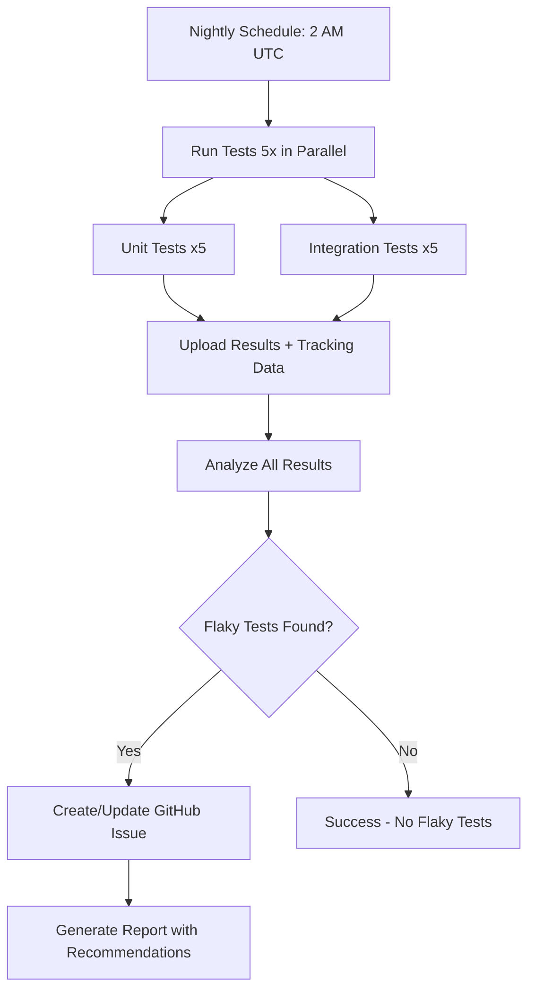
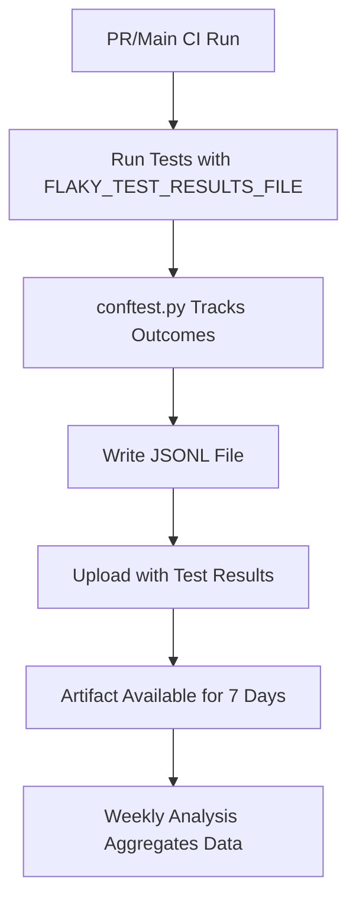

# Flaky Test Detection System

This document describes the comprehensive flaky test detection and categorization system integrated into the CI pipeline.

## Overview

Flaky tests are tests that exhibit non-deterministic behavior - sometimes passing, sometimes failing with the same code. They erode confidence in the test suite and waste developer time. Our system automatically detects, tracks, and reports flaky tests.

## Architecture

### Components

1. **pytest conftest.py Integration**

   - Location: `backend/tests/conftest.py`
   - Tracks test outcomes (pass/fail/skip) during execution
   - Records rerun attempts from pytest-rerunfailures
   - Writes results to JSON Lines format (one run per line)
   - Enabled via `FLAKY_TEST_RESULTS_FILE` environment variable

2. **CI Workflow Integration**

   - Location: `.github/workflows/ci.yml`
   - Every test run (unit and integration) writes flaky test tracking data
   - Artifacts are uploaded with test results for historical analysis
   - Retention: 7 days for regular CI runs, 30-90 days for flaky detection runs

3. **Dedicated Flaky Test Detection Workflow**

   - Location: `.github/workflows/flaky-test-detection.yml`
   - Runs nightly at 2 AM UTC
   - Executes test suite 5 times to detect inconsistent behavior
   - Analyzes pass rates and timing variance
   - Creates GitHub issues for newly detected flaky tests

4. **Analysis Script**
   - Location: `scripts/analyze-flaky-tests.py`
   - Aggregates data across multiple test runs
   - Calculates flakiness scores based on pass rate and reruns
   - Identifies tests with high timing variance
   - Generates reports and quarantine recommendations

## Usage

### Manual Flaky Test Detection

Run the flaky test detection workflow manually:

```bash
# Via GitHub UI: Actions → Flaky Test Detection → Run workflow

# Via GitHub CLI:
gh workflow run flaky-test-detection.yml \
  --field test_runs=5 \
  --field test_suite=all
```

### Analyzing Historical Data

```bash
# Download artifacts from multiple CI runs
mkdir test-results
gh run download <run-id> --dir test-results/run1
gh run download <run-id> --dir test-results/run2

# Analyze for flaky patterns
python scripts/analyze-flaky-tests.py test-results/ \
  --output flaky-report.json \
  --quarantine-file backend/tests/flaky_tests.txt
```

### Configuration

Environment variables for analysis:

```bash
# Pass rate threshold (tests below this are flaky)
export FLAKY_THRESHOLD=0.9  # 90% pass rate

# Minimum test runs required to flag as flaky
export MIN_RUNS=3

# Weight given to rerun successes in flakiness score
export RERUN_WEIGHT=0.5
```

## Detection Criteria

### Flakiness Score

The flakiness score (0.0 to 1.0) combines multiple factors:

1. **Pass Rate**: `1.0 - (passed / total_runs)`

   - Tests with <90% pass rate are flagged
   - Lower pass rate = higher flakiness score

2. **Rerun Penalty**: `min(reruns / total_runs, 1.0) * rerun_weight`

   - Tests that pass only after retry are likely flaky
   - Configurable weight (default: 0.5)

3. **Final Score**: `min(pass_rate_penalty + rerun_penalty, 1.0)`

### Timing Variance

Tests with high timing variance (coefficient of variation >50%) may indicate:

- Race conditions
- Resource contention
- External dependencies
- Non-deterministic operations

## Workflow

### Nightly Detection Flow



### CI Integration Flow



## Quarantine System

### Marking Tests as Flaky

When a test is confirmed flaky, quarantine it:

```python
import pytest

@pytest.mark.flaky
def test_sometimes_fails():
    """Test with known flakiness - quarantined."""
    # Test implementation
    pass
```

Quarantined tests:

- Failures don't block CI
- Are reported as "xfail" (expected failure)
- Remain tracked for analysis
- Should be fixed, not permanently quarantined

### Quarantine File

Maintain a list of quarantined tests:

```
# backend/tests/flaky_tests.txt

# Database connection pool exhaustion under load
backend/tests/integration/test_concurrent_queries.py::test_parallel_writes

# Race condition in WebSocket broadcast
backend/tests/integration/test_websocket_api.py::test_multiple_clients
```

## Reports

### GitHub Actions Summary

Each flaky test detection run creates a job summary:

```markdown
## Flaky Test Report

Detected **3** flaky test(s)

| Status      | Test                       | Pass Rate | Flakiness | Runs |
| ----------- | -------------------------- | --------- | --------- | ---- |
| **NEW**     | `test_database_connection` | 60%       | 0.45      | 5    |
| Quarantined | `test_websocket_broadcast` | 80%       | 0.25      | 5    |
```

### JSON Report

Programmatic access to flaky test data:

```json
{
  "generated_at": "2026-01-21T02:00:00Z",
  "total_flaky": 3,
  "tests": [
    {
      "nodeid": "backend/tests/unit/test_service.py::test_retry_logic",
      "pass_rate": 0.8,
      "total_runs": 5,
      "passed": 4,
      "failed": 1,
      "reruns": 2,
      "flakiness_score": 0.3,
      "run_count": 5
    }
  ]
}
```

### Timing Variance Analysis

The workflow also identifies tests with high timing variance:

```
=== Tests with High Timing Variance ===

backend/tests/integration/test_ai_pipeline.py::test_batch_processing
  Mean: 2.341s, StdDev: 1.823s, CV: 77.87%, Runs: 5

backend/tests/unit/test_cache.py::test_concurrent_updates
  Mean: 0.456s, StdDev: 0.298s, CV: 65.35%, Runs: 5
```

## GitHub Issue Creation

When new flaky tests are detected, the workflow automatically:

1. Searches for existing "Flaky Test Detection" issues
2. Creates a new issue or updates the existing one
3. Includes:
   - Summary of detected flaky tests
   - Pass rates and flakiness scores
   - Recommended actions
   - Links to full reports

Issue labels: `flaky-tests`, `testing`, `ci`

## Best Practices

### Investigation Workflow

When a test is flagged as flaky:

1. **Reproduce Locally**

   ```bash
   # Run test multiple times
   pytest backend/tests/unit/test_flaky.py::test_name --count=10
   ```

2. **Check Common Causes**

   - Race conditions (timing-dependent logic)
   - Shared state between tests
   - External dependencies (network, filesystem)
   - Non-deterministic operations (random, datetime)
   - Resource contention (ports, files, connections)

3. **Fix Root Cause**

   - Add proper synchronization
   - Improve test isolation
   - Mock external dependencies
   - Use deterministic test data
   - Fix resource cleanup

4. **Verify Fix**

   ```bash
   # Run fixed test 20 times
   pytest backend/tests/unit/test_flaky.py::test_name --count=20
   # Should pass 20/20
   ```

5. **Remove Quarantine**
   - Remove `@pytest.mark.flaky` decorator
   - Remove from quarantine file
   - Monitor in next flaky detection run

### Prevention

- **Use Fixtures for Isolation**: Ensure tests don't share state
- **Mock External Services**: Use `mock_detector_client`, `mock_redis`, etc.
- **Use Deterministic Data**: Avoid random data, use factories with fixed seeds
- **Avoid Time-Dependent Logic**: Use `freezegun` to mock time
- **Test in Parallel**: Run with `-n auto` to catch race conditions early

## Metrics and Monitoring

### Key Metrics

1. **Flaky Test Count**: Total number of flaky tests detected
2. **Pass Rate Distribution**: Histogram of test pass rates
3. **Timing Variance**: Tests with >50% coefficient of variation
4. **Quarantine Duration**: How long tests remain flaky
5. **Fix Rate**: Percentage of flaky tests fixed per week

### Dashboard Integration

The workflow includes a stub for pushing metrics to monitoring systems:

```yaml
- name: Update metrics dashboard
  run: |
    # Push to Prometheus, CloudWatch, Datadog, etc.
    # Example: prometheus pushgateway
    cat flaky-test-report.json | \
      python scripts/push-metrics.py --gateway prometheus:9091
```

## Troubleshooting

### No Flaky Test Data Generated

Check that `FLAKY_TEST_RESULTS_FILE` is set:

```bash
# In CI workflow yaml
env:
  FLAKY_TEST_RESULTS_FILE: flaky-test-tracking.jsonl

# Verify file is created
ls -la flaky-test-tracking.jsonl
```

### Analysis Script Errors

```bash
# Ensure result files exist
find test-results/ -name "*.jsonl" -o -name "*.xml"

# Check JSON formatting
python -m json.tool < test-results/flaky-test-tracking.jsonl
```

### False Positives

If tests are incorrectly flagged:

1. Check if test has external dependencies
2. Verify test isolation (no shared state)
3. Increase `MIN_RUNS` threshold
4. Adjust `FLAKY_THRESHOLD` if appropriate

## References

- [Testing Guide](testing.md) - Overview of test infrastructure
- [Testing Workflow](testing-workflow.md) - TDD and test patterns
- [conftest.py](../../backend/tests/conftest.py) - Test fixtures and tracking
- [analyze-flaky-tests.py](../../scripts/analyze-flaky-tests.py) - Analysis script
- [pytest-rerunfailures](https://github.com/pytest-dev/pytest-rerunfailures) - Automatic test retry plugin
