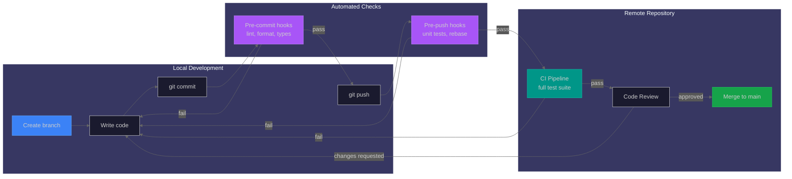
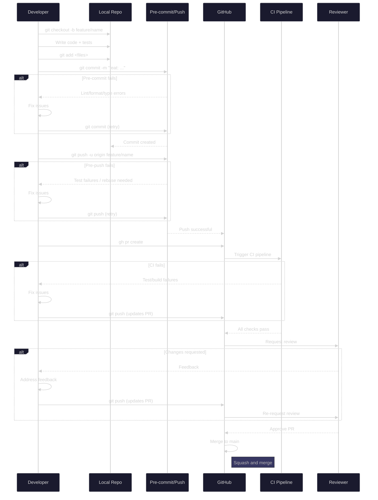

# Git Workflow and Pre-commit Rules

This document covers git safety protocols, pre-commit hook configuration, and the critical testing policy. For detailed hook documentation, see [hooks.md](hooks.md).

## Development Workflow Overview



## PR Workflow (Branch to Merge)



## Git Safety Protocol

**CRITICAL: Never bypass git pre-commit hooks.** All commits must pass pre-commit checks including:

- `ruff check` - Python linting
- `ruff format` - Python formatting
- `mypy` - Python type checking
- `eslint` - TypeScript/JavaScript linting
- `prettier` - Code formatting

### Test Strategy (optimized for performance)

| Stage      | What Runs                          | Runtime   |
| ---------- | ---------------------------------- | --------- |
| Pre-commit | Fast lint/format/type checks only  | ~10-30s   |
| Pre-push   | Unit tests (install separately)    | ~30-60s   |
| CI         | Full test suite with 95% coverage  | ~5-10 min |
| Manual     | `./scripts/validate.sh` before PRs | ~2-3 min  |

### Forbidden Commands

**Do NOT use:**

- `git commit --no-verify`
- `git push --no-verify`
- Any flags that skip pre-commit hooks

### Branch Protection (GitHub enforced)

- All CI jobs must pass before merge
- Admin bypass is disabled
- CODEOWNERS review required

## NEVER DISABLE TESTING

> **ABSOLUTE RULE: Unit and integration tests must NEVER be disabled, removed, or bypassed.**

This rule is non-negotiable. Previous agents have violated this rule by:

- Moving test hooks from `pre-commit` to `pre-push` stage (reducing test frequency)
- Lowering coverage thresholds to pass CI
- Commenting out or skipping failing tests
- Removing test assertions to make tests pass

**If tests are failing, FIX THE CODE or FIX THE TESTS. Do not:**

1. Disable the test hook
2. Change the hook stage to run less frequently
3. Lower coverage thresholds
4. Skip tests with `@pytest.skip` without a documented reason
5. Remove test files or test functions
6. Use `--no-verify` flags

### Required Hooks That Must Remain Active

| Hook                      | Stage    | Purpose                            |
| ------------------------- | -------- | ---------------------------------- |
| `fast-test`               | pre-push | Runs unit tests before every push  |
| Backend Unit Tests        | CI       | Full unit test suite with coverage |
| Backend Integration Tests | CI       | API and service integration tests  |
| Frontend Tests            | CI       | Component and hook tests           |
| E2E Tests                 | CI       | End-to-end browser tests           |

## Pre-commit Setup

**Run once per clone:**

```bash
pre-commit install                       # Install pre-commit hooks
pre-commit install --hook-type pre-push  # Install pre-push hooks
```

If you encounter test failures, your job is to investigate and fix them, not to disable the safety net.

## Running Hooks Manually

If pre-commit checks fail, fix the issues before committing:

```bash
# Backend
uv run pytest backend/tests/ -v

# Frontend
cd frontend && npm test

# Full validation (recommended before PRs)
./scripts/validate.sh

# Pre-commit (runs lint/format checks)
pre-commit run --all-files
```

## Hook Skip (Emergency Only)

In emergencies, you can skip specific hooks (CI will still catch issues):

```bash
# Skip specific hook
SKIP=hadolint,semgrep git commit -m "message"

# Skip pre-push hooks
SKIP=fast-test git push
```

**WARNING:** Skipping hooks should only be done when absolutely necessary. All changes will still be validated in CI.

## Related Documentation

- [Pre-commit Hooks](hooks.md) - Detailed hook documentation
- [Code Quality Tools](code-quality.md) - Tool configuration
- [Testing Guide](testing.md) - Test infrastructure
- [TDD Workflow](testing-workflow.md) - Test-driven development process
