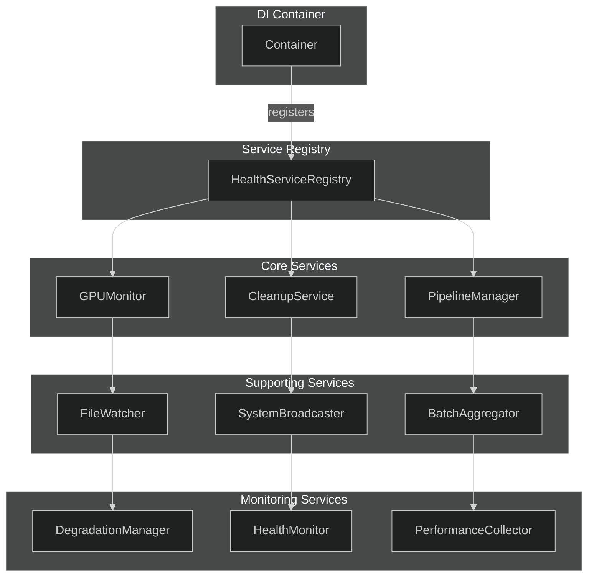

# Health Monitoring Dependency Injection (NEM-2611)

This document describes the dependency injection pattern for health monitoring services, replacing the previous global state pattern.

## Overview

The health monitoring system previously used global variables (`_gpu_monitor`, `_cleanup_service`, etc.) in `backend/api/routes/system.py`. This pattern:

- Made testing difficult due to shared state between tests
- Could lead to unexpected side effects
- Made it harder to reason about service lifecycles

The new DI pattern:

- Uses the existing `Container` class in `backend/core/container.py`
- Introduces `HealthServiceRegistry` as a centralized registry
- Provides FastAPI dependencies for clean injection into route handlers
- Maintains backward compatibility with the legacy global pattern

## Service Architecture



## Service Initialization Order

Services are initialized during application startup in the lifespan context manager (`backend/main.py`):

1. **Container Services** (via `wire_services`):

   - `health_service_registry` - Created first as other services register with it
   - `health_event_emitter` - WebSocket health event emission
   - `redis_client` - Async singleton for Redis connection
   - Other AI services (context_enricher, enrichment_pipeline, nemotron_analyzer)

2. **Background Workers** (main.py lifespan):

   - `GPUMonitor` - GPU resource monitoring
   - `CleanupService` - Data cleanup
   - `SystemBroadcaster` - WebSocket status updates
   - `FileWatcher` - Camera image monitoring
   - `PipelineWorkerManager` - Detection/analysis workers
   - `PerformanceCollector` - Performance metrics
   - `ServiceHealthMonitor` - Auto-recovery monitoring

3. **Registration with Registry**:
   - Each service registers with `HealthServiceRegistry` after creation
   - This makes services available for health checks

## Using the Registry

### In Route Handlers

```python
from fastapi import Depends
from backend.api.dependencies import get_health_service_registry_dep
from backend.services.health_service_registry import HealthServiceRegistry

@router.get("/workers/status")
async def get_worker_statuses(
    registry: HealthServiceRegistry = Depends(get_health_service_registry_dep),
):
    return registry.get_worker_statuses()
```

### Getting Services

```python
# Get specific service
gpu_monitor = registry.gpu_monitor

# Check if critical workers are healthy
is_healthy = registry.are_critical_pipeline_workers_healthy()

# Get circuit breaker
circuit_breaker = registry.circuit_breaker
```

## Circuit Breaker Pattern

The registry includes a circuit breaker for health checks:

```python
# Circuit breaker automatically tracks failures
if registry.circuit_breaker.is_open("redis"):
    # Skip health check, return cached error
    return {"status": "unhealthy", "error": circuit_breaker.get_cached_error("redis")}

# Perform health check
try:
    result = await redis.ping()
    registry.circuit_breaker.record_success("redis")
except Exception as e:
    registry.circuit_breaker.record_failure("redis", str(e))
```

## Testing with DI

The DI pattern makes testing easier:

```python
from unittest.mock import MagicMock
from fastapi.testclient import TestClient

def test_worker_statuses():
    mock_registry = MagicMock()
    mock_registry.get_worker_statuses.return_value = [
        WorkerStatus(name="gpu_monitor", running=True)
    ]

    app.dependency_overrides[get_health_service_registry_dep] = lambda: mock_registry

    response = client.get("/api/system/workers/status")
    assert response.status_code == 200
```

## Backward Compatibility

The legacy `register_workers` function is still called during startup for backward compatibility:

```python
# main.py
# New DI pattern
health_registry = container.get("health_service_registry")
health_registry.register_gpu_monitor(gpu_monitor)
# ...

# Legacy pattern (for routes not yet migrated)
register_workers(
    gpu_monitor=gpu_monitor,
    cleanup_service=cleanup_service,
    # ...
)
```

Routes can be migrated incrementally from the legacy pattern to the DI pattern.

## Migration Guide

To migrate a route from global state to DI:

1. Import the dependency:

   ```python
   from backend.api.dependencies import get_health_service_registry_dep
   ```

2. Add the dependency to the route:

   ```python
   async def my_route(
       registry: HealthServiceRegistry = Depends(get_health_service_registry_dep),
   ):
       # Replace _gpu_monitor with registry.gpu_monitor
       gpu_stats = await registry.gpu_monitor.get_stats()
   ```

3. Remove global imports:
   ```python
   # Remove: from backend.api.routes.system import _gpu_monitor
   ```

## Service Lifecycle

### Startup

1. Container is created and services are wired
2. Background workers are started
3. Workers register with HealthServiceRegistry
4. Application accepts requests

### Shutdown

1. Application stops accepting requests
2. Queues are drained (graceful shutdown)
3. Background workers are stopped in reverse order
4. Container shuts down services (calls close/disconnect)

## Files Modified

| File                                          | Change                                          |
| --------------------------------------------- | ----------------------------------------------- |
| `backend/services/health_service_registry.py` | New file - registry class                       |
| `backend/core/container.py`                   | Added health service registrations              |
| `backend/main.py`                             | Updated to use registry for worker registration |
| `backend/services/health_event_emitter.py`    | Updated to support both DI and legacy patterns  |
| `backend/api/dependencies.py`                 | Added dependency functions                      |

## Related Issues

- NEM-2611: Refactor global state to dependency injection in health monitoring
- NEM-1636: Original DI container implementation
