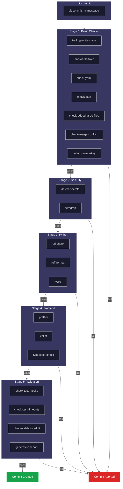
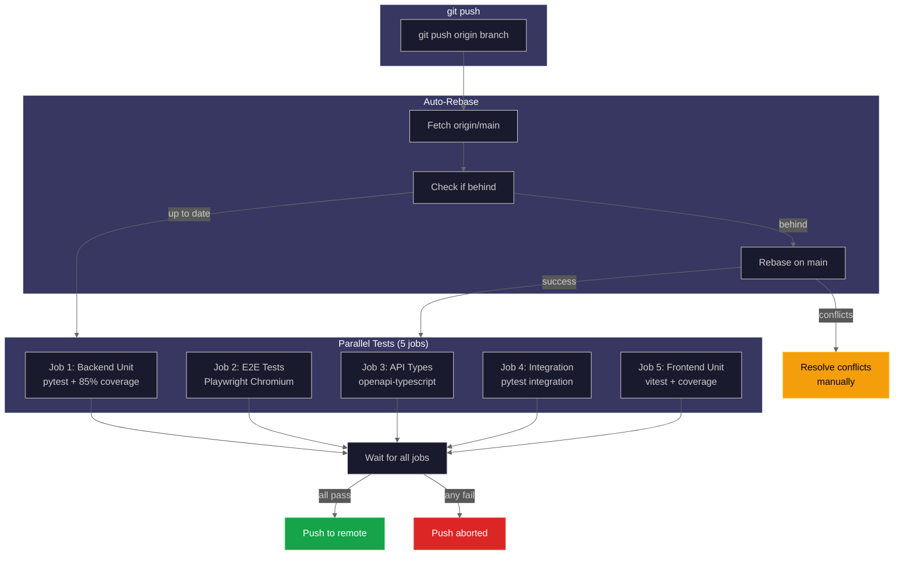
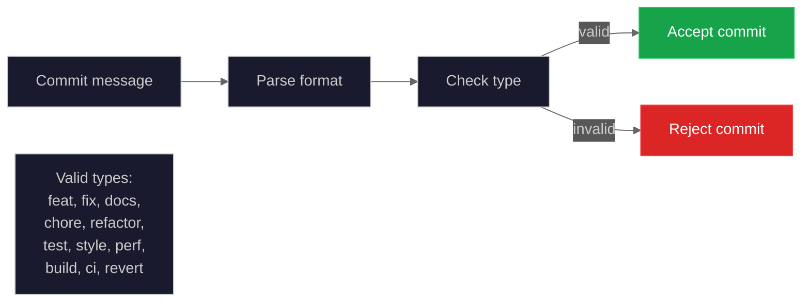

# Pre-commit Hooks

This document provides comprehensive documentation for all pre-commit hooks configured in the project. Hooks run automatically to enforce code quality standards before commits and pushes.

## Quick Reference

| Hook                       | Stage      | Purpose                                | Runtime |
| -------------------------- | ---------- | -------------------------------------- | ------- |
| trailing-whitespace        | pre-commit | Remove trailing whitespace             | <1s     |
| end-of-file-fixer          | pre-commit | Ensure files end with newline          | <1s     |
| check-yaml                 | pre-commit | Validate YAML syntax                   | <1s     |
| check-json                 | pre-commit | Validate JSON syntax                   | <1s     |
| check-added-large-files    | pre-commit | Prevent large files (>1MB)             | <1s     |
| check-merge-conflict       | pre-commit | Detect merge conflict markers          | <1s     |
| detect-private-key         | pre-commit | Prevent committing private keys        | <1s     |
| conventional-pre-commit    | commit-msg | Enforce conventional commit format     | <1s     |
| hadolint                   | pre-commit | Lint Dockerfiles                       | 1-2s    |
| semgrep                    | pre-commit | Security scanning (Python)             | 2-5s    |
| ruff                       | pre-commit | Python linting                         | 1-2s    |
| ruff-format                | pre-commit | Python formatting                      | 1-2s    |
| mypy                       | pre-commit | Python type checking                   | 3-10s   |
| prettier                   | pre-commit | Format non-frontend files              | 1-2s    |
| prettier-frontend          | pre-commit | Format frontend files                  | 1-2s    |
| eslint                     | pre-commit | Frontend linting                       | 2-5s    |
| typescript-check           | pre-commit | Frontend type checking                 | 3-10s   |
| uv-lock-check              | pre-commit | Verify uv lock file is up-to-date      | 1-2s    |
| npm-install-check          | pre-commit | Verify npm dependencies are consistent | 1-3s    |
| check-test-mocks           | pre-commit | Verify integration tests mock services | <1s     |
| check-test-timeouts        | pre-commit | Verify tests mock slow operations      | <1s     |
| check-validation-drift     | pre-commit | Detect Pydantic/Zod schema drift       | <1s     |
| check-integration-tests    | pre-commit | Verify API/service changes have tests  | <1s     |
| detect-secrets             | pre-commit | Detect secrets and credentials         | 1-2s    |
| generate-openapi           | pre-commit | Auto-regenerate OpenAPI spec           | 1-2s    |
| auto-rebase                | pre-push   | Rebase on origin/main                  | 2-10s   |
| check-new-files-have-tests | pre-push   | Verify new source files have tests     | <1s     |
| parallel-tests             | pre-push   | Run all test validations (5 jobs)      | 60-180s |

## Hook Execution Flow

### Pre-commit Hook Flow



### Pre-push Hook Flow



### Commit Message Validation Flow



## Installation

```bash
# Install pre-commit (if not already installed)
pip install pre-commit
# Or with uv: uv tool install pre-commit

# Install pre-commit hooks
pre-commit install

# Install pre-push hooks
pre-commit install --hook-type pre-push

# Install commit-msg hooks (for commit message linting)
pre-commit install --hook-type commit-msg

# Verify installation
pre-commit --version
```

## Running Hooks Manually

```bash
# Run all hooks on all files
pre-commit run --all-files

# Run specific hook on all files
pre-commit run ruff --all-files
pre-commit run mypy --all-files

# Run hooks on staged files only (default behavior)
pre-commit run

# Run pre-push hooks manually
pre-commit run --hook-stage pre-push --all-files
```

## Skipping Hooks

**WARNING:** Skipping hooks should only be done in emergencies. CI will still catch issues.

```bash
# Skip specific hook
SKIP=fast-test git commit -m "message"

# Skip multiple hooks
SKIP=hadolint,semgrep git commit -m "message"

# Skip ALL hooks (use sparingly!)
git commit --no-verify -m "message"

# Skip pre-push hooks
SKIP=auto-rebase git push
```

---

## Pre-commit Hooks (Run on Every Commit)

### General Hooks

#### trailing-whitespace

**Purpose:** Removes trailing whitespace from files.

**What it checks:** Lines ending with spaces or tabs.

**Common failures:**

- Files with extra spaces at end of lines

**Fix:**

```bash
# Auto-fixed during pre-commit
# Or manually remove trailing whitespace in your editor
```

---

#### end-of-file-fixer

**Purpose:** Ensures files end with a single newline.

**What it checks:** Missing or multiple trailing newlines.

**Common failures:**

- Files not ending with newline
- Files ending with multiple newlines

**Fix:**

```bash
# Auto-fixed during pre-commit
```

---

#### conventional-pre-commit

**Purpose:** Enforces conventional commit message format.

**What it checks:**

- Commit messages must follow the pattern: `<type>: <description>`
- Valid types: feat, fix, docs, chore, refactor, test, style, perf, build, ci, revert

**Stage:** commit-msg (runs during `git commit`)

**Common failures:**

```
Bad commit message:
  "updated code"          # Missing type prefix
  "Feature: new button"   # Wrong format (uppercase)
  "random: changes"       # Invalid type

Good commit messages:
  "feat: add user authentication"
  "fix: resolve login button crash"
  "docs: update API documentation"
  "chore: upgrade dependencies"
  "refactor: simplify validation logic"
  "test: add unit tests for auth service"
```

**Fix:**

```bash
# If commit fails, amend with correct format
git commit --amend -m "feat: add new feature description"

# Or skip validation (use sparingly!)
git commit --no-verify -m "message"
```

---

#### check-yaml

**Purpose:** Validates YAML file syntax.

**What it checks:** YAML parsing errors, invalid syntax.

**Common failures:**

- Incorrect indentation
- Missing colons
- Invalid YAML syntax

**Fix:**

```bash
# Validate YAML manually
python -c "import yaml; yaml.safe_load(open('file.yaml'))"
```

---

#### check-json

**Purpose:** Validates JSON file syntax.

**What it checks:** JSON parsing errors, invalid syntax.

**Excludes:** `tsconfig*.json` (uses JSONC format with comments/trailing commas)

**Common failures:**

- Missing or extra commas
- Unquoted strings
- Trailing commas (except in tsconfig)

**Fix:**

```bash
# Validate JSON manually
python -c "import json; json.load(open('file.json'))"
```

---

#### check-added-large-files

**Purpose:** Prevents accidentally committing large files.

**What it checks:** Files larger than 1000KB (1MB).

**Excludes:** Documentation images (`docs/images/*.png`)

**Common failures:**

- Binary files, logs, data files
- Large generated files

**Fix:**

```bash
# Remove file from staging
git reset HEAD large-file.bin

# Add to .gitignore if needed
echo "large-file.bin" >> .gitignore
```

---

#### check-merge-conflict

**Purpose:** Detects unresolved merge conflict markers.

**What it checks:** Lines containing `<<<<<<<`, `=======`, `>>>>>>>`.

**Common failures:**

- Unresolved merge conflicts left in files

**Fix:**

```bash
# Search for conflict markers
grep -rn "<<<<<<" .
grep -rn "=======" .
grep -rn ">>>>>>>" .

# Resolve conflicts manually
```

---

#### detect-private-key

**Purpose:** Prevents committing private keys.

**What it checks:** Patterns matching common private key formats (RSA, DSA, EC, etc.).

**Common failures:**

- SSH private keys
- SSL/TLS private keys
- API tokens in test fixtures

**Fix:**

```bash
# Remove from staging
git reset HEAD private-key.pem

# Use environment variables or secrets management
```

---

### Secret Detection

#### detect-secrets

**Purpose:** Prevents committing secrets and credentials to the repository.

**What it checks:**

- API keys and tokens
- Passwords and secrets in code
- Private keys and certificates
- Database connection strings

**Tool:** [detect-secrets](https://github.com/Yelp/detect-secrets)

**Config:** Uses `.secrets.baseline` for known false positives

**Excludes:** `package-lock.json`, `uv.lock`, `.secrets.baseline`, `mutants/`, `.tsbuildinfo`

**Common failures:**

```
Potential secrets detected in file.py
Secret Type: Secret Keyword
Line: 42
```

**Fix:**

```bash
# If it's a false positive, add to baseline
detect-secrets scan --baseline .secrets.baseline

# Review the baseline file
git diff .secrets.baseline

# Commit the updated baseline
git add .secrets.baseline
git commit -m "chore: update secrets baseline"
```

**Note:** A `regenerate-secrets-baseline` hook automatically regenerates the baseline if it has merge conflicts.

---

### Dockerfile Linting

#### hadolint

**Purpose:** Lints Dockerfiles for best practices and CIS benchmarks.

**What it checks:**

- Security best practices
- Layer optimization
- Base image pinning
- Shell command best practices

**Tool:** [Hadolint](https://github.com/hadolint/hadolint)

**Installation:**

```bash
# macOS
brew install hadolint

# Linux
wget -O hadolint https://github.com/hadolint/hadolint/releases/download/v2.12.0/hadolint-Linux-x86_64
chmod +x hadolint && sudo mv hadolint /usr/local/bin/

# Docker (alternative)
docker pull hadolint/hadolint
```

**Common failures:**

| Rule   | Description               | Fix                                      |
| ------ | ------------------------- | ---------------------------------------- |
| DL3006 | Always tag image version  | Use `FROM python:3.14` not `FROM python` |
| DL3008 | Pin versions in apt-get   | Use `apt-get install pkg=version`        |
| DL3013 | Pin pip versions          | Use `pip install pkg==version`           |
| DL3059 | Multiple consecutive RUN  | Combine with `&&`                        |
| SC2086 | Quote variable expansions | Use `"$var"` not `$var`                  |

**Skip specific rule:**

```dockerfile
# hadolint ignore=DL3008
RUN apt-get update && apt-get install -y curl
```

---

### Security Scanning

#### semgrep

**Purpose:** Static analysis for security vulnerabilities.

**What it checks:**

- Hardcoded credentials
- SQL injection
- Shell injection
- Security anti-patterns

**Config:** `semgrep.yml` (custom rules) + `p/python` (community rules)

**Language version:** Python 3.12 (protobuf compatibility)

**Custom rules in `semgrep.yml`:**

| Rule ID            | Severity | Description                          |
| ------------------ | -------- | ------------------------------------ |
| hardcoded-password | ERROR    | Detects hardcoded credentials        |
| sql-injection-risk | ERROR    | f-string SQL queries with execute()  |
| shell-injection    | ERROR    | subprocess/os.system with shell=True |

**Common failures:**

```python
# BAD: Hardcoded password
password = "secret123"  # semgrep: hardcoded-password

# GOOD: Use environment variable
password = os.environ.get("PASSWORD")

# BAD: SQL injection
query = f"SELECT * FROM users WHERE id = {user_id}"
db.execute(query)  # semgrep: sql-injection-risk

# GOOD: Parameterized query
db.execute("SELECT * FROM users WHERE id = ?", [user_id])

# BAD: Shell injection
subprocess.run(cmd, shell=True)  # semgrep: shell-injection

# GOOD: Use list form
subprocess.run(["ls", "-la"])
```

**Skip specific rule:**

```python
# nosemgrep: hardcoded-password
TEST_PASSWORD = "test123"  # Only for tests
```

---

### Python Linting and Formatting

#### ruff

**Purpose:** Fast Python linter (replaces flake8, isort, pyupgrade).

**What it checks:**

- Code style (PEP 8)
- Import sorting
- Bug patterns
- Security issues (flake8-bandit)
- Async patterns
- Simplification opportunities

**Config:** `pyproject.toml`

**Auto-fix:** Enabled (`--fix --exit-non-zero-on-fix`)

**Rule categories enabled:**

| Prefix | Source                  | Purpose                 |
| ------ | ----------------------- | ----------------------- |
| E/W    | pycodestyle             | Style errors/warnings   |
| F      | Pyflakes                | Logic errors            |
| I      | isort                   | Import sorting          |
| B      | flake8-bugbear          | Bug patterns            |
| C4     | flake8-comprehensions   | Better comprehensions   |
| UP     | pyupgrade               | Python version upgrades |
| ARG    | flake8-unused-arguments | Unused arguments        |
| SIM    | flake8-simplify         | Simplification          |
| TCH    | flake8-type-checking    | Type checking imports   |
| PTH    | flake8-use-pathlib      | Prefer pathlib          |
| ERA    | eradicate               | Commented-out code      |
| PL     | Pylint                  | Various checks          |
| RUF    | Ruff-specific           | Additional rules        |
| ASYNC  | flake8-async            | Async patterns          |
| S      | flake8-bandit           | Security                |

**Common failures and fixes:**

```python
# E501: Line too long
# Fix: Break line or reduce complexity

# I001: Import order
# Fix: Auto-fixed by ruff --fix

# F401: Unused import
# Fix: Remove import or use it

# B008: Do not perform function calls in argument defaults
def bad(items=list()):  # BAD
def good(items=None):   # GOOD
    items = items or []

# S105: Possible hardcoded password
password = "secret"  # BAD
password = os.environ.get("PASSWORD")  # GOOD
```

**Manual commands:**

```bash
# Check
uv run ruff check backend/

# Auto-fix
uv run ruff check --fix backend/

# Show source context
uv run ruff check backend/ --show-source
```

---

#### ruff-format

**Purpose:** Fast Python code formatter (replaces Black).

**What it checks:**

- Consistent formatting
- Line length (100 chars)
- Quote style (double)
- Indent style (spaces)

**Config:** `pyproject.toml`

**Common failures:**

- Inconsistent indentation
- Wrong quote style
- Lines exceeding 100 characters

**Manual commands:**

```bash
# Check formatting
uv run ruff format --check backend/

# Auto-format
uv run ruff format backend/
```

---

#### mypy

**Purpose:** Static type checking for Python.

**What it checks:**

- Type annotations
- Type mismatches
- Missing return types
- Invalid type operations

**Config:** `pyproject.toml`

**Additional dependencies:** pydantic, sqlalchemy, fastapi, redis

**Files:** `backend/` only

**Common failures:**

```python
# Missing return type
def get_name(user):  # BAD: missing type annotations
    return user.name

def get_name(user: User) -> str:  # GOOD
    return user.name

# Type mismatch
def add(a: int, b: int) -> int:
    return a + b

add("1", "2")  # mypy: Argument 1 has incompatible type "str"

# Optional not handled
def process(value: str | None) -> str:
    return value.upper()  # mypy: Item "None" has no attribute "upper"

def process(value: str | None) -> str:
    if value is None:
        return ""
    return value.upper()  # GOOD
```

**Manual commands:**

```bash
# Run type check
uv run mypy backend/

# Show error codes
uv run mypy backend/ --show-error-codes
```

---

### Frontend Linting and Formatting

#### prettier-frontend

**Purpose:** Format frontend files with Tailwind CSS plugin.

**What it formats:**

- TypeScript/TSX files
- JavaScript/JSX files
- CSS files
- JSON files (except package-lock.json)
- Markdown files

**Path:** `frontend/**/*.(ts|tsx|js|jsx|css|json|md)`

**Why separate from main prettier:**

- Uses local prettier with `prettier-plugin-tailwindcss`
- Sorts Tailwind classes automatically
- Avoids type parameter stripping bug in TypeScript

**Common failures:**

- Unsorted Tailwind classes
- Inconsistent formatting

**Manual commands:**

```bash
cd frontend

# Check formatting
npm run format:check

# Auto-format
npm run format
# Or: npx prettier --write src/
```

---

#### prettier

**Purpose:** Format non-frontend files.

**What it formats:**

- CSS, JSON, Markdown, YAML files
- **Excludes:** `frontend/` and `tsconfig*.json`

**Why excludes frontend:** Frontend uses local prettier with Tailwind plugin.

**Why excludes tsconfig:** Uses JSONC format (allows comments and trailing commas).

---

#### eslint

**Purpose:** Lint TypeScript/JavaScript code.

**What it checks:**

- TypeScript best practices
- React hooks rules
- Import ordering
- Accessibility (jsx-a11y)
- Floating promises
- Type-aware rules

**Config:** `frontend/eslint.config.mjs`

**Common failures:**

```typescript
// react-hooks/exhaustive-deps: Missing dependency
useEffect(() => {
  fetchData(userId);
}, []); // BAD: missing userId

useEffect(() => {
  fetchData(userId);
}, [userId]); // GOOD

// @typescript-eslint/no-floating-promises
async function fetch() {
  /* ... */
}
fetch(); // BAD: unhandled promise

await fetch(); // GOOD
void fetch(); // GOOD (if intentionally ignoring)

// import/order: Import order
import { z } from 'zod';
import React from 'react'; // BAD: React should be first

import React from 'react';
import { z } from 'zod'; // GOOD
```

**Manual commands:**

```bash
cd frontend

# Check
npm run lint

# Auto-fix
npm run lint:fix
```

---

#### typescript-check

**Purpose:** TypeScript compilation check (no emit).

**What it checks:**

- Type errors
- Missing types
- Compilation errors

**Config:** `frontend/tsconfig.json`

**Common failures:**

- Type mismatches
- Missing type definitions
- Import errors

**Manual commands:**

```bash
cd frontend

# Run type check
npm run typecheck
# Or: npx tsc --noEmit
```

---

### OpenAPI Generation

#### generate-openapi

**Purpose:** Auto-regenerates `docs/openapi.json` when backend API changes.

**What it does:**

- Runs when files in `backend/api/`, `backend/models/`, or `backend/schemas/` change
- Generates OpenAPI spec from FastAPI routes
- Uses hash-based change detection for performance (~5-10ms skip path, ~1.5-2s regeneration)
- Auto-stages the generated file for commit

**Script:** `scripts/generate-openapi.py`

**Cache file:** `.openapi-cache`

**Common scenarios:**

- Adding new API endpoints: spec regenerated automatically
- Modifying schemas: spec regenerated automatically
- No changes to API: hash comparison only, no regeneration

---

### Dependency Lock Consistency

#### uv-lock-check

**Purpose:** Ensures the uv lock file is up-to-date with pyproject.toml.

**What it checks:**

- Verifies `uv.lock` is synchronized with `pyproject.toml`
- Detects manual changes to pyproject.toml without running `uv lock`

**Triggered by:** Changes to `pyproject.toml` or `uv.lock`

**Common failures:**

```
ERROR: lock file is out of date
```

**Fix:**

```bash
# Regenerate lock file
uv lock

# Stage the updated lock file
git add uv.lock

# Commit together with pyproject.toml
git commit -m "chore: update dependencies"
```

---

#### npm-install-check

**Purpose:** Verifies npm dependencies are consistent with package-lock.json.

**What it checks:**

- Validates `package-lock.json` matches `package.json`
- Ensures dependencies can be installed from lock file

**Triggered by:** Changes to `frontend/package.json` or `frontend/package-lock.json`

**Common failures:**

```
npm error Conflicting package versions
npm error Lockfile is out of date
```

**Fix:**

```bash
cd frontend

# Regenerate package-lock.json
npm install

# Stage the updated lock file
git add package-lock.json

# Commit together with package.json
git commit -m "chore: update frontend dependencies"
```

---

### Validation Alignment

#### check-validation-drift

**Purpose:** Detects drift between backend Pydantic and frontend Zod schemas.

**What it checks:**

- Warns when Pydantic schemas (`backend/api/schemas/`) are modified
- Reminds to verify frontend Zod schemas (`frontend/src/schemas/`) are aligned

**Files watched:** `backend/api/schemas/*.py`, `frontend/src/schemas/*.ts`

**Behavior:** Warning-only hook - commits are not blocked

**Verbose mode:** Set `VALIDATION_DRIFT_VERBOSE=1` for detailed info messages

---

### Test Quality Hooks

#### check-test-mocks

**Purpose:** Ensure integration tests properly mock slow background services.

**What it checks:** Tests using `TestClient(app)` must mock:

- `SystemBroadcaster` / `get_system_broadcaster`
- `GPUMonitor`
- `CleanupService`

**Why needed:** These services start background tasks during app lifespan, causing 5+ second delays per test.

**Files:** `backend/tests/integration/*.py`

**Script:** `scripts/check-test-mocks.py`

**Common failures:**

```
ERROR: Integration tests using TestClient must mock slow background services.

  backend/tests/integration/test_example.py
    Missing mocks for: system_broadcaster, gpu_monitor, cleanup_service
```

**Fix:**

```python
import pytest
from unittest.mock import MagicMock, AsyncMock, patch

@pytest.fixture
def client():
    mock_broadcaster = MagicMock()
    mock_broadcaster.start_broadcasting = AsyncMock()
    mock_broadcaster.stop_broadcasting = AsyncMock()

    mock_gpu_monitor = MagicMock()
    mock_gpu_monitor.start = AsyncMock()
    mock_gpu_monitor.stop = AsyncMock()

    mock_cleanup_service = MagicMock()
    mock_cleanup_service.start = AsyncMock()
    mock_cleanup_service.stop = AsyncMock()

    with (
        patch('backend.main.get_system_broadcaster', return_value=mock_broadcaster),
        patch('backend.main.GPUMonitor', return_value=mock_gpu_monitor),
        patch('backend.main.CleanupService', return_value=mock_cleanup_service),
    ):
        with TestClient(app) as client:
            yield client
```

---

#### check-test-timeouts

**Purpose:** Detect potentially slow patterns in test files.

**What it checks:**

- `asyncio.sleep()` / `time.sleep()` calls >= 1 second without mocking
- HTTP library calls without mocking (requests, httpx, urllib, aiohttp)
- Subprocess calls without mocking

**Files:** `backend/tests/*.py`

**Script:** `scripts/check-test-timeouts.py`

**Safe patterns (allowed):**

- Sleep inside mock functions (`mock_*`, `slow_*`, `fake_*`)
- Sleep wrapped in `asyncio.wait_for(..., timeout=<short>)`
- Calls with mock context (nearby `@patch`, `MagicMock`, etc.)
- Lines with comments: `# mocked`, `# patched`, `# cancelled`, `# intentional`

**Common failures:**

```
SLOW TEST PATTERNS DETECTED

backend/tests/unit/test_example.py:45: sleep(5) - may cause slow tests
    await asyncio.sleep(5)

backend/tests/integration/test_api.py:78: requests.get() - real HTTP call, should be mocked
    response = requests.get(url)
```

**Fix:**

```python
# BAD: Real sleep
await asyncio.sleep(5)

# GOOD: Mocked sleep
with patch('asyncio.sleep'):
    await asyncio.sleep(5)

# GOOD: With safe comment
await asyncio.sleep(5)  # cancelled by task.cancel()

# BAD: Real HTTP call
response = requests.get(url)

# GOOD: Mocked HTTP
with patch('requests.get') as mock_get:
    mock_get.return_value.json.return_value = {"data": "test"}
    response = requests.get(url)
```

---

#### check-integration-tests

**Purpose:** Ensure API routes and services have corresponding integration tests.

**What it checks:**

- Files in `backend/api/routes/` must have integration tests
- Files in `backend/services/` must have integration tests

**Script:** `scripts/check-integration-tests.py`

**Stages:** pre-commit and pre-push

**Common failures:**

```
New/modified API routes without integration tests:
  backend/api/routes/new_endpoint.py
```

**Fix:**

```bash
# Create integration tests for the new route
touch backend/tests/integration/test_new_endpoint.py

# Or mark as intentionally untested (not recommended)
```

---

## Pre-push Hooks (Run Before Push)

### auto-rebase

**Purpose:** Automatically rebase feature branches on origin/main before pushing.

**What it does:**

1. Fetches latest `origin/main`
2. Checks if branch is behind
3. Rebases automatically if needed
4. Aborts and reports if conflicts occur

**Script:** `scripts/pre-push-rebase.sh`

**Skips when:**

- On main/master branch directly
- In detached HEAD state
- Branch is already up-to-date

**Common failures:**

```
[auto-rebase] Rebase failed due to conflicts!

To resolve:
  1. Run: git rebase --abort
  2. Manually rebase: git fetch origin main && git rebase origin/main
  3. Fix conflicts, then: git rebase --continue
  4. Push again
```

**Skip:**

```bash
SKIP=auto-rebase git push
```

---

### parallel-tests

**Purpose:** Run validation tests in parallel before push for faster feedback.

**What it runs (5 parallel jobs):**

1. **Job 1:** Backend unit tests with 85% coverage (pytest) - ~2-3 min
2. **Job 2:** E2E + Accessibility tests (Playwright Chromium) - ~30-60s
3. **Job 3:** API types contract check (openapi-typescript) - ~10-20s
4. **Job 4:** Backend integration tests (subset for speed) - ~30-60s
5. **Job 5:** Frontend unit tests (vitest with coverage) - ~10-30s

**Total time:** max(job1, job2, job3, job4, job5) instead of sum (~60-70% faster than sequential)

**Script:** `scripts/pre-push-tests.sh`

**Runtime:** 60-180 seconds (depends on longest job, typically Job 1)

**Why pre-push not pre-commit:** Full test suite takes ~2-3 minutes, too slow for every commit.

**Job Details:**

| Job | Type                | Command                                                                      | Timeout | Exit on First Failure |
| --- | ------------------- | ---------------------------------------------------------------------------- | ------- | --------------------- |
| 1   | Backend Unit        | `uv run pytest backend/tests/unit/ --cov --cov-fail-under=85 -n auto`        | None    | No                    |
| 2   | E2E + Accessibility | `cd frontend && npm run test:e2e -- --project=chromium`                      | None    | No                    |
| 3   | API Types           | `./scripts/generate-types.sh --check`                                        | None    | No                    |
| 4   | Backend Integration | `uv run pytest backend/tests/integration/ -n0 --tb=short -q -x --timeout=60` | 60s     | Yes (-x)              |
| 5   | Frontend Unit       | `cd frontend && npm test -- --coverage --run`                                | None    | No                    |

**Skip:**

```bash
SKIP=parallel-tests git push
```

**API Types Contract Check:**

If types are out of sync:

```
[ERROR] Generated types are out of date!

The OpenAPI schema has changed. Please regenerate types:
  ./scripts/generate-types.sh

Then commit the updated types file.
```

**Fix:**

```bash
# Regenerate types
./scripts/generate-types.sh

# Commit the changes
git add frontend/src/types/generated/api.ts
git commit -m "chore: regenerate API types"
```

---

### check-new-files-have-tests

**Purpose:** Verify that new source files have corresponding test files.

**What it checks:**

- Detects newly added source files in the commit
- Verifies corresponding test files exist or are being added

**Script:** `scripts/check-test-coverage-gate.py`

**Stage:** pre-push only

**Common failures:**

```
New source files without corresponding test files:
  backend/services/new_service.py -> missing tests
```

**Fix:**

```bash
# Create test file for the new source
touch backend/tests/unit/services/test_new_service.py
```

---

## Troubleshooting

### Hook Not Running

```bash
# Reinstall hooks
pre-commit install
pre-commit install --hook-type pre-push

# Verify hooks are installed
ls -la .git/hooks/
```

### Hook Takes Too Long

```bash
# Run specific hooks to identify slow one
time pre-commit run ruff --all-files
time pre-commit run mypy --all-files
time pre-commit run eslint --all-files
```

### Hook Fails in CI but Passes Locally

```bash
# Ensure you have latest pre-commit
pip install --upgrade pre-commit

# Clear cache
pre-commit clean

# Run with verbose output
pre-commit run --all-files --verbose
```

### Hadolint Not Found

```bash
# macOS
brew install hadolint

# Linux (download binary)
wget -O hadolint https://github.com/hadolint/hadolint/releases/latest/download/hadolint-Linux-x86_64
chmod +x hadolint
sudo mv hadolint /usr/local/bin/

# Verify
hadolint --version
```

### Semgrep Memory Issues

```bash
# Semgrep can use significant memory on large codebases
# If running out of memory, skip temporarily
SKIP=semgrep git commit -m "message"
```

### TypeScript Check Fails but ESLint Passes

TypeScript and ESLint check different things:

- ESLint: Code style, patterns, hooks rules
- TypeScript: Type correctness, compilation

```bash
# Run both to see all issues
cd frontend
npm run lint
npm run typecheck
```

---

## Configuration Files Reference

| File                         | Purpose                       |
| ---------------------------- | ----------------------------- |
| `.pre-commit-config.yaml`    | Main pre-commit configuration |
| `pyproject.toml`             | Ruff, mypy, pytest config     |
| `semgrep.yml`                | Custom Semgrep security rules |
| `frontend/eslint.config.mjs` | ESLint configuration          |
| `frontend/tsconfig.json`     | TypeScript configuration      |
| `frontend/package.json`      | Prettier configuration        |

---

## Related Documentation

- [Code Quality Tools](code-quality.md) - Comprehensive tool documentation
- [Contributing Guide](contributing.md) - Development workflow
- [Testing Guide](testing.md) - Test strategy and patterns
- [CLAUDE.md](../../CLAUDE.md) - Project instructions
