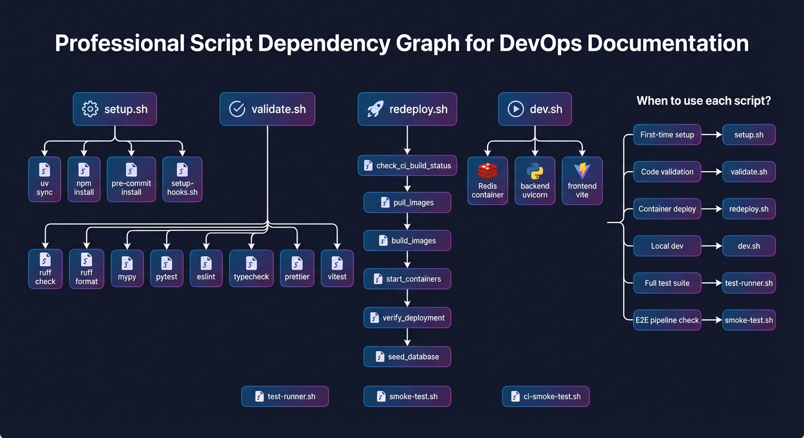

# Development Environment Setup

This guide walks you through setting up a complete development environment for the Home Security Intelligence project.

## Prerequisites

Before starting, ensure you have the following installed:

### Required Software

| Requirement    | Minimum Version         | Check Command                            | Notes                 |
| -------------- | ----------------------- | ---------------------------------------- | --------------------- |
| **Python**     | 3.14+                   | `python3 --version`                      | Required for backend  |
| **Node.js**    | 20.19+ or 22.12+        | `node --version`                         | Required for frontend |
| **npm**        | 9+                      | `npm --version`                          | Comes with Node.js    |
| **Git**        | 2.x                     | `git --version`                          | Version control       |
| **Container**  | Docker 20+ or Podman 4+ | `docker --version` or `podman --version` | Docker or Podman      |
| **PostgreSQL** | 16+                     | `psql --version`                         | Or use testcontainers |
| **Redis**      | 7+                      | `redis-server --version`                 | Or use testcontainers |

### Optional (for GPU features)

| Requirement       | Minimum Version | Check Command    | Notes                  |
| ----------------- | --------------- | ---------------- | ---------------------- |
| **NVIDIA Driver** | 535+            | `nvidia-smi`     | For GPU-accelerated AI |
| **CUDA**          | 12.x            | `nvcc --version` | For YOLO26 inference   |

### Hardware Recommendations

- **RAM:** 16GB minimum, 32GB recommended
- **GPU:** NVIDIA RTX A5500 or equivalent (24GB VRAM) for full AI pipeline
- **Disk:** 50GB free space for models, containers, and data

## Quick Setup

The fastest way to set up your development environment:

```bash
# Clone the repository
git clone https://github.com/mikesvoboda/home_security_intelligence.git
cd home_security_intelligence

# Run the automated setup script
./scripts/setup.sh
```

This script ([scripts/setup.sh](../../scripts/setup.sh:1)) automatically:

1. Checks all prerequisites
2. Creates a Python virtual environment (`.venv`)
3. Installs backend dependencies
4. Installs frontend dependencies
5. Sets up pre-commit hooks
6. Verifies the installation

## Manual Setup

If you prefer step-by-step control or the automated script fails:

### 1. Clone the Repository

```bash
git clone https://github.com/mikesvoboda/home_security_intelligence.git
cd home_security_intelligence
```

### 2. Backend Setup

Create and activate a Python virtual environment:

```bash
# Using uv (recommended - 10-100x faster than pip)
# Install uv: curl -LsSf https://astral.sh/uv/install.sh | sh
uv sync --extra dev

# This creates .venv and installs all dependencies from pyproject.toml
# Development tools (pre-commit, ruff, mypy, pytest) are included
```

**Note:** This project uses `uv` for Python dependency management with `pyproject.toml` as the dependency source. The `uv.lock` file ensures reproducible builds.

### 3. Frontend Setup

```bash
cd frontend
npm install
cd ..
```



_Script dependency graph showing relationships between setup scripts, validation tools, and test runners._

### 4. Pre-commit Hooks

Install pre-commit hooks to enforce code quality on every commit:

```bash
# Install standard pre-commit hooks
pre-commit install

# Install pre-push hooks for tests (CRITICAL - do not skip)
pre-commit install --hook-type pre-push
```

The pre-commit configuration ([.pre-commit-config.yaml](../../.pre-commit-config.yaml:1)) includes:

| Hook                  | Stage      | Purpose                       |
| --------------------- | ---------- | ----------------------------- |
| `trailing-whitespace` | pre-commit | Remove trailing whitespace    |
| `end-of-file-fixer`   | pre-commit | Ensure files end with newline |
| `ruff`                | pre-commit | Python linting and formatting |
| `mypy`                | pre-commit | Python type checking          |
| `prettier`            | pre-commit | Frontend code formatting      |
| `eslint`              | pre-commit | TypeScript/JavaScript linting |
| `typescript-check`    | pre-commit | TypeScript type checking      |
| `fast-test`           | pre-push   | Run unit tests before push    |

### 5. Environment Configuration

Create a `.env` file from the example:

```bash
cp .env.example .env
```

Key environment variables to configure:

```bash
# Database (PostgreSQL required)
# IMPORTANT: Run ./setup.sh to generate .env with a secure password, or set manually:
# Generate password: openssl rand -base64 32
DATABASE_URL=postgresql+asyncpg://security:<your-password>@localhost:5432/security

# Redis
REDIS_URL=redis://localhost:6379/0

# Camera upload directory
FOSCAM_BASE_PATH=/export/foscam

# AI service endpoints (optional for dev)
YOLO26_URL=http://localhost:8090
NEMOTRON_URL=http://localhost:8091
```

### 6. Start Infrastructure Services

Using Docker or Podman:

```bash
# Docker
docker compose -f docker-compose.prod.yml up -d postgres redis

# OR Podman
podman-compose -f docker-compose.prod.yml up -d postgres redis
```

Or configure local services manually.

## Verifying the Setup

Run the verification script:

```bash
./scripts/validate.sh
```

This runs ([scripts/validate.sh](../../scripts/validate.sh:1)):

1. **Ruff linting** - Python code style
2. **Ruff formatting** - Python code formatting
3. **MyPy** - Python type checking
4. **Pytest** - Backend tests with 95% combined coverage
5. **ESLint** - Frontend linting
6. **TypeScript** - Frontend type checking
7. **Prettier** - Frontend formatting
8. **Vitest** - Frontend tests

All checks must pass before committing code.

## Development Workflow

### Starting the Development Servers

**Backend:**

```bash
source .venv/bin/activate
python -m backend.main

# Or with hot reload
uvicorn backend.main:app --host 0.0.0.0 --port 8000 --reload
```

**Frontend:**

```bash
cd frontend
npm run dev
```

**Full stack with AI services:**

```bash
./scripts/dev.sh
```

### Running Tests

```bash
# Backend tests
pytest backend/tests/ -v

# Frontend tests
cd frontend && npm test

# Full test suite with coverage
./scripts/test-runner.sh
```

See [testing.md](testing.md) for comprehensive test documentation.

## IDE Configuration

### VS Code (Recommended)

Create `.vscode/settings.json`:

```json
{
  "python.defaultInterpreterPath": "${workspaceFolder}/.venv/bin/python",
  "python.analysis.typeCheckingMode": "basic",
  "python.formatting.provider": "none",
  "[python]": {
    "editor.defaultFormatter": "charliermarsh.ruff",
    "editor.formatOnSave": true,
    "editor.codeActionsOnSave": {
      "source.fixAll": "explicit",
      "source.organizeImports": "explicit"
    }
  },
  "[typescript]": {
    "editor.defaultFormatter": "esbenp.prettier-vscode",
    "editor.formatOnSave": true
  },
  "[typescriptreact]": {
    "editor.defaultFormatter": "esbenp.prettier-vscode",
    "editor.formatOnSave": true
  },
  "eslint.workingDirectories": ["frontend"],
  "typescript.tsdk": "frontend/node_modules/typescript/lib"
}
```

Recommended extensions:

- **Python:** `ms-python.python`, `charliermarsh.ruff`
- **Frontend:** `esbenp.prettier-vscode`, `dbaeumer.vscode-eslint`
- **General:** `bradlc.vscode-tailwindcss`, `eamodio.gitlens`

### PyCharm / WebStorm

1. Set Python interpreter to `.venv/bin/python`
2. Enable Ruff as external tool for linting
3. Configure ESLint in frontend directory
4. Enable Prettier for TypeScript files

## Common Issues

### Pre-commit Fails on First Run

Pre-commit may need to download hooks on first run:

```bash
pre-commit run --all-files
```

If hooks fail, fix the issues before committing. **Never use `--no-verify`**.

### Database Connection Errors

Ensure PostgreSQL is running:

```bash
# Docker
docker compose -f docker-compose.prod.yml up -d postgres

# OR Podman
podman-compose -f docker-compose.prod.yml up -d postgres
```

Check connection:

```bash
psql postgresql://security:<your-password>@localhost:5432/security
```

### Import Errors in Tests

Activate the virtual environment:

```bash
source .venv/bin/activate
```

The test configuration automatically adds backend to the Python path.

### Node Modules Issues

Clear and reinstall:

```bash
cd frontend
rm -rf node_modules package-lock.json
npm install
```

## Enabling HTTPS

For secure local development or production deployment, you can enable HTTPS:

```bash
# Generate self-signed certificate for development
./scripts/generate-certs.sh

# Enable HTTPS
echo "SSL_ENABLED=true" >> .env

# Restart frontend
docker compose -f docker-compose.prod.yml restart frontend
```

Access at `https://localhost:443`. See [SSL/HTTPS Configuration](ssl-https.md) for complete documentation.

## Next Steps

- [Testing Guide](testing.md) - Learn the test strategy and how to write tests
- [Contributing Guide](contributing.md) - Understand the PR process
- [Code Patterns](patterns.md) - Learn key patterns used in the codebase
- [SSL/HTTPS Configuration](ssl-https.md) - Enable HTTPS for secure connections

## Related Documentation

- [CLAUDE.md](../../CLAUDE.md) - Project instructions and rules
- [Backend AGENTS.md](../../backend/AGENTS.md) - Backend architecture overview
- [Frontend AGENTS.md](../../frontend/AGENTS.md) - Frontend architecture overview
