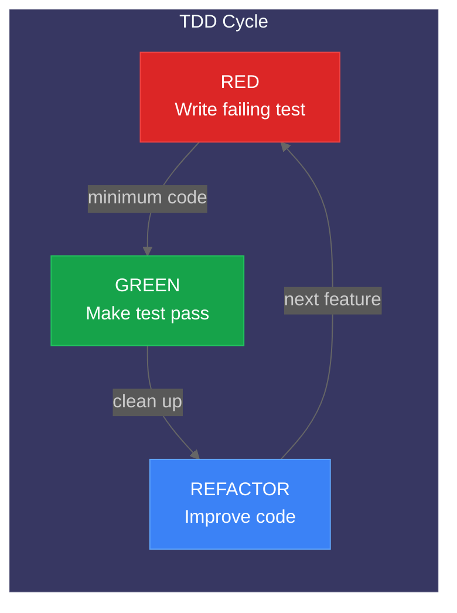
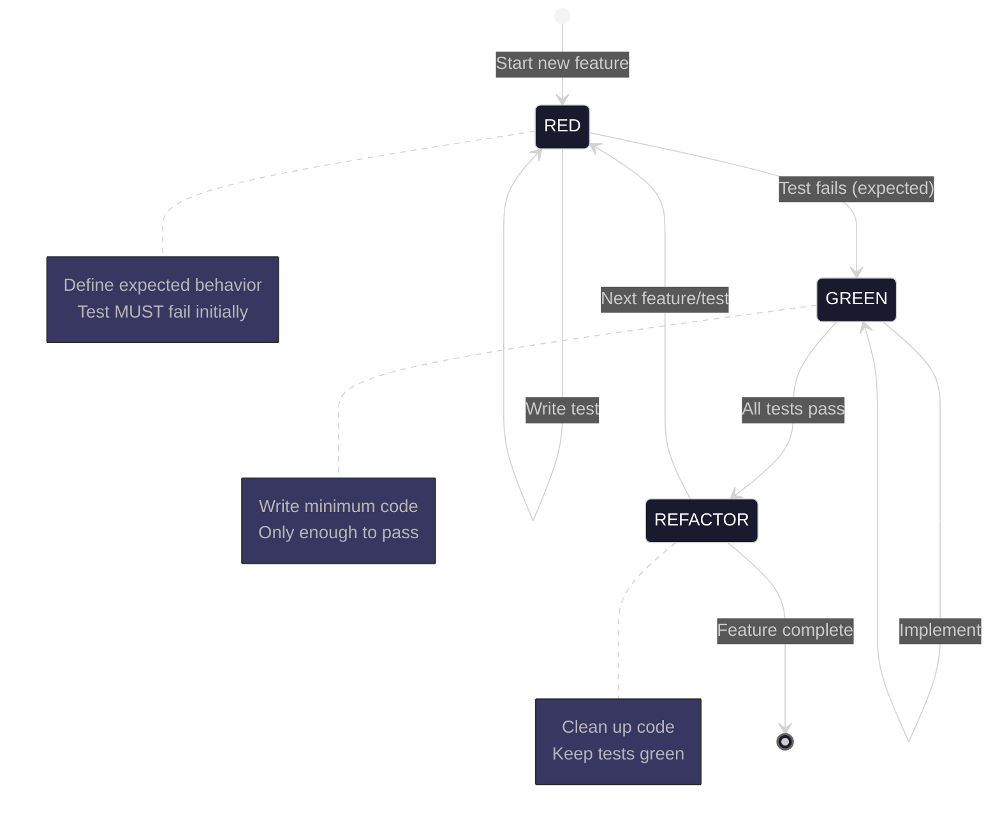

# TDD Workflow Guide

This document describes the Test-Driven Development (TDD) workflow used in this project. For test infrastructure details, fixtures, and running tests, see [testing.md](testing.md).

## The TDD Cycle: RED-GREEN-REFACTOR

This project follows strict TDD for all feature implementation. Tests are not an afterthought; they drive the design and ensure correctness from the start.

1. **RED** - Write a failing test that defines the expected behavior
2. **GREEN** - Write the minimum code necessary to make the test pass
3. **REFACTOR** - Improve the code while keeping tests green



### TDD Cycle Details



## Pre-Implementation Checklist

Before writing any production code, complete this checklist:

- [ ] Understand the acceptance criteria from the Linear issue
- [ ] Identify the code layer(s) involved (API, service, component, E2E)
- [ ] Write test stubs for each acceptance criterion
- [ ] Run tests to confirm they fail (RED phase)
- [ ] Only then begin implementation

## Test Patterns by Layer

### Backend API Routes (pytest + httpx)

```python
# backend/tests/unit/api/routes/test_cameras.py
import pytest
from httpx import AsyncClient
from backend.main import app

@pytest.mark.asyncio
async def test_get_camera_returns_camera_data(async_client: AsyncClient):
    """RED: Write this test first, then implement the endpoint."""
    response = await async_client.get("/api/cameras/front_door")

    assert response.status_code == 200
    data = response.json()
    assert data["name"] == "front_door"
    assert "status" in data
    assert "last_seen" in data

@pytest.mark.asyncio
async def test_get_camera_not_found_returns_404(async_client: AsyncClient):
    """Test error handling for missing cameras."""
    response = await async_client.get("/api/cameras/nonexistent")

    assert response.status_code == 404
    assert "not found" in response.json()["detail"].lower()
```

### Backend Services (pytest + mocking)

```python
# backend/tests/unit/services/test_detection_service.py
import pytest
from unittest.mock import AsyncMock, patch
from backend.services.detection import DetectionService

@pytest.mark.asyncio
async def test_process_image_calls_yolo26_client():
    """RED: Test that service integrates with YOLO26 correctly."""
    mock_yolo26 = AsyncMock()
    mock_yolo26.detect.return_value = [
        {"label": "person", "confidence": 0.95, "bbox": [100, 200, 300, 400]}
    ]

    service = DetectionService(yolo26_client=mock_yolo26)
    result = await service.process_image("/path/to/image.jpg")

    mock_yolo26.detect.assert_called_once_with("/path/to/image.jpg")
    assert len(result.detections) == 1
    assert result.detections[0].label == "person"

@pytest.mark.asyncio
async def test_process_image_handles_yolo26_timeout():
    """Test graceful handling of AI service timeouts."""
    mock_yolo26 = AsyncMock()
    mock_yolo26.detect.side_effect = TimeoutError("YOLO26 timeout")

    service = DetectionService(yolo26_client=mock_yolo26)

    with pytest.raises(DetectionError) as exc_info:
        await service.process_image("/path/to/image.jpg")

    assert "timeout" in str(exc_info.value).lower()
```

### Frontend Components (Vitest + React Testing Library)

```typescript
// frontend/src/components/RiskGauge.test.tsx
import { render, screen } from '@testing-library/react';
import { describe, it, expect } from 'vitest';
import { RiskGauge } from './RiskGauge';

describe('RiskGauge', () => {
  it('displays low risk styling for scores under 30', () => {
    // RED: Write test first, then implement component
    render(<RiskGauge score={25} />);

    const gauge = screen.getByRole('meter');
    expect(gauge).toHaveAttribute('aria-valuenow', '25');
    expect(gauge).toHaveClass('risk-low');
  });

  it('displays high risk styling for scores over 70', () => {
    render(<RiskGauge score={85} />);

    const gauge = screen.getByRole('meter');
    expect(gauge).toHaveClass('risk-high');
    expect(screen.getByText(/high risk/i)).toBeInTheDocument();
  });

  it('updates in real-time when score changes', async () => {
    const { rerender } = render(<RiskGauge score={20} />);
    expect(screen.getByRole('meter')).toHaveAttribute('aria-valuenow', '20');

    rerender(<RiskGauge score={80} />);
    expect(screen.getByRole('meter')).toHaveAttribute('aria-valuenow', '80');
  });
});
```

### E2E Tests (Playwright)

```typescript
// frontend/tests/e2e/dashboard.spec.ts
import { test, expect } from '@playwright/test';

test.describe('Dashboard', () => {
  test('displays live camera feeds on load', async ({ page }) => {
    // RED: Write E2E test first to define user journey
    await page.goto('/');

    // Wait for WebSocket connection
    await expect(page.locator('[data-testid="ws-status"]')).toHaveText('Connected');

    // Verify camera grid loads
    const cameraCards = page.locator('[data-testid="camera-card"]');
    await expect(cameraCards).toHaveCount(4);

    // Verify each camera shows status
    for (const card of await cameraCards.all()) {
      await expect(card.locator('.camera-status')).toBeVisible();
    }
  });

  test('risk gauge updates when new detection arrives', async ({ page }) => {
    await page.goto('/');

    // Initial state
    const gauge = page.locator('[data-testid="risk-gauge"]');
    await expect(gauge).toHaveAttribute('aria-valuenow', '0');

    // Simulate detection via API (or mock WebSocket)
    await page.evaluate(() => {
      window.dispatchEvent(
        new CustomEvent('test:detection', {
          detail: { risk_score: 75 },
        })
      );
    });

    // Verify gauge updates
    await expect(gauge).toHaveAttribute('aria-valuenow', '75');
  });
});
```

## Using the TDD Skill

For complex features, invoke the TDD skill to guide your workflow:

```bash
/superpowers:test-driven-development
```

This skill will:

1. Help identify test cases from requirements
2. Generate test stubs for each layer
3. Guide you through the RED-GREEN-REFACTOR cycle
4. Ensure proper test coverage before completion

## Integration with Linear

Tasks labeled `tdd` are test-focused tasks that pair with feature tasks:
[View TDD issues](https://linear.app/nemotron-v3-home-security/team/NEM/label/tdd)

**Workflow for TDD-labeled issues:**

1. **Claim both tasks** - The feature task and its corresponding TDD task
2. **Start with tests** - Implement tests from the TDD issue first
3. **Verify RED** - Run tests to confirm they fail appropriately
4. **Implement feature** - Write code to make tests pass (GREEN)
5. **Refactor** - Clean up while keeping tests green
6. **Close TDD issue first** - Then close the feature issue

## PR Checklist for TDD Verification

Before creating a PR, verify:

- [ ] All new code has corresponding tests
- [ ] Tests were written BEFORE implementation (TDD)
- [ ] Tests cover happy path AND error cases
- [ ] Coverage thresholds are met (85% backend unit, 95% backend combined)
- [ ] No tests were skipped or disabled
- [ ] E2E tests pass for UI changes

## Validation Workflow

After implementing any feature, run tests to validate:

```bash
# Backend unit tests (parallel ~10s)
uv run pytest backend/tests/unit/ -n auto --dist=worksteal

# Backend integration tests (serial ~70s)
uv run pytest backend/tests/integration/ -n0

# Frontend tests
cd frontend && npm test

# E2E tests (multi-browser)
cd frontend && npx playwright test
```

**CRITICAL:** Do not mark a task as complete until:

- All relevant tests pass
- Test coverage includes both happy path and error cases

## When to Dispatch Validation Agents

- After implementing any new feature
- After modifying existing code
- Before closing any task
- Before committing code

Validation agents should run the full test suite and report any failures. Fix all failures before proceeding.

## Related Documentation

- [Testing Guide](testing.md) - Test infrastructure, fixtures, and running tests
- [Code Quality Tools](code-quality.md) - Linting and formatting
- [Contributing Guide](contributing.md) - Development workflow
