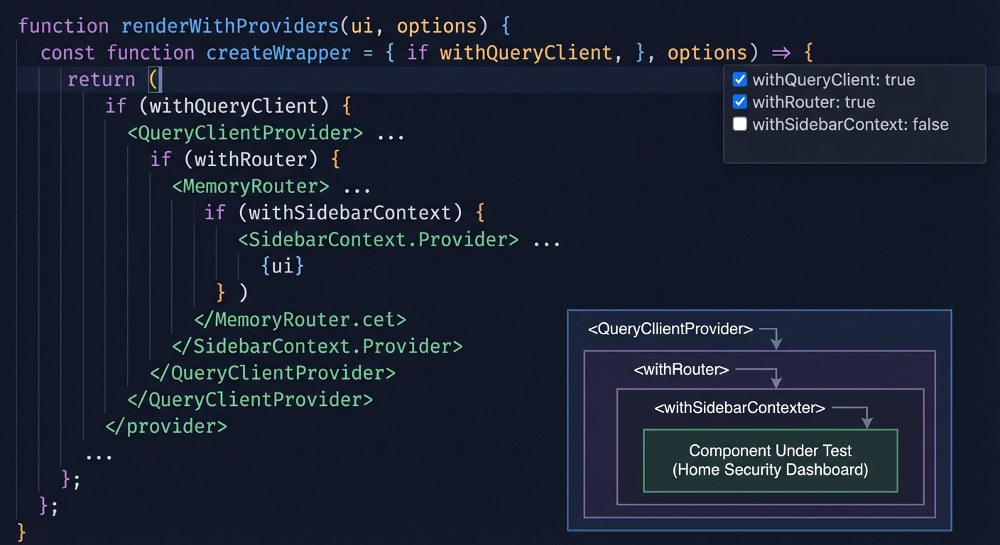
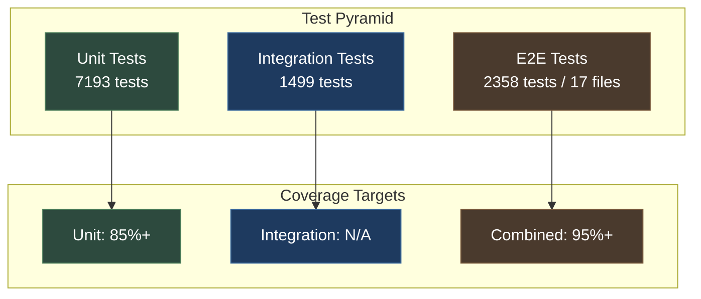

# Testing Guide

This project follows a strict Test-Driven Development (TDD) approach. All features must have tests written at the time of development.

## Test Philosophy

> **ABSOLUTE RULE: Unit and integration tests must NEVER be disabled, removed, or bypassed.**

This rule is non-negotiable. If tests are failing:

1. **FIX THE CODE** - If the implementation is wrong
2. **FIX THE TESTS** - If the tests are incorrect
3. **NEVER** disable, skip, or lower coverage thresholds

See [CLAUDE.md](../../CLAUDE.md:199) for the complete policy on testing requirements.

## Test Architecture



_Frontend test provider tree showing the testing wrapper hierarchy for React Testing Library._



### Test Categories

| Category                      | Location                     | Count      | Timeout | Coverage Target |
| ----------------------------- | ---------------------------- | ---------- | ------- | --------------- |
| **Backend Unit Tests**        | `backend/tests/unit/`        | 7193 tests | 1s      | 85%+            |
| **Backend Integration**       | `backend/tests/integration/` | 1499 tests | 5s      | N/A (combined)  |
| **Backend E2E Tests**         | `backend/tests/e2e/`         | 2 files    | 30s     | -               |
| **GPU Tests**                 | `backend/tests/gpu/`         | 1 file     | -       | -               |
| **Benchmarks**                | `backend/tests/benchmarks/`  | 3 files    | -       | -               |
| **Chaos Tests**               | `backend/tests/chaos/`       | -          | -       | -               |
| **Contract Tests**            | `backend/tests/contracts/`   | -          | -       | -               |
| **Security Tests**            | `backend/tests/security/`    | -          | -       | -               |
| **Test Utilities**            | `backend/tests/utils/`       | -          | -       | -               |
| **Frontend Unit**             | `frontend/src/**/*.test.ts`  | -          | -       | 83%+            |
| **Frontend E2E (Playwright)** | `frontend/tests/e2e/`        | 2358 tests | 15s     | -               |

**Note:** Backend combined coverage (unit + integration) must reach 95% (see `pyproject.toml`).
Frontend thresholds: 83% statements, 77% branches, 81% functions, 84% lines (see `vite.config.ts`).

## Quick Reference

```bash
# Fast feedback (TDD cycle)
pytest --testmon                              # Only affected tests (fastest)
pytest backend/tests/unit/ -m "not slow"      # Fast unit tests only

# Full validation
./scripts/validate.sh                         # Pre-PR validation
pytest backend/tests/ --cov=backend           # All tests with coverage

# Coverage report
pytest backend/tests/ --cov=backend --cov-report=html
open coverage/backend/index.html
```

## Running Tests

### Backend Tests

```bash
# Activate virtual environment first
source .venv/bin/activate

# All backend tests
pytest backend/tests/ -v

# Unit tests only
pytest backend/tests/unit/ -v

# Integration tests only
pytest backend/tests/integration/ -v

# E2E tests
pytest backend/tests/e2e/ -v

# With coverage report
pytest backend/tests/ -v --cov=backend --cov-report=html

# Disable timeouts for debugging
pytest backend/tests/ -v --timeout=0

# Parallel execution (4 workers)
pytest backend/tests/ -v -n 4

# Affected-only tests (TDD fast feedback)
pytest --testmon
```

### Frontend Tests

```bash
cd frontend

# Run all tests
npm test

# Run with coverage
npm run test:coverage

# Watch mode for development
npm run test -- --watch

# E2E tests (Playwright)
npm run test:e2e
```

### Multi-Browser E2E Tests (Playwright)

The frontend E2E test suite runs **2358 tests across 17 spec files** using Playwright. Tests execute across multiple browsers and viewport configurations for comprehensive cross-platform coverage.

#### Browser and Viewport Matrix

| Project         | Device/Browser  | Viewport | Action Timeout |
| --------------- | --------------- | -------- | -------------- |
| `chromium`      | Desktop Chrome  | 1280x720 | 5s             |
| `firefox`       | Desktop Firefox | 1280x720 | 8s             |
| `webkit`        | Desktop Safari  | 1280x720 | 8s             |
| `mobile-chrome` | Pixel 5         | 393x851  | 5s             |
| `mobile-safari` | iPhone 12       | 390x844  | 5s             |
| `tablet`        | iPad (gen 7)    | 810x1080 | 5s             |

#### Running E2E Tests

```bash
cd frontend

# Run all browsers (local development)
npm run test:e2e

# Run specific browser
npm run test:e2e -- --project=chromium
npm run test:e2e -- --project=firefox
npm run test:e2e -- --project=webkit

# Run mobile viewport tests
npm run test:e2e -- --project=mobile-chrome
npm run test:e2e -- --project=mobile-safari

# Run tablet viewport tests
npm run test:e2e -- --project=tablet

# Run with visible browser (headed mode)
npm run test:e2e -- --headed

# Run single test file
npm run test:e2e -- tests/e2e/specs/dashboard.spec.ts

# Debug mode with Playwright Inspector
npm run test:e2e -- --debug
```

#### CI Configuration

In CI, browsers run in parallel containers via the `--project` flag:

- **Chromium job**: `npx playwright test --project=chromium`
- **Firefox job**: `npx playwright test --project=firefox`
- **WebKit job**: `npx playwright test --project=webkit`

Configuration details:

- **Retries**: 2 retries in CI to handle flaky tests
- **Workers**: 4 parallel workers in CI
- **Artifacts**: Screenshots, videos, and traces on failure
- **Reports**: GitHub annotations, HTML report, JUnit XML

#### Playwright Configuration

See [`/frontend/playwright.config.ts`](../../frontend/playwright.config.ts) for full configuration:

- Global test timeout: 15 seconds
- Expect timeout: 3 seconds
- Navigation timeout: 10 seconds
- WebKit tests have extended 30s timeout for complex workflows

### Build Validation Tests

**Purpose:** Detect circular dependency issues in Vite builds that can cause TDZ (Temporal Dead Zone) errors at runtime (NEM-3494).

**Location:** `frontend/tests/e2e/specs/build-validation.spec.ts`

**Config:** `frontend/playwright.config.build-validation.ts`

**Background:** Vite's manual chunk splitting was disabled (vite.config.ts:278-283) after circular import deadlocks between vendor chunks caused production errors. These tests ensure the build remains safe.

#### What the Tests Check

1. **Static Analysis (File System):**

   - Analyzes built JavaScript chunks for circular import patterns
   - Detects self-referencing variable initializations
   - Identifies excessive imports from same module
   - Tracks Rollup interop helper usage
   - Monitors chunk sizes for code splitting issues

2. **Runtime Validation (Browser):**
   - Verifies React renders without TDZ errors
   - Detects reference errors during initial page load
   - Validates all JavaScript modules load successfully
   - Checks for duplicate module initialization
   - Monitors script load order

#### Running Build Validation Tests

```bash
cd frontend

# Build the frontend first (required)
npm run build

# Run all build validation tests (static + runtime)
npx playwright test --config playwright.config.build-validation.ts

# Run only static analysis tests
npx playwright test --config playwright.config.build-validation.ts --grep "Build Validation Tests"

# Run only runtime tests
npx playwright test --config playwright.config.build-validation.ts --grep "Runtime Build Validation"

# Run with visible browser for debugging
npx playwright test --config playwright.config.build-validation.ts --headed
```

**Note:** Build validation tests use a separate Playwright config that:

- Serves the production build via `vite preview` (port 4173)
- Runs only on Chromium for consistent results
- Uses longer timeouts for build analysis (30s)

#### Integration with Validation Workflow

Build validation tests are **not** run automatically by `scripts/validate.sh` because:

- They require a production build (adds ~25s to validation time)
- They analyze static files (can run independently)
- Runtime tests are more appropriate for pre-release validation

**When to run:**

- **Always:** Before creating PRs that modify `vite.config.ts` or build configuration
- **Recommended:** After Vite upgrades or dependency updates affecting bundling
- **Required:** When re-enabling manual chunk splitting (vite.config.ts:278-283)
- **Optional:** As part of pre-release validation for production deployments

To include in automated validation, add to your pre-PR checklist:

```bash
# Full validation + build validation
./scripts/validate.sh && \
  cd frontend && \
  npm run build && \
  npx playwright test --config playwright.config.build-validation.ts
```

#### Interpreting Results

The tests output detailed analysis:

```
=== Chunk Analysis Summary ===
Total chunks: 97
Chunks analyzed: 97

Interop helper usage:
  (none detected - good sign)

Large chunks (>500KB):
  Tracker-M9IbjXzI.js: 829.95 KB
  index-A0-RzToH.js: 805.83 KB

=== Potential Issues Detected ===
(none detected)
```

**What to look for:**

- **Red flags:** Self-referencing patterns, excessive same-module imports (>5)
- **Warnings:** Chunks >1MB (consider code splitting)
- **Info:** Interop helper usage (normal for ESM/CJS interop)

#### Troubleshooting

**Test fails with "Production build not found":**

```bash
cd frontend && npm run build
```

**Port 4173 already in use:**

```bash
# Kill existing preview server
pkill -f "vite preview"
# Or use a different port in playwright.config.build-validation.ts
```

**Runtime tests fail with TDZ errors:**

1. Check the console error output in test results
2. Review recent changes to `vite.config.ts` rollupOptions
3. Consider if manual chunk splitting was re-enabled incorrectly
4. Check for new dependencies with circular imports

### Full Validation

```bash
# Full validation suite (recommended before PRs)
./scripts/validate.sh

# Backend only
./scripts/validate.sh --backend

# Frontend only
./scripts/validate.sh --frontend

# Test runner with coverage
./scripts/test-runner.sh
```

## Pytest Configuration

The pytest configuration is defined in [pyproject.toml](../../pyproject.toml:91):

```toml
[tool.pytest.ini_options]
testpaths = ["backend/tests"]
python_files = ["test_*.py"]
python_classes = ["Test*"]
python_functions = ["test_*"]
asyncio_mode = "auto"
asyncio_default_fixture_loop_scope = "function"
addopts = "-n auto --dist=worksteal -v --strict-markers --tb=short -p randomly"
timeout = 5
timeout_method = "thread"
```

### Test Markers

Available markers defined in [pyproject.toml](../../pyproject.toml:100):

| Marker                     | Purpose                 | Timeout |
| -------------------------- | ----------------------- | ------- |
| `@pytest.mark.asyncio`     | Mark as async test      | -       |
| `@pytest.mark.unit`        | Unit test marker        | 1s      |
| `@pytest.mark.integration` | Integration test marker | 5s      |
| `@pytest.mark.e2e`         | End-to-end test marker  | 30s     |
| `@pytest.mark.gpu`         | GPU-specific test       | -       |
| `@pytest.mark.slow`        | Legitimately slow test  | 30s     |

### Timeout Configuration

Timeouts are automatically assigned based on test location ([conftest.py](../../backend/tests/conftest.py:164)):

| Test Type         | Timeout | Configuration                                  |
| ----------------- | ------- | ---------------------------------------------- |
| Unit tests        | 1s      | Default from pyproject.toml                    |
| Integration tests | 5s      | Auto-assigned in pytest_collection_modifyitems |
| Slow-marked tests | 30s     | `@pytest.mark.slow`                            |
| CLI override      | varies  | `--timeout=N` (0 disables)                     |

### Fast Feedback Loop (Excluding Slow Tests)

For rapid test-driven development, you can exclude slow tests to get faster feedback:

```bash
# Run tests excluding slow tests (fast feedback)
pytest -m "not slow"

# Run only slow tests (full validation)
pytest -m slow

# Run unit tests excluding slow tests
pytest backend/tests/unit/ -m "not slow"

# Run integration tests excluding slow tests
pytest backend/tests/integration/ -m "not slow"
```

**Slow Test Thresholds:**
Tests are marked as `slow` when they:

- Take longer than 1 second (unit tests)
- Take longer than 5 seconds (integration tests)
- Require external resources (network, containers)
- Perform complex computations (AI inference, large datasets)

See `scripts/audit-test-durations.py` for test duration analysis.

### Affected-Only Test Execution (pytest-testmon)

For even faster feedback, use `pytest-testmon` to run only tests affected by code changes:

```bash
# First run: runs all tests and creates .testmondata tracking database
pytest --testmon

# Subsequent runs: only runs tests affected by code changes since last run
pytest --testmon

# Force full test run (ignores testmon cache)
pytest

# Combine with other options
pytest --testmon -m "not slow"                    # Fast feedback: only affected, exclude slow
pytest --testmon backend/tests/unit/ -n auto      # Only affected unit tests, parallel

# Clear testmon cache (forces full re-run next time)
rm .testmondata*
```

**How it works:**

- `pytest-testmon` tracks which tests cover which source files
- On subsequent runs with `--testmon`, it only runs tests that cover files that changed
- Significantly faster than running all tests during active development
- Best for TDD workflows and rapid iteration cycles

**When to use:**

- ✅ **Local development:** During active TDD cycles for instant feedback
- ✅ **Feature branches:** When iterating on a specific module
- ✅ **Pre-commit checks:** Quick validation before committing
- ❌ **CI pipelines:** CI should always run full test suite for validation
- ❌ **Before PRs:** Always run full validation (`./scripts/validate.sh`)

**Limitations:**

- Only tracks Python source files (not config, templates, or external files)
- May miss indirect dependencies (e.g., fixtures, conftest.py changes)
- Cache can become stale (clear with `rm .testmondata*` if unsure)
- Automatically deactivated when selecting specific tests manually (e.g., `pytest test_file.py::test_name --testmon`)

**Performance improvement:**
After making a small change to a single service module, testmon might run only 50-100 tests instead of 7193 unit tests, reducing feedback time from ~60s to ~5s.

**CI Integration Note:**
This implementation keeps testmon **opt-in via --testmon flag only**. CI workflows continue running full test suites by default (without `--testmon`). This ensures:

- ✅ CI always validates the complete test suite for reliability
- ✅ No risk of missing test failures due to stale testmon cache
- ✅ Local developers opt-in when they want fast feedback
- ✅ No CI workflow changes required

## Fixtures

### Shared Fixtures

Core fixtures are defined in [backend/tests/conftest.py](../../backend/tests/conftest.py:1). Integration-specific fixtures are in [backend/tests/integration/conftest.py](../../backend/tests/integration/conftest.py:1). **DO NOT duplicate these in subdirectory conftest files.**

### Synthetic Test Fixtures

Synthetic scenarios generated by [NeMo Data Designer](nemo-data-designer.md) provide ground-truth validated test data for Nemotron prompt evaluation.

**Location:** `backend/tests/fixtures/synthetic/`

| File                | Format  | Contents                                |
| ------------------- | ------- | --------------------------------------- |
| `scenarios.parquet` | Parquet | 24-column scenario dataset              |
| `ground_truth.json` | JSON    | Risk ranges and expected key points     |
| `embeddings.npy`    | NumPy   | Pre-computed semantic vectors           |
| `images/`           | PNG     | Multimodal test images by scenario type |

#### Using the `synthetic_scenarios` Fixture

```python
import pytest

@pytest.mark.asyncio
async def test_risk_score_within_range(synthetic_scenarios):
    """Test that risk scores fall within ground truth ranges."""
    for scenario in synthetic_scenarios.itertuples():
        result = await evaluate_prompt(scenario.formatted_prompt_input)
        min_score, max_score = scenario.ground_truth_risk_range
        assert min_score <= result.risk_score <= max_score

@pytest.mark.asyncio
async def test_context_usage_for_full_enrichment(scenario_by_type):
    """Test that full enrichment context appears in reasoning."""
    # scenario_by_type groups scenarios by type for targeted testing
    full_enrichment = scenario_by_type["threat"]
    for scenario in full_enrichment[full_enrichment.enrichment_level == "full"].itertuples():
        result = await evaluate_prompt(scenario.formatted_prompt_input)
        for key_point in scenario.reasoning_key_points:
            assert key_point.lower() in result.reasoning.lower()
```

#### Fixture Definitions

These fixtures are defined in `backend/tests/conftest.py`:

```python
import pandas as pd
import pytest
from pathlib import Path

SYNTHETIC_FIXTURES_DIR = Path(__file__).parent / "fixtures" / "synthetic"

@pytest.fixture(scope="session")
def synthetic_scenarios() -> pd.DataFrame:
    """Load pre-generated NeMo Data Designer scenarios."""
    return pd.read_parquet(SYNTHETIC_FIXTURES_DIR / "scenarios.parquet")

@pytest.fixture(scope="session")
def scenario_by_type(synthetic_scenarios):
    """Group scenarios for targeted testing."""
    return {
        "normal": synthetic_scenarios[synthetic_scenarios.scenario_type == "normal"],
        "suspicious": synthetic_scenarios[synthetic_scenarios.scenario_type == "suspicious"],
        "threat": synthetic_scenarios[synthetic_scenarios.scenario_type == "threat"],
        "edge_case": synthetic_scenarios[synthetic_scenarios.scenario_type == "edge_case"],
    }
```

For more details on scenario columns and generation, see [NeMo Data Designer Integration](nemo-data-designer.md).

#### Database Fixtures

| Fixture           | Scope    | Location             | Description                                        |
| ----------------- | -------- | -------------------- | -------------------------------------------------- |
| `isolated_db`     | function | Main conftest.py     | Function-scoped isolated PostgreSQL database       |
| `test_db`         | function | Main conftest.py     | Callable session factory for unit tests            |
| `session`         | function | Main conftest.py     | Savepoint-based transaction isolation              |
| `integration_env` | function | Integration conftest | Sets DATABASE_URL, REDIS_URL, HSI_RUNTIME_ENV_PATH |
| `integration_db`  | function | Integration conftest | Initializes PostgreSQL via testcontainers or local |
| `db_session`      | function | Integration conftest | Direct AsyncSession access for integration tests   |

#### Redis Fixtures

| Fixture      | Scope    | Description                                             |
| ------------ | -------- | ------------------------------------------------------- |
| `mock_redis` | function | AsyncMock Redis client with pre-configured health_check |
| `real_redis` | function | Real Redis client via testcontainers (flushes DB 15)    |

#### HTTP Fixtures

| Fixture  | Scope    | Description                                             |
| -------- | -------- | ------------------------------------------------------- |
| `client` | function | httpx AsyncClient with ASGITransport (no server needed) |

#### Utility Fixtures

| Fixture                | Scope    | Description                                      |
| ---------------------- | -------- | ------------------------------------------------ |
| `reset_settings_cache` | autouse  | Clears settings cache before/after each test     |
| `unique_id(prefix)`    | function | Generates unique IDs for parallel test isolation |

### Example Fixture Usage

```python
import pytest
from backend.models import Camera

@pytest.mark.asyncio
async def test_camera_creation(isolated_db):
    """Test creating a camera with isolated database."""
    from backend.core.database import get_session

    async with get_session() as session:
        camera = Camera(id="test_cam", name="Test Camera")
        session.add(camera)
        await session.commit()

        assert camera.id == "test_cam"
```

## Writing Tests

### Unit Test Patterns

Unit tests verify individual components in isolation. All external dependencies (Redis, HTTP, file system) must be mocked.

See [backend/tests/unit/AGENTS.md](../../backend/tests/unit/AGENTS.md:1) for complete patterns.

```python
# Example: Mocking Redis
@pytest.fixture
def mock_redis_client():
    mock_client = AsyncMock(spec=RedisClient)
    mock_client.get = AsyncMock(return_value=None)
    mock_client.set = AsyncMock(return_value=True)
    return mock_client

# Example: Mocking HTTP clients
with patch("httpx.AsyncClient") as mock_http:
    mock_response = MagicMock()
    mock_response.status_code = 200
    mock_response.json.return_value = {"result": "success"}
    mock_client = AsyncMock()
    mock_client.post = AsyncMock(return_value=mock_response)
    mock_http.return_value.__aenter__.return_value = mock_client
```

### Integration Test Patterns

Integration tests verify that multiple components work together correctly.

See [backend/tests/integration/AGENTS.md](../../backend/tests/integration/AGENTS.md:1) for complete patterns.

```python
@pytest.mark.asyncio
async def test_api_endpoint(client):
    """Test API endpoint with real database."""
    response = await client.get("/api/cameras")
    assert response.status_code == 200
    data = response.json()
    assert "cameras" in data
```

### Test Organization

Group related tests in classes:

```python
class TestCameraModel:
    """Tests for Camera model operations."""

    def test_create_camera_with_defaults(self, session):
        camera = Camera(id="test", name="Test Camera")
        session.add(camera)
        session.commit()
        assert camera.status == "online"

    def test_camera_validation_fails_empty_name(self, session):
        with pytest.raises(ValueError):
            Camera(id="test", name="")
```

### Async Testing

All async tests must use the `@pytest.mark.asyncio` decorator:

```python
@pytest.mark.asyncio
async def test_async_operation(isolated_db):
    async with get_session() as session:
        result = await some_async_function(session)
        assert result is not None
```

### Error Testing

Always test both success and failure paths:

```python
@pytest.mark.asyncio
async def test_handles_connection_error():
    """Test graceful handling of connection failures."""
    with patch("httpx.AsyncClient.post", side_effect=ConnectionError):
        result = await detector.detect_objects("test.jpg", "cam1", session)
        assert result == []  # Graceful failure
```

## Coverage Requirements

### Backend Coverage

Configured in [pyproject.toml](../../pyproject.toml:109):

```toml
[tool.coverage.run]
source = ["backend"]
omit = [
    "backend/tests/*",
    "backend/examples/*",
    "backend/main.py",
    "*/__pycache__/*",
]

[tool.coverage.report]
fail_under = 95
show_missing = true
```

### CI Coverage Thresholds

From [.github/workflows/ci.yml](../../.github/workflows/ci.yml:67) and [pyproject.toml](../../pyproject.toml):

| Test Type | Threshold | Rationale                                   |
| --------- | --------- | ------------------------------------------- |
| Unit      | 85%       | CI gate for unit tests alone                |
| Combined  | 95%       | `pyproject.toml` fail_under for all backend |

**Note:** Integration tests run in parallel shards without per-shard coverage thresholds.
Combined coverage (unit + integration) must reach 95%.

### Generating Coverage Reports

```bash
# HTML report
pytest backend/tests/ --cov=backend --cov-report=html
open coverage/backend/index.html

# Terminal report with missing lines
pytest backend/tests/ --cov=backend --cov-report=term-missing
```

## Pre-commit and CI Integration

### Pre-push Hook

The `fast-test` hook runs unit tests before every push ([.pre-commit-config.yaml](../../.pre-commit-config.yaml:106)):

```yaml
- id: fast-test
  name: Quick Backend Tests (Unit Only)
  entry: bash -c 'source .venv/bin/activate && pytest backend/tests/unit/ -m "not slow" -q --tb=no -x -n0'
  stages: [pre-push]
```

### CI Pipeline

The CI workflow ([.github/workflows/ci.yml](../../.github/workflows/ci.yml:1)) runs:

1. **Backend Lint** - Ruff check and format
2. **Backend Type Check** - MyPy
3. **Backend Unit Tests** - 85% coverage threshold
4. **Backend Integration Tests** - Combined 95% threshold
5. **Frontend Lint** - ESLint
6. **Frontend Type Check** - TypeScript
7. **Frontend Tests** - Vitest
8. **Frontend E2E** - Playwright

All jobs must pass before a PR can be merged.

## Database Testing

### PostgreSQL via Testcontainers

Tests automatically start PostgreSQL via testcontainers when:

- `TEST_DATABASE_URL` is not set
- Local PostgreSQL on port 5432 is not available

### Local Development

With Podman/Docker running PostgreSQL:

```bash
podman-compose -f docker-compose.prod.yml up -d postgres redis
pytest backend/tests/ -v
```

Default URLs (set in `.env` or via `./setup.sh`):

- PostgreSQL: `postgresql+asyncpg://security:<your-password>@localhost:5432/security`
- Redis: `redis://localhost:6379/15` (DB 15 for test isolation)

> **Note:** Tests use the password configured in your `.env` file. Run `./setup.sh` to generate secure credentials.

### Parallel Test Isolation

Tests use these strategies for parallel isolation:

1. **Savepoint rollback** - Each test uses SAVEPOINT/ROLLBACK
2. **unique_id()** - Generate unique IDs to prevent conflicts
3. **Advisory locks** - Schema creation coordinated via `pg_advisory_lock(12345)`
4. **xdist_group markers** - Tests requiring sequential execution grouped

## Troubleshooting

### "Database not initialized"

- Use `isolated_db` or `integration_db` fixture
- Ensure `get_settings.cache_clear()` is called
- Check `await init_db()` is called after setting DATABASE_URL

### Parallel test conflicts

- Use `unique_id()` for test data IDs
- Add `@pytest.mark.xdist_group(name="group_name")` for sequential tests
- Check for global state mutations

### Timeout errors

- Add `@pytest.mark.slow` for tests needing > 1s
- Mock external services (HTTP, Redis)
- Check for background tasks not properly mocked

### Import errors

- Backend path is auto-added in conftest.py
- Check module names match file structure
- Activate virtual environment

## Mutation Testing

Mutation testing verifies that your tests actually catch bugs by making small changes (mutations) to source code and checking if tests fail.

### Running Mutation Tests

```bash
# Run all mutation tests (backend + frontend)
./scripts/mutation-test.sh

# Backend only (mutmut)
./scripts/mutation-test.sh --backend

# Frontend only (Stryker)
./scripts/mutation-test.sh --frontend

# Specific backend module
./scripts/mutation-test.sh --module backend/services/severity.py
```

### Target Modules

Mutation testing starts with well-tested utility modules:

| Backend Module                        | Frontend Module           |
| ------------------------------------- | ------------------------- |
| `backend/services/bbox_validation.py` | `src/utils/risk.ts`       |
| `backend/services/severity.py`        | `src/utils/time.ts`       |
|                                       | `src/utils/confidence.ts` |

### Interpreting Results

| Mutation Score | Rating    | Action Needed            |
| -------------- | --------- | ------------------------ |
| 90-100%        | Excellent | Maintain current quality |
| 80-89%         | Good      | Minor improvements       |
| 60-79%         | Fair      | Add targeted tests       |
| Below 60%      | Poor      | Significant test gaps    |

For detailed guidance, see [Mutation Testing Guide](../developer/patterns/mutation-testing.md).

## Related Documentation

- [Setup Guide](setup.md) - Development environment setup
- [Contributing Guide](contributing.md) - PR process and code standards
- [Code Patterns](patterns.md) - Testing patterns in detail
- [backend/tests/AGENTS.md](../../backend/tests/AGENTS.md) - Test infrastructure overview
- [Mutation Testing Guide](../developer/patterns/mutation-testing.md) - Mutation testing with mutmut and Stryker
