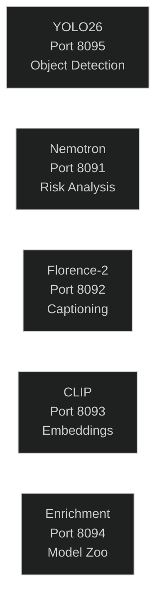
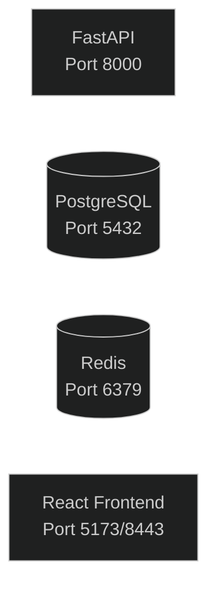
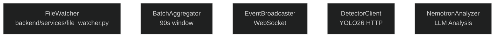
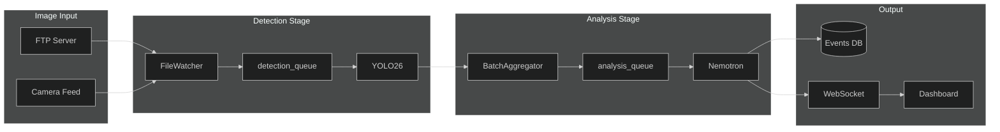
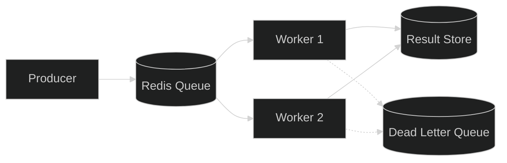
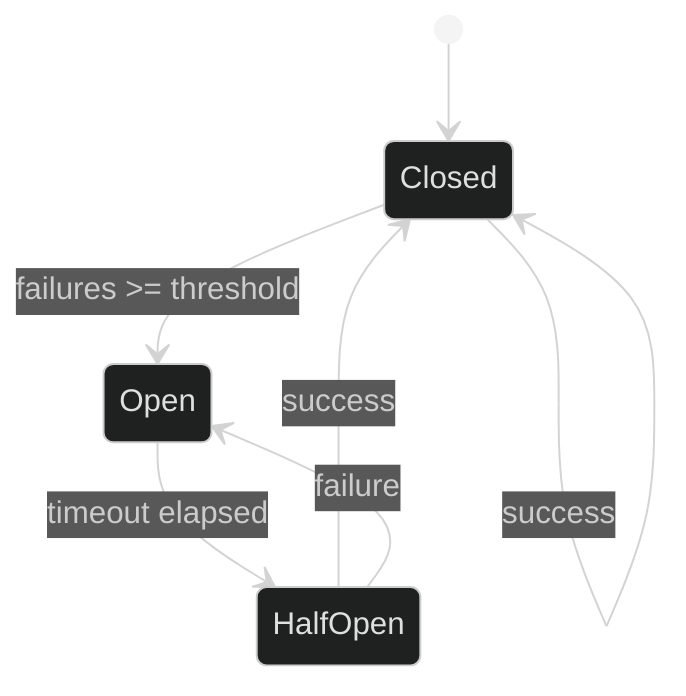
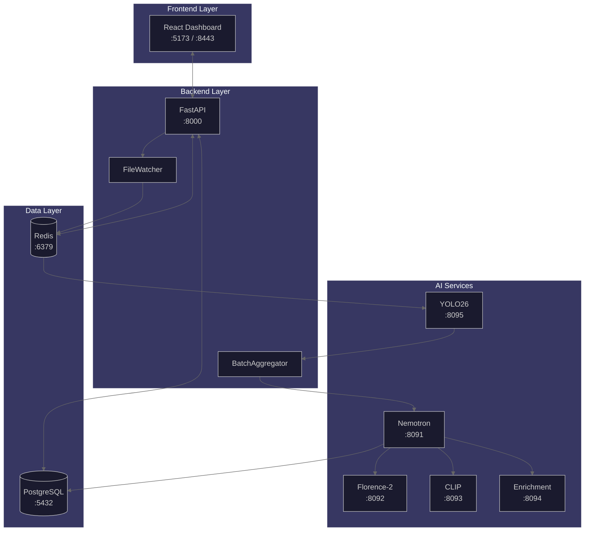
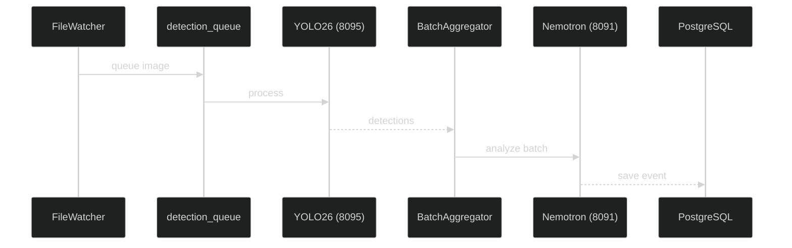

# Shared Diagram Library

> Reusable Mermaid diagram snippets and templates for consistent documentation

This directory contains copy-paste ready diagram components. Use these snippets as building blocks when creating new diagrams in documentation.

## Quick Reference

| Snippet                                         | Description                        |
| ----------------------------------------------- | ---------------------------------- |
| [Theme Configuration](#theme-configuration)     | Standard dark theme init block     |
| [Service Components](#service-components)       | Common service node definitions    |
| [Data Flow Patterns](#data-flow-patterns)       | Pipeline and queue patterns        |
| [Architecture Diagrams](#architecture-diagrams) | Full system architecture templates |

## Related Resources

- [Diagram Style Guide](../style-guides/diagrams.md) - Conventions and best practices
- [Visual Style Guide](../images/style-guide.md) - Colors and design principles

---

## Theme Configuration

### Standard Dark Theme

Copy this init block to the top of every Mermaid diagram:

```mermaid
%%{init: {
  'theme': 'dark',
  'themeVariables': {
    'primaryColor': '#3B82F6',
    'primaryTextColor': '#FFFFFF',
    'primaryBorderColor': '#60A5FA',
    'secondaryColor': '#A855F7',
    'tertiaryColor': '#009688',
    'background': '#121212',
    'mainBkg': '#1a1a2e',
    'lineColor': '#666666'
  }
}}%%
```

### Theme Color Reference

| Variable             | Hex Code  | Purpose                       |
| -------------------- | --------- | ----------------------------- |
| `primaryColor`       | `#3B82F6` | Frontend/React components     |
| `primaryTextColor`   | `#FFFFFF` | Text on primary backgrounds   |
| `primaryBorderColor` | `#60A5FA` | Borders on primary components |
| `secondaryColor`     | `#A855F7` | AI/ML components              |
| `tertiaryColor`      | `#009688` | Backend/FastAPI components    |
| `background`         | `#121212` | Diagram background            |
| `mainBkg`            | `#1a1a2e` | Subgraph backgrounds          |
| `lineColor`          | `#666666` | Default connection lines      |

---

## Service Components

### AI Services



### Core Services



### Backend Services



---

## Data Flow Patterns

### Detection Pipeline



### Queue Processing Pattern



### Circuit Breaker Pattern



---

## Architecture Diagrams

### Full System Overview



### Sequence Diagram Template



---

## Standard Abbreviations

Use these consistent abbreviations across all diagrams:

| Abbreviation | Full Name        | Component Type |
| ------------ | ---------------- | -------------- |
| `FW`         | FileWatcher      | Service        |
| `DQ`         | detection_queue  | Redis Queue    |
| `AQ`         | analysis_queue   | Redis Queue    |
| `YOLO`       | YOLO26           | AI Model       |
| `NEM`        | Nemotron         | AI Model       |
| `FLOR`       | Florence-2       | AI Model       |
| `BA`         | BatchAggregator  | Service        |
| `EB`         | EventBroadcaster | Service        |
| `WS`         | WebSocket        | Communication  |
| `DB`         | PostgreSQL       | Database       |
| `REDIS`      | Redis            | Cache/Queue    |
| `API`        | FastAPI          | API Layer      |
| `UI`         | React Frontend   | Frontend       |
| `ENR`        | Enrichment       | AI Service     |

---

## Port Reference

Current standard ports for all services:

| Service            | Port | Container           |
| ------------------ | ---- | ------------------- |
| Frontend HTTP      | 5173 | frontend            |
| Frontend HTTPS     | 8443 | frontend            |
| Backend API        | 8000 | backend             |
| PostgreSQL         | 5432 | postgres            |
| Redis              | 6379 | redis               |
| Nemotron           | 8091 | ai-llm              |
| Florence-2         | 8092 | ai-florence         |
| CLIP               | 8093 | ai-clip             |
| Enrichment (Heavy) | 8094 | ai-enrichment       |
| YOLO26             | 8095 | ai-yolo26           |
| Enrichment (Light) | 8096 | ai-enrichment-light |

---

## Usage Examples

### Adding a New Diagram

1. Copy the theme configuration from [Theme Configuration](#theme-configuration)
2. Select appropriate components from this library
3. Customize labels and connections for your use case
4. Follow the [Diagram Style Guide](../style-guides/diagrams.md) for conventions

### Embedding in Documentation

```markdown
## System Architecture

The following diagram shows the data flow through the system:

\`\`\`mermaid
%%{init: {'theme': 'dark'}}%%
flowchart LR
A[Source] --> B[Processing] --> C[Output]
\`\`\`
```

---

## Contributing

When adding new diagram components:

1. Follow the [Diagram Style Guide](../style-guides/diagrams.md) conventions
2. Use standard abbreviations from this document
3. Include theme configuration in all examples
4. Test rendering in GitHub/GitLab before committing
