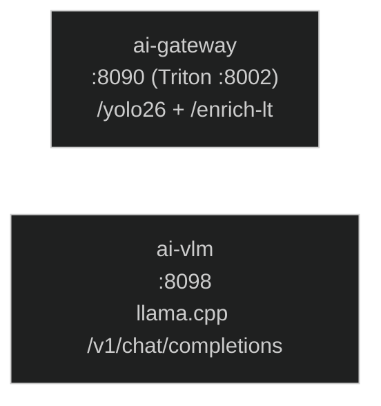
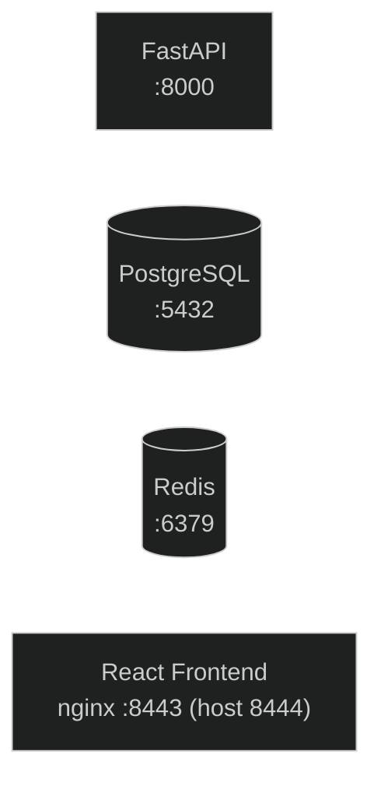
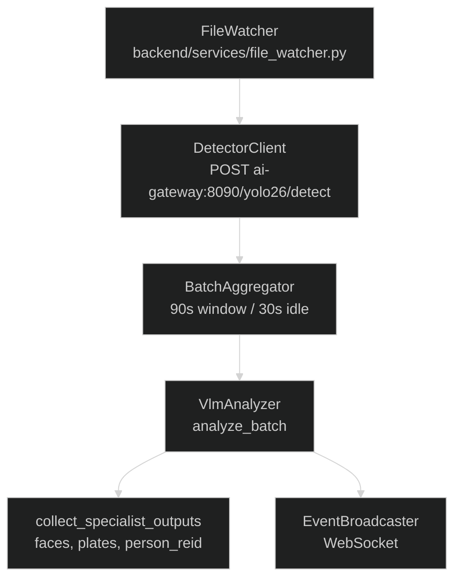
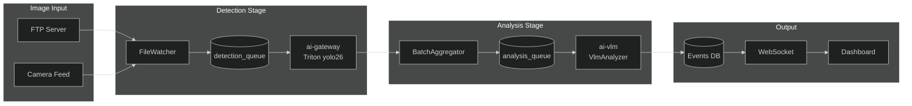
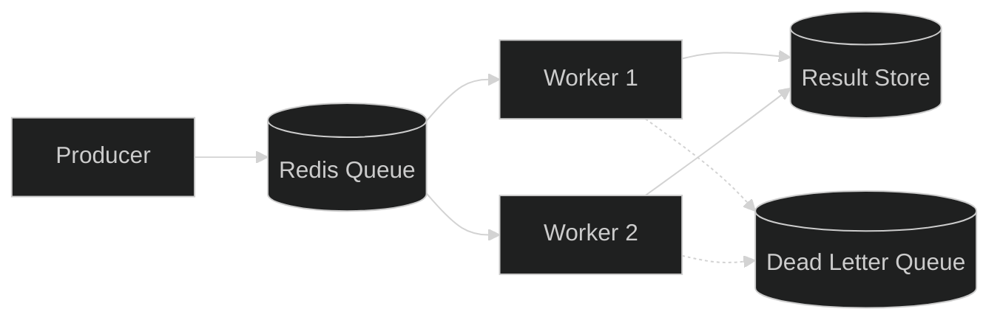
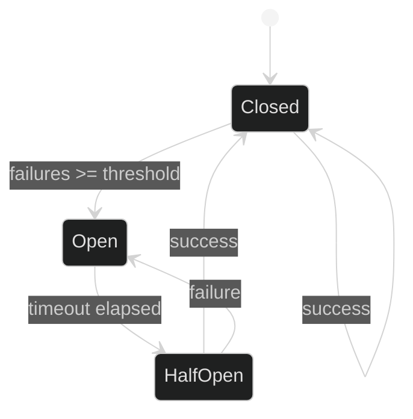
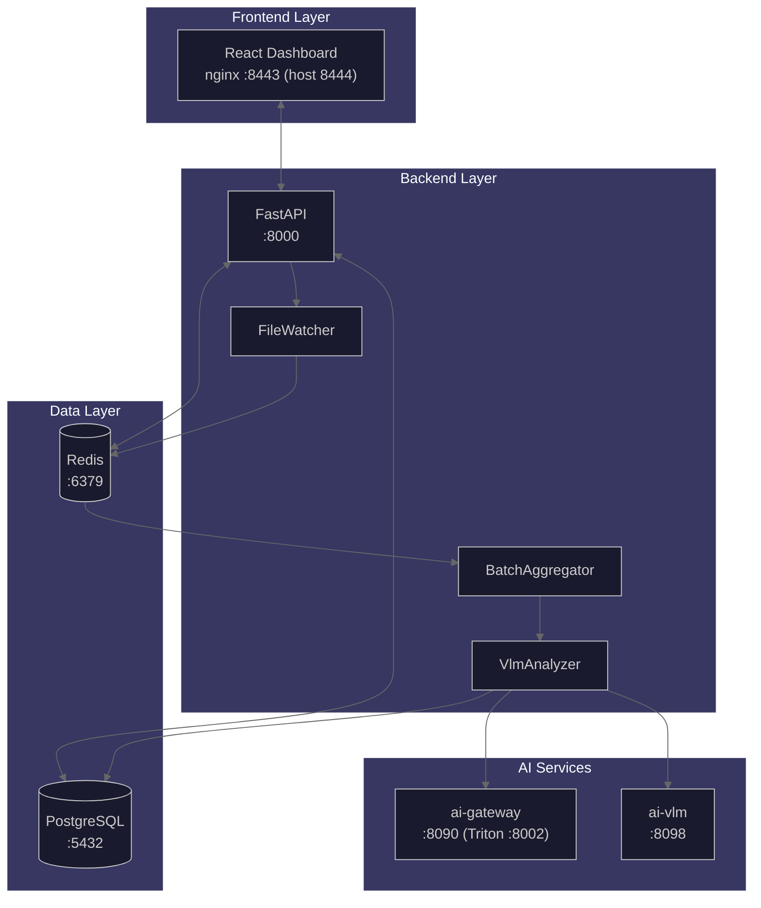
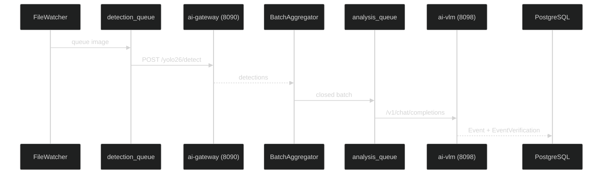
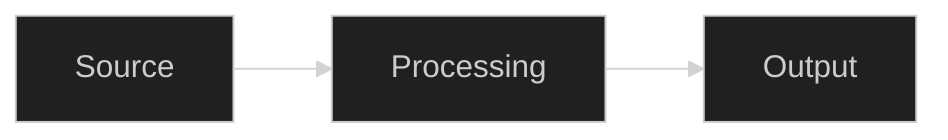

# Shared Diagram Library

> Reusable Mermaid diagram snippets and templates for consistent documentation

This directory contains copy-paste ready diagram components. Use these snippets
as building blocks when creating new diagrams in documentation. Each snippet
names the components and ports the stack actually runs — copy it, then relabel
for your own use case.

## Quick Reference

| Snippet                                         | Description                        |
| ----------------------------------------------- | ---------------------------------- |
| [Theme Configuration](#theme-configuration)     | Standard dark theme init block     |
| [Service Components](#service-components)       | Common service node definitions    |
| [Data Flow Patterns](#data-flow-patterns)       | Pipeline and queue patterns        |
| [Architecture Diagrams](#architecture-diagrams) | Full system architecture templates |

## Related Resources

- [Diagram Style Guide](../style-guides/diagrams.md) - Conventions and best practices
- [Visual Style Guide](../images/style-guide.md) - Colors and design principles
- [Container Orchestration](../deployment/container-orchestration.md) - Startup phases and health checks

---

## Theme Configuration

### Standard Dark Theme

Copy this init block to the top of every Mermaid diagram:

```mermaid
%%{init: {
  'theme': 'dark',
  'themeVariables': {
    'primaryColor': '#3B82F6',
    'primaryTextColor': '#FFFFFF',
    'primaryBorderColor': '#60A5FA',
    'secondaryColor': '#A855F7',
    'tertiaryColor': '#009688',
    'background': '#121212',
    'mainBkg': '#1a1a2e',
    'lineColor': '#666666'
  }
}}%%
```

### Theme Color Reference

| Variable             | Hex Code  | Purpose                       |
| -------------------- | --------- | ----------------------------- |
| `primaryColor`       | `#3B82F6` | Frontend/React components     |
| `primaryTextColor`   | `#FFFFFF` | Text on primary backgrounds   |
| `primaryBorderColor` | `#60A5FA` | Borders on primary components |
| `secondaryColor`     | `#A855F7` | AI/ML components              |
| `tertiaryColor`      | `#009688` | Backend/FastAPI components    |
| `background`         | `#121212` | Diagram background            |
| `mainBkg`            | `#1a1a2e` | Subgraph backgrounds          |
| `lineColor`          | `#666666` | Default connection lines      |

---

## Service Components

### AI Services

Two containers serve models. `ai-gateway` is Triton behind FastAPI; `ai-vlm` is
one `llama-server` holding one GGUF pair, in the default compose set.


```mermaid
%%{init: {'theme': 'dark'}}%%
flowchart LR
    GW["ai-gateway<br/>:8090 (Triton :8002)<br/>/yolo26 + /enrich-lt"]
    VLM["ai-vlm<br/>:8098<br/>llama.cpp /v1/chat/completions"]
```

### Core Services


```mermaid
%%{init: {'theme': 'dark'}}%%
flowchart LR
    API["FastAPI<br/>:8000"]
    DB[(PostgreSQL<br/>:5432)]
    REDIS[(Redis<br/>:6379)]
    UI["React Frontend<br/>nginx :8443 (host 8444)"]
```

### Backend Services


```mermaid
%%{init: {'theme': 'dark'}}%%
flowchart TB
    FW[FileWatcher<br/>backend/services/file_watcher.py]
    DC[DetectorClient<br/>POST ai-gateway:8090/yolo26/detect]
    BA[BatchAggregator<br/>90s window / 30s idle]
    VA[VlmAnalyzer<br/>analyze_batch]
    SP[collect_specialist_outputs<br/>faces, plates, person_reid]
    EB[EventBroadcaster<br/>WebSocket]

    FW --> DC --> BA --> VA
    VA --> SP
    VA --> EB
```

---

## Data Flow Patterns

### Detection Pipeline


```mermaid
%%{init: {
  'theme': 'dark',
  'themeVariables': {
    'primaryColor': '#3B82F6',
    'secondaryColor': '#A855F7',
    'tertiaryColor': '#009688'
  }
}}%%
flowchart LR
    subgraph Input["Image Input"]
        FTP[FTP Server]
        CAM[Camera Feed]
    end

    subgraph Detection["Detection Stage"]
        FW[FileWatcher]
        DQ[(detection_queue)]
        GW[ai-gateway<br/>Triton yolo26]
    end

    subgraph Analysis["Analysis Stage"]
        BA[BatchAggregator]
        AQ[(analysis_queue)]
        VLM[ai-vlm<br/>VlmAnalyzer]
    end

    subgraph Output["Output"]
        DB[(Events DB)]
        WS[WebSocket]
        UI[Dashboard]
    end

    FTP --> FW
    CAM --> FW
    FW --> DQ
    DQ --> GW
    GW --> BA
    BA --> AQ
    AQ --> VLM
    VLM --> DB
    DB --> WS
    WS --> UI
```

### Queue Processing Pattern


```mermaid
%%{init: {'theme': 'dark'}}%%
flowchart LR
    Producer --> Queue[(Redis Queue)]
    Queue --> Worker1[Worker 1]
    Queue --> Worker2[Worker 2]
    Worker1 --> Result[(Result Store)]
    Worker2 --> Result
    Worker1 -.-> DLQ[(Dead Letter Queue)]
    Worker2 -.-> DLQ
```

### Circuit Breaker Pattern


```mermaid
%%{init: {'theme': 'dark'}}%%
stateDiagram-v2
    [*] --> Closed
    Closed --> Open : failures >= threshold
    Open --> HalfOpen : timeout elapsed
    HalfOpen --> Closed : success
    HalfOpen --> Open : failure
    Closed --> Closed : success
```

---

## Architecture Diagrams

### Full System Overview


```mermaid
%%{init: {
  'theme': 'dark',
  'themeVariables': {
    'primaryColor': '#3B82F6',
    'primaryTextColor': '#FFFFFF',
    'primaryBorderColor': '#60A5FA',
    'secondaryColor': '#A855F7',
    'tertiaryColor': '#009688',
    'background': '#121212',
    'mainBkg': '#1a1a2e',
    'lineColor': '#666666'
  }
}}%%
flowchart TB
    subgraph Frontend["Frontend Layer"]
        UI["React Dashboard<br/>nginx :8443 (host 8444)"]
    end

    subgraph Backend["Backend Layer"]
        API["FastAPI<br/>:8000"]
        FW[FileWatcher]
        BA[BatchAggregator]
        VA[VlmAnalyzer]
    end

    subgraph AI["AI Services"]
        GW["ai-gateway<br/>:8090 (Triton :8002)"]
        VLM["ai-vlm<br/>:8098"]
    end

    subgraph Storage["Data Layer"]
        DB[(PostgreSQL<br/>:5432)]
        REDIS[(Redis<br/>:6379)]
    end

    UI <--> API
    API --> FW
    FW --> REDIS
    REDIS --> BA
    BA --> VA
    VA --> GW
    VA --> VLM
    VA --> DB
    API <--> DB
    API <--> REDIS
```

`ai-vlm` is in the default compose set but deliberately **not** in the
backend's `depends_on`, so the backend starts and degrades without it. Draw that
edge as optional when the distinction matters.

### Sequence Diagram Template


```mermaid
%%{init: {'theme': 'dark'}}%%
sequenceDiagram
    participant FW as FileWatcher
    participant DQ as detection_queue
    participant GW as ai-gateway (8090)
    participant BA as BatchAggregator
    participant AQ as analysis_queue
    participant VLM as ai-vlm (8098)
    participant DB as PostgreSQL

    FW->>DQ: queue image
    DQ->>GW: POST /yolo26/detect
    GW-->>BA: detections
    BA->>AQ: closed batch
    AQ->>VLM: /v1/chat/completions
    VLM-->>DB: Event + EventVerification
```

---

## Standard Abbreviations

Use these consistent abbreviations across all diagrams:

| Abbreviation | Full Name           | Component Type |
| ------------ | ------------------- | -------------- |
| `FW`         | FileWatcher         | Service        |
| `DQ`         | detection_queue     | Redis Queue    |
| `AQ`         | analysis_queue      | Redis Queue    |
| `DC`         | DetectorClient      | HTTP Client    |
| `GW`         | ai-gateway (Triton) | AI Service     |
| `VLM`        | ai-vlm (llama.cpp)  | AI Service     |
| `BA`         | BatchAggregator     | Service        |
| `VA`         | VlmAnalyzer         | Service        |
| `SP`         | Specialist lookups  | Service        |
| `EB`         | EventBroadcaster    | Service        |
| `WS`         | WebSocket           | Communication  |
| `DB`         | PostgreSQL          | Database       |
| `REDIS`      | Redis               | Cache/Queue    |
| `API`        | FastAPI             | API Layer      |
| `UI`         | React Frontend      | Frontend       |

---

## Port Reference

Container ports are stable; the host mapping is interpolated from `.env`, so a
colliding port is fixed in `.env` rather than by editing compose.

| Service              | Host mapping                       | Container |
| -------------------- | ---------------------------------- | --------- |
| Frontend HTTPS       | `${FRONTEND_HTTPS_PORT:-8444}`     | 8443      |
| Frontend HTTP        | `${FRONTEND_HTTP_PORT:-8080}`      | 8080      |
| Backend API          | `${API_PORT:-8000}`                | 8000      |
| ai-gateway (FastAPI) | `${AI_GATEWAY_PORT:-8090}`         | 8090      |
| ai-gateway (Triton)  | `${AI_GATEWAY_METRICS_PORT:-8002}` | 8002      |
| ai-vlm (default set) | `${AI_VLM_PORT:-8098}`             | 8098      |
| ai-llm-vllm (`vllm`) | `${VLLM_PORT:-8097}`               | 8000      |
| PostgreSQL           | `${POSTGRES_PORT:-5432}`           | 5432      |
| Redis                | `${REDIS_PORT:-6379}`              | 6379      |
| go2rtc API           | `${GO2RTC_API_PORT:-1984}`         | 1984      |
| Prometheus           | `${PROMETHEUS_PORT:-9090}`         | 9090      |
| Grafana              | `${GRAFANA_PORT:-3002}`            | 3000      |
| Pyroscope            | `${PYROSCOPE_PORT:-4040}`          | 4040      |
| Tempo API            | `${TEMPO_PORT:-3200}`              | 3200      |

Every mapping above is published on `127.0.0.1` only by default (`O1.6`);
`EXPOSE_LAN=true` publishes the two frontend ports for LAN clients.

---

## Usage Examples

### Adding A New Diagram

1. Copy the theme configuration from [Theme Configuration](#theme-configuration)
2. Select appropriate components from this library
3. Customize labels and connections for your use case
4. Follow the [Diagram Style Guide](../style-guides/diagrams.md) for conventions

### Embedding In Documentation

Quote the inner fence with backslashes so the example renders as text:

````markdown
## System Architecture

The following diagram shows the data flow through the system:


```mermaid
%%{init: {'theme': 'dark'}}%%
flowchart LR
    A[Source] --> B[Processing] --> C[Output]
```
````

---

## Contributing

When adding new diagram components:

1. Follow the [Diagram Style Guide](../style-guides/diagrams.md) conventions
2. Use standard abbreviations from this document
3. Include theme configuration in all examples
4. Keep names and ports matching `docker-compose.prod.yml` — a diagram naming a
   component that no longer runs is worse than no diagram
5. Test rendering before committing
