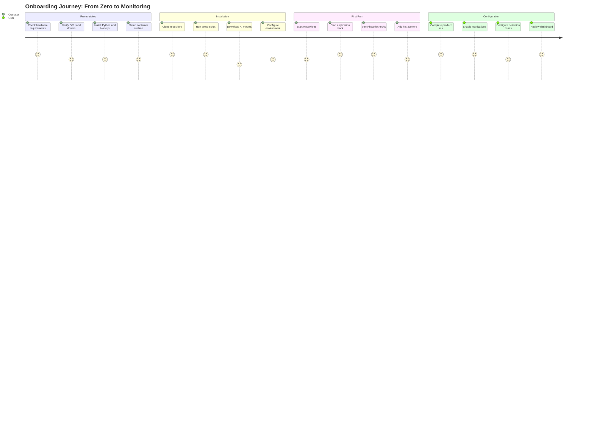

# Getting Started

Welcome to Home Security Intelligence. This section guides you from zero to a running system.

> **Note:** This section covers installation and initial setup. For ongoing usage documentation, see the [User Guide](../user/README.md).

---

## Quick Navigation

### Technical Setup (for operators/installers)

Follow these steps in order to install and start the system:

| Step | Guide                             | Description                                  |
| ---- | --------------------------------- | -------------------------------------------- |
| 1    | [Prerequisites](prerequisites.md) | Verify hardware and software requirements    |
| 2    | [Installation](installation.md)   | Clone, setup environment, download AI models |
| 3    | [First Run](first-run.md)         | Start the system and verify everything works |
| 4    | [Upgrading](upgrading.md)         | Update to new versions                       |

### End User Guides

These guides help users learn the system after installation:

| Guide                         | Description                                              |
| ----------------------------- | -------------------------------------------------------- |
| [Quick Start](quick-start.md) | Non-technical intro - what the system does and basic use |
| [Product Tour](tour.md)       | Interactive walkthrough and first-time setup             |

---

## Recommended Path

**New users:** Follow steps 1-3 in order. The entire process takes approximately 30 minutes (plus model download time).

**Existing users:** Jump directly to [Upgrading](upgrading.md) for version updates.

---

## User Journey

_The onboarding journey takes operators through system setup, then hands off to end users for configuration and daily use._

---

## What You Will Need

- NVIDIA GPU with 8GB+ VRAM (RTX 3060 or better)
- Python 3.14+, Node.js 20.19+
- Docker or Podman
- Foscam cameras (or compatible FTP-uploading cameras)

See [Prerequisites](prerequisites.md) for complete requirements and verification commands.

---

## Next Steps After Setup

Once your system is running, continue to the guide that matches your role:

| Role           | Hub                                     | Focus                                 |
| -------------- | --------------------------------------- | ------------------------------------- |
| **End Users**  | [User Guide](../user/README.md)         | Dashboard usage, cameras, alerts      |
| **Developers** | [Developer Guide](../developer/)        | Contributing, testing, architecture   |
| **Operators**  | [Operator Guide](../operator/README.md) | Deployment, monitoring, configuration |

> **Recommended for all users:** Complete the [Product Tour](tour.md) to familiarize yourself with the dashboard before diving into detailed documentation.
