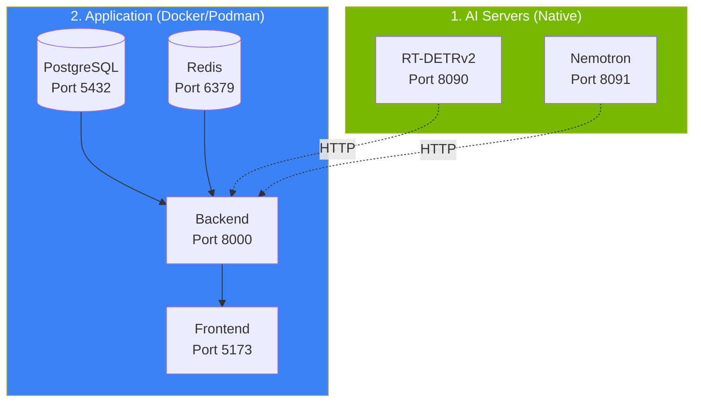

# First Run

This guide walks you through starting the system for the first time and verifying all components are working.

<!-- Nano Banana Pro Prompt:
"Technical illustration of system startup sequence,
multiple service containers connecting and synchronizing,
dark background #121212, NVIDIA green #76B900 accent lighting,
clean minimalist style, vertical 2:3 aspect ratio,
no text overlays"
-->

---

## Choose Your Deployment Mode

There are two deployment paths. Choose the one that fits your setup:

| Mode            | AI Services          | Use Case                                 | Docker Compose File       |
| --------------- | -------------------- | ---------------------------------------- | ------------------------- |
| **Production**  | Run in containers    | Simplest setup, everything containerized | `docker-compose.prod.yml` |
| **Development** | Run natively on host | Faster AI iteration, debugging           | `docker-compose.yml`      |

> **Important:** Do NOT mix host-run AI servers with `docker-compose.prod.yml`. This causes port conflicts on 8090/8091.

---

## Option A: Production Mode (Recommended)

All services run in containers, including GPU-accelerated AI servers.

### Prerequisites

- NVIDIA GPU with `nvidia-container-toolkit` installed
- Models downloaded via `./ai/download_models.sh`

### Start Everything

```bash
# Docker
docker compose -f docker-compose.prod.yml up -d

# OR Podman
podman-compose -f docker-compose.prod.yml up -d
```

**What starts** ([`docker-compose.prod.yml`](../../docker-compose.prod.yml:1)):

| Service     | Port | Purpose                    |
| ----------- | ---- | -------------------------- |
| PostgreSQL  | 5432 | Database                   |
| Redis       | 6379 | Queues + pub/sub           |
| ai-detector | 8090 | RT-DETRv2 object detection |
| ai-llm      | 8091 | Nemotron LLM risk analysis |
| Backend     | 8000 | FastAPI + WebSocket        |
| Frontend    | 5173 | React dashboard (nginx)    |

### Verify Production Deployment

```bash
# Docker
docker compose -f docker-compose.prod.yml ps

# OR Podman
podman-compose -f docker-compose.prod.yml ps

# Expected: All services "healthy" or "running"
NAME                      STATUS
security-postgres-1       healthy
security-redis-1          healthy
security-ai-detector-1    healthy
security-ai-llm-1         healthy
security-backend-1        healthy
security-frontend-1       healthy
```

### Access Dashboard

Open **[http://localhost:5173](http://localhost:5173)**

---

## Option B: Development Mode (Host AI)

AI servers run natively on the host for faster iteration. Application services run in containers.



> **Why host AI servers?** Faster restart times during model development, easier debugging, and simpler GPU access without container runtime configuration.

### Step 1: Start AI Servers

Open **two separate terminal windows** for the AI servers.

#### Terminal 1: RT-DETRv2 Detection Server

```bash
cd home-security-intelligence
./ai/start_detector.sh
```

**What happens** ([`ai/rtdetr/model.py`](../../ai/rtdetr/model.py)):

- Loads RT-DETRv2 via HuggingFace Transformers (`RTDETR_MODEL_PATH`)
- Starts HTTP server on port 8090
- Uses ~4GB VRAM

**Expected output:**

```
Starting RT-DETRv2 Detection Server...
Model directory: /path/to/ai/rtdetr
Port: 8090
Expected VRAM usage: ~4GB
INFO:     Uvicorn running on http://0.0.0.0:8090
```

#### Terminal 2: Nemotron LLM Server

```bash
cd home-security-intelligence
./ai/start_llm.sh
```

**What happens** ([`ai/start_llm.sh:36-43`](../../ai/start_llm.sh:36)):

- Loads the Nemotron GGUF model via llama.cpp
- Starts HTTP server on port 8091 ([line 16](../../ai/start_llm.sh:16))
- Uses ~3GB VRAM
- Configures 4096 token context, 2 parallel requests

**Expected output:**

```
Starting Nemotron LLM Server via llama.cpp...
Model: /path/to/ai/nemotron/nemotron-mini-4b-instruct-q4_k_m.gguf
Port: 8091
Context size: 4096
GPU layers: 99 (all layers)
llama server listening at http://0.0.0.0:8091
```

#### Verify AI Servers

```bash
# Check RT-DETRv2
curl http://localhost:8090/health
# Expected: JSON describing model + CUDA status

# Check Nemotron
curl http://localhost:8091/health
# Expected: {"status": "ok"}
```

### Step 2: Start Application Stack

In a **third terminal**, set the AI host and start containers:

```bash
# macOS with Docker Desktop (default, no export needed)
docker compose up -d

# macOS with Podman
export AI_HOST=host.containers.internal
podman-compose up -d

# Linux with Docker
docker compose up -d

# Linux with Podman (use your host IP)
export AI_HOST=192.168.1.100  # Replace with your IP
podman-compose up -d
```

> **Note:** The development compose file (`docker-compose.yml`) does NOT include AI services - it expects them to run on the host.

**What starts** ([`docker-compose.yml`](../../docker-compose.yml:1)):

| Service    | Port | Purpose                           |
| ---------- | ---- | --------------------------------- |
| PostgreSQL | 5432 | Database                          |
| Redis      | 6379 | Queues + pub/sub                  |
| Backend    | 8000 | FastAPI + WebSocket               |
| Frontend   | 5173 | React dashboard (Vite dev server) |

### Verify Development Deployment

```bash
# Docker
docker compose ps

# OR Podman
podman-compose ps

# Expected: All services "healthy" or "running"
NAME                    STATUS
security-postgres-1     healthy
security-redis-1        healthy
security-backend-1      healthy
security-frontend-1     healthy
```

### Access Dashboard

Open **[http://localhost:5173](http://localhost:5173)**

---

## Post-Startup Verification

After starting with either mode, verify all services are communicating:

### Backend Health Check

```bash
# Backend health (checks all dependencies)
curl http://localhost:8000/api/system/health
```

**Expected response:**

```json
{
  "status": "healthy",
  "database": "connected",
  "redis": "connected",
  "detection_service": "available",
  "llm_service": "available"
}
```

### Individual Health Endpoints

```bash
# Database readiness
curl http://localhost:8000/api/system/health/ready

# GPU Stats (if AI servers running)
curl http://localhost:8000/api/system/gpu
```

---

## Configure Your First Camera

1. **Via Dashboard**: Navigate to Settings > Cameras > Add Camera

2. **Via API**:

   ```bash
   curl -X POST http://localhost:8000/api/cameras \
     -H "Content-Type: application/json" \
     -d '{
       "name": "Front Door",
       "folder_path": "front_door",
       "status": "active"
     }'
   ```

3. **Configure FTP**: Point your camera to upload to:
   - Host: Your server IP
   - Path: `/export/foscam/front_door/` (or your `FOSCAM_BASE_PATH`)

---

## Viewing Logs

### Production Mode

```bash
# Docker
docker compose -f docker-compose.prod.yml logs -f
docker compose -f docker-compose.prod.yml logs -f backend

# OR Podman
podman-compose -f docker-compose.prod.yml logs -f
podman-compose -f docker-compose.prod.yml logs -f backend
```

### Development Mode

AI server logs appear in the terminal windows where you started them.

```bash
# Docker
docker compose logs -f
docker compose logs -f backend

# OR Podman
podman-compose logs -f
podman-compose logs -f backend
```

---

## Stopping the System

### Production Mode

```bash
# Docker
docker compose -f docker-compose.prod.yml down
docker compose -f docker-compose.prod.yml down -v  # Full cleanup (removes volumes)

# OR Podman
podman-compose -f docker-compose.prod.yml down
podman-compose -f docker-compose.prod.yml down -v  # Full cleanup (removes volumes)
```

### Development Mode

```bash
# Docker
docker compose down

# OR Podman
podman-compose down

# Stop AI Servers: Press Ctrl+C in each terminal
```

---

## Troubleshooting

### AI servers won't start

```bash
# Check GPU availability
nvidia-smi

# Check model files exist
ls -la ai/nemotron/*.gguf
# RT-DETRv2 weights are downloaded to HuggingFace cache; use /health to confirm model_loaded=true

# Check port availability
lsof -i :8090
lsof -i :8091
```

### Port conflict on 8090/8091

This happens when you mix host AI servers with `docker-compose.prod.yml`.

**Solution:** Choose one path:

- **Production:** Stop host AI servers, use `docker-compose.prod.yml` only
- **Development:** Use `docker-compose.yml` (no AI containers) with host AI servers

### Backend can't reach AI services

```bash
# From inside container - Docker
docker exec security-backend-1 curl http://host.docker.internal:8090/health

# From inside container - Podman
podman exec security-backend-1 curl http://host.containers.internal:8090/health

# Check AI_HOST is set correctly
echo $AI_HOST
```

### Database connection issues

```bash
# Docker
docker compose ps postgres
docker compose logs postgres

# OR Podman
podman-compose ps postgres
podman-compose logs postgres
```

### Frontend not loading

```bash
# Check nginx logs (production) - Docker or Podman
docker compose -f docker-compose.prod.yml logs frontend
# OR
podman-compose -f docker-compose.prod.yml logs frontend

# Verify backend is healthy
curl http://localhost:8000/api/system/health
```

---

## Next Steps

System is running. Continue with:

- **[User Guide](../user-guide/dashboard-overview.md)** - Learn to use the dashboard
- **[Configuration](../admin-guide/configuration.md)** - Customize settings
- **[Upgrading](upgrading.md)** - Future version upgrades
