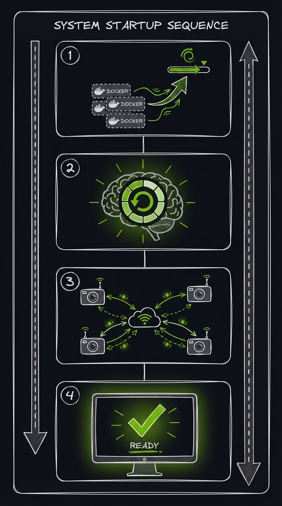
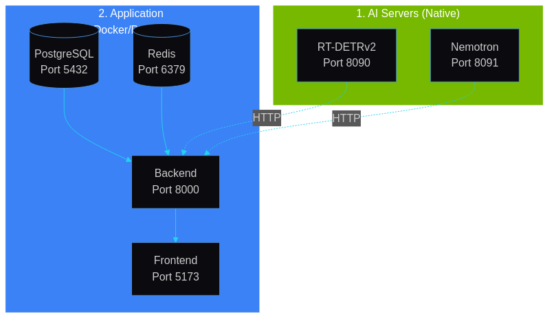

# First Run



_AI-generated visualization of system startup sequence showing container initialization, model loading, camera connections, and dashboard ready state._

This guide walks you through starting the system for the first time and verifying all components are working.

<!-- Nano Banana Pro Prompt:
"Technical illustration of system startup sequence,
multiple service containers connecting and synchronizing,
dark background #121212, NVIDIA green #76B900 accent lighting,
clean minimalist style, vertical 2:3 aspect ratio,
no text overlays"
-->

---

## Choose Your Deployment Mode

Use this decision tree to determine the best deployment path for your setup:


_Quickstart decision tree: Choose Production Mode for simplest setup with everything containerized, or Development Mode for faster AI iteration with native GPU access._

---

There are two deployment paths. Choose the one that fits your setup:

| Mode           | AI Services       | Use Case                                 | Docker Compose File       |
| -------------- | ----------------- | ---------------------------------------- | ------------------------- |
| **Production** | Run in containers | Simplest setup, everything containerized | `docker-compose.prod.yml` |

> **Important:** Do NOT run the host AI scripts (`./ai/start_detector.sh`, `./ai/start_llm.sh`) at the same time as `docker-compose.prod.yml` — the `ai-gateway` and `ai-llm` containers already claim ports 8090 and 8091, so the host servers will fail to bind.

---

## Option A: Production Mode (Recommended)

All services run in containers, including GPU-accelerated AI servers.

### Prerequisites

- NVIDIA GPU with `nvidia-container-toolkit` installed
- AI model storage configured (see `docs/operator/ai-installation.md`)
- `.env` and `docker-compose.override.yml` written by `python setup.py` (see [Installation](installation.md))

### Start Everything

```bash
# Docker
docker compose -f docker-compose.prod.yml up -d

# OR Podman
podman compose -f docker-compose.prod.yml up -d
```

**What starts** ([`docker-compose.prod.yml`](https://github.com/mikesvoboda/nemotron-v3-home-security-intelligence/blob/main/docker-compose.prod.yml)) — 21 services; the ones you interact with day one:

| Service    | Host port           | Purpose                                                     |
| ---------- | ------------------- | ----------------------------------------------------------- |
| postgres   | 5432                | Database                                                    |
| redis      | 6379                | Queues + pub/sub                                            |
| ai-gateway | 8090 (metrics 8002) | Single AI entrypoint — YOLO26, Florence-2, CLIP, enrichment |
| ai-llm     | 8091                | Nemotron LLM risk analysis (llama.cpp)                      |
| go2rtc     | 1984 / 8555         | Camera stream relaying                                      |
| backend    | 8000                | FastAPI + WebSocket                                         |
| frontend   | 8080 / 8444         | React dashboard via nginx (HTTP / HTTPS)                    |

The rest is the observability stack (prometheus, grafana on 3002, loki, tempo, alertmanager, pyroscope, alloy, the exporters) plus `foscam-init`, a one-shot job that prepares the camera directory.

> **Port Note:** Every service binds `127.0.0.1` only, except the frontend, which listens on all interfaces. The dashboard is on **port 8080 (HTTP)** by default, configurable via `FRONTEND_HTTP_PORT`, and **port 8444 (HTTPS)** when enabled via `SSL_ENABLED=true`, configurable via `FRONTEND_HTTPS_PORT`. The HTTPS listener serves auto-generated self-signed certificates; the backend's own AI calls go to the gateway over compose DNS, not through these ports.

### Verify Production Deployment

```bash
# Docker
docker compose -f docker-compose.prod.yml ps

# OR Podman
podman compose -f docker-compose.prod.yml ps

# Expected: every service "Up (healthy)" (or the one-shot foscam-init "Completed").
# The LLM container takes the longest — its healthcheck allows up to 5 minutes
# for model load. Re-run the command until everything is healthy.
```

### Register the First Admin

A fresh install serves nothing useful until you create the first account. The API returns **503** for every route except setup, health, and metrics (SetupGuardMiddleware) until an admin exists.

Open the dashboard — it will show the setup page — and register the first admin account there, or do it via the API:

```bash
# Confirm setup is pending
curl -s http://localhost:8000/api/auth/setup-status

# Register the first admin (username: 3-50 chars of letters/digits/_/-;
# password: 8+ chars with an uppercase letter, a lowercase letter, and a digit)
curl -X POST http://localhost:8000/api/auth/register \
  -H "Content-Type: application/json" \
  -d '{"username": "admin", "email": "you@example.com", "password": "<choose-one>"}'
```

### Access Dashboard

Open **[http://localhost:8080](http://localhost:8080)** (HTTP), or **[https://localhost:8444](https://localhost:8444)** (HTTPS, if `SSL_ENABLED=true`).

> **HTTPS Note:** SSL is **off by default** (`SSL_ENABLED=false` in the compose file). Enable it in `.env` and recreate the frontend container to get HTTPS with auto-generated self-signed certificates. Your browser will show a certificate warning because the certificate is self-signed — accept it to proceed. For trusted certificates, see the [SSL/HTTPS Configuration Guide](../developer/ssl-https.md).

---

## Option B: Development Mode (Host AI)

AI servers run natively on the host for faster iteration; everything else runs in containers.



_Development mode: AI servers run natively on the host, application services run in containers._

> **Why host AI servers?** Faster restart times during model development, easier debugging, and simpler GPU access without container runtime configuration.

> **Scope:** Host-run AI replaces only what the containers provide: `./ai/start_detector.sh` stands in for the gateway's `/yolo26` router, and `./ai/start_llm.sh` for the `ai-llm` container. Florence/CLIP/enrichment have no host-run launcher yet, so for now start `ai-gateway` as a container as well.

### Step 1: Start AI Servers

Open **two separate terminal windows** for the AI servers.

#### Terminal 1: YOLO26 Detection Server

```bash
cd nemotron-v3-home-security-intelligence
./ai/start_detector.sh
```

**What happens** ([`ai/yolo26/model.py`](https://github.com/mikesvoboda/nemotron-v3-home-security-intelligence/blob/main/ai/yolo26/model.py)):

- Loads YOLO26 via HuggingFace Transformers (`YOLO26_MODEL_PATH`)
- Listens on port **8090** (`YOLO26_PORT` overrides; the script exports `PORT`)
- Uses ~4GB VRAM

**Expected output:**

```
Starting YOLO26v2 Detection Server...
Model directory: /path/to/repo/ai/yolo26
Port: 8090
Expected VRAM usage: ~4GB
INFO:     Uvicorn running on http://0.0.0.0:8090
```

#### Terminal 2: Nemotron LLM Server

```bash
cd nemotron-v3-home-security-intelligence
./ai/start_llm.sh
```

**What happens** ([`ai/start_llm.sh:36-43`](https://github.com/mikesvoboda/nemotron-v3-home-security-intelligence/blob/main/ai/start_llm.sh#L36)):

- Loads a Nemotron GGUF via llama.cpp — by default `ai/nemotron/nemotron-mini-4b-instruct-q4_k_m.gguf` (~3GB VRAM, 4K context); override the file with `NEMOTRON_MODEL_PATH`
- Listens on port **8091** (`NEMOTRON_PORT` overrides)

**Expected output:**

```
Starting Nemotron LLM Server via llama.cpp...
Model: /path/to/repo/ai/nemotron/nemotron-mini-4b-instruct-q4_k_m.gguf
Port: 8091
Context size: 4096
GPU layers: 99 (all layers)
```

#### Verify AI Servers

```bash
# Check YOLO26 (root path — the standalone server has no /yolo26 prefix)
curl http://localhost:8090/health
# Expected: JSON describing model + CUDA status

# Check Nemotron
curl http://localhost:8091/health
# Expected: {"status": "ok"}
```

### Step 2: Point the Stack at Host AI, Then Start It

The backend reaches AI services purely through URL environment variables from `.env` — there is no `AI_HOST` variable. For host-run AI set:

```bash
# In .env (native-dev defaults are already shown this way in .env.example):
USE_AI_GATEWAY=false
YOLO26_URL=http://host.docker.internal:8090     # Docker Desktop, or your host IP
NEMOTRON_URL=http://host.docker.internal:8091   # Podman: http://host.containers.internal:8091
```

> **Podman on Linux:** `host.containers.internal` resolves inside the default Podman network; if it doesn't on your host, use the host's LAN IP (e.g. `http://192.168.1.100:8090`).

Then start the containers **without the two AI services**, so they don't fight the host servers for ports 8090/8091 (if you couldn't start `ai-gateway`'s other routers above, add it back to the list):

```bash
# Docker
docker compose -f docker-compose.prod.yml up -d postgres redis go2rtc backend frontend

# OR Podman
podman compose -f docker-compose.prod.yml up -d postgres redis go2rtc backend frontend
```

### Verify Development Deployment

```bash
# Docker
docker compose -f docker-compose.prod.yml ps

# OR Podman
podman compose -f docker-compose.prod.yml ps

# Expected: the services you started are "Up (healthy)". Use `ps` rather than
# pattern-matching container names — compose derives container names from the
# project directory unless a service pins container_name (e.g. hsi-go2rtc).
```

### Access Dashboard

Open **[http://localhost:8080](http://localhost:8080)** (HTTP) or **[https://localhost:8444](https://localhost:8444)** (HTTPS) — same as production. Register the first admin on first boot as described above.

---

## Post-Startup Verification

After starting with either mode, verify all services are communicating:

### Backend Health Check

```bash
# Backend health (checks all dependencies)
curl http://localhost:8000/api/system/health
```

**Expected response** (shape per the backend's `HealthResponse` schema — service names are keys in `services`):

```json
{
  "status": "healthy",
  "services": {
    "database": { "status": "healthy" },
    "redis": { "status": "healthy" },
    "ai": { "status": "healthy" }
  },
  "timestamp": "2026-09-22T12:00:00Z",
  "recent_events": [],
  "memory": { "rss_mb": 250.1 }
}
```

The endpoint returns HTTP 200 when healthy and 503 when degraded or unhealthy.

### Individual Health Endpoints

```bash
# Readiness probe (fast)
curl http://localhost:8000/api/system/health/ready

# Per-AI-service status
curl http://localhost:8000/api/health/ai-services

# GPU Stats
curl http://localhost:8000/api/system/gpu
```

---

## Configure Your First Camera

You usually don't need to register cameras at all: the backend's file watcher **auto-creates** a camera record the first time it sees a new image under any subfolder of the camera root. To set it up:

1. **Point your camera's FTP** at `<FOSCAM_BASE_PATH>/<folder>/` on the host — by default `/export/foscam/front_door/`. On the host that is your FTP destination; inside the backend container the same directory is mounted at `/cameras/front_door` (compose always mounts the camera root at `/cameras`).

2. **Via Dashboard** (to review or edit): Settings → Cameras (`/settings/cameras`).

3. **Via API** (cameras are matched by folder path, so use the path as the backend sees it):

   ```bash
   curl -X POST http://localhost:8000/api/cameras \
     -H "Content-Type: application/json" \
     -d '{
       "name": "Front Door",
       "folder_path": "/cameras/front_door",
       "status": "online"
     }'
   ```

---

## Viewing Logs

### Production Mode

```bash
# Docker
docker compose -f docker-compose.prod.yml logs -f
docker compose -f docker-compose.prod.yml logs -f backend

# OR Podman
podman compose -f docker-compose.prod.yml logs -f
podman compose -f docker-compose.prod.yml logs -f backend
```

### Development Mode

AI server logs appear in the terminal windows where you started them.

```bash
# Docker
docker compose -f docker-compose.prod.yml logs -f backend

# OR Podman
podman compose -f docker-compose.prod.yml logs -f backend
```

---

## Stopping the System

### Production Mode

```bash
# Docker
docker compose -f docker-compose.prod.yml down
docker compose -f docker-compose.prod.yml down -v  # Full cleanup (removes volumes)

# OR Podman
podman compose -f docker-compose.prod.yml down
podman compose -f docker-compose.prod.yml down -v  # Full cleanup (removes volumes)
```

### Development Mode

```bash
# Docker
docker compose -f docker-compose.prod.yml down

# OR Podman
podman compose -f docker-compose.prod.yml down

# Stop AI Servers: Press Ctrl+C in each terminal
```

---

## Troubleshooting

### AI servers won't start

```bash
# Check GPU availability
nvidia-smi

# Check model files exist (host-run start_llm.sh wants the Mini 4B GGUF locally)
ls -la ai/nemotron/*.gguf
# YOLO26 weights are fetched via HuggingFace; use /health to confirm the model loaded

# Check port availability (gateway: 8090, LLM: 8091)
lsof -i :8090
lsof -i :8091
```

### Port conflict on 8090/8091

This happens when you run the host AI scripts while `ai-gateway`/`ai-llm` containers are also up.

**Solution:** Choose one path:

- **Production:** Stop the host AI servers, use `docker-compose.prod.yml` only
- **Development:** Run AI servers natively on the host and point `YOLO26_URL`/`NEMOTRON_URL` (in `.env`) at them — see Option B

### Backend can't reach AI services

```bash
# Find the backend container name
podman compose -f docker-compose.prod.yml ps backend

# From inside the container - Docker
docker exec <backend-container> curl http://host.docker.internal:8090/health

# From inside the container - Podman
podman exec <backend-container> curl http://host.containers.internal:8090/health

# Check the URL vars the container actually has
podman compose -f docker-compose.prod.yml exec backend env | grep -E "YOLO26_URL|NEMOTRON_URL"
```

### Database connection issues

```bash
# Docker
docker compose -f docker-compose.prod.yml ps postgres
docker compose -f docker-compose.prod.yml logs postgres

# OR Podman
podman compose -f docker-compose.prod.yml ps postgres
podman compose -f docker-compose.prod.yml logs postgres
```

### Frontend not loading

```bash
# Check nginx logs (production) - Docker or Podman
docker compose -f docker-compose.prod.yml logs frontend
# OR
podman compose -f docker-compose.prod.yml logs frontend

# Verify backend is healthy
curl http://localhost:8000/api/system/health
```

---

## Next Steps

System is running. Continue with:

- **[Dashboard Guide](../ui/dashboard.md)** - Learn to use the dashboard
- **[Configuration Reference](../reference/config/env-reference.md)** - Customize settings
- **[Upgrading](upgrading.md)** - Future version upgrades
