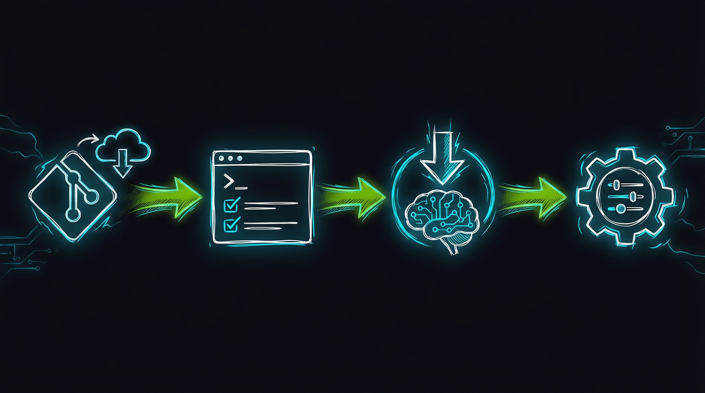

# Installation

This guide walks through the complete installation process for Home Security Intelligence.

<!-- Nano Banana Pro Prompt:
"Technical illustration of software installation process,
terminal window with code and progress bars,
dark background #121212, NVIDIA green #76B900 accent lighting,
clean minimalist style, vertical 2:3 aspect ratio,
no text overlays"
-->

---

## Overview

The installation consists of four steps:



_Four-step installation workflow: Clone Repository, Setup Environment, Download Models, and Configure._

---

## Step 1: Clone the Repository

```bash
git clone https://github.com/your-org/home-security-intelligence.git
cd home-security-intelligence
```

---

## Step 2: Run Setup Script

The setup script ([`scripts/setup-hooks.sh`](../../scripts/setup-hooks.sh:1)) automates environment configuration:

```bash
./scripts/setup-hooks.sh
```

### What It Does

1. **Creates Python virtual environment** ([lines 26-51](../../scripts/setup-hooks.sh:26))

   ```bash
   # Creates .venv/ and installs all dependencies from pyproject.toml
   # Uses uv (recommended - 10-100x faster than pip)
   uv sync --extra dev
   ```

   **Note:** Dependencies are defined in `pyproject.toml` and locked in `uv.lock` for reproducible builds.

2. **Installs Node.js dependencies** ([lines 54-67](../../scripts/setup-hooks.sh:54))

   ```bash
   cd frontend && npm install
   ```

3. **Configures pre-commit hooks** ([lines 71-82](../../scripts/setup-hooks.sh:71))

   ```bash
   pre-commit install
   pre-commit install --hook-type commit-msg
   ```

### Expected Output

```
Setting up Python environment...
Creating Python virtual environment...
Installing backend dependencies...
✓ Python environment ready

Setting up Node.js environment...
Installing frontend dependencies...
✓ Node.js environment ready

Setting up pre-commit hooks...
✓ Pre-commit hooks installed

Setup complete!
```

---

## Step 3: Download AI Models

The model download script ([`ai/download_models.sh`](../../ai/download_models.sh:1)) fetches the required AI models:

```bash
./ai/download_models.sh
```

### Models Downloaded

| Model                   | Size    | Purpose              | Location                                                        |
| ----------------------- | ------- | -------------------- | --------------------------------------------------------------- |
| **Nemotron-3-Nano-30B** | ~14.7GB | Risk analysis (prod) | `/export/ai_models/nemotron/nemotron-3-nano-30b-a3b-q4km/`      |
| **Nemotron Mini 4B**    | ~2.5GB  | Risk analysis (dev)  | `ai/nemotron/` ([lines 90-167](../../ai/download_models.sh:90)) |
| **YOLO26**              | varies  | Object detection     | HuggingFace cache (`HF_HOME`), pulled by the detector service   |

### Using Pre-downloaded Models

If you have models cached locally (e.g., on a shared network drive), you can skip the download:

```bash
# For Nemotron (GGUF format) - Production 30B model
export NEMOTRON_GGUF_PATH=/export/ai_models/nemotron/nemotron-3-nano-30b-a3b-q4km/Nemotron-3-Nano-30B-A3B-Q4_K_M.gguf
# Or for development (Mini 4B)
# export NEMOTRON_GGUF_PATH=/path/to/nemotron-mini-4b-instruct-q4_k_m.gguf

# YOLO26 is loaded via HuggingFace (configure via YOLO26_MODEL_PATH if needed)
export YOLO26_MODEL_PATH=PekingU/yolo26_r50vd_coco_o365

# Then run the script
./ai/download_models.sh
```

The script will copy from your local path instead of downloading.

### Model Search Paths

The script automatically searches these locations for existing models:

```bash
# Nemotron search paths
/export/ai_models/nemotron
/export/ai_models/weights
/export/ai_models/cache

# YOLO26 search paths
/export/ai_models/yolo26v2
/export/ai_models/yolo26v2/weights
/export/ai_models/yolo26v2/optimized
```

---

## Step 4: Configure Environment

### Create Environment File

Copy the example environment file:

```bash
cp .env.example .env
```

### Required Configuration

> **Recommended:** Run `./setup.sh` to generate a `.env` file with secure database credentials automatically.

Or manually edit `.env` with your settings:

```bash
# Database (POSTGRES_PASSWORD is REQUIRED - generate with: openssl rand -base64 32)
DATABASE_URL=postgresql+asyncpg://security:<your-password>@postgres:5432/security
REDIS_URL=redis://redis:6379

# AI Services (pick URLs based on your deployment mode)
# See: docs/operator/deployment-modes.md
#
# Production (docker-compose.prod.yml): backend reaches AI via compose DNS
# YOLO26_URL=http://ai-yolo26:8095
# NEMOTRON_URL=http://ai-llm:8091
# FLORENCE_URL=http://ai-florence:8092
# CLIP_URL=http://ai-clip:8093
# ENRICHMENT_URL=http://ai-enrichment:8094
#
# Development (host-run AI):
# YOLO26_URL=http://localhost:8095
# NEMOTRON_URL=http://localhost:8091

# Camera Upload Directory
FOSCAM_BASE_PATH=/export/foscam
```

### Platform-Specific Configuration

#### macOS

```bash
# Docker Desktop (default works automatically)
# Uses host.docker.internal

# Podman on macOS
export AI_HOST=host.containers.internal
```

#### Linux

```bash
# Docker Engine (default works automatically for most setups)
# Uses host.docker.internal

# Podman on Linux - use your host's IP address
export AI_HOST=192.168.1.100  # Replace with your IP
```

### Configure Camera Paths

Mount your camera upload directory. Edit `docker-compose.prod.yml` or set the environment variable:

```bash
# In .env or shell
export FOSCAM_BASE_PATH=/path/to/your/camera/uploads
```

The directory structure should be:

```
/path/to/camera/uploads/
├── front_door/
│   └── ... (FTP uploaded images)
├── back_yard/
│   └── ...
└── garage/
    └── ...
```

---

## Verify Installation

After completing all steps, verify the installation:

```bash
# Check Python environment
source .venv/bin/activate
python --version
pip list | grep -E "(fastapi|sqlalchemy|redis)"

# Check Node environment
cd frontend && npm list --depth=0

# Check models exist
ls -la ai/nemotron/*.gguf

# YOLO26 weights live in HuggingFace cache. Verify by starting the service and hitting /health:
# curl http://localhost:8095/health

# Check container runtime (choose one)
docker --version && docker compose version   # Docker
# OR
podman --version && podman-compose --version  # Podman
```

---

## Troubleshooting

### Setup script fails

```bash
# Ensure Python 3.14+ is available
python3 --version

# Try with explicit Python version
python3.14 -m venv .venv
```

### Model download fails

```bash
# Check network connectivity
curl -I https://huggingface.co

# Use pre-downloaded models (see Step 3)
export NEMOTRON_GGUF_PATH=/your/local/model.gguf
```

### Node.js dependency issues

```bash
# Clear npm cache and retry
cd frontend
rm -rf node_modules package-lock.json
npm install
```

---

## Next Steps

Installation complete. Proceed to:

**[First Run](first-run.md)** - Start the system and verify everything works.
