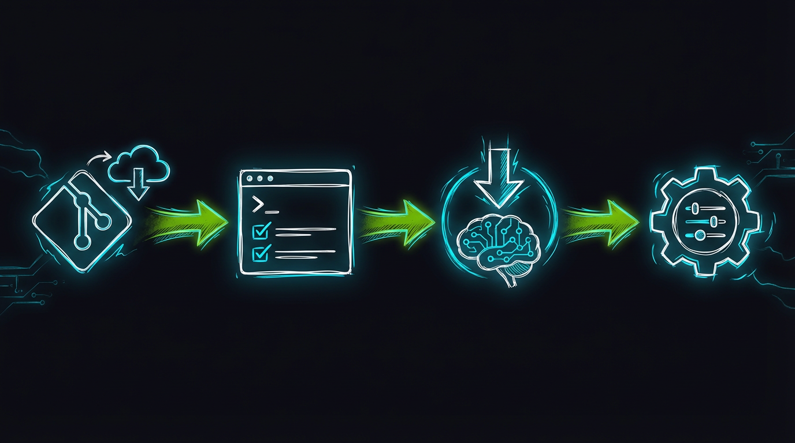

# Installation

This guide walks through the complete installation process for Home Security Intelligence.

<!-- Nano Banana Pro Prompt:
"Technical illustration of software installation process,
terminal window with code and progress bars,
dark background #121212, NVIDIA green #76B900 accent lighting,
clean minimalist style, vertical 2:3 aspect ratio,
no text overlays"
-->

---

## Overview



_Four-step installation workflow: Clone Repository, Setup Environment, Download Models, and Configure._

There are two setup paths. Run `python setup.py` — it is the supported first-time setup, because it generates a `.env` with real random credentials and a `docker-compose.override.yml` for your paths and ports. `./scripts/setup-hooks.sh` is the developer path: it installs the dev toolchain (virtualenv, npm packages, git hooks) and does not produce a working configuration by itself.

---

## Step 1: Clone the Repository

Clone the repository and change into it:

```bash
git clone https://github.com/mikesvoboda/nemotron-v3-home-security-intelligence.git
cd nemotron-v3-home-security-intelligence
```

---

## Step 2: Run First-Time Setup

```bash
python setup.py
```

The interactive script ([`setup.py`](https://github.com/mikesvoboda/nemotron-v3-home-security-intelligence/blob/main/setup.py)) asks for your camera upload path, AI models path, and credentials, then writes:

- `.env` — with generated passwords (`POSTGRES_PASSWORD` etc.) and port assignments. File permissions are set to 600.
- `docker-compose.override.yml` — port mappings and the camera-path volume mount, merged automatically with `docker-compose.prod.yml`.

Run `python setup.py --guided` for step-by-step explanations, or `python setup.py --defaults` to accept every default non-interactively.

> **Do not** create `.env` with `cp .env.example .env`. `.env.example` uses placeholder credentials and `setup.py` is what generates real ones. If you insist on editing by hand, at minimum set `POSTGRES_PASSWORD` (generate with `openssl rand -base64 32`) and make `DATABASE_URL` match `POSTGRES_USER`/`POSTGRES_DB`/`POSTGRES_PASSWORD`.

### Developer extras (optional)

If you will contribute code, also install the dev toolchain:

```bash
./scripts/setup-hooks.sh
```

It runs `uv sync --extra dev` for the Python environment and installs the frontend dependencies plus pre-commit, commit-msg, and pre-push git hooks.

---

## Step 3: Download AI Models

```bash
./ai/download_models.sh
```

The script ([`ai/download_models.sh`](https://github.com/mikesvoboda/nemotron-v3-home-security-intelligence/blob/main/ai/download_models.sh)) writes to `${AI_MODELS_PATH}` (default `/export/ai_models`). Set `AI_MODELS_PATH=./models ./ai/download_models.sh` to use a different root.

### What it downloads

| Model                                               | Size    | Purpose                | Destination                                                    |
| --------------------------------------------------- | ------- | ---------------------- | -------------------------------------------------------------- |
| **Nemotron-3-Nano-30B** (Q4_K_M)                    | ~14.7GB | Risk analysis (LLM)    | `$AI_MODELS_PATH/nemotron/nemotron-3-nano-30b-a3b-q4km/`       |
| **YOLO26v2** (`PekingU/yolo26_r50vd_coco_o365`)     | ~165MB  | Object detection       | Not downloaded — HuggingFace fetches it on first service start |
| **Florence-2-Large**                                | varies  | Scene description      | `$AI_MODELS_PATH/model-zoo/`                                   |
| **CLIP ViT-L**, **Fashion-CLIP**, enrichment models | varies  | Embeddings, attributes | `$AI_MODELS_PATH/model-zoo/`                                   |
| **YOLO26** Ultralytics variants                     | ~67MB   | Detection (backup)     | `$AI_MODELS_PATH/model-zoo/yolo26/`                            |

If a Nemotron GGUF already exists anywhere the script searches (`$NEMOTRON_GGUF_PATH`, `/export/ai_models/weights/`, the HuggingFace cache), it links or copies that file instead of re-downloading 14.7GB.

---

## Step 4: Check Your Settings

After `setup.py` has written `.env`, review the values that depend on your hardware:

```bash
# Camera upload directory (host path where cameras FTP images)
FOSCAM_BASE_PATH=/export/foscam

# AI models root — must match what you used in Step 3
AI_MODELS_PATH=/export/ai_models

# GPU assignment (see docs/development/multi-gpu.md)
GPU_LLM=0            # GPU running Nemotron
GPU_AI_SERVICES=1    # GPU running the ai-gateway models
```

AI service URLs are already set correctly for the containerized deployment in both `.env.example` and the compose file itself — every model except Nemotron routes through the AI gateway:

```bash
AI_GATEWAY_URL=http://ai-gateway:8090
YOLO26_URL=http://ai-gateway:8090/yolo26      # also /florence /clip /enrichment /enrich-lt
NEMOTRON_URL=http://ai-llm:8091               # llama.cpp keeps its own container
```

Inside the backend container the camera directory is always mounted at `/cameras`, regardless of your host path (the compose file sets `FOSCAM_BASE_PATH=/cameras` for the backend service).

### Mount the camera directory

`setup.py` adds the camera volume to `docker-compose.override.yml`. Check it points at your real upload path, which must contain one subfolder per camera:

```
/export/foscam/
├── front_door/
│   └── ... (FTP uploaded images)
├── back_yard/
│   └── ...
└── garage/
    └── ...
```

---

## Verify Installation

```bash
# .env and override exist and .env is private
ls -l .env docker-compose.override.yml

# Models are present
ls -lh /export/ai_models/nemotron/nemotron-3-nano-30b-a3b-q4km/

# Compose file resolves with your .env
docker compose -f docker-compose.prod.yml config -q   # silent = valid
# OR
podman compose -f docker-compose.prod.yml config -q
```

For the dev environment (if you ran `setup-hooks.sh`):

```bash
source .venv/bin/activate && python --version   # 3.14.x
```

---

## Troubleshooting

### Setup script fails

```bash
# Requires Python 3.14+ (see .python-version)
python3 --version
```

### Model download fails

```bash
# Check connectivity to HuggingFace
curl -I https://huggingface.co

# Point the script at a pre-downloaded file instead
export NEMOTRON_GGUF_PATH=/your/local/model.gguf
./ai/download_models.sh
```

### Node.js dependency issues (dev environment)

```bash
cd frontend
rm -rf node_modules
npm ci        # or: npm install
```

---

## Next Steps

Installation complete. Proceed to:

**[First Run](first-run.md)** - Start the system and verify everything works.
