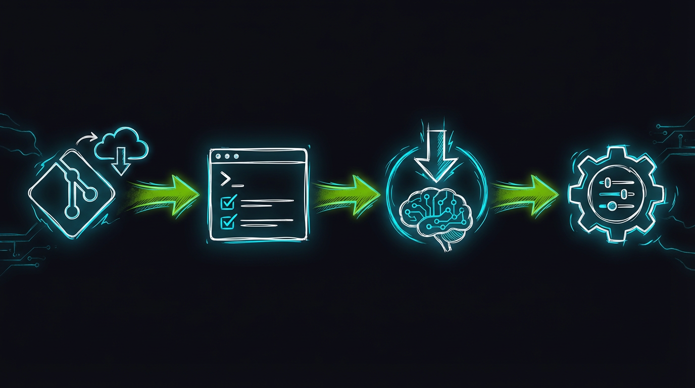

# Installation

This guide walks through the complete installation process for Home Security Intelligence.

<!-- Nano Banana Pro Prompt:
"Technical illustration of software installation process,
terminal window with code and progress bars,
dark background #121212, NVIDIA green #76B900 accent lighting,
clean minimalist style, vertical 2:3 aspect ratio,
no text overlays"
-->

---

## Overview



_Four-step installation workflow: Clone Repository, Setup Environment, Download Models, and Configure._

There are two setup paths. Run `python setup.py` — it is the supported first-time setup, because it generates a `.env` with real random credentials and a `docker-compose.override.yml` for your paths and ports. `./scripts/setup-hooks.sh` is the developer path: it installs the dev toolchain (virtualenv, npm packages, git hooks) and does not produce a working configuration by itself.

---

## Step 1: Clone the Repository

Clone the repository and change into it:

```bash
git clone https://github.com/mikesvoboda/nemotron-v3-home-security-intelligence.git
cd nemotron-v3-home-security-intelligence
```

---

## Step 2: Run First-Time Setup

```bash
python setup.py
```

The interactive script ([`setup.py`](https://github.com/mikesvoboda/nemotron-v3-home-security-intelligence/blob/main/setup.py)) asks for your camera upload path, AI models path, and credentials, then writes:

- `.env` — with generated passwords (`POSTGRES_PASSWORD` etc.) and port assignments. File permissions are set to 600.
- `docker-compose.override.yml` — port mappings and the camera-path volume mount, merged automatically with `docker-compose.prod.yml`.

Run `python setup.py --guided` for step-by-step explanations, or `python setup.py --defaults` to accept every default non-interactively.

> **Do not** create `.env` with `cp .env.example .env`. `.env.example` uses placeholder credentials and `setup.py` is what generates real ones. If you insist on editing by hand, at minimum set `POSTGRES_PASSWORD` (generate with `openssl rand -base64 32`) and make `DATABASE_URL` match `POSTGRES_USER`/`POSTGRES_DB`/`POSTGRES_PASSWORD`.

### Developer extras (optional)

If you will contribute code, also install the dev toolchain:

```bash
./scripts/setup-hooks.sh
```

It runs `uv sync --extra dev` for the Python environment and installs the frontend dependencies plus pre-commit, commit-msg, and pre-push git hooks.

---

## Step 3: Download AI Models

```bash
./ai/download_models.sh
```

The script ([`ai/download_models.sh`](https://github.com/mikesvoboda/nemotron-v3-home-security-intelligence/blob/main/ai/download_models.sh)) writes to `${AI_MODELS_PATH}` (default `/export/ai_models`). Set `AI_MODELS_PATH=./models ./ai/download_models.sh` to use a different root.

### What it downloads

Five artifacts, and `models.yml` at the repo root is the authority on which (`setup_lib/models_config.get_downloadable_models()` is the rule):

| Model                    | Size   | Purpose                                               | Destination                                           |
| ------------------------ | ------ | ----------------------------------------------------- | ----------------------------------------------------- |
| YOLO26 n/s/m `.pt`       | ~67MB  | Triton export input for the gateway's `yolo26`        | `$AI_MODELS_PATH/model-zoo/yolo26/`                   |
| OSNet-AIN x1.0           | ~10MB  | Person re-ID (Triton `reid` + backend `osnet_loader`) | `$AI_MODELS_PATH/model-zoo/osnet-ain-x1-0/`           |
| Threat-Detection-YOLOv8n | ~25MB  | Weapon detection (Triton `threat`)                    | `$AI_MODELS_PATH/model-zoo/threat-detection-yolov8n/` |
| YOLO11 face              | ~11MB  | Face boxes on person crops                            | `$AI_MODELS_PATH/model-zoo/yolo11-face-detection/`    |
| YOLO11 license-plate     | ~650MB | Plate boxes                                           | `$AI_MODELS_PATH/model-zoo/yolo11-license-plate/`     |

Everything the pipeline needs arrives another way, and the script says so in its header:

- **The reasoning engine's weights.** `${AI_MODELS_PATH}/vlm/` is where you put the GGUF pair named by `VLM_MODEL_PATH` / `VLM_MMPROJ_PATH` — the script creates that directory and never fills it, because identity is operator config. Compose mounts the directory read-only into `ai-vlm` at `/models`.
- **The face leg.** `scrfd_10g_bnkps.onnx` and `w600k_r50.onnx`, unpacked by hand from InsightFace `buffalo_l.zip`; both `models.yml` rows are `download_method: skip` with a sha256 pin.
- **`fast-alpr` and `paddleocr`.** The libraries fetch what they need at runtime.

See [Models Reference](../reference/models.md#model-download) for sources and pins.

---

## Step 4: Check Your Settings

After `setup.py` has written `.env`, review the values that depend on your hardware:

```bash
# Camera upload directory (host path where cameras FTP images)
FOSCAM_BASE_PATH=/export/foscam

# AI models root — must match what you used in Step 3
AI_MODELS_PATH=/export/ai_models

# GPU assignment (see docs/developer/multi-gpu.md)
GPU_LLM=0            # card the ai-vlm container gets
GPU_AI_SERVICES=1    # card the ai-gateway (Triton) models get
```

AI service URLs are already set correctly for the containerized deployment in both `.env.example` and the compose file itself:

```bash
AI_GATEWAY_URL=http://ai-gateway:8090         # gateway base, used with USE_AI_GATEWAY=true
YOLO26_URL=http://ai-gateway:8090/yolo26      # detection; the gateway's other router is /enrich-lt
AI_VLM_URL=http://ai-vlm:8098                 # reasoning serve (in the default compose set)
```

`ai-vlm` is in the default compose set, so a plain `up -d` starts the reasoning serve alongside the gateway — no profile flag to remember. Nothing depends on `ai-vlm`, so if it fails to start (no GPU here, or the GGUF pair is not where compose mounts it) the rest of the stack still comes up and the risk gauge simply stays at 0; see [First Run](first-run.md).

Inside the backend container the camera directory is always mounted at `/cameras`, regardless of your host path (the compose file sets `FOSCAM_BASE_PATH=/cameras` for the backend service).

### Mount the camera directory

`setup.py` adds the camera volume to `docker-compose.override.yml`. Check it points at your real upload path, which must contain one subfolder per camera:

```
/export/foscam/
├── front_door/
│   └── ... (FTP uploaded images)
├── back_yard/
│   └── ...
└── garage/
    └── ...
```

---

## Verify Installation

```bash
# .env and override exist and .env is private
ls -l .env docker-compose.override.yml

# Model-zoo artifacts and your own VLM weights
ls -lh /export/ai_models/model-zoo/yolo26/ /export/ai_models/model-zoo/osnet-ain-x1-0/
ls -lh /export/ai_models/vlm/        # the GGUF + mmproj you placed here

# Compose file resolves with your .env
docker compose -f docker-compose.prod.yml config -q   # silent = valid
# OR
podman compose -f docker-compose.prod.yml config -q
```

For the dev environment (if you ran `setup-hooks.sh`):

```bash
source .venv/bin/activate && python --version   # 3.14.x
```

---

## Troubleshooting

### Setup script fails

```bash
# Requires Python 3.14+ (see .python-version)
python3 --version
```

### Model download fails

```bash
# Check connectivity to HuggingFace
curl -I https://huggingface.co

# The five artifacts come from GitHub releases and HuggingFace; retry
./ai/download_models.sh

# A model-zoo row whose weights failed the sha256 pin is reported and skipped —
# re-run rather than hand-placing a file, since the loaders verify the pin too
```

### Node.js dependency issues (dev environment)

```bash
cd frontend
rm -rf node_modules
npm ci        # or: npm install
```

---

## Next Steps

Installation complete. Proceed to:

**[First Run](first-run.md)** - Start the system and verify everything works.
