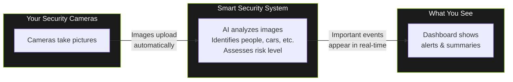
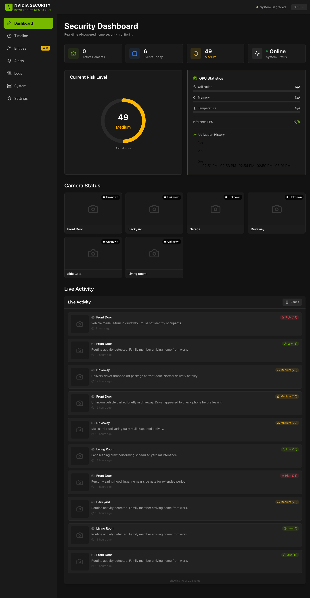

# Getting Started

> Welcome to your home security system! This guide will help you understand what it does and how to use it.

## What Does This System Do?

Think of this system as a **smart security guard** that watches your cameras 24/7.

When your cameras capture images, the system:

1. **Looks at each image** to see if there's a person, vehicle, animal, or package
2. **Thinks about what it sees** - Is this normal activity? Is this concerning?
3. **Tells you what's happening** with a simple summary and a risk score (0-100)

Instead of you having to watch hours of boring footage, the system only shows you the interesting moments and explains why they might matter.

For example, instead of just saying "person detected," it might say:

> "Unknown person approaching back entrance at 2am - this is unusual activity for this time and location."

---

## How It All Works (The Simple Version)

You don't need to do anything to make this work - the cameras, AI, and dashboard all work together automatically.

---

## Opening the Dashboard

To view your security dashboard:

1. **Open your web browser** (Chrome, Safari, Firefox, or Edge all work)
2. **Go to this address:** `http://localhost:5173`

That's it! The dashboard should appear automatically.

> **Tip:** Bookmark this page for easy access. You can also create a shortcut on your desktop or phone home screen.

---

## What You'll See When You First Open It

When you open the dashboard, you'll see several sections:

_The main dashboard view showing all key components at a glance._

### The Main Dashboard

This is your home base. Here's what each part shows you:

| Section             | What It Shows                                                                                       |
| ------------------- | --------------------------------------------------------------------------------------------------- |
| **Stats Row**       | Quick numbers - how many cameras are on, events today, current risk level                           |
| **Risk Gauge**      | A dial showing the current risk level (0-100). Green is calm, yellow needs attention, red is urgent |
| **GPU Performance** | Technical info about how the AI is running (you can ignore this)                                    |
| **Camera Status**   | Thumbnails from each camera showing they're working                                                 |
| **Live Activity**   | A scrolling list of recent events with AI summaries                                                 |

### The Sidebar Menu

On the left side, you'll see navigation options organized into collapsible groups:

**MONITORING**

| Menu Item     | What's There                                                          |
| ------------- | --------------------------------------------------------------------- |
| **Dashboard** | The main overview (where you start)                                   |
| **Timeline**  | History of all events - you can filter by camera, date, or risk level |
| **Entities**  | Recognized people, vehicles, and tracked objects                      |
| **Alerts**    | Events that need your attention                                       |

**ANALYTICS**

| Menu Item          | What's There                                |
| ------------------ | ------------------------------------------- |
| **Analytics**      | Charts and statistics about security events |
| **AI Audit**       | Review AI decision-making and accuracy      |
| **AI Performance** | Monitor AI model performance metrics        |
| **Profiling**      | System performance profiling tools          |

**OPERATIONS** (collapsed by default)

| Menu Item    | What's There                            |
| ------------ | --------------------------------------- |
| **Jobs**     | Background job status and management    |
| **Pipeline** | AI processing pipeline operations       |
| **Tracing**  | Request tracing for debugging           |
| **Logs**     | Technical system logs (troubleshooting) |

**ADMIN** (collapsed by default)

| Menu Item             | What's There                               |
| --------------------- | ------------------------------------------ |
| **Audit Log**         | Security audit trail                       |
| **Data Management**   | Data import/export operations              |
| **Scheduled Reports** | Configure automated report generation      |
| **Webhooks**          | Manage webhook integrations                |
| **Trash**             | Recover deleted events                     |
| **GPU Settings**      | Configure GPU allocation for AI processing |
| **Settings**          | Camera configuration and preferences       |

---

## About the Demo Data

When you first start using the system, you might see **sample events** on the dashboard. This is normal!

**What's happening:** While the AI pipeline is being set up or if there's no recent camera activity, the system shows demonstration data so you can see how everything works.

**How to tell the difference:**

- **Demo data** - Shows generic examples like "Person detected at Front Door"
- **Real data** - Shows actual timestamps and AI-generated descriptions specific to what your cameras captured

Once your cameras are connected and active, real events will start appearing automatically. Demo data helps you learn the interface without needing to wait for actual activity.

---

## Quick Tips for Getting Started

_The Risk Gauge shows your current security status at a glance._

1. **Check the Risk Gauge first** - If it's green (0-29), everything is calm. Yellow (30-59) means take a look. Orange/Red (60-100) deserves prompt attention. See [Risk Levels Reference](../reference/config/risk-levels.md) for details.

2. **Click on events to see details** - Each event in the activity feed can be clicked to see the full AI analysis, including the original image and reasoning.

3. **Use the Timeline for history** - Need to check what happened last night? The Timeline page lets you search and filter past events.

4. **Don't worry about false alarms** - The AI learns and improves over time. Animals, delivery people, and normal activity usually get low risk scores.

---

## Next Steps

- **[Dashboard](../ui/dashboard.md)** - Detailed guide to all dashboard features
- **[Understanding Alerts](../ui/understanding-alerts.md)** - What the risk levels mean and when to take action

---

## Need Help?

If the dashboard isn't loading or something looks wrong:

1. Make sure the system is running (ask whoever set it up)
2. Try refreshing the page in your browser
3. Try a different browser if one isn't working

For technical help, contact the person who installed the system.
