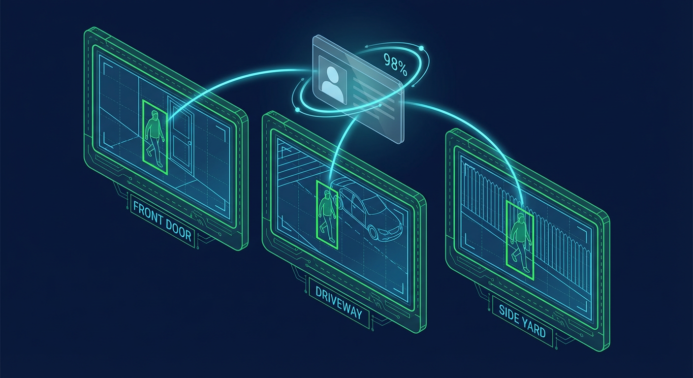

# Face Recognition Guide

Guide to the face detection and person identification features in Home Security Intelligence.

## Overview

Home Security Intelligence includes face detection capabilities that work alongside person re-identification to track individuals across cameras and match them against household members. This enables features like:

- **Household Member Recognition**: Identify known family members
- **Cross-Camera Tracking**: Follow individuals across multiple cameras
- **Unknown Person Alerts**: Get notified when unfamiliar faces are detected
- **Demographics Analysis**: Estimate age and gender for identification context



---

## Architecture

### Face Detection Pipeline

```mermaid
%%{init: {
  'theme': 'dark',
  'themeVariables': {
    'primaryColor': '#3B82F6',
    'primaryTextColor': '#FFFFFF',
    'primaryBorderColor': '#60A5FA',
    'secondaryColor': '#A855F7',
    'tertiaryColor': '#009688',
    'background': '#121212',
    'mainBkg': '#1a1a2e',
    'lineColor': '#666666'
  }
}}%%
flowchart LR
    subgraph Input["Image Input"]
        CAM[Camera Image]
    end

    subgraph Detection["Object Detection"]
        YOLO26["YOLO26<br/>Person Detection"]
        BBOX["Person Bounding Box<br/>(x, y, width, height)"]
    end

    subgraph FaceDetection["Face Detection<br/>backend/services/face_detector.py"]
        HEAD["Head Region Extraction<br/>Top 40% of bbox"]
        CROP["Crop with 20% Padding"]
        YOLO11["YOLO11-face<br/>Face Detection"]
        FACE["FaceDetection<br/>(bbox, confidence, person_id)"]
    end

    subgraph ReID["Re-Identification<br/>backend/services/reid_service.py"]
        CLIP["CLIP embeddings<br/>ai-gateway /clip"]
        EMB["768-dim Embedding<br/>L2 normalized"]
        STORE["Store in Redis<br/>24h TTL"]
        PG["PostgreSQL<br/>30-day retention"]
    end

    subgraph Matching["Household Matching<br/>backend/services/household_matcher.py"]
        SEARCH["Cosine Similarity Search<br/>threshold >= 0.85"]
        MEMBERS[(Household Members<br/>Stored Embeddings)]
        MATCH{"Match<br/>Found?"}
        KNOWN["Known Member<br/>HouseholdMatch"]
        UNKNOWN["Unknown Person<br/>Entity Record"]
    end

    subgraph Output["Result"]
        ALERT["Alert Generation<br/>Based on trust level"]
    end

    CAM --> YOLO26
    YOLO26 --> BBOX
    BBOX --> HEAD
    HEAD --> CROP
    CROP --> YOLO11
    YOLO11 --> FACE
    FACE --> CLIP
    CLIP --> EMB
    EMB --> STORE
    STORE -.-> PG
    EMB --> SEARCH
    MEMBERS --> SEARCH
    SEARCH --> MATCH
    MATCH -->|Yes| KNOWN
    MATCH -->|No| UNKNOWN
    KNOWN --> ALERT
    UNKNOWN --> ALERT
```



**Pipeline Stages:**

1. **Person Detection**: YOLO26 identifies person bounding boxes
2. **Head Region Extraction**: Upper 40% of person bbox extracted
3. **Face Detection**: YOLO11 face model detects faces in head region
4. **Embedding Generation**: the gateway `/clip` router (SigLIP 2 Base) produces
   768-dimensional embeddings
5. **Matching**: embeddings compared against the household member database

### Models Used

| Model                 | Purpose                   | VRAM (MB)          | Where it runs            |
| --------------------- | ------------------------- | ------------------ | ------------------------ |
| yolo26                | Person detection          | 0 (Triton-managed) | ai-gateway `/yolo26`     |
| yolo11-face           | Face detection on crops   | 200                | backend model zoo        |
| siglip2-base          | 768-dim entity embeddings | 200                | ai-gateway `/clip`       |
| osnet-ain-x1-0        | 512-dim person re-ID      | 100                | ai-gateway `/enrich-lt`  |
| vit-age-classifier    | Age estimation            | 200                | ai-gateway `/enrichment` |
| vit-gender-classifier | Gender estimation         | 200                | ai-gateway `/enrichment` |

VRAM figures are the `vram_mb` values in `models.yml`.

---

## Face Detection

### How It Works

The face detector operates on person detections:

```python
# Head region extraction
HEAD_REGION_RATIO = 0.4  # Top 40% of person bbox

# For a person at [x, y, width, height]
head_region = [x, y, width, height * 0.4]
```

**Why Head Region?**

For a standing person, the face is typically in the top 40% of the bounding box. This reduces false positives and improves detection accuracy.

### Face Detection Output

```json
{
  "faces": [
    {
      "bbox": [120, 80, 180, 140],
      "confidence": 0.92,
      "person_detection_id": 12345
    }
  ]
}
```

### Configuration

These are the parameter defaults on the functions in
`backend/services/face_detector.py`:

| Parameter              | Default | Description                             |
| ---------------------- | ------- | --------------------------------------- |
| `head_ratio`           | 0.4     | Fraction of person bbox for head region |
| `padding`              | 0.2     | Padding around head bbox (20%)          |
| `confidence_threshold` | 0.3     | Minimum face detection confidence       |

---

## Person Re-Identification

Two separate vectors are produced for every person, and they are not
interchangeable:

| Vector                 | Dimension | Produced by                           | Used for                                                                                           |
| ---------------------- | --------- | ------------------------------------- | -------------------------------------------------------------------------------------------------- |
| Entity embedding       | 768       | gateway `/clip` (SigLIP 2)            | Cross-camera entity tracking, household matching (`reid_service.py`)                               |
| Person re-ID embedding | 512       | gateway `/enrich-lt` (OSNet-AIN x1.0) | Stored in `enrichment_data["person_reid"]`, read by `household_matcher.extract_person_embedding()` |

### Embedding Storage

`backend/services/reid_service.py` stores entity embeddings in Redis with a
24-hour TTL (`EMBEDDING_TTL_SECONDS = 86400`) and mirrors them to PostgreSQL for
30-day retention. `backend/services/reid_matcher.py` keys its index by an
`embedding_hash` computed from the vector.

**Entity embedding properties:**

- **Dimensionality**: 768 values (`EMBEDDING_DIMENSION` in `reid_service.py`)
- **Normalization**: L2 normalized (unit length)
- **Comparison**: Cosine similarity

### Similarity Matching

Two embeddings are compared using cosine similarity. Because both vectors are
L2 normalized, the dot product is the cosine:

```
similarity = dot(embedding_a, embedding_b)

if similarity >= threshold:
    # Same person
else:
    # Different people
```

**Default thresholds in code:** 0.85, set by `DEFAULT_SIMILARITY_THRESHOLD` in
`backend/services/reid_service.py` and `SIMILARITY_THRESHOLD` in
`backend/services/household_matcher.py`. Both accept an override at
construction time.

**Guidelines for tuning:**

| Threshold | Use Case                                |
| --------- | --------------------------------------- |
| 0.6       | Lenient matching (more false positives) |
| 0.85      | Default in code                         |
| 0.9       | Very strict (may miss matches)          |

---

## Demographics Analysis

### Age Estimation

`POST http://localhost:8090/enrichment/demographics` returns age and gender in
one response:

```json
{
  "age_range": "21-30",
  "age_confidence": 0.87,
  "gender": "male",
  "gender_confidence": 0.91,
  "inference_time_ms": 22.1
}
```

**Age Ranges:** the gateway maps model class indices onto 0-10, 11-20, 21-30,
31-40, 41-50, 51-60, 61-70, 71+
(`ai/gateway/adapters/enrichment.py`). The
`DemographicsResults.age_range` check constraint in
`backend/models/enrichment.py` additionally accepts `71-80`, `81+` and
`unknown`. The label list in the legacy `ai/enrichment/models/demographics.py`
(0-10, 11-20, 21-35, 36-50, 51-65, 65+) is a different vocabulary — that module
does not run in the gateway deployment.

### Gender Estimation

The same call returns `gender` as `male`, `female` or `unknown`, with
`gender_confidence` beside it.

**Privacy Note:** Demographics are used for identification context only and are not stored long-term. They help distinguish between individuals when other identifying features are similar.

---

## Household Member Registration

### Adding Household Members

```bash
curl -X POST http://localhost:8000/api/household/members \
  -H 'Content-Type: application/json' \
  -d '{
    "name": "John Smith",
    "role": "family",
    "trusted_level": "full",
    "notes": "Lives at the house"
  }'
```

Field names come from `HouseholdMemberCreate` in
`backend/api/schemas/household.py`: `name`, `role`, `trusted_level`,
`typical_schedule` and `notes`. There is no `relationship`,
`notify_on_arrival` or `notify_on_departure` field — notification behaviour
comes from alert rules, not the member record.

**`role` values** (`MemberRole` in `backend/models/household.py`): `resident`,
`family`, `service_worker`, `frequent_visitor`.

**Response** (`HouseholdMemberResponse`):

```json
{
  "id": 1,
  "name": "John Smith",
  "role": "family",
  "trusted_level": "full",
  "typical_schedule": null,
  "notes": "Lives at the house",
  "created_at": "2026-01-26T10:00:00Z",
  "updated_at": "2026-01-26T10:00:00Z"
}
```

### Adding Member Embeddings

Add a face embedding extracted from an existing event:

```bash
curl -X POST http://localhost:8000/api/household/members/1/embeddings \
  -H 'Content-Type: application/json' \
  -d '{ "event_id": 100, "confidence": 0.95 }'
```

`AddEmbeddingRequest` takes `event_id` (required, integer — the event the
embedding is extracted from) and `confidence` (optional, default 1.0, your
reliability score for that sample). Bulk enrolment lives on the face
recognition router instead: `POST /api/known-persons/bulk-enroll`.

**Best Practices for Embeddings:**

1. **Multiple angles**: Add embeddings from different camera angles
2. **Different lighting**: Include day and night conditions
3. **Various expressions**: Include neutral and smiling
4. **Quality threshold**: Only use high-confidence detections
5. **Minimum count**: At least 3-5 embeddings per person

### Trust Levels

`TrustLevel` in `backend/models/household.py` has three values:

| Level     | Behaviour                               |
| --------- | --------------------------------------- |
| `full`    | Never trigger alerts for this person    |
| `partial` | Reduced alert severity, still monitored |
| `monitor` | Log activity, do not suppress alerts    |

There is no `restricted` trust level. To flag a person the system should raise
on, register them with `monitor` and write an alert rule that matches them.

---

## Cross-Camera Tracking

### Entity Tracking

When a person is detected, the system:

1. Generates an embedding for the detection
2. Compares against recent embeddings from other cameras
3. Links detections if similarity exceeds threshold
4. Creates an entity record for tracking

**Entity Response** (`EntitySummary` in `backend/api/schemas/entities.py`):

```json
{
  "id": "entity-uuid",
  "entity_type": "person",
  "first_seen": "2026-01-26T14:00:00Z",
  "last_seen": "2026-01-26T14:15:00Z",
  "appearance_count": 3,
  "cameras_seen": ["front_door", "driveway"],
  "thumbnail_url": "/api/media/thumbnails/abc123.jpg",
  "trust_status": "untrusted"
}
```

A household match is a separate lookup: `GET /api/entities/matches/{detection_id}`
returns the member matched to a detection, and `GET /api/entities/trusted` and
`/api/entities/untrusted` filter by trust status.

### Entity History

```bash
curl http://localhost:8000/api/entities/entity-uuid/history
```

**Response** (`EntityHistoryResponse`, whose items are `EntityAppearance`):

```json
{
  "entity_id": "entity-uuid",
  "entity_type": "person",
  "count": 2,
  "appearances": [
    {
      "detection_id": "12345",
      "camera_id": "front_door",
      "camera_name": "Front Door",
      "timestamp": "2026-01-26T14:00:00Z",
      "thumbnail_url": "/api/media/thumbnails/abc123.jpg",
      "similarity_score": 0.91,
      "attributes": {}
    },
    {
      "detection_id": "12346",
      "camera_id": "driveway",
      "camera_name": "Driveway",
      "timestamp": "2026-01-26T14:05:00Z",
      "thumbnail_url": "/api/media/thumbnails/def456.jpg",
      "similarity_score": 0.88,
      "attributes": {}
    }
  ]
}
```

---

## API Reference

### Household Members

| Endpoint                                 | Method | Description        |
| ---------------------------------------- | ------ | ------------------ |
| `/api/household/members`                 | GET    | List all members   |
| `/api/household/members`                 | POST   | Create new member  |
| `/api/household/members/{id}`            | GET    | Get member details |
| `/api/household/members/{id}`            | PATCH  | Update member      |
| `/api/household/members/{id}`            | DELETE | Delete member      |
| `/api/household/members/{id}/embeddings` | POST   | Add embedding      |

### Household Vehicles

| Endpoint                       | Method | Description          |
| ------------------------------ | ------ | -------------------- |
| `/api/household/vehicles`      | GET    | List all vehicles    |
| `/api/household/vehicles`      | POST   | Register new vehicle |
| `/api/household/vehicles/{id}` | GET    | Get vehicle details  |
| `/api/household/vehicles/{id}` | PATCH  | Update vehicle       |
| `/api/household/vehicles/{id}` | DELETE | Delete vehicle       |

### Entities

| Endpoint                     | Method | Description             |
| ---------------------------- | ------ | ----------------------- |
| `/api/entities`              | GET    | List tracked entities   |
| `/api/entities/{id}`         | GET    | Get entity details      |
| `/api/entities/{id}/history` | GET    | Get appearance timeline |

### Query Parameters (Entities)

| Parameter     | Type     | Description                     |
| ------------- | -------- | ------------------------------- |
| `entity_type` | String   | Filter by 'person' or 'vehicle' |
| `camera_id`   | String   | Filter by camera                |
| `since`       | DateTime | Entities seen since timestamp   |
| `limit`       | Integer  | Pagination limit (default: 50)  |
| `offset`      | Integer  | Pagination offset               |

---

## Matching Algorithm

### Person-to-Member Matching

From `HouseholdMatcher.match_person` in `backend/services/household_matcher.py`:

```
For each detected person:
  1. Take the person embedding
  2. Load every stored member embedding
  3. Cosine-similarity each one against the person embedding
  4. Keep candidates with similarity > threshold
  5. Return the single highest-scoring candidate
  6. If nothing clears the threshold, treat the person as unknown
```

The loop takes the best single pair; it does not average similarity across a
member's embeddings.

### Match Confidence

The value reported with a match is the cosine similarity from that comparison —
see `HouseholdMatch.similarity`. No formula combines face confidence,
similarity and embedding count.

---

## Alert Integration

### How Alerts Fire

There is no dedicated "unknown person" alert type with a fixed severity table.
Alerts are rule-driven: `backend/services/alert_engine.py` creates an alert
when an event matches an `AlertRule` (`backend/models/alert.py` — conditions
are risk threshold, object types, cameras, zones, detection confidence,
schedule, and optional dwell time). The rule's own `severity` field
(`low` / `medium` / `high` / `critical`) is the starting severity.

Trust then adjusts it (`SEVERITY_ESCALATION` / `SEVERITY_REDUCTION` in
`alert_engine.py`):

| Entity trust | Effect on severity                            |
| ------------ | --------------------------------------------- |
| Untrusted    | Escalated by one level (medium becomes high)  |
| Trusted      | Reduced by one level, or the alert is skipped |

### Zone Context

The zone a detection lands in reaches Nemotron as prompt context, not as a
severity multiplier: `ZONE_RISK_WEIGHTS` in
`backend/services/context_enricher.py` labels `entry_point` high,
`driveway`/`yard` medium, `sidewalk`/`other` low. Those five are the complete
set of `CameraZoneType` values (`backend/models/camera_zone.py`).

To make unknown-person detections at your front door alert at a chosen
severity, create an alert rule matching `object_types: ["person"]` and that
zone, with the severity you want.

---

## Privacy Considerations

### Data Retention

| Data Type                   | Retention           | Where it lives                                  |
| --------------------------- | ------------------- | ----------------------------------------------- |
| Events and detections       | `RETENTION_DAYS=30` | Pruned by `backend/services/cleanup_service.py` |
| Face detections             | 30 days             | Stored on detections, so they age out with them |
| Per-detection re-ID vectors | 30 days             | `reid_embeddings` table, FK to `detections`     |
| Demographics results        | 30 days             | `demographics_results` table, per detection     |
| Redis entity embeddings     | 24 hours            | `EMBEDDING_TTL_SECONDS` in `reid_service.py`    |
| Member embeddings           | Until deleted       | `PersonEmbedding` rows, removed with the member |

The 30-day figure is `RETENTION_DAYS` in `.env`, read as `retention_days` in
`backend/core/config.py`. Short-term cross-camera linking is the job of
`track_service.prune_old_tracks()`, which prunes by `track_retention_hours`,
not by a seven-day entity policy.

### Data Minimization

- Face images are not stored separately
- Embeddings are numerical vectors only
- Demographics are estimates, not identity
- All data can be deleted via member deletion

### Local Processing

All face recognition processing happens locally:

- No cloud services
- No third-party APIs
- Data stays on your network
- Full control over retention

---

## Best Practices

### For Accurate Recognition

1. **Quality Images**: Ensure cameras have good resolution and lighting
2. **Multiple Embeddings**: Add 5+ embeddings per household member
3. **Varied Conditions**: Include different lighting, angles, expressions
4. **Regular Updates**: Re-add embeddings if appearance changes significantly
5. **Threshold Tuning**: Adjust match threshold based on your needs

### For Privacy

1. **Minimal Registration**: Only register necessary household members
2. **Trust Levels**: Use appropriate trust levels for different relationships
3. **Regular Cleanup**: Review and remove outdated member data
4. **Notification Control**: Configure notifications thoughtfully

### For Performance

1. **Embedding Limit**: Keep member embedding count reasonable (10-20)
2. **Model Priority**: In the gateway deployment every enrichment model has
   `priority: medium` in `models.yml` and Triton preloads them, so there is no
   load-order penalty; the legacy container's HIGH-priority ordering applied
   only there
3. **Batch Processing**: Face detection runs in batches with other enrichment

---

## Troubleshooting

### Faces Not Detected

**Check:**

1. Person fully visible in frame
2. Face not obscured (hat, mask, angle)
3. Sufficient lighting
4. Camera resolution adequate

**Fix:**

- Adjust camera position for better face visibility
- Improve lighting conditions
- Lower confidence threshold (may increase false positives)

### Wrong Person Matched

**Causes:**

1. Insufficient embeddings for member
2. Similar-looking individuals
3. Match threshold too low

**Fix:**

- Add more diverse embeddings for the member
- Increase match threshold
- Remove problematic embeddings

### Known Member Not Recognized

**Check:**

1. Member has sufficient embeddings (5+)
2. Embeddings are from varied conditions
3. Appearance hasn't changed significantly
4. Detection quality is adequate

**Fix:**

- Add new embeddings from recent detections
- Remove old/poor quality embeddings
- Lower match threshold slightly

### Too Many Unknown Alerts

**Options:**

1. Register more household members
2. Configure trust levels for regular visitors
3. Adjust zone-based alert severity
4. Set up quiet hours for specific times

---

## Related Documentation

- [Video Analytics Guide](video-analytics.md) - AI pipeline overview
- [Zone Configuration Guide](zone-configuration.md) - Zone setup
- [Entities](../ui/entities.md) - Entity tracking UI
- [Settings](../ui/settings.md) - Household management
