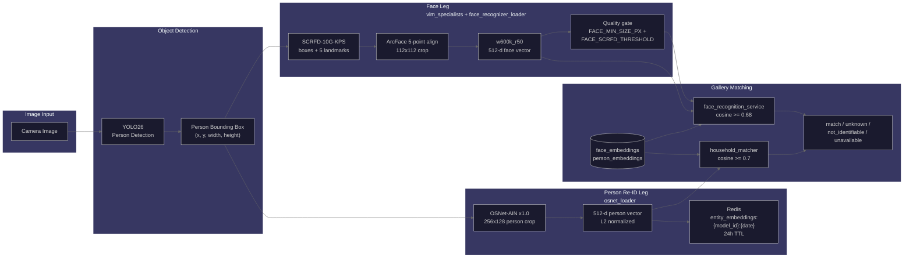

# Face Recognition Guide

Guide to the face detection and person identification features in Home Security Intelligence.

## Overview

Home Security Intelligence runs face detection and person re-identification as
lookups beside its vision-language model: they answer "is this a person we
already know?" precisely, which a generalist should not be asked to guess.
That enables:

- **Household Member Recognition**: Identify known family members
- **Cross-Camera Tracking**: Follow individuals across multiple cameras
- **Unknown-Face Review**: `GET /api/face-events/unknown` lists faces that never
  matched the gallery, and the enrollment queue turns them into known persons


---

## Architecture

### Identification Pipelines


```mermaid
%%{init: {
  'theme': 'dark',
  'themeVariables': {
    'primaryColor': '#3B82F6',
    'primaryTextColor': '#FFFFFF',
    'primaryBorderColor': '#60A5FA',
    'secondaryColor': '#A855F7',
    'tertiaryColor': '#009688',
    'background': '#121212',
    'mainBkg': '#1a1a2e',
    'lineColor': '#666666'
  }
}}%%
flowchart LR
    subgraph Input["Image Input"]
        CAM[Camera Image]
    end

    subgraph Detection["Object Detection"]
        YOLO26["YOLO26<br/>Person Detection"]
        BBOX["Person Bounding Box<br/>(x, y, width, height)"]
    end

    subgraph FaceLeg["Face Leg<br/>vlm_specialists + face_recognizer_loader"]
        SCRFD["SCRFD-10G-KPS<br/>boxes + 5 landmarks"]
        ALIGN["ArcFace 5-point align<br/>112x112 crop"]
        FEMB["w600k_r50<br/>512-d face vector"]
        GATE["Quality gate<br/>FACE_MIN_SIZE_PX +<br/>FACE_SCRFD_THRESHOLD"]
    end

    subgraph ReidLeg["Person Re-ID Leg<br/>osnet_loader"]
        OSNET["OSNet-AIN x1.0<br/>256x128 person crop"]
        EMB["512-d person vector<br/>L2 normalized"]
        STORE["Redis<br/>entity_embeddings:{model_id}:{date}<br/>24h TTL"]
    end

    subgraph Matching["Gallery Matching"]
        FSEARCH["face_recognition_service<br/>cosine >= 0.68"]
        RSEARCH["household_matcher<br/>cosine >= 0.7"]
        DB[(face_embeddings<br/>person_embeddings)]
        OUT["match / unknown /<br/>not_identifiable / unavailable"]
    end

    CAM --> YOLO26
    YOLO26 --> BBOX
    BBOX --> SCRFD
    SCRFD --> ALIGN
    ALIGN --> FEMB
    FEMB --> GATE
    BBOX --> OSNET
    OSNET --> EMB
    EMB --> STORE
    GATE --> FSEARCH
    FEMB --> FSEARCH
    EMB --> RSEARCH
    DB --> FSEARCH
    DB --> RSEARCH
    FSEARCH --> OUT
    RSEARCH --> OUT
```

**Pipeline stages:**

1. **Person Detection**: YOLO26 identifies person bounding boxes
2. **Face Leg**: SCRFD-10G-KPS finds and landmarks the face; ArcFace
   `w600k_r50` embeds the aligned 112x112 crop as an L2-normalized 512-d
   vector (`backend/services/face_recognizer_loader.py`, CPU onnxruntime)
3. **Re-ID Leg**: OSNet-AIN x1.0 embeds the person crop as a 512-d vector
   (`backend/services/osnet_loader.py`)
4. **Gallery Matching**: each vector is cosine-compared against
   `face_embeddings` / `person_embeddings` rows
5. **Prompt Lines**: the outcome is rendered as text into the VLM prompt — the
   model sees "matched Alice, 0.81" or "unknown" or "not identifiable", never
   a vector

### Models Used

| Model                 | Purpose                                     | `vram_mb`        | Where it runs          |
| --------------------- | ------------------------------------------- | ---------------- | ---------------------- |
| `yolo26`              | Person detection                            | 0 (Triton-owned) | `ai-gateway` `/yolo26` |
| `face-detector-scrfd` | Face boxes + 5 landmarks (onnxruntime, CPU) | 0 (CPU)          | backend face leg       |
| `face-recognizer`     | 512-d face embedding (onnxruntime, CPU)     | 0 (CPU)          | backend face leg       |
| `osnet-ain-x1-0`      | 512-d person re-ID embedding (torch)        | 100              | backend re-ID leg      |

Numbers are the `vram_mb` field of each entry in the root `models.yml`. The
face leg's two rows are paired by design: `get_face_leg_handles()` returns
`None` unless both are resident, so a host with one loaded still answers
`unavailable` rather than half-running the leg.

The model zoo can also load `yolo11-face` (`vram_mb: 200`, `preload: false`)
from head crops. The event-path face leg does not use it: boxes without
landmarks cannot be ArcFace-aligned, and an unaligned crop silently costs the
embedder accuracy.

---

## Face Detection

### How It Works

The event-path face leg runs on the batch's key frames, not on person crops
from the detector. For each frame `vlm_specialists._collect_face_texts()`
detects faces with SCRFD-10G-KPS, aligns each one with its five landmarks, and
embeds the 112x112 crop with ArcFace `w600k_r50`:

```python
# backend/services/face_recognizer_loader.py
# scrfd_10g_bnkps.onnx  -> boxes + 5 landmarks
# w600k_r50.onnx        -> aligned 112x112 crop in, L2-normalized 512-d out
```

### The Quality Gate and the Four Outcomes

A crop is only worth reporting if it is big enough and the detector believes
it. The gate (`passes_quality_gate`, shared by the event path and server-side
enrolment so the two can never disagree) grades every candidate into one of
four outcomes:

| Outcome            | Meaning                                                 |
| ------------------ | ------------------------------------------------------- |
| `match`            | Gate passed and the gallery had a known person          |
| `unknown`          | Gate passed, no gallery match                           |
| `not_identifiable` | Crop too small or too low-confidence to judge           |
| `unavailable`      | The leg could not run (weights not resident, no frames) |

Order matters: a crop that fails the gate is `not_identifiable` even when it
also has no match, so a tiny night face never reads as "unknown person" and
drags the verdict toward alarm. A leg that could not run increments
`hsi_specialist_unavailable_total` — the only degradation signal.

### Configuration

| Setting                 | Default | Where                    | Description                                               |
| ----------------------- | ------- | ------------------------ | --------------------------------------------------------- |
| `face_min_size_px`      | 40      | `backend/core/config.py` | Minimum face box in pixels; below this → not identifiable |
| `face_scrfd_threshold`  | 0.6     | `backend/core/config.py` | Minimum SCRFD score; also the detection threshold         |
| `face_match_threshold`  | 0.68    | `backend/core/config.py` | Cosine similarity above which a face is a match           |
| `backend_model_preload` | `false` | `backend/core/config.py` | Load the leg's weights at boot (≥24GB hosts)              |

These are config, not code constants: the gate's job is to keep a tiny or
night-time crop from reading "unknown", and the right cut-off depends on your
cameras.

---

## Person Re-Identification

There is exactly **one person-vector space** in this system: OSNet-AIN x1.0,
512 dimensions, SHA-256-pinned weights. Face vectors are a separate space with
their own gallery and their own threshold — the two are never compared to each
other.

| Vector                 | Dimension | Produced by         | Gallery table                                                 | Live probe                                     |
| ---------------------- | --------- | ------------------- | ------------------------------------------------------------- | ---------------------------------------------- |
| Face embedding         | 512       | ArcFace `w600k_r50` | `face_embeddings` (one row per sample, per `KnownPerson`)     | computed per frame by the face leg             |
| Person re-ID embedding | 512       | OSNet-AIN x1.0      | `person_embeddings` (one row per household-member enrollment) | `detections.enrichment_data["reid_embedding"]` |

Both gallery tables carry a `model_id` column naming the weights that produced
the bytes, so a probe computed by one model is never silently scored against a
gallery built by another (see the F11 provenance rule in
[ai-pipeline-current-state](../architecture/ai-pipeline-current-state.md)).

### Embedding Storage

`backend/services/reid_service.py` caches person vectors in Redis under
`entity_embeddings:{model_id}:{date}` with a 24-hour TTL
(`EMBEDDING_TTL_SECONDS = 86400`). The key is partitioned by `model_id` and the
same id rides inside each payload — a stored vector always declares the weights
that computed it, so a future weight change cannot silently mix two spaces into
one comparison. `backend/services/reid_matcher.py` writes
`detections.enrichment_data["reid_embedding"]` with
`{vector, dimension, hash, model, stored_at}`.

`household_matcher.extract_person_embedding()` reads the cached vector from
`enrichment_data["embeddings"]["person_reid"]`.

**Person-vector properties:**

- **Dimensionality**: 512 (`EMBEDDING_DIMENSION` in `reid_service.py`)
- **Normalization**: L2 normalized (unit length)
- **Comparison**: Cosine similarity

### Similarity Matching

Because both vectors are L2 normalized, the dot product is the cosine:

```
similarity = dot(embedding_a, embedding_b)

if similarity >= threshold:
    # Same person
else:
    # Different people
```

**Thresholds, both configurable:**

| Space          | Setting                     | Code default | Where                    |
| -------------- | --------------------------- | ------------ | ------------------------ |
| Person (OSNet) | `reid_similarity_threshold` | 0.7          | `backend/core/config.py` |
| Face (ArcFace) | `face_match_threshold`      | 0.68         | `backend/core/config.py` |

`HouseholdMatcher` prefers the configured `reid_similarity_threshold` and falls
back to its class constant (`SIMILARITY_THRESHOLD = 0.7`) only when settings
cannot be read. `FaceRecognitionService.DEFAULT_MATCH_THRESHOLD` mirrors the
configured face value so the specialist and the gallery API never disagree
about what "match" means.

Both numbers are provisional and calibrated against your own galleries.

**Guidelines for tuning:**

| Threshold | Use Case                                |
| --------- | --------------------------------------- |
| 0.6       | Lenient matching (more false positives) |
| 0.68-0.70 | Shipped defaults                        |
| 0.9       | Very strict (will miss matches)         |

## Household Member Registration

### Adding Household Members

```bash
curl -X POST http://localhost:8000/api/household/members \
  -H 'Content-Type: application/json' \
  -d '{
    "name": "John Smith",
    "role": "family",
    "trusted_level": "full",
    "notes": "Lives at the house"
  }'
```

Field names come from `HouseholdMemberCreate` in
`backend/api/schemas/household.py`: `name`, `role`, `trusted_level`,
`typical_schedule` and `notes`. There is no `relationship`,
`notify_on_arrival` or `notify_on_departure` field — notification behaviour
comes from alert rules, not the member record.

**`role` values** (`MemberRole` in `backend/models/household.py`): `resident`,
`family`, `service_worker`, `frequent_visitor`.

**Response** (`HouseholdMemberResponse`):

```json
{
  "id": 1,
  "name": "John Smith",
  "role": "family",
  "trusted_level": "full",
  "typical_schedule": null,
  "notes": "Lives at the house",
  "created_at": "2026-01-26T10:00:00Z",
  "updated_at": "2026-01-26T10:00:00Z"
}
```

### Adding Member Embeddings

Add a face embedding extracted from an existing event:

```bash
curl -X POST http://localhost:8000/api/household/members/1/embeddings \
  -H 'Content-Type: application/json' \
  -d '{ "event_id": 100, "confidence": 0.95 }'
```

`AddEmbeddingRequest` takes `event_id` (required, integer — the event the
embedding is extracted from) and `confidence` (optional, default 1.0, your
reliability score for that sample). Bulk enrolment lives on the face
recognition router instead: `POST /api/known-persons/bulk-enroll`.

**Best Practices for Embeddings:**

1. **Multiple angles**: Add embeddings from different camera angles
2. **Different lighting**: Include day and night conditions
3. **Various expressions**: Include neutral and smiling
4. **Quality threshold**: Only use high-confidence detections
5. **Minimum count**: At least 3-5 embeddings per person

### Trust Levels

`TrustLevel` in `backend/models/household.py` has three values:

| Level     | Behaviour                               |
| --------- | --------------------------------------- |
| `full`    | Never trigger alerts for this person    |
| `partial` | Reduced alert severity, still monitored |
| `monitor` | Log activity, do not suppress alerts    |

There is no `restricted` trust level. To flag a person the system should raise
on, register them with `monitor` and write an alert rule that matches them.

---

## Cross-Camera Tracking

### Entity Tracking

When a person is detected, the system:

1. Generates an embedding for the detection
2. Compares against recent embeddings from other cameras
3. Links detections if similarity exceeds threshold
4. Creates an entity record for tracking

**Entity Response** (`EntitySummary` in `backend/api/schemas/entities.py`):

```json
{
  "id": "entity-uuid",
  "entity_type": "person",
  "first_seen": "2026-01-26T14:00:00Z",
  "last_seen": "2026-01-26T14:15:00Z",
  "appearance_count": 3,
  "cameras_seen": ["front_door", "driveway"],
  "thumbnail_url": "/api/media/thumbnails/abc123.jpg",
  "trust_status": "untrusted"
}
```

A household match is a separate lookup: `GET /api/entities/matches/{detection_id}`
returns the member matched to a detection, and `GET /api/entities/trusted` and
`/api/entities/untrusted` filter by trust status.

### Entity History

```bash
curl http://localhost:8000/api/entities/entity-uuid/history
```

**Response** (`EntityHistoryResponse`, whose items are `EntityAppearance`):

```json
{
  "entity_id": "entity-uuid",
  "entity_type": "person",
  "count": 2,
  "appearances": [
    {
      "detection_id": "12345",
      "camera_id": "front_door",
      "camera_name": "Front Door",
      "timestamp": "2026-01-26T14:00:00Z",
      "thumbnail_url": "/api/media/thumbnails/abc123.jpg",
      "similarity_score": 0.91,
      "attributes": {}
    },
    {
      "detection_id": "12346",
      "camera_id": "driveway",
      "camera_name": "Driveway",
      "timestamp": "2026-01-26T14:05:00Z",
      "thumbnail_url": "/api/media/thumbnails/def456.jpg",
      "similarity_score": 0.88,
      "attributes": {}
    }
  ]
}
```

---

## API Reference

### Household Members (`backend/api/routes/household.py`)

| Endpoint                                  | Method | Description                                                                     |
| ----------------------------------------- | ------ | ------------------------------------------------------------------------------- |
| `/api/household/members`                  | GET    | List all members                                                                |
| `/api/household/members`                  | POST   | Create new member                                                               |
| `/api/household/members/{id}`             | GET    | Get member details                                                              |
| `/api/household/members/{id}`             | PATCH  | Update member                                                                   |
| `/api/household/members/{id}`             | DELETE | Delete member                                                                   |
| `/api/household/members/{id}/link-person` | PATCH  | Link a member to a `KnownPerson` row                                            |
| `/api/household/members/{id}/embeddings`  | POST   | Enroll the person re-ID vector for an event (201; 503 if OSNet is not resident) |

The embedding route takes an `event_id`, finds the event's first `person`
detection, and computes the 512-d vector server-side with the resident OSNet
handle — the response stores the vector beside the `model_id` that produced it.

### Known Persons and Faces (`backend/api/routes/face_recognition.py`)

| Endpoint                                            | Method | Description                                                |
| --------------------------------------------------- | ------ | ---------------------------------------------------------- |
| `/api/known-persons`                                | GET    | List known persons (`household_only` filter)               |
| `/api/known-persons`                                | POST   | Create known person                                        |
| `/api/known-persons/{id}`                           | GET    | Get known person                                           |
| `/api/known-persons/{id}`                           | PATCH  | Update known person                                        |
| `/api/known-persons/{id}`                           | DELETE | Delete known person (cascades to its embeddings)           |
| `/api/known-persons/{id}/appearances`               | GET    | Appearance history                                         |
| `/api/known-persons/{id}/embeddings`                | GET    | List stored face embeddings                                |
| `/api/known-persons/{id}/embeddings/{embedding_id}` | DELETE | Delete one face embedding                                  |
| `/api/known-persons/{id}/enroll-from-detection`     | POST   | Compute + store a face vector from a detection's own frame |
| `/api/known-persons/bulk-enroll`                    | POST   | Compute + store face vectors from an uploaded image        |
| `/api/face-events`                                  | GET    | Face events (`camera_id` filter)                           |
| `/api/face-events/stats`                            | GET    | Face-event counts                                          |
| `/api/face-events/unknown`                          | GET    | Unmatched faces (unknown strangers)                        |
| `/api/face-events/match`                            | POST   | Score a probe against the gallery                          |
| `/api/face-events/{event_id}/identify`              | POST   | Identify a stored face event                               |
| `/api/enrollment-queue`                             | GET    | Auto-enrollment candidates (`status` filter)               |
| `/api/enrollment-queue/{candidate_id}`              | GET    | One candidate                                              |
| `/api/enrollment-queue/{candidate_id}/approve`      | POST   | Approve a candidate into the gallery                       |
| `/api/enrollment-queue/{candidate_id}/reject`       | POST   | Reject a candidate                                         |
| `/api/auto-enrollment/settings`                     | GET    | Current auto-enrollment thresholds                         |

Every face vector the server stores comes from an image the server read:
`enroll-from-detection` and `bulk-enroll` are the enrollment surface.
`POST /api/known-persons/{id}/embeddings` answers **410 Gone** — a vector the
server did not compute carries no provenance, so it cannot enter a gallery whose
whole correctness rule is "every stored vector names its weights".

### Entities

| Endpoint                               | Method | Description                                             |
| -------------------------------------- | ------ | ------------------------------------------------------- |
| `/api/entities`                        | GET    | List tracked entities                                   |
| `/api/entities/stats`                  | GET    | Entity counts                                           |
| `/api/entities/trusted`                | GET    | Trusted entities                                        |
| `/api/entities/untrusted`              | GET    | Untrusted entities                                      |
| `/api/entities/{id}/trust`             | PATCH  | Set an entity's trust status                            |
| `/api/entities/{id}`                   | GET    | Get entity details                                      |
| `/api/entities/{id}/history`           | GET    | Get appearance timeline                                 |
| `/api/entities/matches/{detection_id}` | GET    | Household member matched to a detection                 |
| `/api/entities/v2`                     | GET    | Entity list, historical (`source`: redis/postgres/both) |
| `/api/entities/v2/{id}`                | GET    | Entity detail, historical                               |
| `/api/entities/v2/{id}/detections`     | GET    | Detections behind an entity                             |

### Query Parameters (Entities)

| Parameter     | Type     | Description                              |
| ------------- | -------- | ---------------------------------------- |
| `entity_type` | String   | Filter by 'person' or 'vehicle'          |
| `camera_id`   | String   | Filter by camera                         |
| `since`       | DateTime | Entities seen since timestamp            |
| `limit`       | Integer  | Pagination limit (default: 50, max 1000) |
| `offset`      | Integer  | Pagination offset                        |

---

## Matching Algorithm

### Person-to-Member Matching

From `HouseholdMatcher.match_person` in `backend/services/household_matcher.py`:

```
For each detected person:
  1. Take the person embedding
  2. Load every stored member embedding
  3. Cosine-similarity each one against the person embedding
  4. Keep candidates with similarity > threshold
  5. Return the single highest-scoring candidate
  6. If nothing clears the threshold, treat the person as unknown
```

The loop takes the best single pair; it does not average similarity across a
member's embeddings.

### Match Confidence

The value reported with a match is the cosine similarity from that comparison —
see `HouseholdMatch.similarity`. No formula combines face confidence,
similarity and embedding count.

---

## Alert Integration

### What Exists Today

Two separate pieces sit behind the words "alert rule", and only one of them
runs on the event path:

| Piece                                        | What it does now                                                                                                                                         |
| -------------------------------------------- | -------------------------------------------------------------------------------------------------------------------------------------------------------- |
| `backend/models/alert.py` (`AlertRule`)      | The rule rows and their conditions (risk threshold, object types, cameras, zones, confidence, schedule, dwell time, threat filters).                     |
| `backend/services/alert_engine.py`           | Evaluates those rules — `evaluate_event()` / `create_alerts_for_event()`, driven on demand by the `POST /api/alerts/rules/{rule_id}/test` dry-run route. |
| `backend/services/threat_monitor_service.py` | The one place the shipped pipeline writes an `Alert` row for a detection: the batch aggregator's threat fast path.                                       |

`AlertRuleEngine` is complete code with no automatic caller: nothing in the
watchdog → gateway → VLM path calls `evaluate_event()` or
`create_alerts_for_event()`, so saving an enabled rule does **not** start alerts
on its own. The engine runs when you exercise a rule explicitly through
`POST /api/alerts/{rule_id}/test`, which reports per-event match results without
creating alerts. Plan alerting around that: today the automatic alert in the
shipped stack is the threat path, and it is opt-in
(`GATEWAY_ENABLE_THREAT=true`).

### Trust Adjustment

When the engine does evaluate an event, entity trust changes what it does
(`_get_aggregate_entity_trust_status()` / `SEVERITY_ESCALATION` in
`alert_engine.py`):

| Aggregate trust | Effect                                                              |
| --------------- | ------------------------------------------------------------------- |
| `trusted`       | Evaluation stops before the rules run — no alerts for the event     |
| `untrusted`     | Each matched rule's severity escalates one level (`critical` stays) |
| `unknown`       | Rules apply at the severity written on the rule                     |

Aggregation is the most permissive status across the event's detections: one
trusted entity makes the whole event trusted. The rule's own `severity` field
(`low` / `medium` / `high` / `critical`) is the starting value in every case.

### Zone Context

Zones reach the vision-language model as **names, not weights**:
`build_assess_context()` in `backend/services/vlm_analyzer.py` takes a `zones`
list plus a `zone_crossing` boolean, and `detect_zone_crossing()` derives the
flag from a track appearing in two different zone memberships — with no track
ids or no zone memberships it returns an honest `False` rather than a guess.
The VLM is the thing that decides whether a person in the `entry_point` zone
matters.

There is a zone→risk-label table in the tree
(`ZONE_RISK_WEIGHTS` in `backend/services/context_enricher.py`: `entry_point`
high, `driveway`/`yard` medium, `sidewalk`/`other` low, over the five
`CameraZoneType` values in `backend/models/camera_zone.py`), but nothing
consumes it on the shipped path, so it changes no score today.

To make unknown-person detections at your front door alert at a chosen
severity, create an alert rule matching `object_types: ["person"]` and that
zone, with the severity you want — and read the "What Exists Today" box above
for what saving that rule does and does not do.

---

## Privacy Considerations

### Data Retention

| Data Type                   | Retention           | Where it lives                                                  |
| --------------------------- | ------------------- | --------------------------------------------------------------- |
| Events and detections       | `RETENTION_DAYS=30` | Pruned by `backend/services/cleanup_service.py`                 |
| Face detections             | 30 days             | Stored on detections, so they age out with them                 |
| Face gallery vectors        | Until deleted       | `FaceEmbedding` rows, removed with the `KnownPerson`            |
| Per-detection re-ID vectors | 30 days             | `detections.enrichment_data` JSONB, ages out with the detection |
| Redis entity embeddings     | 24 hours            | `EMBEDDING_TTL_SECONDS` in `reid_service.py`                    |
| Member embeddings           | Until deleted       | `PersonEmbedding` rows, removed with the member                 |

The 30-day figure is `RETENTION_DAYS` in `.env`, read as `retention_days` in
`backend/core/config.py`. Short-term cross-camera linking is the job of
`track_service.prune_old_tracks()`, which prunes by `track_retention_hours`.

### Data Minimization

- Face images are not stored separately from the detection they came from
- Embeddings are numerical vectors only
- All data can be deleted via member deletion

### Local Processing

All face recognition processing happens locally:

- No cloud services
- No third-party APIs
- Data stays on your network
- Full control over retention

---

## Best Practices

### For Accurate Recognition

1. **Quality Images**: Ensure cameras have good resolution and lighting
2. **Multiple Embeddings**: Add 5+ embeddings per household member
3. **Varied Conditions**: Include different lighting, angles, expressions
4. **Regular Updates**: Re-add embeddings if appearance changes significantly
5. **Threshold Tuning**: Adjust match threshold based on your needs

### For Privacy

1. **Minimal Registration**: Only register necessary household members
2. **Trust Levels**: Use appropriate trust levels for different relationships
3. **Regular Cleanup**: Review and remove outdated member data
4. **Notification Control**: Configure notifications thoughtfully

### For Performance

1. **Embedding Limit**: Keep member embedding count reasonable (10-20)
2. **Residency, not priority**: the re-ID leg is the one vision model that
   costs the backend VRAM, and it loads only when `BACKEND_MODEL_PRELOAD=true`.
   On a host below that budget the legs report `unavailable` — counts ride
   `hsi_specialist_unavailable_total`, which is the only degradation signal.
3. **Batching**: face and re-ID lookups run per detection inside the batch
   analyzer's `collect_specialist_outputs()`, so their cost scales with
   `MAX_KEY_FRAMES` (4) rather than with every frame the detector saw.

---

## Troubleshooting

### Faces Not Detected

**Check:**

1. Person fully visible in frame
2. Face not obscured (hat, mask, angle)
3. Sufficient lighting
4. Camera resolution adequate

**Fix:**

- Adjust camera position for better face visibility
- Improve lighting conditions
- Lower confidence threshold (may increase false positives)

### Wrong Person Matched

**Causes:**

1. Insufficient embeddings for member
2. Similar-looking individuals
3. Match threshold too low

**Fix:**

- Add more diverse embeddings for the member
- Increase match threshold
- Remove problematic embeddings

### Known Member Not Recognized

**Check:**

1. Member has sufficient embeddings (5+)
2. Embeddings are from varied conditions
3. Appearance hasn't changed significantly
4. Detection quality is adequate

**Fix:**

- Add new embeddings from recent detections
- Remove old/poor quality embeddings
- Lower match threshold slightly

### Too Many Unknown Alerts

**Options:**

1. Register more household members
2. Configure trust levels for regular visitors
3. Adjust zone-based alert severity
4. Set up quiet hours for specific times

---

## Related Documentation

- [Video Analytics Guide](video-analytics.md) - AI pipeline overview
- [Zone Configuration Guide](zone-configuration.md) - Zone setup
- [Entities](../ui/entities.md) - Entity tracking UI
- [Settings](../ui/settings.md) - Household management
