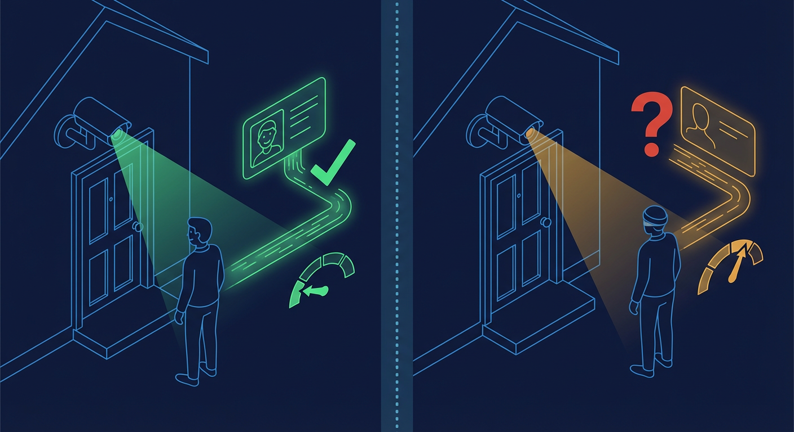
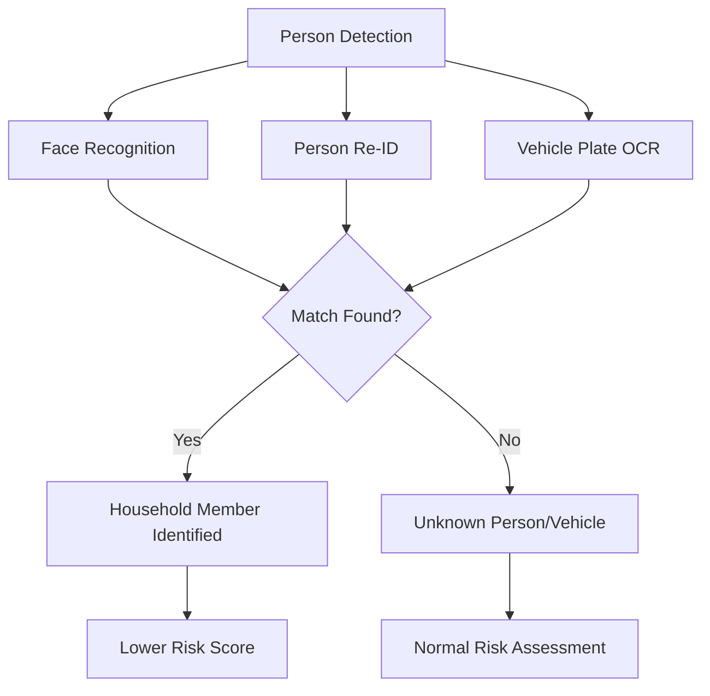

# Household Member Registration Workflow

This guide explains how to register household members and vehicles for face recognition and alert suppression.

---

## Overview

Registering household members enables the system to:

- **Recognize family members** - Identify known people across all cameras
- **Suppress false alerts** - Avoid notifications for trusted individuals
- **Link vehicles** - Associate vehicles with household members for plate recognition

Each member carries two galleries: a face gallery (ArcFace vectors on the linked
`KnownPerson`) and a person re-ID gallery (OSNet vectors on the member itself).
Both are built from detections the server reads, described in Step 2.

---

## Quick Start

### Via the Web UI

1. Navigate to **Settings** > **Household Settings**
2. Click **Add** in the Members section
3. Enter member details:
   - **Name** (required)
   - **Role** (resident, family, service worker, frequent visitor)
   - **Trust Level** (full, partial, monitor)
   - **Notes** (optional)
4. Click **Add** to save

### Via API

```bash
curl -X POST http://localhost:8000/api/household/members \
  -H "Content-Type: application/json" \
  -d '{
    "name": "John Smith",
    "role": "resident",
    "trusted_level": "full",
    "notes": "Primary resident"
  }'
```

---

## Registration Workflow

### Step 1: Create Household Member

Members represent people who should be recognized by the system.

#### Member Roles

| Role               | Description                    | Typical Use                |
| ------------------ | ------------------------------ | -------------------------- |
| `resident`         | Lives at the property          | Family members, roommates  |
| `family`           | Family member not living there | Parents, siblings visiting |
| `service_worker`   | Regular service providers      | Housekeeper, gardener      |
| `frequent_visitor` | Regular guests                 | Friends, neighbors         |

#### Trust Levels

| Level     | What the code does with it                                                         | Use Case                           |
| --------- | ---------------------------------------------------------------------------------- | ---------------------------------- |
| `full`    | A face match sets the entity to `trusted`; a trusted entity skips alert generation | Family members always welcome      |
| `partial` | A face match leaves the entity's trust status unchanged                            | Service workers, still monitored   |
| `monitor` | A face match sets the entity to `unknown` (logged, never treated as trusted)       | Track activity without suppression |

`typical_schedule` is stored on the member and returned by the API, and nothing
in the shipped evaluation path reads it — a `partial` member is not
"alerts outside schedule". The trust mapping above lives in
`backend/services/unified_embedding_service.py`, and the skip/escalate step that
consumes the resulting status lives in `backend/services/alert_engine.py`.

#### API Request

```bash
POST /api/household/members
Content-Type: application/json

{
  "name": "John Smith",
  "role": "resident",
  "trusted_level": "full",
  "typical_schedule": {
    "weekdays": "9:00-17:00",
    "weekends": "flexible"
  },
  "notes": "Works from home on Fridays"
}
```

#### API Response

```json
{
  "id": 1,
  "name": "John Smith",
  "role": "resident",
  "trusted_level": "full",
  "typical_schedule": {
    "weekdays": "9:00-17:00",
    "weekends": "flexible"
  },
  "notes": "Works from home on Fridays",
  "created_at": "2026-01-28T10:00:00Z",
  "updated_at": "2026-01-28T10:00:00Z"
}
```

### Step 2: Enroll Embeddings (Optional)

Recognition only works against a gallery, so each member needs samples stored
before the system can recognise them. There are two galleries and the routes
below fill them one at a time — the server computes every vector from an image
it read itself, and stores the weights' `model_id` beside it.

#### Person re-ID vector, from an event (member route)

```bash
POST /api/household/members/{member_id}/embeddings
Content-Type: application/json

{
  "event_id": 12345,
  "confidence": 0.95
}
```

The route finds the event's first `person` detection, crops with its bounding
box, and runs the resident OSNet-AIN x1.0 handle. If those weights are not
resident (`BACKEND_MODEL_PRELOAD=false` on a sub-24GB host) the answer is **503
naming the cause** — never a zero-vector stand-in.

#### Face vectors, from a detection or an uploaded image (known-person routes)

```bash
POST /api/known-persons/{person_id}/enroll-from-detection
POST /api/known-persons/bulk-enroll
PATCH /api/household/members/{member_id}/link-person   # ties the two records together
```

`POST /api/known-persons/{person_id}/embeddings` — the route that accepted a
client-computed vector — answers **410 Gone**. A vector the server did not
compute carries no provenance, and the gallery's whole correctness rule is that
every stored vector names its weights.

#### Best Practices for Embeddings

| Recommendation                   | Reason                                         |
| -------------------------------- | ---------------------------------------------- |
| Add 5+ samples per person        | A person is scored against the best single row |
| Use different camera angles      | Handles varying viewpoints                     |
| Include day and night images     | Accounts for lighting changes                  |
| Add various expressions          | Recognizes different poses                     |
| Only use high-quality detections | Confidence > 0.8 recommended                   |

### Step 3: Register Vehicles (Optional)

Link vehicles to household members for license plate recognition.

#### API Request

```bash
POST /api/household/vehicles
Content-Type: application/json

{
  "description": "Silver Tesla Model 3",
  "vehicle_type": "car",
  "license_plate": "ABC123",
  "color": "Silver",
  "owner_id": 1,
  "trusted": true
}
```

#### Vehicle Types

| Type         | Examples                |
| ------------ | ----------------------- |
| `car`        | Sedan, coupe, hatchback |
| `suv`        | SUV, crossover          |
| `truck`      | Pickup truck            |
| `van`        | Minivan, cargo van      |
| `motorcycle` | Motorcycle, scooter     |
| `other`      | Anything else           |

---

## UI Workflow

### Accessing Household Settings

1. Click the **Settings** icon in the navigation
2. Select **Household Settings** from the sidebar
3. The page displays three sections:
   - **Household Name** - Editable household identifier
   - **Members** - List of registered members
   - **Vehicles** - List of registered vehicles

### Adding a Member

1. Click the **Add** button in the Members section
2. Fill in the modal form:
   - **Name** (required) - Display name for the person
   - **Role** (required) - Select from dropdown
   - **Trust Level** (required) - Select alert behavior
   - **Notes** (optional) - Additional information
3. Click **Add** to create the member

### Editing a Member

1. Find the member in the list
2. Click the **Edit** (pencil) icon
3. Modify fields in the modal
4. Click **Update** to save changes

### Deleting a Member

1. Find the member in the list
2. Click the **Delete** (trash) icon
3. Confirm deletion in the dialog
4. Note: This also deletes associated embeddings

### Managing Vehicles

The vehicle workflow is identical to members:

1. Click **Add** in the Vehicles section
2. Enter vehicle details
3. Optionally select an **Owner** from registered members
4. Mark as **Trusted** to suppress alerts

---

## API Reference

### Household Members

| Method | Endpoint                                  | Description                                  |
| ------ | ----------------------------------------- | -------------------------------------------- |
| GET    | `/api/household/members`                  | List all members                             |
| POST   | `/api/household/members`                  | Create new member                            |
| GET    | `/api/household/members/{id}`             | Get member details                           |
| PATCH  | `/api/household/members/{id}`             | Update member                                |
| DELETE | `/api/household/members/{id}`             | Delete member                                |
| PATCH  | `/api/household/members/{id}/link-person` | Link the member to a `KnownPerson` row       |
| POST   | `/api/household/members/{id}/embeddings`  | Enroll the event's 512-d OSNet person vector |

### Registered Vehicles

| Method | Endpoint                       | Description          |
| ------ | ------------------------------ | -------------------- |
| GET    | `/api/household/vehicles`      | List all vehicles    |
| POST   | `/api/household/vehicles`      | Register new vehicle |
| GET    | `/api/household/vehicles/{id}` | Get vehicle details  |
| PATCH  | `/api/household/vehicles/{id}` | Update vehicle       |
| DELETE | `/api/household/vehicles/{id}` | Delete vehicle       |

### Face Recognition (Advanced)

| Method | Endpoint                                        | Description                                     |
| ------ | ----------------------------------------------- | ----------------------------------------------- |
| GET    | `/api/known-persons`                            | List known persons (`household_only` filter)    |
| POST   | `/api/known-persons`                            | Create known person                             |
| GET    | `/api/known-persons/{id}`                       | Get person details                              |
| PATCH  | `/api/known-persons/{id}`                       | Update person                                   |
| DELETE | `/api/known-persons/{id}`                       | Delete person (cascades to its face embeddings) |
| GET    | `/api/known-persons/{id}/embeddings`            | List face embeddings                            |
| DELETE | `/api/known-persons/{id}/embeddings/{eid}`      | Delete one embedding                            |
| POST   | `/api/known-persons/{id}/enroll-from-detection` | Compute + store a face vector from a detection  |
| POST   | `/api/known-persons/bulk-enroll`                | Compute + store face vectors from an upload     |
| GET    | `/api/face-events`                              | List face detection events                      |
| GET    | `/api/face-events/unknown`                      | Unmatched faces                                 |
| POST   | `/api/face-events/match`                        | Score a probe against the gallery               |
| GET    | `/api/enrollment-queue`                         | Auto-enrollment candidates                      |
| POST   | `/api/enrollment-queue/{id}/approve`            | Approve a candidate into the gallery            |

---

## Data Model

### HouseholdMember

```typescript
interface HouseholdMember {
  id: number;
  name: string;
  role: 'resident' | 'family' | 'service_worker' | 'frequent_visitor';
  trusted_level: 'full' | 'partial' | 'monitor';
  typical_schedule?: Record<string, unknown> | null;
  notes?: string | null;
  created_at: string;
  updated_at: string;
}
```

### RegisteredVehicle

```typescript
interface RegisteredVehicle {
  id: number;
  description: string;
  vehicle_type: 'car' | 'truck' | 'motorcycle' | 'suv' | 'van' | 'other';
  license_plate?: string | null;
  color?: string | null;
  owner_id?: number | null;
  trusted: boolean;
  created_at: string;
}
```

---

## Alert Behavior

### Trust Level Effects

| Scenario                     | Full Trust                           | Partial Trust          | Monitor                              |
| ---------------------------- | ------------------------------------ | ---------------------- | ------------------------------------ |
| Face matched to this member  | Entity set `trusted` → alert skipped | Entity trust unchanged | Entity set `unknown` → still alerted |
| No gallery match             | Entity stays untrusted; rules apply  | Same                   | Same                                 |
| Vehicle with `trusted: true` | Matched vehicle is treated as known  | Normal processing      | Normal processing                    |

### Schedule Notes

The `typical_schedule` field accepts a JSON object describing expected presence
times and round-trips through the API unchanged:

```json
{
  "weekdays": "9:00-17:00",
  "weekends": "flexible",
  "monday": "8:00-18:00",
  "holidays": "not expected"
}
```

It is documentation you keep on the record — nothing in the shipped alert
evaluation reads it. To alert on a member only during certain hours, put the
hours in an alert rule's `schedule` condition instead
(`_check_schedule()` in `backend/services/alert_engine.py` evaluates day names
and time ranges against the event's timestamp).

---

## Troubleshooting

### Member Not Being Recognized

**Possible Causes:**

1. No embeddings added for the member
2. Insufficient embeddings (need 5+)
3. Poor quality source images
4. Significant appearance change

**Solutions:**

1. Add embeddings from recent, clear detections
2. Include multiple angles and lighting conditions
3. Use only high-confidence detections
4. Remove outdated embeddings, add current ones

### Alerts Still Triggering for Known Members

**Possible Causes:**

1. Trust level set to `monitor` or `partial` (neither marks the entity trusted)
2. Face match confidence below `FACE_MATCH_THRESHOLD`
3. The face matched a `KnownPerson` that is not linked to a household member

**Solutions:**

1. Change trust level to `full` for complete suppression
2. Lower `FACE_MATCH_THRESHOLD` (adds false positives), or enroll more samples
3. Link the known person to the member with
   `PATCH /api/household/members/{id}/link-person`

### Vehicle Not Suppressing Alerts

**Possible Causes:**

1. License plate not entered or incorrect
2. `trusted` flag not set to true
3. Plate OCR reading issues

**Solutions:**

1. Verify license plate matches exactly
2. Ensure `trusted: true` in vehicle settings
3. Check if plate is readable in camera view

### Cannot Delete Member

**Error:** "Member has associated data"

**Solution:** Delete associated embeddings first, then delete the member. Alternatively, the system will cascade delete embeddings when the member is deleted.

---

## Integration with Face Recognition

The household member system integrates with the face recognition pipeline:

1. **Detection** - YOLO26 detects persons in camera feed
2. **Face Extraction** - SCRFD-10G-KPS finds faces on the key frames and
   returns five landmarks per face
3. **Embedding** - ArcFace `w600k_r50` embeds each aligned crop as a 512-d
   face vector; OSNet-AIN x1.0 embeds the person crop as a separate 512-d
   re-ID vector
4. **Matching** - each vector is cosine-compared against its own gallery
   (`face_embeddings` for faces, `person_embeddings` for members)
5. **Alert Decision** - Trust level determines alert behavior

### Household Matching Flow



The system uses multiple identification methods -- face recognition, person re-identification, and vehicle plate OCR -- to match detections against registered household members and vehicles. A successful match lowers the risk score based on the member's trust level.



For detailed face recognition documentation, see [Face Recognition Guide](face-recognition.md).

---

## Privacy Considerations

### Data Stored

| Data Type        | Retention                 | Location   |
| ---------------- | ------------------------- | ---------- |
| Member names     | Permanent                 | PostgreSQL |
| Face embeddings  | Permanent (until deleted) | PostgreSQL |
| Vehicle info     | Permanent                 | PostgreSQL |
| Detection events | 30 days                   | PostgreSQL |

### Data Deletion

When a member is deleted:

- All associated embeddings are cascade deleted
- Historical detection matches remain (anonymized)
- Vehicle ownership links are cleared

### Local Processing

All face recognition runs locally:

- No cloud API calls
- No external data sharing
- Embeddings are numerical vectors, not images

---

## Related Documentation

- [Face Recognition Guide](face-recognition.md) - Face detection pipeline details
- [Zone Configuration Guide](zone-configuration.md) - Zone-based alert configuration
- [Video Analytics Guide](video-analytics.md) - AI pipeline overview
