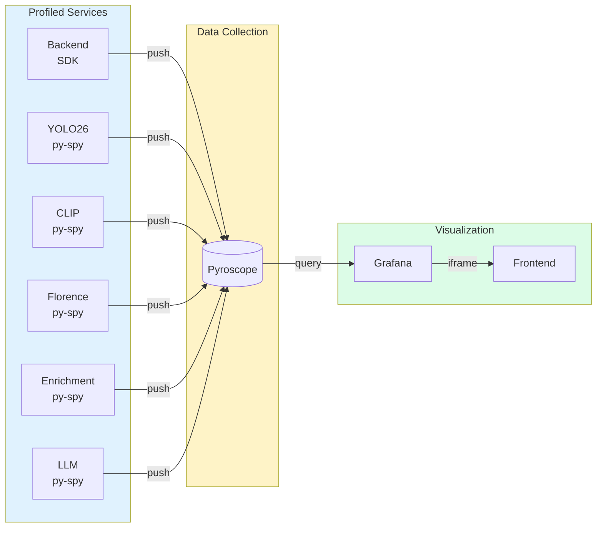

# Continuous Profiling Guide

> Identify performance bottlenecks using Pyroscope continuous profiling across all services.

## Overview

The Nemotron Home Security Intelligence platform uses [Pyroscope](https://pyroscope.io/) for continuous profiling across all services. Continuous profiling captures CPU and memory usage patterns over time, enabling you to:

- Identify CPU hotspots in AI inference pipelines
- Find memory leaks before they cause OOM errors
- Compare performance before and after code changes
- Correlate slow requests with specific code paths

## Accessing Profiling Data

### Via Frontend Dashboard

Navigate to **Profiling** in the sidebar to access the embedded Grafana dashboard with Pyroscope visualizations.

| Button              | Function                                                            |
| ------------------- | ------------------------------------------------------------------- |
| **Open in Grafana** | Opens the full Grafana dashboard in a new tab for advanced features |
| **Explore**         | Opens Grafana Explore with Pyroscope datasource for ad-hoc queries  |
| **Open Pyroscope**  | Opens the native Pyroscope UI at `localhost:4040`                   |
| **Refresh**         | Reloads the embedded dashboard                                      |

### Direct Access

| Interface    | URL                                            | Purpose                          |
| ------------ | ---------------------------------------------- | -------------------------------- |
| Pyroscope UI | [http://localhost:4040](http://localhost:4040) | Native Pyroscope interface       |
| Grafana      | [http://localhost:3002](http://localhost:3002) | Dashboards with Pyroscope panels |

## Profiled Services

All services are instrumented with either the Python SDK (push-based) or py-spy profiler (sidecar approach):

| Service          | Application Name      | Method     | Description                             |
| ---------------- | --------------------- | ---------- | --------------------------------------- |
| Backend          | `nemotron-backend`    | Python SDK | FastAPI backend with all business logic |
| YOLO26           | `ai-yolo26`           | py-spy     | Object detection service                |
| CLIP             | `ai-clip`             | py-spy     | Entity re-identification embeddings     |
| Florence         | `ai-florence`         | py-spy     | Vision-language scene understanding     |
| Enrichment       | `ai-enrichment`       | py-spy     | Heavy enrichment models (GPU 0)         |
| Enrichment Light | `ai-enrichment-light` | py-spy     | Light enrichment models (GPU 1)         |
| LLM (Nemotron)   | `ai-llm`              | py-spy     | Nemotron LLM inference                  |

### Profiling Methods

**Python SDK (Backend)**

The backend uses the `pyroscope-io` Python SDK which integrates directly with the Python interpreter:

```python
# backend/core/telemetry.py
import pyroscope

pyroscope.configure(
    application_name="nemotron-backend",
    server_address=os.getenv("PYROSCOPE_URL", "http://pyroscope:4040"),
    tags={"service": "backend", "environment": os.getenv("ENVIRONMENT", "development")},
    oncpu=True,
    gil_only=False,  # Profile all threads
    enable_logging=True,
)
```

**py-spy Profiler (AI Services)**

AI services use py-spy in a sidecar pattern for minimal overhead:

```bash
# scripts/pyroscope-profiler.sh
py-spy record --pid "$PID" --duration 30 --format speedscope --nonblocking
# Profiles are pushed to Pyroscope via HTTP
```

## Reading Flamegraphs

Flamegraphs are the primary visualization for understanding where time or memory is consumed:

```
                    +-----------------+
                    |   main()        |  <- Entry point (root)
                    +--------+--------+
                             |
            +----------------+----------------+
            |                                 |
    +-------+-------+               +--------+--------+
    | process_batch |               | handle_request |
    +-------+-------+               +--------+--------+
            |                                 |
    +-------+-------+               +--------+--------+
    | detect_objects|               | db_query       |
    +---------------+               +----------------+
         (WIDE = more time)
```

### Reading Tips

| Pattern                | Meaning                                             |
| ---------------------- | --------------------------------------------------- |
| **Wide bar at top**    | High-level function consuming significant resources |
| **Wide bar at bottom** | Leaf function (actual work) consuming resources     |
| **Narrow tower**       | Deep call stack but minimal resource usage          |
| **Flat top**           | Most time spent in this specific function           |

### Interaction

- **Click** on a bar to zoom into that function and its children
- **Hover** to see exact time/sample counts
- **Reset** to return to the full view
- **Compare** button to diff two time ranges

## Profile Types

| Type              | Description                               | Use Case                            |
| ----------------- | ----------------------------------------- | ----------------------------------- |
| **CPU**           | Shows where processing time is spent      | Finding slow code paths             |
| **alloc_objects** | Shows number of allocations per code path | Finding allocation hotspots         |
| **alloc_space**   | Shows bytes allocated per code path       | Finding memory-intensive operations |

### Memory Profiling (Backend)

The backend service captures memory allocation profiles via `pyroscope-io` SDK parameters:

- **alloc_objects**: Tracks the count of memory allocations by code path. High values indicate functions creating many objects, which can cause GC pressure.
- **alloc_space**: Tracks total bytes allocated by code path. High values indicate functions allocating large amounts of memory, useful for finding memory-intensive operations.

Memory profiling is enabled by default (`PYROSCOPE_MEMORY_ENABLED=true`). To disable it (reduces profiling overhead):

```bash
# In .env or docker-compose override
PYROSCOPE_MEMORY_ENABLED=false
```

**Interpreting Memory Profiles:**

| Pattern                                | Meaning                                    | Action                                     |
| -------------------------------------- | ------------------------------------------ | ------------------------------------------ |
| High `alloc_objects` in tight loop     | Many small allocations causing GC pressure | Consider object pooling or pre-allocation  |
| High `alloc_space` in single function  | Large memory allocation hotspot            | Review data structures, consider streaming |
| Growing `alloc_space` over time        | Potential memory leak                      | Check for retained references              |
| `alloc_objects` spikes during requests | Normal request handling                    | Baseline for comparison                    |

## Configuration

### Environment Variables

| Variable                   | Default                 | Description                                       |
| -------------------------- | ----------------------- | ------------------------------------------------- |
| `PYROSCOPE_ENABLED`        | `true`                  | Enable/disable profiling                          |
| `PYROSCOPE_URL`            | `http://pyroscope:4040` | Pyroscope server URL                              |
| `PYROSCOPE_SAMPLE_RATE`    | `100`                   | CPU profiling sample rate in Hz                   |
| `PYROSCOPE_MEMORY_ENABLED` | `true`                  | Enable memory allocation profiling (backend only) |
| `PROFILE_INTERVAL`         | `30`                    | Profile duration in seconds (py-spy)              |
| `ENVIRONMENT`              | `development`           | Environment tag for profiles                      |

### Disabling Profiling

To disable profiling (reduces CPU overhead by ~1-3%):

```bash
# In .env or docker-compose override
PYROSCOPE_ENABLED=false
```

Or disable per-service in `docker-compose.prod.yml`:

```yaml
ai-yolo26:
  environment:
    - PYROSCOPE_ENABLED=false
```

### Retention

Profiling data retention is configured in the Pyroscope server:

| Setting          | Default    | Description                   |
| ---------------- | ---------- | ----------------------------- |
| Retention Period | 15 days    | How long profile data is kept |
| Resolution       | 10 seconds | Profile sampling interval     |

## Common Use Cases

### Finding CPU Hotspots

1. Select the service (e.g., `ai-yolo26`)
2. Choose **CPU** profile type
3. Expand the time range to include the slow period
4. Look for wide bars at the bottom of the flamegraph
5. Click to zoom into suspicious functions

### Finding Memory Leaks

1. Select the service experiencing memory growth
2. Choose **Memory** profile type
3. Select a time range spanning several hours
4. Look for allocations that never get freed
5. Compare memory profiles from start and end of range

### Comparing Performance

1. Open Grafana Explore with Pyroscope datasource
2. Select the service and profile type
3. Use the **Compare** feature to diff two time ranges
4. Green bars = faster in second range
5. Red bars = slower in second range

### Correlating with Traces

The backend service automatically tags profiling data with OpenTelemetry trace context (NEM-4127). This enables precise correlation between a specific request trace and its CPU/memory profile.

#### Automatic Trace-to-Profile Correlation

Every HTTP request to the backend is automatically tagged with:

- `trace_id`: 32-character hex string identifying the distributed trace
- `span_id`: 16-character hex string identifying the current span

This happens via the `ProfilingMiddleware` which wraps each request with trace context tags.

#### Finding the Profile for a Slow Request

1. **Find the slow trace in Jaeger/Tempo:**

   - Navigate to the [Tracing](../ui/tracing.md) page
   - Find the slow request by duration or error status
   - Copy the `trace_id` from the trace details

2. **Filter Pyroscope by trace_id:**

   ```
   In Pyroscope UI or Grafana Explore:
   - Select application: nemotron-backend
   - Add tag filter: trace_id="<your-trace-id>"
   ```

3. **View the exact profile:**
   - The flamegraph shows CPU usage for only that specific request
   - Identify the exact functions causing slowness

#### Example: Debugging a Slow API Request

```bash
# 1. Find slow traces (e.g., requests > 5 seconds)
# In Jaeger: service=nemotron-backend, minDuration=5s

# 2. Get trace_id from the slow trace
# Example: 0123456789abcdef0123456789abcdef

# 3. In Pyroscope, filter by that trace_id
# Query: {service_name="nemotron-backend", trace_id="0123456789abcdef0123456789abcdef"}

# 4. Analyze the flamegraph to find the bottleneck
```

#### Programmatic Trace Correlation

You can also manually tag profiling sections in your code:

```python
from backend.core.telemetry import profile_with_trace_context, trace_span

@trace_function("heavy_computation")
async def process_data(data):
    # Profiling data for this function will be tagged with trace context
    with profile_with_trace_context():
        result = await expensive_operation(data)
    return result
```

#### Legacy Method: Time-based Correlation

If trace tagging is not available, use time-based correlation:

1. Note the time range of the slow operation from the trace
2. Open Profiling and select the same time range
3. Identify which code paths consumed the most resources

### Trace-to-Profile Navigation

Grafana provides direct navigation from Jaeger traces to Pyroscope profiles (NEM-4129). This enables a seamless debugging workflow where you can jump from a slow trace span directly to the corresponding CPU profile.

#### How to Navigate from Trace to Profile

1. **Find a slow trace in Jaeger:**

   - Go to Grafana (http://localhost:3002)
   - Navigate to **Explore** and select the **Jaeger** datasource
   - Search for traces by service name, operation, or duration
   - Click on a trace to open the trace detail view

2. **Click through to the profile:**

   - In the trace detail view, click on any span
   - Look for the **Profiles** tab or **Profiles for this span** link
   - Click to open the corresponding Pyroscope profile filtered by trace ID

3. **Analyze the flame graph:**
   - The flame graph shows CPU usage for the specific trace/span
   - Wide bars at the bottom indicate functions consuming the most CPU time
   - Click on bars to zoom into specific code paths
   - Use the **Compare** feature to diff against a baseline

#### What to Look for in the Flame Graph

| Pattern                     | Meaning                                 | Action                              |
| --------------------------- | --------------------------------------- | ----------------------------------- |
| Wide bar in `json.dumps`    | Serialization bottleneck                | Consider caching or streaming       |
| Wide bar in `db_query`      | Database query taking significant CPU   | Review query, add indexes           |
| Wide bar in `model.predict` | ML inference dominating                 | Expected for AI services            |
| Wide bar in `GC collect`    | Garbage collection pressure             | Reduce allocations, tune GC         |
| Deep narrow tower           | Many function calls but little CPU each | Normal call stack, not a bottleneck |

#### Configuration

The trace-to-profile integration is configured in Grafana's datasource provisioning:

```yaml
# monitoring/grafana/provisioning/datasources/prometheus.yml
- name: Jaeger
  jsonData:
    tracesToProfiles:
      datasourceUid: pyroscope
      profileTypeId: 'process_cpu:cpu:nanoseconds:cpu:nanoseconds'
      customQuery: true
      query: '{service_name="${__span.tags["service.name"]}", trace_id="${__span.traceId}"}'
```

The query uses span tags to filter profiles:

- `service_name`: Matches the service that generated the trace
- `trace_id`: Filters to only show the profile for that specific distributed trace

#### Requirements

For trace-to-profile navigation to work:

1. **Pyroscope must be running:** `podman ps | grep pyroscope`
2. **Backend must be profiled with trace tags:** Enabled by `ProfilingMiddleware` (NEM-4127)
3. **Trace IDs must match:** Both Jaeger and Pyroscope must see the same trace_id

#### Troubleshooting Navigation

If the "Profiles" tab doesn't appear or shows no data:

1. **Verify trace tagging is enabled:**

   ```bash
   # Check backend logs for trace context in profiles
   podman logs backend 2>&1 | grep "profile.*trace_id"
   ```

2. **Check Pyroscope has trace_id tag:**

   - Open Pyroscope UI (http://localhost:4040)
   - Select `nemotron-backend` application
   - Look for `trace_id` in the tag filter dropdown

3. **Verify Grafana datasource config:**

   ```bash
   # Check the provisioned datasource
   podman exec grafana cat /etc/grafana/provisioning/datasources/prometheus.yml | grep -A10 tracesToProfiles
   ```

4. **Restart Grafana to reload datasources:**
   ```bash
   podman-compose -f docker-compose.prod.yml restart grafana
   ```

## Troubleshooting

### No Data Appearing

1. **Check Pyroscope is running:**

   ```bash
   podman ps | grep pyroscope
   curl http://localhost:4040/ready
   ```

2. **Verify profiling is enabled:**

   ```bash
   podman logs backend 2>&1 | grep -i pyroscope
   # Should see: "Pyroscope profiling initialized"
   ```

3. **Check service instrumentation:**

   ```bash
   podman logs ai-yolo26 2>&1 | grep -i profiler
   # Should see: "Starting Pyroscope profiler for ai-yolo26"
   ```

4. **Verify network connectivity:**
   ```bash
   podman exec backend curl -s http://pyroscope:4040/ready
   ```

### Missing Service

If a specific service doesn't appear in Pyroscope:

1. Check the service has `PYROSCOPE_ENABLED=true` in its environment
2. Verify the service has the profiler script (AI services) or SDK (backend)
3. Check container logs for profiler errors:
   ```bash
   podman exec ai-yolo26 cat /tmp/profiler.log
   ```

### High Overhead

Continuous profiling typically adds 1-3% CPU overhead. If overhead is excessive:

1. **Reduce profile interval:**

   ```yaml
   environment:
     - PROFILE_INTERVAL=60 # Profile for 60s instead of 30s
   ```

2. **Disable for non-critical services:**

   ```yaml
   ai-enrichment-light:
     environment:
       - PYROSCOPE_ENABLED=false
   ```

3. **Check py-spy is running in nonblocking mode** (default):
   ```bash
   grep "nonblocking" /usr/local/bin/pyroscope-profiler.sh
   ```

### "Unknown profile type: seconds" Error

This error was caused by a bug in older Pyroscope versions with Speedscope format. The fix requires:

- `pyroscope-io` SDK >= 0.8.7 (specified in `pyproject.toml`)
- Pyroscope server >= 1.9.2 (we use 1.18.0 in `docker-compose.prod.yml`)

If you see this error, update your containers:

```bash
podman-compose -f docker-compose.prod.yml pull pyroscope
podman-compose -f docker-compose.prod.yml up -d pyroscope
```

## Architecture



## Request-Level Debugging (NEM-4134)

The **Request-Level Profiling Dashboard** provides a dedicated workflow for debugging individual slow requests using trace-correlated profiles. This dashboard complements the main profiling dashboard by focusing specifically on single-request analysis.

### Accessing the Dashboard

1. **From the main profiling dashboard:** Click the **Request-Level Debugging** link at the top
2. **Direct URL:** Navigate to `/d/hsi-request-profiling/hsi-request-level-profiling`
3. **From Grafana:** Go to Dashboards and search for "Request-Level Profiling"

### Step-by-Step Debugging Workflow

#### Step 1: Find Slow Requests

The dashboard shows a table of **Recent Slow Requests** with p99 latency by endpoint:

- **Green** = healthy latency (<500ms)
- **Yellow** = elevated latency (500ms-1s)
- **Red** = high latency (>1s)

Use this table to identify which endpoints are experiencing performance issues.

#### Step 2: Get a Trace ID

To profile a specific slow request, you need its trace ID:

1. Click the **Jaeger Traces** link in the dashboard header
2. In Grafana Explore, search for slow traces:
   - Service: `nemotron-backend` (or relevant service)
   - Min Duration: `500ms` (or your threshold)
3. Click on a slow trace to open its details
4. Copy the `trace_id` (32-character hex string like `0123456789abcdef0123456789abcdef`)

#### Step 3: View the Profile

1. Paste the trace ID into the **Trace ID** variable at the top of the dashboard
2. The **Profile for Trace** flame graph will update to show CPU usage for that specific request
3. The memory profile panels below will show allocation patterns for the same request

#### Step 4: Identify Hotspots

Reading the flame graph:

| Pattern                | Meaning                                 | Action                          |
| ---------------------- | --------------------------------------- | ------------------------------- |
| **Wide bar at bottom** | Leaf function consuming significant CPU | Optimize this function          |
| **Wide bar in middle** | Function calling slow children          | Look at children for root cause |
| **Narrow tower**       | Deep call stack, minimal CPU each       | Normal, not a bottleneck        |
| **Click on a bar**     | Zoom into that function                 | Navigate to specific code paths |

Common hotspots and what they mean:

| Function Pattern            | Typical Cause               | Suggested Action                     |
| --------------------------- | --------------------------- | ------------------------------------ |
| `json.dumps` / `json.loads` | Serialization bottleneck    | Cache results, use faster JSON libs  |
| `db_query` / SQLAlchemy     | Database operations         | Add indexes, optimize queries        |
| `model.predict` / inference | ML model execution          | Expected for AI services             |
| `GC.collect`                | Garbage collection pressure | Reduce allocations, use object pools |
| `await` / async operations  | Waiting on I/O              | Check downstream dependencies        |

### Alternative: Direct Navigation from Jaeger

You can also navigate directly from a trace to its profile:

1. Open the **Tracing** dashboard or Grafana Explore with Jaeger
2. Find and click on a slow trace
3. Click on the slow span within the trace
4. Look for the **Profiles** tab or **Profiles for this span** link
5. Click to jump directly to the Pyroscope profile filtered by that trace ID

This integration is configured via the Tempo-Pyroscope linking feature (NEM-4129).

### Memory Profile Analysis

The dashboard includes memory profile panels for the selected trace:

- **Memory Allocations (Objects)**: Shows functions that created the most objects. High values indicate allocation hotspots that may cause GC pressure.
- **Memory Bytes Allocated**: Shows functions that allocated the most memory. Useful for finding memory-intensive operations.

### Best Practices

1. **Start with p99 latency**: Focus on the slowest requests first (tail latency)
2. **Compare traces**: Profile multiple slow requests to identify patterns
3. **Check time correlation**: Use the latency trends panel to see if slowness is recent or ongoing
4. **Validate with memory**: Sometimes slow requests are caused by excessive allocations, not CPU
5. **Use the main dashboard for aggregates**: For overall service performance, use the main profiling dashboard

### Troubleshooting

#### "No profile data" for a trace ID

- **Verify the trace ID is correct**: It should be a 32-character hex string
- **Check the time range**: Ensure the dashboard time range includes when the trace occurred
- **Verify profiling was active**: The backend must have been running with profiling enabled during that request
- **Check service selection**: Ensure the correct service is selected in the Service dropdown

#### Flame graph shows minimal data

- **Request may have been fast**: Very fast requests may not generate significant profile data
- **Sampling rate**: CPU profiling uses sampling; very quick operations may not be captured
- **Check memory profiles**: The memory flame graphs may show more detail for allocation-heavy requests

## GPU Profiling with PyTorch (NEM-4130)

While Pyroscope captures CPU/memory profiles, it cannot see inside GPU operations. PyTorch Profiler captures CUDA kernel timing, memory transfers, and tensor operations - essential for optimizing AI inference bottlenecks.

### Enabling GPU Profiling

GPU profiling is disabled by default (performance overhead). Enable it selectively:

```bash
# In .env or docker-compose override
PYTORCH_PROFILE_ENABLED=true
PYTORCH_PROFILE_RATE=0.05  # 5% of requests profiled
```

### Environment Variables

| Variable                  | Default         | Description                        |
| ------------------------- | --------------- | ---------------------------------- |
| `PYTORCH_PROFILE_ENABLED` | `false`         | Enable/disable GPU profiling       |
| `PYTORCH_PROFILE_RATE`    | `0.05`          | Sample rate (0.0-1.0, 5% default)  |
| `PYTORCH_PROFILE_DIR`     | `/tmp/profiles` | Output directory for Chrome traces |

### Services with GPU Profiling

The following AI services support PyTorch GPU profiling:

| Service             | Profile Name   | Notes                       |
| ------------------- | -------------- | --------------------------- |
| ai-yolo26           | `yolo26_*`     | Object detection inference  |
| ai-florence         | `florence_*`   | Vision-language captioning  |
| ai-clip             | `clip_*`       | Entity re-identification    |
| ai-enrichment       | `enrichment_*` | Heavy transformer models    |
| ai-enrichment-light | `enrichment_*` | Light models (pose, threat) |

### Viewing GPU Traces

1. **Copy traces from container:**

   ```bash
   # All services share the pytorch-profiles volume
   podman cp ai-yolo26:/tmp/profiles ./profiles

   # Or list available traces
   podman exec ai-yolo26 ls -la /tmp/profiles/
   ```

2. **Open in Perfetto UI:**
   - Navigate to [https://ui.perfetto.dev](https://ui.perfetto.dev)
   - Drag and drop the `.json` trace file
   - Use the timeline to explore CUDA operations

### What to Look For

| Pattern                              | Meaning                           | Action                                  |
| ------------------------------------ | --------------------------------- | --------------------------------------- |
| Long CUDA kernel gaps                | CPU-GPU sync stalls               | Use async operations, batch transfers   |
| Memory allocation spikes             | Frequent tensor allocations       | Pre-allocate tensors, use memory pools  |
| Small frequent kernels               | Kernel launch overhead dominating | Fuse operations, use larger batch sizes |
| `cudaMemcpy` taking significant time | Memory transfer bottleneck        | Pin memory, use CUDA streams            |
| `cuda_synchronize` bars              | Unnecessary synchronization       | Remove explicit syncs where possible    |

### Example: Profiling a Detection Request

```python
from ai.shared import gpu_profile

async def detect_objects(image):
    # Profile is captured ~5% of requests when enabled
    with gpu_profile("yolo26_detect", trace_id=request_id):
        preprocessed = preprocess(image)
        detections = model(preprocessed)
        postprocessed = postprocess(detections)
    return postprocessed
```

### Programmatic Usage

The GPU profiler can be used directly in AI service code:

```python
from ai.shared import gpu_profile, should_profile

# Check if profiling is active
if should_profile():
    logger.info("This request will be GPU profiled")

# Profile a specific operation
with gpu_profile("model_forward", trace_id="abc123"):
    output = model(input_tensor)

# Profile with custom settings
with gpu_profile("inference", record_shapes=True, profile_memory=True):
    result = model.generate(prompt)
```

### Performance Overhead

GPU profiling adds overhead when enabled:

| Metric              | Overhead         | Notes                           |
| ------------------- | ---------------- | ------------------------------- |
| Latency per request | ~5-15%           | Due to profiler instrumentation |
| Memory usage        | ~50-100MB        | Trace buffer storage            |
| Disk I/O            | ~1-5MB per trace | Chrome trace JSON files         |

**Recommendation:** Enable only for debugging sessions, not continuous production use. Use `PYTORCH_PROFILE_RATE=0.01` (1%) for minimal impact during investigation.

### Cleanup

Profile traces accumulate in the shared volume. Clean up periodically:

```bash
# Remove traces older than 7 days
podman exec ai-yolo26 find /tmp/profiles -name "*.json" -mtime +7 -delete

# Or clear all traces
podman volume rm pytorch-profiles
```

## GPU Hardware Metrics with DCGM (NEM-4132)

While PyTorch Profiler captures application-level GPU operations, NVIDIA DCGM (Data Center GPU Manager) provides hardware-level metrics essential for understanding system bottlenecks. DCGM metrics reveal whether workloads are compute-bound or memory-bound.

### Key Concepts

**Compute-bound vs Memory-bound Workloads:**

| Characteristic    | Compute-bound                    | Memory-bound                              |
| ----------------- | -------------------------------- | ----------------------------------------- |
| GPU Utilization   | High (>80%)                      | Low to Medium (<50%)                      |
| Memory Bandwidth  | Low to Medium                    | High (>70%)                               |
| Bottleneck        | ALU/Tensor cores                 | Memory bus                                |
| Optimization      | Use smaller models, quantization | Reduce batch size, optimize memory access |
| Example workloads | Large transformer inference      | Large batch embedding generation          |

### Accessing GPU Metrics

**Via Grafana Dashboard:**

Navigate to the "HSI GPU Metrics" dashboard at [http://localhost:3002](http://localhost:3002) for visualization of:

- GPU utilization over time
- Memory used/free
- Memory bandwidth utilization
- Temperature and power consumption
- Clock speeds
- PCIe throughput

**Direct Prometheus Queries:**

```promql
# GPU utilization percentage
DCGM_FI_DEV_GPU_UTIL

# Memory bandwidth utilization
DCGM_FI_DEV_MEM_COPY_UTIL

# VRAM used (MB)
DCGM_FI_DEV_FB_USED

# GPU temperature (Celsius)
DCGM_FI_DEV_GPU_TEMP

# Power usage (Watts)
DCGM_FI_DEV_POWER_USAGE
```

### Key DCGM Metrics

| Metric                           | Description                  | Unit    | Use Case                 |
| -------------------------------- | ---------------------------- | ------- | ------------------------ |
| `DCGM_FI_DEV_GPU_UTIL`           | GPU compute utilization      | %       | Overall GPU usage        |
| `DCGM_FI_DEV_MEM_COPY_UTIL`      | Memory bandwidth utilization | %       | Memory-bound detection   |
| `DCGM_FI_DEV_FB_USED`            | Framebuffer (VRAM) used      | MB      | OOM risk assessment      |
| `DCGM_FI_DEV_FB_FREE`            | Framebuffer free             | MB      | Available VRAM           |
| `DCGM_FI_DEV_GPU_TEMP`           | GPU temperature              | Celsius | Thermal throttling       |
| `DCGM_FI_DEV_POWER_USAGE`        | Power consumption            | Watts   | Power throttling         |
| `DCGM_FI_DEV_SM_CLOCK`           | SM clock frequency           | MHz     | Clock throttling         |
| `DCGM_FI_DEV_MEM_CLOCK`          | Memory clock frequency       | MHz     | Memory throttling        |
| `DCGM_FI_DEV_PCIE_TX_THROUGHPUT` | PCIe transmit rate           | B/s     | Data transfer bottleneck |
| `DCGM_FI_DEV_PCIE_RX_THROUGHPUT` | PCIe receive rate            | B/s     | Data transfer bottleneck |

### Identifying Workload Characteristics

**1. Compute-bound Workload:**

```
GPU Util: 95%
Mem BW Util: 30%
→ GPU is busy with calculations, memory is not the bottleneck
→ Optimize by: quantization, pruning, smaller models
```

**2. Memory-bound Workload:**

```
GPU Util: 40%
Mem BW Util: 85%
→ GPU is waiting for data, memory bus is saturated
→ Optimize by: smaller batch sizes, memory pooling, pinned memory
```

**3. PCIe-bound Workload:**

```
GPU Util: 30%
Mem BW Util: 20%
PCIe TX/RX: Very high
→ Too much data transfer between CPU and GPU
→ Optimize by: batch more data, reduce CPU-GPU transfers
```

**4. Thermal Throttling:**

```
GPU Util: Fluctuating/dropping
Temperature: >83°C
SM Clock: Below expected
→ GPU is overheating and reducing performance
→ Fix: improve cooling, reduce workload
```

### Alerts

DCGM alerts are configured in `monitoring/gpu-alerts.yml`:

| Alert                         | Condition            | Severity | Description           |
| ----------------------------- | -------------------- | -------- | --------------------- |
| `GPUMemoryNearFull`           | VRAM >90%            | Critical | OOM imminent          |
| `GPUMemoryHigh`               | VRAM >80%            | Warning  | Monitor for OOM       |
| `GPUHighTemperature`          | Temp >85°C           | Critical | Thermal throttling    |
| `GPUTemperatureElevated`      | Temp >75°C           | Warning  | Approaching throttle  |
| `GPUUtilizationSaturated`     | Util >95% for 15m    | Warning  | GPU may be bottleneck |
| `GPUMemoryBandwidthSaturated` | BW >90%              | Warning  | Memory-bound          |
| `DCGMExporterDown`            | Exporter unreachable | Critical | No GPU metrics        |

### Troubleshooting

**No DCGM metrics appearing:**

1. Check DCGM exporter is running:

   ```bash
   podman ps | grep dcgm-exporter
   curl http://localhost:9400/metrics | head -20
   ```

2. Verify NVIDIA driver is accessible:

   ```bash
   podman exec dcgm-exporter nvidia-smi
   ```

3. Check Prometheus is scraping DCGM:
   ```bash
   curl http://localhost:9090/api/v1/targets | jq '.data.activeTargets[] | select(.labels.job=="dcgm-exporter")'
   ```

**GPU metrics show zeros:**

- NVIDIA driver may not be properly configured
- GPU may be in a power-saving state
- Check `nvidia-smi` output on the host

**High memory bandwidth but low GPU utilization:**

This is normal for memory-bound workloads. Consider:

- Reducing batch sizes to fit more data in cache
- Using memory pooling
- Optimizing memory access patterns in your model

## Related Documentation

| Document                                                | Purpose                              |
| ------------------------------------------------------- | ------------------------------------ |
| [Monitoring Guide](../operator/monitoring.md)           | GPU, tokens, and distributed tracing |
| [Profiling UI](../ui/pyroscope.md)                      | Frontend profiling page reference    |
| [Profiling Runbook](../operations/profiling-runbook.md) | Operations procedures                |
| [AI Performance](../operator/ai-performance.md)         | AI service tuning                    |
