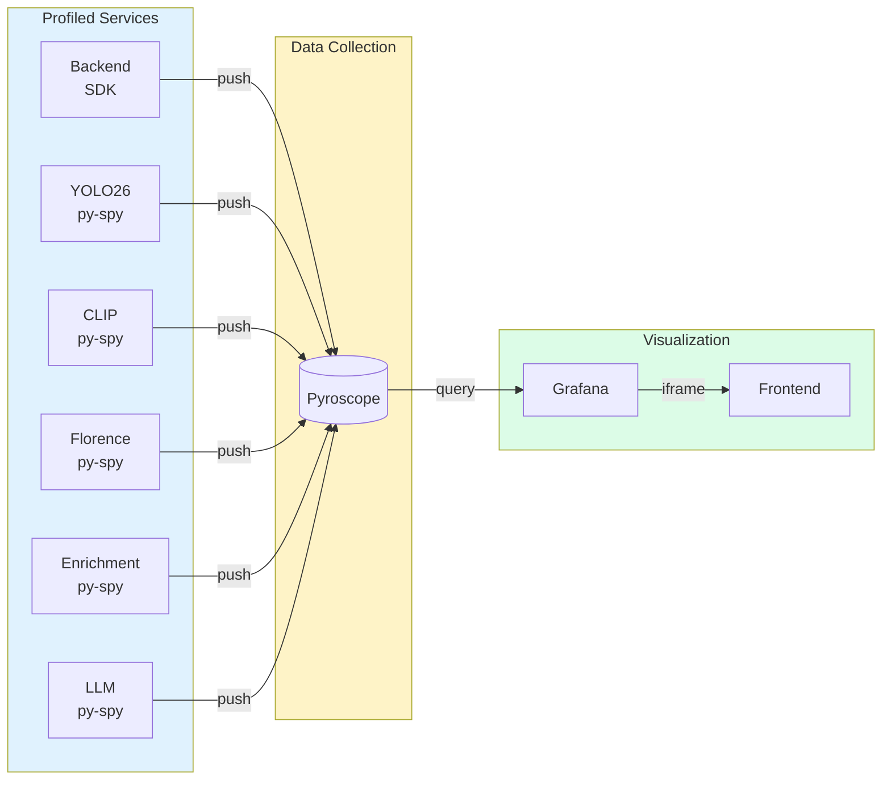

# Continuous Profiling Guide

> Identify performance bottlenecks using Pyroscope continuous profiling across all services.

## Overview

The Nemotron Home Security Intelligence platform uses [Pyroscope](https://pyroscope.io/) for continuous profiling across all services. Continuous profiling captures CPU and memory usage patterns over time, enabling you to:

- Identify CPU hotspots in AI inference pipelines
- Find memory leaks before they cause OOM errors
- Compare performance before and after code changes
- Correlate slow requests with specific code paths

## Accessing Profiling Data

### Via Frontend Dashboard

Navigate to **Profiling** in the sidebar to access the embedded Grafana dashboard with Pyroscope visualizations.

| Button              | Function                                                            |
| ------------------- | ------------------------------------------------------------------- |
| **Open in Grafana** | Opens the full Grafana dashboard in a new tab for advanced features |
| **Explore**         | Opens Grafana Explore with Pyroscope datasource for ad-hoc queries  |
| **Open Pyroscope**  | Opens the native Pyroscope UI at `localhost:4040`                   |
| **Refresh**         | Reloads the embedded dashboard                                      |

### Direct Access

| Interface    | URL                                            | Purpose                          |
| ------------ | ---------------------------------------------- | -------------------------------- |
| Pyroscope UI | [http://localhost:4040](http://localhost:4040) | Native Pyroscope interface       |
| Grafana      | [http://localhost:3002](http://localhost:3002) | Dashboards with Pyroscope panels |

## Profiled Services

All services are instrumented with either the Python SDK (push-based) or py-spy profiler (sidecar approach):

| Service          | Application Name      | Method     | Description                             |
| ---------------- | --------------------- | ---------- | --------------------------------------- |
| Backend          | `nemotron-backend`    | Python SDK | FastAPI backend with all business logic |
| YOLO26           | `ai-yolo26`           | py-spy     | Object detection service                |
| CLIP             | `ai-clip`             | py-spy     | Entity re-identification embeddings     |
| Florence         | `ai-florence`         | py-spy     | Vision-language scene understanding     |
| Enrichment       | `ai-enrichment`       | py-spy     | Heavy enrichment models (GPU 0)         |
| Enrichment Light | `ai-enrichment-light` | py-spy     | Light enrichment models (GPU 1)         |
| LLM (Nemotron)   | `ai-llm`              | py-spy     | Nemotron LLM inference                  |

### Profiling Methods

**Python SDK (Backend)**

The backend uses the `pyroscope-io` Python SDK which integrates directly with the Python interpreter:

```python
# backend/core/telemetry.py
import pyroscope

pyroscope.configure(
    application_name="nemotron-backend",
    server_address=os.getenv("PYROSCOPE_URL", "http://pyroscope:4040"),
    tags={"service": "backend", "environment": os.getenv("ENVIRONMENT", "development")},
    oncpu=True,
    gil_only=False,  # Profile all threads
    enable_logging=True,
)
```

**py-spy Profiler (AI Services)**

AI services use py-spy in a sidecar pattern for minimal overhead:

```bash
# scripts/pyroscope-profiler.sh
py-spy record --pid "$PID" --duration 30 --format speedscope --nonblocking
# Profiles are pushed to Pyroscope via HTTP
```

## Reading Flamegraphs

Flamegraphs are the primary visualization for understanding where time or memory is consumed:

```
                    +-----------------+
                    |   main()        |  <- Entry point (root)
                    +--------+--------+
                             |
            +----------------+----------------+
            |                                 |
    +-------+-------+               +--------+--------+
    | process_batch |               | handle_request |
    +-------+-------+               +--------+--------+
            |                                 |
    +-------+-------+               +--------+--------+
    | detect_objects|               | db_query       |
    +---------------+               +----------------+
         (WIDE = more time)
```

### Reading Tips

| Pattern                | Meaning                                             |
| ---------------------- | --------------------------------------------------- |
| **Wide bar at top**    | High-level function consuming significant resources |
| **Wide bar at bottom** | Leaf function (actual work) consuming resources     |
| **Narrow tower**       | Deep call stack but minimal resource usage          |
| **Flat top**           | Most time spent in this specific function           |

### Interaction

- **Click** on a bar to zoom into that function and its children
- **Hover** to see exact time/sample counts
- **Reset** to return to the full view
- **Compare** button to diff two time ranges

## Profile Types

| Type       | Description                          | Use Case                |
| ---------- | ------------------------------------ | ----------------------- |
| **CPU**    | Shows where processing time is spent | Finding slow code paths |
| **Memory** | Shows where memory is allocated      | Finding memory leaks    |

## Configuration

### Environment Variables

| Variable            | Default                 | Description                          |
| ------------------- | ----------------------- | ------------------------------------ |
| `PYROSCOPE_ENABLED` | `true`                  | Enable/disable profiling             |
| `PYROSCOPE_URL`     | `http://pyroscope:4040` | Pyroscope server URL                 |
| `PROFILE_INTERVAL`  | `30`                    | Profile duration in seconds (py-spy) |
| `ENVIRONMENT`       | `development`           | Environment tag for profiles         |

### Disabling Profiling

To disable profiling (reduces CPU overhead by ~1-3%):

```bash
# In .env or docker-compose override
PYROSCOPE_ENABLED=false
```

Or disable per-service in `docker-compose.prod.yml`:

```yaml
ai-yolo26:
  environment:
    - PYROSCOPE_ENABLED=false
```

### Retention

Profiling data retention is configured in the Pyroscope server:

| Setting          | Default    | Description                   |
| ---------------- | ---------- | ----------------------------- |
| Retention Period | 15 days    | How long profile data is kept |
| Resolution       | 10 seconds | Profile sampling interval     |

## Common Use Cases

### Finding CPU Hotspots

1. Select the service (e.g., `ai-yolo26`)
2. Choose **CPU** profile type
3. Expand the time range to include the slow period
4. Look for wide bars at the bottom of the flamegraph
5. Click to zoom into suspicious functions

### Finding Memory Leaks

1. Select the service experiencing memory growth
2. Choose **Memory** profile type
3. Select a time range spanning several hours
4. Look for allocations that never get freed
5. Compare memory profiles from start and end of range

### Comparing Performance

1. Open Grafana Explore with Pyroscope datasource
2. Select the service and profile type
3. Use the **Compare** feature to diff two time ranges
4. Green bars = faster in second range
5. Red bars = slower in second range

### Correlating with Traces

1. Find a slow trace in the [Tracing](../ui/tracing.md) page
2. Note the time range of the slow operation
3. Open Profiling and select the same time range
4. Identify which code paths consumed the most resources

## Troubleshooting

### No Data Appearing

1. **Check Pyroscope is running:**

   ```bash
   podman ps | grep pyroscope
   curl http://localhost:4040/ready
   ```

2. **Verify profiling is enabled:**

   ```bash
   podman logs backend 2>&1 | grep -i pyroscope
   # Should see: "Pyroscope profiling initialized"
   ```

3. **Check service instrumentation:**

   ```bash
   podman logs ai-yolo26 2>&1 | grep -i profiler
   # Should see: "Starting Pyroscope profiler for ai-yolo26"
   ```

4. **Verify network connectivity:**
   ```bash
   podman exec backend curl -s http://pyroscope:4040/ready
   ```

### Missing Service

If a specific service doesn't appear in Pyroscope:

1. Check the service has `PYROSCOPE_ENABLED=true` in its environment
2. Verify the service has the profiler script (AI services) or SDK (backend)
3. Check container logs for profiler errors:
   ```bash
   podman exec ai-yolo26 cat /tmp/profiler.log
   ```

### High Overhead

Continuous profiling typically adds 1-3% CPU overhead. If overhead is excessive:

1. **Reduce profile interval:**

   ```yaml
   environment:
     - PROFILE_INTERVAL=60 # Profile for 60s instead of 30s
   ```

2. **Disable for non-critical services:**

   ```yaml
   ai-enrichment-light:
     environment:
       - PYROSCOPE_ENABLED=false
   ```

3. **Check py-spy is running in nonblocking mode** (default):
   ```bash
   grep "nonblocking" /usr/local/bin/pyroscope-profiler.sh
   ```

### "Unknown profile type: seconds" Error

This error was caused by a bug in older Pyroscope versions with Speedscope format. The fix requires:

- `pyroscope-io` SDK >= 0.8.7 (specified in `pyproject.toml`)
- Pyroscope server >= 1.9.2 (we use 1.18.0 in `docker-compose.prod.yml`)

If you see this error, update your containers:

```bash
podman-compose -f docker-compose.prod.yml pull pyroscope
podman-compose -f docker-compose.prod.yml up -d pyroscope
```

## Architecture



## Related Documentation

| Document                                                | Purpose                              |
| ------------------------------------------------------- | ------------------------------------ |
| [Monitoring Guide](../operator/monitoring.md)           | GPU, tokens, and distributed tracing |
| [Profiling UI](../ui/pyroscope.md)                      | Frontend profiling page reference    |
| [Profiling Runbook](../operations/profiling-runbook.md) | Operations procedures                |
| [AI Performance](../operator/ai-performance.md)         | AI service tuning                    |
