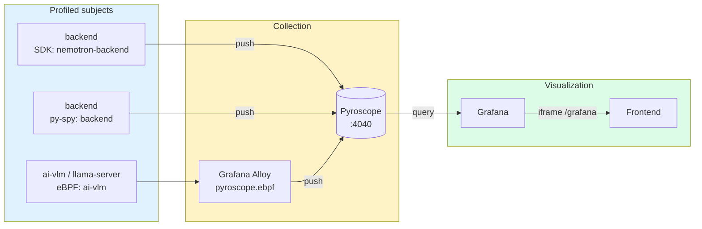

# Continuous Profiling Guide

> Identify performance bottlenecks using Pyroscope continuous profiling.

## Overview

Home Security Intelligence runs [Pyroscope](https://pyroscope.io/) as a
continuous profiler (`pyroscope` service, host
`${PYROSCOPE_PORT:-4040}` → container 4040). Continuous profiling captures CPU
and memory usage patterns over time, enabling you to:

- Identify CPU hotspots in the request and pipeline paths
- Find memory leaks before they cause OOM errors
- Compare performance before and after code changes
- Correlate slow requests with specific code paths

## Accessing Profiling Data

### Via Frontend Dashboard

The **Profiling** page (`frontend/src/components/pyroscope/PyroscopePage.tsx`,
route `/pyroscope`) embeds a Grafana dashboard through the nginx `/grafana`
reverse proxy (`frontend/nginx.conf:117`).

| Button              | Function                                                                  |
| ------------------- | ------------------------------------------------------------------------- |
| **Open in Grafana** | Opens the full Grafana dashboard in a new tab for advanced features       |
| **Explore**         | Opens Grafana Explore with the Pyroscope datasource for ad-hoc queries    |
| **Open Pyroscope**  | Opens the native Pyroscope UI at `http://localhost:4040` (hardcoded link) |
| **Refresh**         | Reloads the embedded dashboard                                            |

Grafana's own host port is `127.0.0.1:${GRAFANA_PORT:-3002}:3000`
(`docker-compose.prod.yml:1071`); set `GRAFANA_PORT` in `.env` if that collides.

### Direct Access

| Interface    | URL                                            | Purpose                          |
| ------------ | ---------------------------------------------- | -------------------------------- |
| Pyroscope UI | [http://localhost:4040](http://localhost:4040) | Native Pyroscope interface       |
| Grafana      | [http://localhost:3002](http://localhost:3002) | Dashboards with Pyroscope panels |

## Profiled Services

Three mechanisms feed Pyroscope, and each one has a specific set of subjects:

| Application name   | What it profiles                                 | Mechanism                                      | Switch it with                                                            |
| ------------------ | ------------------------------------------------ | ---------------------------------------------- | ------------------------------------------------------------------------- |
| `nemotron-backend` | Backend process, in-process CPU                  | pyroscope-io SDK (`backend/core/telemetry.py`) | `PYROSCOPE_ENABLED` in the backend container                              |
| `backend`          | Same backend process, sampled from outside       | py-spy + `scripts/pyroscope-profiler.sh`       | `PYROSCOPE_ENABLED` in the backend container (`backend/entrypoint.sh:51`) |
| `ai-vlm`           | `llama-server` (native C/C++), whole-process CPU | Alloy eBPF profiler                            | label `pyroscope.profile: 'true'` (`docker-compose.prod.yml:151`)         |

The two backend names are **the same process profiled twice**, not two
services. The SDK tags profiles with `service="backend"` and
`environment` (`backend/core/telemetry.py:1553-1561`); the py-spy loop posts to
`/ingest?name=backend&…&spyName=pyspy&format=speedscope`
(`scripts/pyroscope-profiler.sh:65`).

`ai-gateway` carries no profiling subject today: it runs Triton, has no
`pyroscope.profile` label, and no in-process agent, so it pushes nothing.

### Profiling Methods

**Python SDK (backend)**

`init_profiling()` in `backend/core/telemetry.py` configures
`application_name="nemotron-backend"`, `server_address` from `PYROSCOPE_URL`
(default `http://pyroscope:4040`; `PYROSCOPE_SERVER` is also read),
`sample_rate` from `PYROSCOPE_SAMPLE_RATE` (default 100 Hz), `oncpu=True`,
`gil_only=False` (all threads), and tags `service` / `environment`. It returns
silently when `PYROSCOPE_ENABLED` is anything but `true`, and when the
`pyroscope-io` import fails.

**py-spy sidecar (backend, external view)**

`backend/entrypoint.sh:51` launches `scripts/pyroscope-profiler.sh "backend"`
in the background when `PYROSCOPE_ENABLED=true`. The script waits 10s, finds
the uvicorn/python PID, then loops:

```bash
py-spy record --pid "$PID" --duration "$PROFILE_INTERVAL" \
  --format speedscope --output "$PROFILE_FILE" --nonblocking
```

Each completed recording is POSTed to the Pyroscope ingest endpoint, and
`PROFILE_INTERVAL` (default 30) sets both the recording length and the gap.
`py-spy` is installed in the backend image at `backend/Dockerfile:189-194`.

**Alloy eBPF profiler (native processes)**

`monitoring/alloy/config.alloy` discovers containers over the Podman socket,
keeps only those labelled `pyroscope.profile=true`, and takes the profile
application name from the `pyroscope.service` label (falling back to the
container name). `pyroscope.ebpf` samples at 97 Hz every 15s with C++ symbol
demangling, which is what makes `llama-server` stacks readable. Only `ai-vlm`
carries the label today (`docker-compose.prod.yml:151-152`).

### Naming Note

Pyroscope profile selectors use `service_name="…"`, and those names are exactly
the three in the table above. They are **not** the Prometheus label names used
elsewhere: a backend AI-request series uses `service="yolo26"`, and a Prometheus
target uses `job="hsi-backend-metrics"`
([Metrics Coverage](metrics-coverage.md)).

## Reading Flamegraphs

Flamegraphs are the primary visualization for understanding where time or memory is consumed:

```
                    +-----------------+
                    |   main()        |  <- Entry point (root)
                    +--------+--------+
                             |
            +----------------+----------------+
            |                                 |
    +-------+-------+               +--------+--------+
    | process_batch |               | handle_request |
    +-------+-------+               +--------+--------+
            |                                 |
    +-------+-------+               +--------+--------+
    | detect_objects|               | db_query       |
    +---------------+               +----------------+
         (WIDE = more time)
```

### Reading Tips

| Pattern                | Meaning                                             |
| ---------------------- | --------------------------------------------------- |
| **Wide bar at top**    | High-level function consuming significant resources |
| **Wide bar at bottom** | Leaf function (actual work) consuming resources     |
| **Narrow tower**       | Deep call stack but minimal resource usage          |
| **Flat top**           | Most time spent in this specific function           |

### Interaction

- **Click** on a bar to zoom into that function and its children
- **Hover** to see exact time/sample counts
- **Reset** to return to the full view
- **Compare** button to diff two time ranges

## Profile Types

| Type              | Description                               | Use Case                            |
| ----------------- | ----------------------------------------- | ----------------------------------- |
| **CPU**           | Shows where processing time is spent      | Finding slow code paths             |
| **alloc_objects** | Shows number of allocations per code path | Finding allocation hotspots         |
| **alloc_space**   | Shows bytes allocated per code path       | Finding memory-intensive operations |

The profiling dashboards offer exactly those three, as
`process_cpu:cpu:nanoseconds:cpu:nanoseconds`,
`memory:alloc_objects:count:space:bytes` and
`memory:alloc_space:bytes:space:bytes` (`monitoring/grafana/dashboards/hsi-profiling.json`).

### Memory Profile Availability

`memory:*` profiles come from the pyroscope-io agent's allocation sampler, and
in this stack exactly one process runs that agent: the backend. The py-spy
path only emits `process_cpu` (it POSTs speedscope CPU recordings), and the
Alloy eBPF path emits native CPU profiles for `ai-vlm`. So a memory flame graph
is only interesting for `service_name="nemotron-backend"`.

The compose file passes `PYROSCOPE_MEMORY_ENABLED` to the backend container
(`docker-compose.prod.yml:542`); no Python code
in this repo reads that variable, and `init_profiling()` never passes
`mem_enabled` to `pyroscope.configure` (the installed agent, pyroscope-io 1.2.4,
defaults it to `false`). If allocation profiles are missing, check the Pyroscope
application list for the `memory:alloc_space…` type before tuning anything.

**Interpreting Memory Profiles:**

| Pattern                                | Meaning                                    | Action                                     |
| -------------------------------------- | ------------------------------------------ | ------------------------------------------ |
| High `alloc_objects` in tight loop     | Many small allocations causing GC pressure | Consider object pooling or pre-allocation  |
| High `alloc_space` in single function  | Large memory allocation hotspot            | Review data structures, consider streaming |
| Growing `alloc_space` over time        | Potential memory leak                      | Check for retained references              |
| `alloc_objects` spikes during requests | Normal request handling                    | Baseline for comparison                    |

## Configuration

### Environment Variables

Every value below is the one the backend container gets
(`docker-compose.prod.yml:536-541` and `backend/entrypoint.sh:51`):

| Variable                   | Default                 | Read by                                                                     |
| -------------------------- | ----------------------- | --------------------------------------------------------------------------- |
| `PYROSCOPE_ENABLED`        | `true`                  | `backend/core/telemetry.py` (SDK) and `backend/entrypoint.sh` (py-spy)      |
| `PYROSCOPE_URL`            | `http://pyroscope:4040` | both; `PYROSCOPE_SERVER` is an accepted alternative                         |
| `PYROSCOPE_SAMPLE_RATE`    | `100`                   | SDK only, in Hz                                                             |
| `PYROSCOPE_MEMORY_ENABLED` | `true`                  | passed to the container; no Python reader (see Memory Profile Availability) |
| `PROFILE_INTERVAL`         | `30`                    | py-spy loop, seconds per recording                                          |
| `ENVIRONMENT`              | `development`           | SDK profile tag `environment`                                               |
| `PYROSCOPE_PORT`           | `4040`                  | host publish port and backend health checks (`backend/core/config.py:311`)  |

The Alloy eBPF sampler is configured in `monitoring/alloy/config.alloy`, not by
environment variables.

### Disabling Profiling

To disable backend profiling (typically worth 1-3% CPU):

```bash
# In .env or a docker-compose override
PYROSCOPE_ENABLED=false
```

That single switch turns off both backend paths — the SDK and the py-spy loop.
To stop the eBPF profile of the VLM engine, remove the `pyroscope.profile`
label from the `ai-vlm` service in a compose override:

```yaml
services:
  ai-vlm:
    labels:
      pyroscope.profile: 'false'
```

### Retention (NEM-3928)

Retention lives in `monitoring/pyroscope/pyroscope-config.yml` (Pyroscope
1.18.0, pinned in `monitoring/pyroscope/Dockerfile`):

| Setting (config key)                          | Value   | Effect                                                 |
| --------------------------------------------- | ------- | ------------------------------------------------------ |
| `limits.compactor_blocks_retention_period`    | `720h`  | Blocks older than 30 days are marked for deletion      |
| `pyroscopedb.min_free_disk_gb`                | `10`    | Oldest blocks deleted when free space drops below this |
| `pyroscopedb.min_disk_available_percentage`   | `0.05`  | Secondary disk-safety threshold (5%)                   |
| `pyroscopedb.enforcement_interval`            | `5m`    | How often retention is checked                         |
| `pyroscopedb.max_block_duration`              | `1h`    | Maximum duration of a single block                     |
| `compactor.compaction_interval`               | `2h`    | How often blocks are compacted                         |
| `compactor.cleanup_interval`                  | `15m`   | How often retention cleanup runs                       |
| `compactor.deletion_delay`                    | `2h`    | Grace period before marked blocks are removed          |
| `limits.ingestion_rate_mb` / `…burst_size_mb` | `4`/`8` | Ingress rate limit per tenant                          |

**How retention works:**

1. **Time-based:** the compactor deletes blocks older than 30 days.
2. **Disk-based:** when free space falls under 10 GB or 5%, the oldest blocks go regardless of age.
3. **Compaction:** small blocks merge into larger ones every 2h, improving compression.

**Tuning retention** — edit `monitoring/pyroscope/pyroscope-config.yml`:

```yaml
# Reduce retention from 30 days to 7 days
limits:
  compactor_blocks_retention_period: 168h

# Increase minimum free disk threshold
pyroscopedb:
  min_free_disk_gb: 20
```

Then restart Pyroscope (the config is bind-mounted read-only, so a recreate is
what picks up new content):

```bash
podman-compose -f docker-compose.prod.yml restart pyroscope
```

The `pyroscope_data` volume holds the profile blocks
(`docker-compose.prod.yml:1303`, `:1500`).

## Common Use Cases

### Finding CPU Hotspots

1. In the Pyroscope UI, pick the application (`nemotron-backend`, `backend`, or `ai-vlm`)
2. Choose **CPU** profile type
3. Expand the time range to include the slow period
4. Look for wide bars at the bottom of the flamegraph
5. Click to zoom into suspicious functions

### Finding Memory Leaks

1. Select `nemotron-backend` (the only subject emitting allocation profiles)
2. Choose **Memory** profile type
3. Select a time range spanning several hours
4. Look for allocations that never get freed
5. Compare memory profiles from start and end of range

### Comparing Performance

1. Open Grafana Explore with the Pyroscope datasource, or use the **Profile
   Comparison** row in `hsi-profiling` (variables `baseline_from` / `baseline_to`)
2. Select the service and profile type
3. Use the **Compare** feature to diff two time ranges
4. Green bars = faster in second range
5. Red bars = slower in second range

### Correlating with Traces

`ProfilingMiddleware` (`backend/api/middleware/profiling.py`, added at
`backend/main.py:1513`) wraps every HTTP request in
`profile_with_trace_context()`, which tags Pyroscope data with the current
OpenTelemetry `trace_id` (32-char hex) and `span_id` (16-char hex) — NEM-4127.

The tags exist only when the span context is valid, and a valid span requires
tracing to be initialised. Tracing is **off in the shipped config**:
`.env.example:1081` sets `OTEL_ENABLED=false` (the compose default is `true`,
the example that lands in `.env` is `false`). With tracing off, requests are
profiled but carry no `trace_id` tag, so trace→profile lookup finds nothing and
time-range correlation is the working method. See the `tracesToProfiles` caveat
below.

#### Finding the Profile for a Slow Request

1. **Find the slow trace in Tempo:**

   - Navigate to the [Tracing](../ui/tracing.md) page or Grafana Explore
   - Find the slow request by duration or error status
   - Copy the `trace_id` from the trace details

2. **Filter Pyroscope by trace_id:**

   ```
   In Pyroscope UI or Grafana Explore:
   - Select application: nemotron-backend
   - Add tag filter: trace_id="<your-trace-id>"
   ```

3. **View the exact profile:**
   - The flamegraph shows CPU usage for only that specific request
   - Identify the exact functions causing slowness

#### Example: Debugging a Slow API Request

```bash
# 1. Find slow traces (e.g., requests > 5 seconds)
# In Tempo: service=nemotron-backend, minDuration=5s
# (that is OTEL_SERVICE_NAME, docker-compose.prod.yml:630)

# 2. Get trace_id from the slow trace
# Example: 0123456789abcdef0123456789abcdef

# 3. In Pyroscope, filter by that trace_id
# Selector: {service_name="nemotron-backend", trace_id="0123456789abcdef0123456789abcdef"}

# 4. Analyze the flamegraph to find the bottleneck
```

#### Programmatic Trace Correlation

To tag a specific section of code yourself:

```python
from backend.core.telemetry import profile_with_trace_context, trace_function

@trace_function("heavy_computation")
async def process_data(data):
    # Profiling data for this function is tagged with trace context
    with profile_with_trace_context():
        result = await expensive_operation(data)
    return result
```

`profile_with_trace_context()` is a no-op when OpenTelemetry or `pyroscope` is
unimportable, or when there is no active span — it never raises.

### Trace-to-Profile Navigation

Grafana's Tempo datasource provisions a `tracesToProfiles` link
(`monitoring/grafana/provisioning/datasources/prometheus.yml:210-217`, NEM-4129):

```yaml
- name: Tempo
  uid: tempo
  jsonData:
    tracesToProfiles:
      datasourceUid: pyroscope
      profileTypeId: 'process_cpu:cpu:nanoseconds:cpu:nanoseconds'
      customQuery: true
      query: '{service_name="${__span.tags["service.name"]}", trace_id="${__span.traceId}"}'
```

Two facts about that query decide whether the **Profiles** tab ever shows data:

1. The trace service name must exist as a Pyroscope `service_name`. Backend
   traces carry `service.name=nemotron-backend` (`OTEL_SERVICE_NAME`,
   `docker-compose.prod.yml:630`), which is a real profile name — but a trace
   from `ai-gateway` or `ai-vlm` carries `ai-gateway` / `ai-vlm`, and only
   `ai-vlm` has profiles.
2. The profile must carry a `trace_id` tag, which requires tracing enabled at
   the producer (see Correlating with Traces). With `OTEL_ENABLED=false` the
   tab opens empty.

When both hold, the workflow is: Explore → Tempo → open the trace → click the
slow span → **Profiles for this span** → flame graph filtered to that trace.

#### What to Look for in the Flame Graph

| Pattern                     | Meaning                                 | Action                              |
| --------------------------- | --------------------------------------- | ----------------------------------- |
| Wide bar in `json.dumps`    | Serialization bottleneck                | Consider caching or streaming       |
| Wide bar in `db_query`      | Database query taking significant CPU   | Review query, add indexes           |
| Wide bar in the VLM sampler | llama.cpp decode dominating             | Expected for the VLM engine         |
| Wide bar in `GC collect`    | Garbage collection pressure             | Reduce allocations, tune GC         |
| Deep narrow tower           | Many function calls but little CPU each | Normal call stack, not a bottleneck |

#### Troubleshooting Navigation

If the "Profiles" tab doesn't appear or shows no data:

1. **Confirm tracing is enabled in the container you traced:**

   ```bash
   podman exec backend env | grep OTEL_ENABLED
   ```

2. **Check Pyroscope has the `trace_id` tag:**

   - Open Pyroscope UI (http://localhost:4040)
   - Select the `nemotron-backend` application
   - Look for `trace_id` in the tag filter dropdown; an absent tag means no
     profile was ever tagged, i.e. tracing was off

3. **Verify Grafana datasource config:**

   ```bash
   podman exec grafana cat /etc/grafana/provisioning/datasources/prometheus.yml | grep -A10 tracesToProfiles
   ```

4. **Restart Grafana to reload datasources:**
   ```bash
   podman-compose -f docker-compose.prod.yml restart grafana
   ```

## Dashboards

`monitoring/grafana/dashboards/` ships two profiling dashboards, provisioned
into the HSI folder:

| File                         | uid                     | Contents                                                                                                                                                                                                                 |
| ---------------------------- | ----------------------- | ------------------------------------------------------------------------------------------------------------------------------------------------------------------------------------------------------------------------ |
| `hsi-profiling.json`         | `hsi-profiling`         | `ai-vlm` and `nemotron-backend` CPU flame graphs, a `$service` selector (`label_values(service_name)`), baseline-vs-current comparison, top-functions and regression tables, memory flame graphs, regression stat panels |
| `hsi-request-profiling.json` | `hsi-request-profiling` | `$trace_id` flame graphs (CPU + both memory types), slow-request table and latency panels from `http_request_duration_seconds`                                                                                           |

The `$service` variable is `label_values(service_name)`, so the dropdown lists
whatever Pyroscope actually holds — including `backend` from the py-spy loop.
The memory panels are keyed to `$service` and therefore return data only when
`$service=nemotron-backend`.

`hsi-profiling` also computes regression ratios that back the profiling alerts:

| Panel expression                                                     | Recording rule (`monitoring/profiling-recording-rules.yml`)    |
| -------------------------------------------------------------------- | -------------------------------------------------------------- |
| `job:service_cpu_regression_ratio:5m_vs_24h`                         | `:121` — 5m CPU rate vs its own 24h average                    |
| `job:service_memory_regression_ratio:current_vs_6h`                  | `:140` — current RSS vs its own 6h average                     |
| `count(ALERTS{alertname=~"ServiceCPUSpike.*", alertstate="firing"})` | alerts defined in `monitoring/profiling-regression-alerts.yml` |

Those ratios are derived from `job:service_cpu_seconds:rate5m` /
`job:service_memory_bytes:current`, i.e. from Prometheus container metrics —
they work whether or not Pyroscope is receiving anything.

## Request-Level Debugging (NEM-4134)

The **Request-Level Profiling** dashboard (`/d/hsi-request-profiling/hsi-request-level-profiling`)
focuses on single-request analysis. Open the **Request-Level Debugging** link at
the top of `hsi-profiling`, or search Grafana for "Request-Level Profiling".

### Step-by-Step Debugging Workflow

#### Step 1: Find Slow Requests

The **Recent Slow Requests** table ranks endpoints by p99:

```promql
topk(20, histogram_quantile(0.99,
  sum by (le, http_route) (rate(http_request_duration_seconds_bucket{job="hsi-backend-metrics"}[5m]))))
```

That is the backend's own HTTP histogram
(`backend/api/middleware/prometheus.py:64`, labels `method`, `handler`,
`status`, `http_route`). Colour bands in the panel: green <500ms, yellow
500ms-1s, red >1s.

#### Step 2: Get a Trace ID

The dashboard header link is labelled **Tempo Traces** and points at
`/explore?left={"datasource":"tempo"}`:

1. In Grafana Explore, search for slow traces
   - Service: `nemotron-backend` (or relevant service)
   - Min Duration: `500ms` (or your threshold)
2. Click a slow trace to open its details
3. Copy the `trace_id` (32-character hex string)

If tracing is disabled, there are no traces to copy — use the latency table to
pick the endpoint and time window, then profile by time range instead.

#### Step 3: View the Profile

Paste the trace ID into the **Trace ID** variable. The three flame-graph panels
query `{service_name="$service", trace_id="$trace_id"}` for `process_cpu`,
`memory:alloc_objects` and `memory:alloc_space`.

#### Step 4: Identify Hotspots

Reading the flame graph:

| Pattern                | Meaning                                 | Action                          |
| ---------------------- | --------------------------------------- | ------------------------------- |
| **Wide bar at bottom** | Leaf function consuming significant CPU | Optimize this function          |
| **Wide bar in middle** | Function calling slow children          | Look at children for root cause |
| **Narrow tower**       | Deep call stack, minimal CPU each       | Normal, not a bottleneck        |
| **Click on a bar**     | Zoom into that function                 | Navigate to specific code paths |

Common hotspots and what they mean:

| Function Pattern            | Typical Cause               | Suggested Action                     |
| --------------------------- | --------------------------- | ------------------------------------ |
| `json.dumps` / `json.loads` | Serialization bottleneck    | Cache results, use faster JSON libs  |
| `db_query` / SQLAlchemy     | Database operations         | Add indexes, optimize queries        |
| `GC.collect`                | Garbage collection pressure | Reduce allocations, use object pools |
| `await` / async operations  | Waiting on I/O              | Check downstream dependencies        |

### Memory Profile Analysis

The dashboard's memory panels read the two `memory:*` profile types, which
means `nemotron-backend` only (see Memory Profile Availability):

- **Memory Allocations (Objects)**: functions that created the most objects — allocation hotspots that cause GC pressure.
- **Memory Bytes Allocated**: functions that allocated the most bytes — memory-intensive operations.

### Best Practices

1. **Start with p99 latency**: Focus on the slowest requests first (tail latency)
2. **Compare traces**: Profile multiple slow requests to identify patterns
3. **Check time correlation**: Use the latency trends panel to see if slowness is recent or ongoing
4. **Validate with memory**: Sometimes slow requests are caused by excessive allocations, not CPU
5. **Use `hsi-profiling` for aggregates**: For overall service performance, use the main profiling dashboard

### Troubleshooting

#### "No profile data" for a trace ID

- **Verify the trace ID is correct**: a 32-character hex string
- **Check the time range**: the dashboard range must include when the trace happened
- **Verify tracing was on**: with `OTEL_ENABLED=false` no profile carries `trace_id`
- **Check the service variable**: the panels filter on `$service`, so it must be the application that served the request

#### Flame graph shows minimal data

- **Request may have been fast**: very fast requests generate few samples
- **Sampling rate**: CPU profiling samples; quick operations may be missed entirely
- **Check memory profiles**: allocation flame graphs can show detail a CPU graph misses

## GPU Profiling With PyTorch

Pyroscope cannot see inside GPU operations. `ai/shared/gpu_profiler.py` is a
PyTorch-profiler helper that wraps an operation and exports a Chrome trace with
CPU and (when CUDA is initialised) CUDA activity, memory allocation and tensor
shapes.

It is a library, not a service: nothing in the shipped path calls
`gpu_profile()` today, and the inference that runs in production executes inside
Triton (`ai-gateway`), not inside Python in this repo. Use it from a script or a
dev-time server where your model really does run in-process.

### Enabling GPU Profiling

Profiling is off unless you opt in, and the process being profiled must see
these variables (`ai/shared/gpu_profiler.py:44-46`):

```bash
PYTORCH_PROFILE_ENABLED=true
PYTORCH_PROFILE_RATE=0.05   # 5% of guarded calls are sampled
```

| Variable                  | Default         | Description                        |
| ------------------------- | --------------- | ---------------------------------- |
| `PYTORCH_PROFILE_ENABLED` | `false`         | Enable/disable GPU profiling       |
| `PYTORCH_PROFILE_RATE`    | `0.05`          | Sample rate (0.0-1.0, 5% default)  |
| `PYTORCH_PROFILE_DIR`     | `/tmp/profiles` | Output directory for Chrome traces |

### Usage

```python
from ai.shared import gpu_profile, should_profile

# Check if profiling is active for this call
if should_profile():
    logger.info("This call will be GPU profiled")

# Profile one operation
with gpu_profile("model_forward", trace_id="abc123"):
    output = model(input_tensor)

# Explicitly request shapes and memory tracking
with gpu_profile("inference", record_shapes=True, profile_memory=True):
    result = model.generate(prompt)
```

`should_profile()` returns true only when `PYTORCH_PROFILE_ENABLED=true`, CUDA
is available, and the random draw passes `PYTORCH_PROFILE_RATE`. Each captured
trace is written as `<name>_<trace_id>_<timestamp>.json` under
`PYTORCH_PROFILE_DIR`.

### Viewing GPU Traces

Copy the traces off whatever container or host produced them, then open them in
Perfetto:

```bash
# From a container you ran the profiled code in
podman cp <container>:/tmp/profiles ./profiles

# Or list them first
podman exec <container> ls -la /tmp/profiles/
```

Then drag the `.json` file onto [https://ui.perfetto.dev](https://ui.perfetto.dev).

### What to Look For

| Pattern                              | Meaning                           | Action                                  |
| ------------------------------------ | --------------------------------- | --------------------------------------- |
| Long CUDA kernel gaps                | CPU-GPU sync stalls               | Use async operations, batch transfers   |
| Memory allocation spikes             | Frequent tensor allocations       | Pre-allocate tensors, use memory pools  |
| Small frequent kernels               | Kernel launch overhead dominating | Fuse operations, use larger batch sizes |
| `cudaMemcpy` taking significant time | Memory transfer bottleneck        | Pin memory, use CUDA streams            |
| `cuda_synchronize` bars              | Unnecessary synchronization       | Remove explicit syncs where possible    |

### Performance Overhead

GPU profiling adds overhead while a trace is being captured:

| Metric           | Overhead         | Notes                           |
| ---------------- | ---------------- | ------------------------------- |
| Latency per call | ~5-15%           | Due to profiler instrumentation |
| Memory usage     | ~50-100MB        | Trace buffer storage            |
| Disk I/O         | ~1-5MB per trace | Chrome trace JSON files         |

**Recommendation:** enable it for debugging sessions, not continuous production
use, and drop to `PYTORCH_PROFILE_RATE=0.01` while investigating.

### Cleanup

Traces accumulate in `PYTORCH_PROFILE_DIR`:

```bash
# Remove traces older than 7 days
find /tmp/profiles -name "*.json" -mtime +7 -delete
```

## GPU Hardware Metrics with DCGM (NEM-4132)

Application-level GPU profiling says what your code asked the GPU to do; NVIDIA
DCGM says what the card actually did. DCGM metrics reveal whether workloads are
compute-bound or memory-bound.

### Accessing GPU Metrics

`dcgm-exporter` listens on `:9400` (`DCGM_EXPORTER_LISTEN=:9400`, published as
`127.0.0.1:${DCGM_EXPORTER_PORT:-9400}`, `docker-compose.prod.yml:1396-1400`).
It sits on the `gpu-rootful` compose profile, and the `dcgm-exporter` job
scrapes it at 15s through a host-network target (`monitoring/prometheus.yml`,
job `dcgm-exporter`) because DCGM's `nv-hostengine` needs host-level root and
runs as a rootful systemd service installed by `setup.py`.

**Via Grafana:** the "HSI GPU Metrics" dashboard
(`monitoring/grafana/dashboards/hsi-gpu-metrics.json`, uid `hsi-gpu-metrics`) at
[http://localhost:3002](http://localhost:3002) covers utilization, memory,
bandwidth, temperature, power, clocks and PCIe throughput.

**Direct Prometheus queries:**

```promql
# GPU utilization percentage
DCGM_FI_DEV_GPU_UTIL

# Memory bandwidth utilization
DCGM_FI_DEV_MEM_COPY_UTIL

# VRAM used (MiB)
DCGM_FI_DEV_FB_USED

# GPU temperature (Celsius)
DCGM_FI_DEV_GPU_TEMP

# Power usage (Watts)
DCGM_FI_DEV_POWER_USAGE
```

### Key DCGM Metrics

The exported set is exactly what
`monitoring/dcgm/custom-counters.csv` lists (mounted over the exporter default
counters at `docker-compose.prod.yml:1394`):

| Metric                                       | Description                   | Unit    |
| -------------------------------------------- | ----------------------------- | ------- |
| `DCGM_FI_DEV_GPU_UTIL`                       | GPU compute utilization       | %       |
| `DCGM_FI_DEV_MEM_COPY_UTIL`                  | Memory bandwidth utilization  | %       |
| `DCGM_FI_DEV_ENC_UTIL` / `_DEC_UTIL`         | Encoder / decoder utilization | %       |
| `DCGM_FI_DEV_FB_USED` / `_FB_FREE`           | Framebuffer used / free       | MiB     |
| `DCGM_FI_DEV_GPU_TEMP` / `_MEMORY_TEMP`      | GPU / memory temperature      | Celsius |
| `DCGM_FI_DEV_POWER_USAGE`                    | Power draw                    | W       |
| `DCGM_FI_DEV_TOTAL_ENERGY_CONSUMPTION`       | Energy since boot             | mJ      |
| `DCGM_FI_DEV_SM_CLOCK` / `_MEM_CLOCK`        | SM / memory clock frequency   | MHz     |
| `DCGM_FI_PROF_PCIE_TX_BYTES` / `_RX_BYTES`   | PCIe transmit / receive rate  | B/s     |
| `DCGM_FI_DEV_PCIE_REPLAY_COUNTER`            | PCIe retries                  | count   |
| `DCGM_FI_DEV_ECC_*_VOL_TOTAL` / `_AGG_TOTAL` | Single/double-bit ECC errors  | count   |
| `DCGM_FI_DEV_RETIRED_SBE/_DBE/_PENDING`      | Retired pages                 | count   |
| `DCGM_FI_DEV_XID_ERRORS`                     | Last XID error encountered    | gauge   |

### Identifying Workload Characteristics

**1. Compute-bound workload:**

```
GPU Util: 95%
Mem BW Util: 30%
→ GPU is busy with calculations, memory is not the bottleneck
→ Optimize by: quantization, pruning, smaller models
```

**2. Memory-bound workload:**

```
GPU Util: 40%
Mem BW Util: 85%
→ GPU is waiting for data, memory bus is saturated
→ Optimize by: smaller batch sizes, memory pooling, pinned memory
```

**3. PCIe-bound workload:**

```
GPU Util: 30%
Mem BW Util: 20%
PCIe TX/RX: Very high
→ Too much data transfer between CPU and GPU
→ Optimize by: batch more data, reduce CPU-GPU transfers
```

**4. Thermal throttling:**

```
GPU Util: Fluctuating/dropping
Temperature: >83°C
SM Clock: Below expected
→ GPU is overheating and reducing performance
→ Fix: improve cooling, reduce workload
```

### Alerts

Defined in `monitoring/gpu-alerts.yml`, with the condition and severity the file
actually declares:

| Alert                         | Condition                        | For | Severity |
| ----------------------------- | -------------------------------- | --- | -------- |
| `GPUMemoryNearFull`           | VRAM used >90% of (used+free)    | 2m  | critical |
| `GPUMemoryHigh`               | VRAM used >80%                   | 5m  | warning  |
| `GPUHighTemperature`          | `DCGM_FI_DEV_GPU_TEMP` > 85      | 5m  | critical |
| `GPUTemperatureElevated`      | `DCGM_FI_DEV_GPU_TEMP` > 75      | 10m | warning  |
| `GPUUtilizationSaturated`     | `DCGM_FI_DEV_GPU_UTIL` > 95      | 15m | warning  |
| `GPUUnderutilizedMemoryBound` | low utilization with high memory | 5m  | warning  |
| `GPUMemoryBandwidthSaturated` | `DCGM_FI_DEV_MEM_COPY_UTIL` > 90 | 10m | warning  |
| `GPUHighPowerUsage`           | `DCGM_FI_DEV_POWER_USAGE` > 350  | 10m | warning  |
| `GPUClockSpeedDegraded`       | clocks below expected            | 5m  | warning  |
| `DCGMExporterDown`            | `up{job="dcgm-exporter"} == 0`   | 2m  | critical |
| `NoGPUMetrics`                | no DCGM series arriving          | 5m  | warning  |

## Troubleshooting

### No Data Appearing

1. **Check Pyroscope is running:**

   ```bash
   podman ps | grep pyroscope
   curl http://localhost:4040/ready
   ```

2. **Verify the backend SDK initialised:**

   ```bash
   podman logs backend 2>&1 | grep -i pyroscope
   # Expect: "Pyroscope profiling initialized: server=… sample_rate=100Hz"
   ```

3. **Check the py-spy loop is running:**

   ```bash
   podman exec backend cat /app/data/logs/profiler.log | tail
   # Expect: "[pyroscope-profiler] … Starting profiler for backend"
   ```

4. **Verify the eBPF target is labelled:**

   ```bash
   podman inspect ai-vlm --format '{{json .Config.Labels}}' | jq '.["pyroscope.profile"]'
   ```

5. **Verify connectivity from the backend container:**
   ```bash
   podman exec backend curl -s http://pyroscope:4040/ready
   ```

### Missing Service

If an application doesn't appear in Pyroscope, match the mechanism to the
subject:

1. `nemotron-backend` missing → `PYROSCOPE_ENABLED` is not `true`, or the
   `pyroscope-io` package failed to import (check backend logs for
   "Pyroscope profiling skipped")
2. `backend` missing → the profiler loop died; `/app/data/logs/profiler.log`
   holds py-spy's stderr, and `/tmp/pyspy_error.log` the last failure
3. `ai-vlm` missing → Alloy's eBPF component needs the Podman socket,
   `pid: host`, and CAP_BPF/CAP_PERFMON; check the `alloy` container logs, and
   confirm the `pyroscope.profile` / `pyroscope.service` labels are present

### High Overhead

Continuous profiling typically adds 1-3% CPU. If overhead is excessive:

1. **Lengthen the py-spy cycle** (less frequent, longer windows) — add to a
   compose override under `backend.environment`:

   ```yaml
   - PROFILE_INTERVAL=60 # default 30
   ```

2. **Turn the backend paths off** (`PYROSCOPE_ENABLED=false` disables the SDK
   and the py-spy loop together), or drop the sample rate:

   ```yaml
   - PYROSCOPE_SAMPLE_RATE=50
   ```

3. **Confirm py-spy is running nonblocking** (the script default):
   ```bash
   grep nonblocking scripts/pyroscope-profiler.sh
   ```

### "Unknown profile type: seconds" Error

This is a Pyroscope speedscope-format bug fixed in
[grafana/pyroscope#4568](https://github.com/grafana/pyroscope/pull/4568),
released in 1.9.2. The pinned server is 1.18.0
(`monitoring/pyroscope/Dockerfile`) and `pyproject.toml:71` requires
`pyroscope-io>=0.8.7`; the resolved agent in `uv.lock` is 1.2.4. If you see it,
your images are older than the pins:

```bash
podman-compose -f docker-compose.prod.yml pull pyroscope
podman-compose -f docker-compose.prod.yml up -d pyroscope
```

## Architecture


```mermaid
flowchart LR
    subgraph Subjects["Profiled subjects"]
        B["backend<br/>SDK: nemotron-backend"]
        B2["backend<br/>py-spy: backend"]
        V["ai-vlm / llama-server<br/>eBPF: ai-vlm"]
    end

    subgraph Collect["Collection"]
        A["Grafana Alloy<br/>pyroscope.ebpf"]
        P[(Pyroscope<br/>:4040)]
    end

    subgraph Viz["Visualization"]
        G[Grafana]
        FE[Frontend]
    end

    B -->|push| P
    B2 -->|push| P
    V --> A -->|push| P
    P -->|query| G
    G -->|iframe /grafana| FE

    style Subjects fill:#e0f2fe
    style Collect fill:#fef3c7
    style Viz fill:#dcfce7
```

## Related Documentation

| Document                                                | Purpose                              |
| ------------------------------------------------------- | ------------------------------------ |
| [Monitoring Guide](../operator/monitoring.md)           | GPU, tokens, and distributed tracing |
| [Metrics Coverage](metrics-coverage.md)                 | Which series have a producer         |
| [Profiling UI](../ui/pyroscope.md)                      | Frontend profiling page reference    |
| [Profiling Runbook](../operations/profiling-runbook.md) | Operations procedures                |
| [AI Performance](../operator/ai-performance.md)         | AI service tuning                    |
| [GPU Memory Limits](../deployment/gpu-memory-limits.md) | Per-service VRAM sizing              |
