# Video Analytics Guide

Comprehensive guide to the AI-powered video analytics features in Home Security Intelligence.

## Overview

Home Security Intelligence provides a multi-model AI pipeline that transforms raw camera footage into actionable security insights. The video analytics system processes images through multiple specialized models to detect, classify, track, and assess security risks in real-time.

### Key Capabilities

| Feature                 | Description                                     | Models Used               |
| ----------------------- | ----------------------------------------------- | ------------------------- |
| **Object Detection**    | Detect people, vehicles, animals, and objects   | YOLO26                    |
| **Scene Understanding** | Generate captions and descriptions              | Florence-2-base           |
| **Anomaly Detection**   | Compare against learned baselines               | SigLIP 2 Base (as `clip`) |
| **Threat Detection**    | Identify weapons and dangerous items            | Threat-Detection-YOLOv8n  |
| **Person Analysis**     | Pose, demographics, clothing, re-identification | Multiple models           |
| **Vehicle Analysis**    | Vehicle type, damage, license plates            | Multiple models           |
| **Risk Assessment**     | LLM-based contextual risk analysis              | Nemotron-3-Nano-30B       |

---

## Architecture

### Detection Pipeline

```
Camera Upload -> File Watcher -> Object Detection -> Batch Aggregator -> Enrichment -> Risk Analysis -> Event
     (1)            (2)              (3)                  (4)              (5)            (6)          (7)
```



```mermaid
%%{init: {
  'theme': 'dark',
  'themeVariables': {
    'primaryColor': '#3B82F6',
    'primaryTextColor': '#FFFFFF',
    'primaryBorderColor': '#60A5FA',
    'secondaryColor': '#A855F7',
    'tertiaryColor': '#009688',
    'background': '#121212',
    'mainBkg': '#1a1a2e',
    'lineColor': '#666666'
  }
}}%%
flowchart LR
    subgraph Input["1. Image Input"]
        CAM[Camera]
        FTP[FTP Server<br/>/export/foscam/]
        FW[FileWatcher<br/>inotify + debounce]
    end

    subgraph Detection["2. Object Detection"]
        DQ[(detection_queue)]
        YOLO[YOLO26<br/>ai-gateway /yolo26<br/>port 8090]
    end

    subgraph Batching["3. Batch Aggregation"]
        BA[BatchAggregator<br/>90s window / 30s idle]
        AQ[(analysis_queue)]
    end

    subgraph Enrichment["4. Context Enrichment"]
        FLOR[Florence-2-base<br/>Scene captions<br/>ai-gateway /florence]
        CLIP[SigLIP 2 Base<br/>Anomaly detection<br/>ai-gateway /clip]
        MZ[Model Zoo<br/>On-demand models<br/>ai-gateway /enrichment]
    end

    subgraph Analysis["5. Risk Assessment"]
        NEM[Nemotron-3-Nano-30B<br/>LLM risk scoring]
    end

    subgraph Output["6. Event Output"]
        DB[(PostgreSQL<br/>Event storage)]
        WS[WebSocket<br/>Real-time broadcast]
        UI[React Dashboard]
    end

    CAM -->|FTP upload| FTP
    FTP -->|inotify| FW
    FW -->|queue job| DQ
    DQ --> YOLO
    YOLO -->|detections| BA
    BA -->|batch ready| AQ
    AQ --> FLOR
    AQ --> CLIP
    AQ --> MZ
    FLOR -->|captions| NEM
    CLIP -->|embeddings| NEM
    MZ -->|enrichment| NEM
    NEM -->|risk score| DB
    NEM -->|event| WS
    WS --> UI
```

1. **Camera Upload**: Cameras upload images via FTP to `/export/foscam/{camera_name}/`
2. **File Watcher**: Monitors directories for new images with deduplication
3. **Object Detection**: YOLO26 identifies objects and their bounding boxes
4. **Batch Aggregator**: Groups detections into 90-second time windows
5. **Enrichment**: Model Zoo extracts additional context (clothing, pose, etc.)
6. **Risk Analysis**: Nemotron LLM evaluates the complete context
7. **Event Creation**: Security events are created and broadcast via WebSocket

### Where the Models Run

All detection, vision-language, embedding and enrichment models run inside one
container, `ai-gateway`. A FastAPI front on port 8090 translates HTTP to gRPC
for a Triton Inference Server that runs in the same container on the GPU. The
backend reaches each model through a router prefix:

| Router        | Models served                                              |
| ------------- | ---------------------------------------------------------- |
| `/yolo26`     | YOLO26 object detection                                    |
| `/florence`   | Florence-2-base                                            |
| `/clip`       | SigLIP 2 Base (registered as `clip` / `clip_text`)         |
| `/enrichment` | vehicle, fashion-clip, demographics, action (heavy models) |
| `/enrich-lt`  | pose, threat, reid, pet, depth (light models)              |

Triton loads its whole model list when the container starts; the compose
healthcheck allows three minutes for it. The list lives in
`ai/gateway/main.py` (`ALL_MODELS`), and `models.yml` decides whether each
model lands on the GPU or the CPU.

### Models Used Per Analysis Step

Per-model VRAM from `models.yml`:

| Model                          | Purpose                  | VRAM (MB) | Served under  |
| ------------------------------ | ------------------------ | --------- | ------------- |
| threat-detection-yolov8n       | Weapon detection         | 300       | `/enrich-lt`  |
| yolov8n-pose                   | Body posture analysis    | 200       | `/enrich-lt`  |
| osnet-ain-x1-0                 | Person re-identification | 100       | `/enrich-lt`  |
| pet-classifier                 | Cat/dog detection        | 200       | `/enrich-lt`  |
| depth-anything-v2-tiny         | Distance estimation      | 100       | `/enrich-lt`  |
| vit-age-classifier             | Age estimation           | 200       | `/enrichment` |
| vit-gender-classifier          | Gender estimation        | 200       | `/enrichment` |
| fashion-clip                   | Clothing analysis        | 500       | `/enrichment` |
| vehicle-segment-classification | Vehicle type             | 1500      | `/enrichment` |
| stgcn-plus-plus                | Action recognition       | 20 (CPU)  | `/enrichment` |

Set `ENRICHMENT_<TASK>_SERVICE` in `.env` to move a task between the heavy and
light endpoints; the defaults are in `.env.example`.

---

## Object Detection

### YOLO26 Detection

The primary object detector uses YOLO26 for fast, accurate detection. Run the
requests against the AI gateway, not a standalone detector container:

```bash
# Check detector health
curl http://localhost:8090/yolo26/health

# Single-image detection (multipart upload)
curl -F "file=@frame.jpg" http://localhost:8090/yolo26/detect

# Batch detection
curl -F "files=@a.jpg" -F "files=@b.jpg" http://localhost:8090/yolo26/detect/batch
```

**Detected Object Classes:**

- **People**: person
- **Vehicles**: car, truck, bus, motorcycle, bicycle
- **Animals**: dog, cat, bird
- **Objects**: backpack, handbag, suitcase, umbrella
- And 80+ COCO classes

**Detection Response:**

```json
{
  "detections": [
    {
      "class": "person",
      "confidence": 0.9214,
      "bbox": { "x": 120, "y": 80, "width": 160, "height": 370 }
    }
  ],
  "image_width": 1920,
  "image_height": 1080,
  "inference_time_ms": 5.76
}
```

### Detection Filtering

Detections are filtered by:

- **Confidence threshold**: Minimum confidence to keep a detection. `.env.example` ships `DETECTION_CONFIDENCE_THRESHOLD=0.5`; classes listed in `DETECTION_CLASS_THRESHOLDS` use their own value instead (for example `person` 0.40, `car` 0.50, `bus` 0.55)
- **Object classes**: Filter to security-relevant objects
- **Zone filtering**: Only process detections in defined zones

---

## Scene Understanding

### Florence-2 Captioning

Florence-2-base provides rich scene descriptions. The gateway exposes it as a
task-token prompt API, not a per-task endpoint — you post an image and a
Florence task token:

```bash
# Health check
curl http://localhost:8090/florence/health

# Caption a frame
curl -X POST http://localhost:8090/florence/extract \
  -H 'Content-Type: application/json' \
  -d '{"image": "<base64>", "prompt": "<MORE_DETAILED_CAPTION>"}'
```

**Task tokens the backend sends to `/extract`:**

| Token                     | Description                   |
| ------------------------- | ----------------------------- |
| `<CAPTION>`               | Brief scene description       |
| `<DETAILED_CAPTION>`      | Comprehensive scene analysis  |
| `<MORE_DETAILED_CAPTION>` | Extended detailed description |

**Other Florence endpoints on the same router:**

| Endpoint                            | Description                |
| ----------------------------------- | -------------------------- |
| `/florence/ocr`                     | Text recognition           |
| `/florence/ocr-with-regions`        | Text with bounding boxes   |
| `/florence/detect`                  | Bounding box detection     |
| `/florence/dense-caption`           | Per-region descriptions    |
| `/florence/describe-region`         | Caption one region         |
| `/florence/phrase-grounding`        | Ground a phrase to boxes   |
| `/florence/detect_security_objects` | Fixed security vocabulary  |
| `/florence/batch-extract`           | Many images in one request |

**Response Example:**

```json
{
  "result": "A person in a blue jacket approaches the front door carrying a package",
  "prompt_used": "<MORE_DETAILED_CAPTION>",
  "inference_time_ms": 145.2
}
```

---

## Anomaly Detection

### Zone Baseline Comparison

The system learns normal activity patterns per zone and flags deviations from
them (`backend/services/zone_anomaly_service.py`):

1. Detections accumulate into per-zone baselines
2. Each new detection is scored against the baseline in standard deviations
3. A deviation past the threshold raises an anomaly (severity: >= 3.0 std is
   WARNING, >= 4.0 std is CRITICAL)

**Baseline Metrics:**

| Metric                  | Description                            |
| ----------------------- | -------------------------------------- |
| `hourly_pattern`        | Expected activity by hour (24 buckets) |
| `day_of_week_pattern`   | Expected activity by day (7 buckets)   |
| `typical_dwell_time`    | Average time objects stay in view      |
| `typical_crossing_rate` | Expected zone crossings per hour       |

**Anomaly Checks** (all three compare in standard deviations against the
baseline; default trigger is 2.0 std):

- **Unusual time**: detection at an hour the zone is normally quiet
- **Unusual frequency**: a spike or drop in recent detections for the zone
- **Unusual dwell**: an object in view far longer than the zone typical

New people and vehicles are handled separately, by household matching and face
recognition — see [Face Recognition Guide](face-recognition.md).

### Baseline Visualization

The dashboard provides four visualization components for understanding learned activity patterns:

#### 24-Hour Activity Pattern (HourlyPatternChart)

A line chart showing average detections for each hour of the day (0-23):

- **Green line**: Average detections per hour
- **Shaded band**: Confidence interval (+/- 1 standard deviation)
- **Orange dot**: Peak activity hour
- **Point opacity**: Data quality indicator (more samples = more opaque)

**Interpreting the chart:**

- Full opacity points have 20+ samples (high confidence)
- Faded points have fewer samples (still learning)
- Hover over points to see exact values and sample counts

#### Weekly Activity Pattern (DailyPatternChart)

A bar chart showing activity levels for each day of the week:

- **Bar height**: Average detections for that day
- **Bar color intensity**: Activity level relative to the busiest day
- **Orange dot on bar**: Peak hour for that day
- **Weekend bars**: Highlighted in blue

**Interpreting the chart:**

- Hover over bars to see average detections, peak hour, and total samples
- "Busiest day" and "Quietest day" badges identify patterns

#### Current Deviation Status (BaselineDeviationCard)

A color-coded card showing how current activity compares to baseline:

| Color  | Interpretation           | Deviation Range      |
| ------ | ------------------------ | -------------------- |
| Blue   | Far below / Below normal | < -1.0 std dev       |
| Green  | Normal                   | -1.0 to +1.0 std dev |
| Yellow | Slightly above normal    | +1.0 to +2.0 std dev |
| Orange | Above normal             | +2.0 to +3.0 std dev |
| Red    | Far above normal         | >= +3.0 std dev      |

The "far below" and "below normal" bands split again at -2.0 std; both render
in blue.

The card displays:

- **Deviation score**: Number of standard deviations from baseline
- **Contributing factors**: What's causing the deviation (e.g., "high_person_count")
- **Last updated**: When the deviation was calculated

#### Object Baseline Chart (ObjectBaselineChart)

Per-class detection statistics showing frequency patterns by object type:

- **Grouped bars per class**: Average hourly rate, peak hour, total detections
- **Color-coded by class**: Person (blue), Vehicle (green), Animal (orange), etc.
- **Sort options**: By frequency, total detections, peak hour, or alphabetically

### Baseline Tuning

For per-camera baseline configuration, see the **Baseline Tuning Panel** in the camera settings:

- **Sensitivity threshold**: Adjusts how many standard deviations trigger an anomaly (0.5-5.0)
- **Minimum samples**: Sets how many data points are needed before detection is reliable
- **Reset baseline**: Clears all learned data to start fresh

API endpoints for programmatic control are documented in [Baseline Configuration API](../api/analytics-endpoints.md#baseline-configuration-api).

---

## Person Analysis

### Pose Estimation

`POST http://localhost:8090/enrich-lt/pose-analyze` runs yolov8n-pose (17 COCO
keypoints) and derives a posture from the keypoint geometry:

```json
{
  "keypoints": [
    { "name": "nose", "x": 0.45, "y": 0.12, "confidence": 0.95 },
    { "name": "left_shoulder", "x": 0.42, "y": 0.25, "confidence": 0.92 }
  ],
  "posture": "standing",
  "alerts": [],
  "num_people": 1,
  "inference_time_ms": 12.4
}
```

**Posture values the gateway emits:** `standing`, `crouching`, `lying`,
`bending`, `unknown`. A `crouching` or `lying` posture adds a text alert to the
`alerts` list.

### Demographics

`POST http://localhost:8090/enrichment/demographics` estimates age and gender
from a face crop:

```json
{
  "age_range": "21-30",
  "age_confidence": 0.81,
  "gender": "male",
  "gender_confidence": 0.93,
  "inference_time_ms": 22.1
}
```

**Age Ranges:** 0-10, 11-20, 21-30, 31-40, 41-50, 51-60, 61-70, 71+ — the
labels the gateway maps `demographics_age` class indices onto in
`ai/gateway/adapters/enrichment.py`. The `DemographicsResults.age_range` check
constraint in `backend/models/enrichment.py` accepts those plus `71-80`, `81+`
and `unknown`.

### Clothing Analysis

`POST http://localhost:8090/enrichment/clothing-classify` runs the Marqo
FashionSigLIP zero-shot clothing classifier:

```json
{
  "clothing_type": "jacket",
  "color": "blue",
  "style": "casual",
  "confidence": 0.74,
  "top_category": "outerwear",
  "description": "Blue jacket, dark trousers",
  "is_suspicious": false,
  "is_service_uniform": false,
  "inference_time_ms": 31.0
}
```

### Person Re-Identification

`POST http://localhost:8090/enrich-lt/person-reid` runs OSNet-AIN x1.0 and
returns a normalized 512-dimensional embedding for tracking across cameras:

```json
{
  "embedding": [0.0123, -0.0341, 0.0187],
  "embedding_dimension": 512,
  "inference_time_ms": 8.9
}
```

Matching and match thresholds are applied in the backend, not by the gateway.

**Use Cases:**

- Track individuals across multiple cameras
- Identify repeat visitors
- Link detections to known household members

---

## Vehicle Analysis

### Vehicle Classification

`POST http://localhost:8090/enrichment/vehicle-classify` runs a ResNet-50
trained on MIO-TCD. It scores eleven labels, drops `background` and
`pedestrian`, and returns the best remaining one:

```json
{
  "vehicle_type": "car",
  "display_name": "car/sedan",
  "confidence": 0.91,
  "is_commercial": false,
  "all_scores": { "car": 0.91, "pickup_truck": 0.05 },
  "inference_time_ms": 18.3
}
```

**Vehicle Classes:** articulated_truck, bicycle, bus, car, motorcycle,
non_motorized_vehicle, pickup_truck, single_unit_truck, work_van

### License Plate Detection

The enrichment pipeline prefers FastALPR (end-to-end detection plus OCR,
`backend/services/fast_alpr_loader.py`). When FastALPR is unavailable it falls
back to yolo11-license-plate detection followed by PaddleOCR. Either path
produces plate text plus a box for the pipeline's `license_plates` list:

```json
{
  "license_plates": [
    {
      "text": "ABC 1234",
      "ocr_confidence": 0.88,
      "bbox": { "x": 100, "y": 200, "width": 100, "height": 40 }
    }
  ]
}
```

---

## Threat Detection

### Weapon Detection

The enrichment pipeline routes threat checks to
`POST http://localhost:8090/enrich-lt/threat-detect`, which runs
threat-detection-yolov8n:

```json
{
  "threats_detected": [
    {
      "class": "knife",
      "confidence": 0.85,
      "bbox": { "x": 150, "y": 200, "width": 30, "height": 80 }
    }
  ],
  "is_threat": true,
  "max_confidence": 0.85,
  "inference_time_ms": 9.1
}
```

**Detection classes the gateway post-processes:** `knife`, `pistol`, `rifle`,
`threat_object`. The backend applies severity separately — see
`ai/enrichment/models/threat_detector.py`, which maps gun/rifle/pistol to
critical, knife and sword-type items to high, and bat/crowbar/hammer to medium.

---

## Risk Assessment

### Nemotron LLM Analysis

The Nemotron-3-Nano-30B model provides contextual risk assessment. It runs in
its own container, `ai-llm`, on llama.cpp at port 8091 (`NEMOTRON_URL`); the
optional `vllm` compose profile swaps in `ai-llm-vllm` instead. Inspect a
finished event's prompt and response through the backend at
`/api/llm-reasoning/events/{event_id}`.

**Input Context:**

- All detections in the batch
- Florence captions and descriptions
- Zone information and types
- Historical baseline comparison
- Household member matching
- Time of day and patterns

**Output:**

```json
{
  "risk_score": 45,
  "risk_level": "medium",
  "summary": "Unknown person approached front door at unusual hour",
  "reasoning": "Activity at 2:14 AM when no family members are expected...",
  "recommended_actions": ["Review footage", "Check if visitor expected"]
}
```

**Risk Score Mapping:**

| Score  | Level    | Color  | Action                 |
| ------ | -------- | ------ | ---------------------- |
| 0-29   | Low      | Green  | Informational only     |
| 30-59  | Medium   | Yellow | Review when convenient |
| 60-84  | High     | Orange | Prompt review          |
| 85-100 | Critical | Red    | Immediate attention    |

---

## API Reference

### Analytics Endpoints

| Endpoint                                 | Method | Description                       |
| ---------------------------------------- | ------ | --------------------------------- |
| `/api/analytics/detection-trends`        | GET    | Daily detection counts            |
| `/api/analytics/risk-history`            | GET    | Risk level distribution over time |
| `/api/analytics/camera-uptime`           | GET    | Uptime percentage per camera      |
| `/api/analytics/object-distribution`     | GET    | Detection counts by object type   |
| `/api/analytics/risk-score-distribution` | GET    | Risk score histogram              |
| `/api/analytics/risk-score-trends`       | GET    | Average risk score over time      |

### Query Parameters

All analytics endpoints accept:

| Parameter    | Type   | Description                       |
| ------------ | ------ | --------------------------------- |
| `start_date` | Date   | Start date (ISO format, required) |
| `end_date`   | Date   | End date (ISO format, required)   |
| `camera_id`  | String | Filter by camera (optional)       |

### Example Request

```bash
curl "http://localhost:8000/api/analytics/detection-trends?start_date=2026-01-01&end_date=2026-01-26"
```

### Response Format

```json
{
  "data_points": [
    { "date": "2026-01-01", "count": 156 },
    { "date": "2026-01-02", "count": 203 }
  ],
  "total_detections": 4521,
  "start_date": "2026-01-01",
  "end_date": "2026-01-26"
}
```

---

## Model Status API

Model status and loading go through the backend under `/api/system/models`
(`backend/api/routes/model_management.py`). Do not call the enrichment service
ports directly.

```bash
# Every model in the registry, with runtime state
curl http://localhost:8000/api/system/models

# One model
curl http://localhost:8000/api/system/models/pet-classifier/status

# Combined VRAM totals
curl http://localhost:8000/api/system/models/vram-summary

# Load / unload / reload
curl -X POST http://localhost:8000/api/system/models/pet-classifier/load
curl -X POST http://localhost:8000/api/system/models/pet-classifier/unload
curl -X POST http://localhost:8000/api/system/models/pet-classifier/reload
```

`GET /api/system/models` returns one entry per registry model:

```json
{
  "models": [
    {
      "name": "pet-classifier",
      "category": "classification",
      "estimated_vram_mb": 200,
      "enabled": true,
      "service": "ai-enrichment-light",
      "gpu_id": 1,
      "runtime": {
        "loaded": true,
        "actual_vram_mb": 187,
        "last_used": "2026-09-22T10:30:00Z",
        "load_count": 5
      }
    }
  ],
  "service_status": {
    "ai-enrichment": "healthy",
    "ai-enrichment-light": "healthy"
  }
}
```

`backend/api/routes/system.py` exposes a second, simpler pair: `GET
/api/system/models` for names and `GET /api/system/models/{model_name}` for one
model. `model_management.py` is registered first, so it answers the bare
`/api/system/models` request.

---

## Best Practices

### Optimizing Detection Quality

1. **Camera Placement**: Ensure cameras have clear views of entry points
2. **Lighting**: Good lighting improves detection accuracy
3. **Resolution**: Higher resolution enables better detail extraction
4. **Zone Configuration**: Focus analysis on important areas

### Managing VRAM

1. **Priority Models**: Keep critical models (threat detection) always ready
2. **Preloading**: Preload expected models before high-activity periods
3. **Monitoring**: Watch VRAM utilization via `/models/status`

### Reducing False Positives

1. **Zone Configuration**: Exclude high-motion areas (trees, roads)
2. **Household Registration**: Add known people and vehicles
3. **Baseline Learning**: Allow system to learn normal patterns
4. **Feedback**: Use the feedback system to improve calibration

---

## Troubleshooting

### No Detections

1. Check camera is uploading to correct directory
2. Verify file watcher is running: `curl http://localhost:8000/api/system/pipeline`
3. Check the AI gateway: `curl http://localhost:8090/yolo26/health`
4. Review detection queue depth in system telemetry

### Slow Analysis

1. Check GPU utilization: `curl http://localhost:8000/api/system/gpu`
2. Review pipeline latency: `curl http://localhost:8000/api/system/pipeline-latency`
3. Consider adjusting batch window settings
4. Check for VRAM pressure in model status

### Inaccurate Risk Scores

1. Review recent events for patterns
2. Check zone configuration is accurate
3. Register household members to reduce false positives
4. Allow baseline learning time (7+ days recommended)

---

## Related Documentation

- [Zone Configuration Guide](zone-configuration.md) - Configure detection zones
- [Face Recognition Guide](face-recognition.md) - Person identification
- [Analytics Endpoints](../api/analytics-endpoints.md) - API reference
- [AI Performance](../ui/ai-performance.md) - Model monitoring
