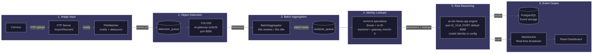

# Video Analytics Guide

Comprehensive guide to the AI-powered video analytics features in Home Security Intelligence.

> **R8 (2026-09-29).** The legacy enrichment/LLM tier retired: the
> `ai-llm` Nemotron service and the gateway's `/florence`, `/clip` and
> `/enrichment` routers are deleted, and with them the Florence captioning,
> SigLIP anomaly embeddings, pose, demographics, clothing and vehicle-classifier
> features this guide documented (the S5 slice also removed their dashboard
> panels). What ships today: YOLO26 detection + a small identity/specialist
> lane (`/enrich-lt`: threat + re-ID) + the `ai-vlm` vision-language engine.

## Overview

Home Security Intelligence runs one AI pipeline: a generalist vision-language
model reasons over what the camera saw, backed by a small lane of specialists
for the questions a single model can't be trusted to answer precisely. The
per-attribute specialist zoo (age, gender, clothing, vehicle type, pose,
action, pet, depth) is retired — the VLM describes what it sees instead of
re-perceiving it with one model per attribute (ledger ruling D5: model
identity is config).

### Key Capabilities

| Feature                 | Description                                   | Serves it                               |
| ----------------------- | --------------------------------------------- | --------------------------------------- |
| **Object Detection**    | Detect people, vehicles, animals, and objects | YOLO26 (`/yolo26`)                      |
| **Scene Understanding** | Describe and assess each event visually       | `ai-vlm` engine (identity is config)    |
| **Threat Detection**    | Identify weapons and dangerous items          | Threat-Detection-YOLOv8n (`/enrich-lt`) |
| **Person Re-ID**        | Embeddings matched against your registrations | OSNet-AIN x1.0 (`/enrich-lt`)           |
| **Anomaly Detection**   | Compare against learned per-zone baselines    | backend statistical baselines           |
| **Risk Assessment**     | VLM-based contextual risk analysis            | `ai-vlm` engine                         |

---

## Architecture

### Detection Pipeline

```
Camera Upload -> File Watcher -> Object Detection -> Batch Aggregator -> VLM Reasoning -> Event
     (1)            (2)              (3)                  (4)                (5)         (6)
```


```mermaid
%%{init: {
  'theme': 'dark',
  'themeVariables': {
    'primaryColor': '#3B82F6',
    'primaryTextColor': '#FFFFFF',
    'primaryBorderColor': '#60A5FA',
    'secondaryColor': '#A855F7',
    'tertiaryColor': '#009688',
    'background': '#121212',
    'mainBkg': '#1a1a2e',
    'lineColor': '#666666'
  }
}}%%
flowchart LR
    subgraph Input["1. Image Input"]
        CAM[Camera]
        FTP[FTP Server<br/>/export/foscam/]
        FW[FileWatcher<br/>inotify + debounce]
    end

    subgraph Detection["2. Object Detection"]
        DQ[(detection_queue)]
        YOLO[YOLO26<br/>ai-gateway /yolo26<br/>port 8090]
    end

    subgraph Batching["3. Batch Aggregation"]
        BA[BatchAggregator<br/>90s window / 30s idle]
        AQ[(analysis_queue)]
    end

    subgraph Lookups["4. Identity Lookups"]
        LT[enrich-lt specialists<br/>threat + re-ID<br/>backend + gateway /enrich-lt]
    end

    subgraph Analysis["5. Risk Reasoning"]
        VLM[ai-vlm llama.cpp engine<br/>port AI_VLM_PORT default 8098<br/>model identity is config]
    end

    subgraph Output["6. Event Output"]
        DB[(PostgreSQL<br/>Event storage)]
        WS[WebSocket<br/>Real-time broadcast]
        UI[React Dashboard]
    end

    CAM -->|FTP upload| FTP
    FTP -->|inotify| FW
    FW -->|queue job| DQ
    DQ --> YOLO
    YOLO -->|detections| BA
    BA -->|batch ready| AQ
    AQ --> LT
    LT -->|detections + lookups| VLM
    VLM -->|verdict| DB
    VLM -->|event| WS
    WS --> UI
```

1. **Camera Upload**: Cameras upload images via FTP to `/export/foscam/{camera_name}/`
2. **File Watcher**: Monitors directories for new images with deduplication
3. **Object Detection**: YOLO26 identifies objects and their bounding boxes
4. **Batch Aggregator**: Groups detections into 90-second time windows
5. **Identity Lookups**: re-ID embeddings and the weapon detector run on the
   specialist lane; the VLM prompt is built from the batch and its detections
6. **Risk Reasoning**: The `ai-vlm` engine describes the scene and returns the
   verdict (risk score + summary)
7. **Event Creation**: Security events are created and broadcast via WebSocket

> Note: as of this writing the shipped backend builds the VLM prompt from the
> batch itself; nothing in the event path calls `/enrich-lt/threat-detect` or
> `/enrich-lt/person-reid` — those endpoints are live on the gateway (served,
> health-checked, and pinned by the `ai_contract` tier) but their per-event
> callers retired with the enrichment tier. re-ID matching still runs
> (`reid_service.py`) on embeddings from its own loader.

### Where the Models Run

Two GPU services (see `docker-compose.prod.yml`):

| Service                                                       | What runs                                                                                                                                                                                                                                                                                                                                         |
| ------------------------------------------------------------- | ------------------------------------------------------------------------------------------------------------------------------------------------------------------------------------------------------------------------------------------------------------------------------------------------------------------------------------------------- |
| `ai-gateway` (port 8090)                                      | FastAPI front for a Triton Inference Server in the same container. Exactly two routers: `/yolo26` (detection, segmentation) and `/enrich-lt` (`/threat-detect`, `/person-reid`). `GATEWAY_MODEL_SET` resolves only `vlm` — any other value hard-raises. Triton loads its models at container start; the compose healthcheck allows three minutes. |
| `ai-vlm` (`AI_VLM_PORT`, default 8098; compose profile `vlm`) | llama.cpp serving the configured GGUF pair (`VLM_MODEL_PATH` + `VLM_MMPROJ_PATH`). The backend soft-depends only: with the profile off the stack boots and events degrade (no verdicts) instead of failing.                                                                                                                                       |

The retired lanes — `/florence`, `/clip`, `/enrichment`, and the `ai-llm`
(:8091) / enrichment (:8094, :8096) containers — no longer exist in any
compose file.

### Models Used Per Analysis Step

Per-model VRAM from `models.yml` (the live catalogue; retired rows deleted):

| Model                    | Purpose                       | VRAM (MB)           | Where it runs        |
| ------------------------ | ----------------------------- | ------------------- | -------------------- |
| yolo26                   | Object detection              | 0 (Triton-resident) | gateway `/yolo26`    |
| threat-detection-yolov8n | Weapon detection              | 300                 | gateway `/enrich-lt` |
| osnet-ain-x1-0           | Person re-identification      | 100                 | gateway `/enrich-lt` |
| yolo11-face              | Face detection on crops       | 200                 | backend model zoo    |
| face-detector-scrfd      | Face detection (CPU)          | 0 (CPU)             | backend model zoo    |
| face-recognizer          | Face matching (CPU)           | 0 (CPU)             | backend model zoo    |
| yolo11-license-plate     | Plate detection               | 300                 | backend model zoo    |
| fast-alpr                | Plate read (end-to-end)       | 28                  | backend model zoo    |
| paddleocr                | Plate read (fallback OCR)     | 100                 | backend model zoo    |
| yolo26-general           | Alternate detector (disabled) | 400                 | backend model zoo    |

The old heavy/light task switches are gone too: R8 S3 deleted the nine
`ENRICHMENT_*_SERVICE` variables (see the note at `.env.example:337`) — there
is one lane and no routing choice left.

---

## Object Detection

### YOLO26 Detection

The primary object detector uses YOLO26 for fast, accurate detection. Run the
requests against the AI gateway, not a standalone detector container:

```bash
# Check detector health
curl http://localhost:8090/yolo26/health

# Single-image detection (multipart upload)
curl -F "file=@frame.jpg" http://localhost:8090/yolo26/detect

# Batch detection
curl -F "files=@a.jpg" -F "files=@b.jpg" http://localhost:8090/yolo26/detect/batch
```

**Detected Object Classes:**

- **People**: person
- **Vehicles**: car, truck, bus, motorcycle, bicycle
- **Animals**: dog, cat, bird
- **Objects**: backpack, handbag, suitcase, umbrella
- And 80+ COCO classes

**Detection Response:**

```json
{
  "detections": [
    {
      "class": "person",
      "confidence": 0.9214,
      "bbox": { "x": 120, "y": 80, "width": 160, "height": 370 }
    }
  ],
  "image_width": 1920,
  "image_height": 1080,
  "inference_time_ms": 5.76
}
```

### Detection Filtering

Detections are filtered by:

- **Confidence threshold**: Minimum confidence to keep a detection. `.env.example` ships `DETECTION_CONFIDENCE_THRESHOLD=0.5`; classes listed in `DETECTION_CLASS_THRESHOLDS` use their own value instead (for example `person` 0.40, `car` 0.50, `bus` 0.55)
- **Object classes**: Filter to security-relevant objects
- **Zone filtering**: Only process detections in defined zones

---

## Scene Understanding

### VLM Captioning and Reasoning

Scene description moved from the retired Florence adapter to the shipped
`ai-vlm` llama.cpp engine: the analyzer (`backend/services/vlm_analyzer.py`,
built only through `build_pipeline_analyzer`) builds one prompt per batch —
the key frames plus their detections — and the engine answers with the scene
description and the risk verdict in one pass. Model identity is operator
config (`VLM_MODEL_PATH` / `VLM_MMPROJ_PATH`); this guide names no model.

Inspect the prompt and response a finished event produced:

```bash
curl http://localhost:8000/api/llm-reasoning/events/{event_id}
```

---

## Anomaly Detection

### Zone Baseline Comparison

The system learns normal activity patterns per zone and flags deviations from
them (`backend/services/zone_anomaly_service.py`). Baselines are statistical —
per-zone metric distributions, not embeddings (the retired SigLIP lane
contributed nothing to them):

1. Detections accumulate into per-zone baselines
2. Each new detection is scored against the baseline in standard deviations
3. A deviation past the threshold raises an anomaly (severity: >= 3.0 std is
   WARNING, >= 4.0 std is CRITICAL)

**Baseline Metrics:**

| Metric                  | Description                            |
| ----------------------- | -------------------------------------- |
| `hourly_pattern`        | Expected activity by hour (24 buckets) |
| `day_of_week_pattern`   | Expected activity by day (7 buckets)   |
| `typical_dwell_time`    | Average time objects stay in view      |
| `typical_crossing_rate` | Expected zone crossings per hour       |

**Anomaly Checks** (all three compare in standard deviations against the
baseline; default trigger is 2.0 std):

- **Unusual time**: detection at an hour the zone is normally quiet
- **Unusual frequency**: a spike or drop in recent detections for the zone
- **Unusual dwell**: an object in view far longer than the zone typical

New people and vehicles are handled separately, by household matching and face
recognition — see [Face Recognition Guide](face-recognition.md).

### Baseline Visualization

The dashboard provides four visualization components for understanding learned activity patterns:

#### 24-Hour Activity Pattern (HourlyPatternChart)

A line chart showing average detections for each hour of the day (0-23):

- **Green line**: Average detections per hour
- **Shaded band**: Confidence interval (+/- 1 standard deviation)
- **Orange dot**: Peak activity hour
- **Point opacity**: Data quality indicator (more samples = more opaque)

**Interpreting the chart:**

- Full opacity points have 20+ samples (high confidence)
- Faded points have fewer samples (still learning)
- Hover over points to see exact values and sample counts

#### Weekly Activity Pattern (DailyPatternChart)

A bar chart showing activity levels for each day of the week:

- **Bar height**: Average detections for that day
- **Bar color intensity**: Activity level relative to the busiest day
- **Orange dot on bar**: Peak hour for that day
- **Weekend bars**: Highlighted in blue

**Interpreting the chart:**

- Hover over bars to see average detections, peak hour, and total samples
- "Busiest day" and "Quietest day" badges identify patterns

#### Current Deviation Status (BaselineDeviationCard)

A color-coded card showing how current activity compares to baseline:

| Color  | Interpretation           | Deviation Range      |
| ------ | ------------------------ | -------------------- |
| Blue   | Far below / Below normal | < -1.0 std dev       |
| Green  | Normal                   | -1.0 to +1.0 std dev |
| Yellow | Slightly above normal    | +1.0 to +2.0 std dev |
| Orange | Above normal             | +2.0 to +3.0 std dev |
| Red    | Far above normal         | >= +3.0 std dev      |

The "far below" and "below normal" bands split again at -2.0 std; both render
in blue.

The card displays:

- **Deviation score**: Number of standard deviations from baseline
- **Contributing factors**: What's causing the deviation (e.g., "high_person_count")
- **Last updated**: When the deviation was calculated

#### Object Baseline Chart (ObjectBaselineChart)

Per-class detection statistics showing frequency patterns by object type:

- **Grouped bars per class**: Average hourly rate, peak hour, total detections
- **Color-coded by class**: Person (blue), Vehicle (green), Animal (orange), etc.
- **Sort options**: By frequency, total detections, peak hour, or alphabetically

### Baseline Tuning

For per-camera baseline configuration, see the **Baseline Tuning Panel** in the camera settings:

- **Sensitivity threshold**: Adjusts how many standard deviations trigger an anomaly (0.5-5.0)
- **Minimum samples**: Sets how many data points are needed before detection is reliable
- **Reset baseline**: Clears all learned data to start fresh

API endpoints for programmatic control are documented in [Baseline Configuration API](../api/analytics-endpoints.md#baseline-configuration-api).

---

## Person Analysis

> Retired with R8: pose estimation (yolov8n-pose posture alerts,
> `enrich-lt/pose-analyze`), demographics (`enrichment/demographics`, and its
> table dropped by R8 S4), and clothing analysis (Marqo FashionSigLIP,
> `enrichment/clothing-classify`). The VLM path describes what it sees;
> demographic or clothing labels are prompt-level output, not per-attribute
> model columns. The dashboard's enrichment panels retired with them (R8 S5).

### Person Re-Identification

`POST http://localhost:8090/enrich-lt/person-reid` runs OSNet-AIN x1.0 and
returns a normalized 512-dimensional embedding for tracking across cameras:

```json
{
  "embedding": [0.0123, -0.0341, 0.0187],
  "embedding_dimension": 512,
  "inference_time_ms": 8.9
}
```

Matching and match thresholds are applied in the backend
(`backend/services/reid_service.py`), not by the gateway.

**Use Cases:**

- Track individuals across multiple cameras
- Identify repeat visitors
- Link detections to known household members

---

## Vehicle Analysis

> Retired with R8: the MIO-TCD vehicle classifier
> (`enrichment/vehicle-classify`). Vehicle _detection_ (class + box) is YOLO26's
> job and unaffected.

### License Plate Detection

The enrichment pipeline prefers FastALPR (end-to-end detection plus OCR,
`backend/services/fast_alpr_loader.py`). When FastALPR is unavailable it falls
back to yolo11-license-plate detection followed by PaddleOCR. Either path
produces plate text plus a box for the pipeline's `license_plates` list:

```json
{
  "license_plates": [
    {
      "text": "ABC 1234",
      "ocr_confidence": 0.88,
      "bbox": { "x": 100, "y": 200, "width": 100, "height": 40 }
    }
  ]
}
```

---

## Threat Detection

### Weapon Detection

`POST http://localhost:8090/enrich-lt/threat-detect` runs
threat-detection-yolov8n:

```json
{
  "threats_detected": [
    {
      "class": "knife",
      "confidence": 0.85,
      "bbox": { "x": 150, "y": 200, "width": 30, "height": 80 }
    }
  ],
  "is_threat": true,
  "max_confidence": 0.85,
  "inference_time_ms": 9.1
}
```

**Detection classes the gateway post-processes:** `knife`, `pistol`, `rifle`,
`threat_object`. The backend maps threat types to alert severity in
`backend/services/threat_monitor_service.py` (`get_threat_severity`: firearms —
gun/pistol/rifle/handgun — are CRITICAL, bladed weapons HIGH, and so on; the
category enum lives in `backend/services/threat_categories.py`).

---

## Risk Assessment

### VLM Analysis

Risk reasoning runs on the `ai-vlm` llama.cpp engine — compose profile `vlm`,
host port `AI_VLM_PORT` (default 8098); model identity is config
(`VLM_MODEL_PATH`/`VLM_MMPROJ_PATH`, D5). The optional `vllm` compose profile
exists for benchmarking (`ai-llm-vllm`), not for serving events. Inspect a
finished event's prompt and response through the backend at
`/api/llm-reasoning/events/{event_id}`.

**Input Context:**

- The batch's key frames (stills) and their detections
- Zone information and types
- Household member matching (face/re-ID lookups)
- Time of day and baseline context

**Output:**

```json
{
  "risk_score": 45,
  "risk_level": "medium",
  "summary": "Unknown person approached front door at unusual hour",
  "reasoning": "Activity at 2:14 AM when no family members are expected...",
  "recommended_actions": ["Review footage", "Check if visitor expected"]
}
```

**Risk Score Mapping:**

| Score  | Level    | Color  | Action                 |
| ------ | -------- | ------ | ---------------------- |
| 0-29   | Low      | Green  | Informational only     |
| 30-59  | Medium   | Yellow | Review when convenient |
| 60-84  | High     | Orange | Prompt review          |
| 85-100 | Critical | Red    | Immediate attention    |

---

## API Reference

### Analytics Endpoints

| Endpoint                                 | Method | Description                       |
| ---------------------------------------- | ------ | --------------------------------- |
| `/api/analytics/detection-trends`        | GET    | Daily detection counts            |
| `/api/analytics/risk-history`            | GET    | Risk level distribution over time |
| `/api/analytics/camera-uptime`           | GET    | Uptime percentage per camera      |
| `/api/analytics/object-distribution`     | GET    | Detection counts by object type   |
| `/api/analytics/risk-score-distribution` | GET    | Risk score histogram              |
| `/api/analytics/risk-score-trends`       | GET    | Average risk score over time      |

### Query Parameters

All analytics endpoints accept:

| Parameter    | Type   | Description                       |
| ------------ | ------ | --------------------------------- |
| `start_date` | Date   | Start date (ISO format, required) |
| `end_date`   | Date   | End date (ISO format, required)   |
| `camera_id`  | String | Filter by camera (optional)       |

### Example Request

```bash
curl "http://localhost:8000/api/analytics/detection-trends?start_date=2026-01-01&end_date=2026-01-26"
```

### Response Format

```json
{
  "data_points": [
    { "date": "2026-01-01", "count": 156 },
    { "date": "2026-01-02", "count": 203 }
  ],
  "total_detections": 4521,
  "start_date": "2026-01-01",
  "end_date": "2026-01-26"
}
```

---

## Model Status API

Model status and loading go through the backend under `/api/system/models`
(`backend/api/routes/model_management.py`). Do not call gateway routers
directly for status.

```bash
# Every model in the registry, with runtime state
curl http://localhost:8000/api/system/models

# One model
curl http://localhost:8000/api/system/models/yolo11-license-plate/status

# Combined VRAM totals
curl http://localhost:8000/api/system/models/vram-summary

# Load / unload / reload
curl -X POST http://localhost:8000/api/system/models/yolo11-license-plate/load
curl -X POST http://localhost:8000/api/system/models/yolo11-license-plate/unload
curl -X POST http://localhost:8000/api/system/models/yolo11-license-plate/reload
```

`GET /api/system/models` returns one entry per registry model. Since R8 S3 the
`service` labels are lane names of the one serving lane
(`ai-enrichment-light` = the `/enrich-lt` router; `ai-gateway` = everything the
root health answers), and `service_status` carries exactly those two rows:

```json
{
  "models": [
    {
      "name": "osnet-ain-x1-0",
      "category": "embedding",
      "estimated_vram_mb": 100,
      "enabled": true,
      "service": "ai-enrichment-light",
      "gpu_id": 1,
      "runtime": {
        "loaded": true,
        "actual_vram_mb": 96,
        "last_used": "2026-09-22T10:30:00Z",
        "load_count": 5
      }
    }
  ],
  "service_status": {
    "ai-enrichment-light": "healthy",
    "ai-gateway": "healthy"
  }
}
```

`backend/api/routes/system.py` exposes a second, simpler pair: `GET
/api/system/models` for names and `GET /api/system/models/{model_name}` for one
model. `model_management.py` is registered first, so it answers the bare
`/api/system/models` request.

---

## Best Practices

### Optimizing Detection Quality

1. **Camera Placement**: Ensure cameras have clear views of entry points
2. **Lighting**: Good lighting improves detection accuracy
3. **Resolution**: Higher resolution enables better detail extraction
4. **Zone Configuration**: Focus analysis on important areas

### Managing VRAM

1. **VLM sizing**: `VLM_GPU_LAYERS=auto` (default) fits the engine to the card;
   set an explicit layer count to reserve headroom for the gateway
2. **Preloading**: Preload expected models before high-activity periods
3. **Monitoring**: Watch VRAM utilization via `/api/system/models/vram-summary`

### Reducing False Positives

1. **Zone Configuration**: Exclude high-motion areas (trees, roads)
2. **Household Registration**: Add known people and vehicles
3. **Baseline Learning**: Allow system to learn normal patterns
4. **Feedback**: Use the feedback system to improve calibration

---

## Troubleshooting

### No Detections

1. Check camera is uploading to correct directory
2. Verify file watcher is running: `curl http://localhost:8000/api/system/pipeline`
3. Check the AI gateway: `curl http://localhost:8090/yolo26/health`
4. Review detection queue depth in system telemetry

### Slow Analysis

1. Check GPU utilization: `curl http://localhost:8000/api/system/gpu`
2. Review pipeline latency: `curl http://localhost:8000/api/system/pipeline-latency`
3. Consider adjusting batch window settings
4. Check for VRAM pressure in model status

### Inaccurate Risk Scores

1. Review recent events for patterns
2. Check zone configuration is accurate
3. Register household members to reduce false positives
4. Allow baseline learning time (7+ days recommended)

---

## Related Documentation

- [Zone Configuration Guide](zone-configuration.md) - Configure detection zones
- [Face Recognition Guide](face-recognition.md) - Person identification
- [Analytics Endpoints](../api/analytics-endpoints.md) - API reference
- [AI Performance](../ui/ai-performance.md) - Model monitoring
