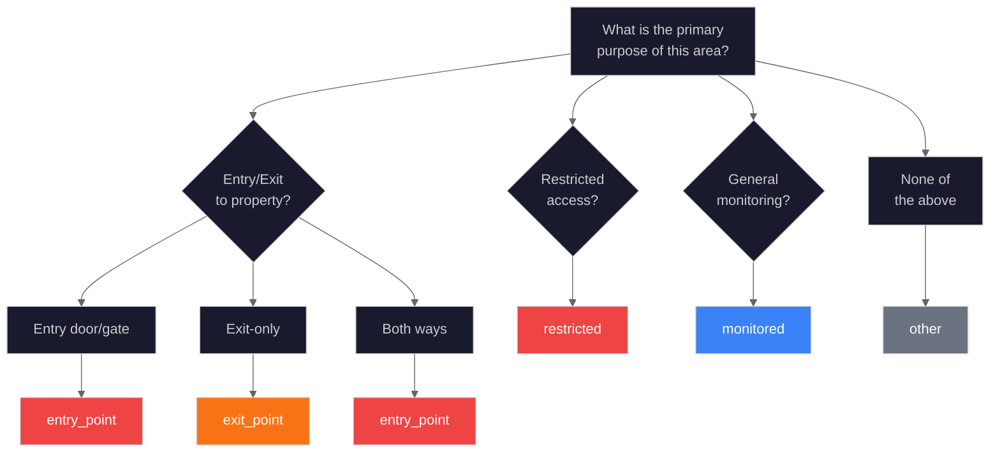
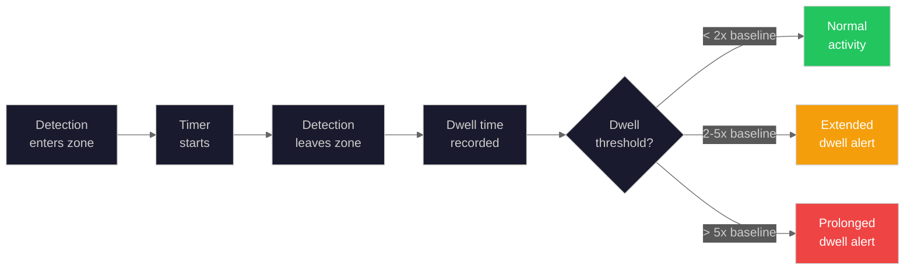
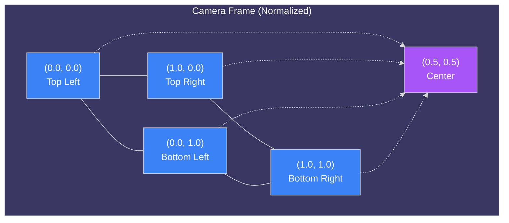

# Zone Configuration Guide

Complete guide to configuring and using detection zones for focused security monitoring.

## Overview

Detection zones allow you to define specific regions within camera views for targeted AI analysis. Instead of processing the entire frame equally, zones help the AI prioritize activity in designated areas like entry points, driveways, and restricted areas.

### Benefits of Using Zones

| Benefit                     | Description                                    |
| --------------------------- | ---------------------------------------------- |
| **Reduced false positives** | Ignore motion from roads, sidewalks, trees     |
| **Prioritized alerts**      | Higher-priority notifications for entry points |
| **Organized detections**    | See which zone triggered each detection        |
| **Custom sensitivity**      | Different importance levels per area           |
| **Household integration**   | Link zones to household members                |
| **Activity tracking**       | Monitor dwell time and crossing events         |

---

## Zone Types

Each zone has a type that affects AI behavior and alert prioritization:

| Type          | Color  | Best For                         | Alert Priority |
| ------------- | ------ | -------------------------------- | -------------- |
| `entry_point` | Red    | Doors, gates, garage entries     | Highest        |
| `exit_point`  | Orange | Exit-only areas, emergency exits | High           |
| `restricted`  | Red    | Off-limits areas, secure zones   | Highest        |
| `monitored`   | Blue   | General monitored areas          | Medium         |
| `other`       | Gray   | Miscellaneous areas              | Low            |

### Zone Type Decision Tree



---

## Creating Zones

### Using the Zone Editor

1. Navigate to **Settings > Cameras**
2. Click the map pin icon on the camera card
3. The Zone Editor opens with camera snapshot

### Drawing Rectangle Zones (Recommended)

Best for most use cases:

1. Click the **Rectangle** button in the toolbar
2. Click and hold at one corner
3. Drag to the opposite corner
4. Release to complete
5. Configure zone settings in the form

### Drawing Polygon Zones

For irregular areas:

1. Click the **Polygon** button
2. Click to place each vertex point
3. Continue clicking to add points
4. Double-click to close the shape
5. Configure zone settings

### Zone Form Settings

| Field        | Requirements         | Example            |
| ------------ | -------------------- | ------------------ |
| **Name**     | 1-50 characters      | "Front Door Entry" |
| **Type**     | Select from dropdown | entry_point        |
| **Color**    | Choose from 8 colors | Red (#EF4444)      |
| **Priority** | 0-100 slider         | 90                 |
| **Enabled**  | Toggle on/off        | Enabled            |

### Priority Guidelines

| Priority | Usage                               |
| -------- | ----------------------------------- |
| 0-30     | Informational zones, low importance |
| 31-60    | Standard monitoring, routine areas  |
| 61-85    | Important areas, approach zones     |
| 86-100   | Critical areas, entry points        |

---

## Zone Intelligence Features

### Dwell Time Tracking

The system tracks how long objects remain in zones:



**Dwell Time Alerts:**

- Normal dwell: No alert
- Extended dwell (2x baseline): Medium alert
- Prolonged dwell (5x baseline): High alert

**Configuration:**

```json
{
  "dwell_threshold_seconds": 30,
  "extended_dwell_multiplier": 2.0,
  "prolonged_dwell_multiplier": 5.0
}
```

### Line Crossing Detection

Detects when objects cross zone boundaries:

| Event          | Description                           |
| -------------- | ------------------------------------- |
| `zone.entered` | Object crossed from outside to inside |
| `zone.exited`  | Object crossed from inside to outside |

**WebSocket Events:**

```json
{
  "type": "zone.entered",
  "data": {
    "zone_id": "uuid",
    "zone_name": "Front Door",
    "zone_type": "entry_point",
    "entity_type": "person",
    "timestamp": "2026-01-26T14:30:00Z"
  }
}
```

### Approach Vector Calculation

The system calculates if objects are approaching zones:

```json
{
  "is_approaching": true,
  "direction_degrees": 45.0,
  "speed_normalized": 0.02,
  "distance_to_zone": 0.15,
  "estimated_arrival_seconds": 7.5
}
```

**Direction Convention:**

- 0 degrees = Moving up (toward top of frame)
- 90 degrees = Moving right
- 180 degrees = Moving down
- 270 degrees = Moving left

---

## Household Integration

### Zone Ownership

Assign zones to household members:

```json
{
  "zone_id": "uuid",
  "owner_id": "member-uuid",
  "allowed_member_ids": ["member-1", "member-2"],
  "allowed_vehicle_ids": ["vehicle-1"]
}
```

**Owner Benefits:**

- Receives all notifications for this zone
- Can customize zone-specific alert settings
- Visual badge shows owner avatar

### Trust Configuration

Configure who triggers alerts in which zones:

| Trust Level       | Behavior                                  |
| ----------------- | ----------------------------------------- |
| **Full Trust**    | No alerts (family members)                |
| **Partial Trust** | Alerts outside schedule (service workers) |
| **Monitor**       | Log only, no notifications                |
| **Unknown**       | Full alerts based on zone type            |

**Trust Matrix Example:**

```
                    | Driveway | Front Door | Backyard | Garage |
--------------------|----------|------------|----------|--------|
Family (full trust) |    OK    |     OK     |    OK    |   OK   |
Service (partial)   |    OK    |     OK     | 9-5 only |  ALERT |
Unknown             |  ALERT   |   ALERT    |  ALERT   | ALERT  |
```

### Schedule-Based Access

Configure time-based trust rules:

```json
{
  "member_ids": ["service-worker-1"],
  "schedule": {
    "days": ["monday", "tuesday", "wednesday", "thursday", "friday"],
    "start_time": "09:00",
    "end_time": "17:00",
    "timezone": "America/New_York"
  }
}
```

---

## Zone API Reference

### List Zones

```bash
GET /api/cameras/{camera_id}/zones
```

**Query Parameters:**

| Parameter | Type    | Description              |
| --------- | ------- | ------------------------ |
| `enabled` | Boolean | Filter by enabled status |

**Response:**

```json
{
  "zones": [
    {
      "id": "uuid",
      "camera_id": "front_door",
      "name": "Front Porch",
      "zone_type": "entry_point",
      "shape": "rectangle",
      "coordinates": [
        [0.1, 0.2],
        [0.9, 0.2],
        [0.9, 0.8],
        [0.1, 0.8]
      ],
      "color": "#EF4444",
      "priority": 90,
      "enabled": true,
      "created_at": "2026-01-15T10:00:00Z"
    }
  ]
}
```

### Create Zone

```bash
POST /api/cameras/{camera_id}/zones
Content-Type: application/json

{
  "name": "Front Porch",
  "zone_type": "entry_point",
  "shape": "rectangle",
  "coordinates": [[0.1, 0.2], [0.9, 0.2], [0.9, 0.8], [0.1, 0.8]],
  "color": "#EF4444",
  "priority": 90,
  "enabled": true
}
```

### Update Zone

```bash
PUT /api/cameras/{camera_id}/zones/{zone_id}
Content-Type: application/json

{
  "name": "Updated Name",
  "priority": 95
}
```

### Delete Zone

```bash
DELETE /api/cameras/{camera_id}/zones/{zone_id}
```

### Zone Household Config

```bash
# Get household config for zone
GET /api/zones/{zone_id}/household

# Update household config
PUT /api/zones/{zone_id}/household
{
  "owner_id": "member-uuid",
  "allowed_member_ids": ["member-1", "member-2"]
}
```

---

## Zone Baseline API

> **Note:** The Zone Baseline API is not yet implemented. The database model (`zone_activity_baselines` table) exists, but the REST API endpoints are planned for a future release. See NEM-4064 for tracking.

### Get Zone Baseline (Planned)

```bash
GET /api/zones/{zone_id}/baseline
```

**Planned Response:**

```json
{
  "zone_id": "uuid",
  "hourly_pattern": [2, 1, 0, 0, 0, 1, 5, 12, 15, 10, 8, 7, ...],
  "day_of_week_pattern": [45, 52, 48, 50, 55, 62, 58],
  "typical_dwell_time": 15.5,
  "typical_crossing_rate": 4.2,
  "baseline_computed_at": "2026-01-25T00:00:00Z"
}
```

### Zone Anomalies (Planned)

```bash
GET /api/zones/{zone_id}/anomalies
?start_date=2026-01-20&end_date=2026-01-26
```

**Response:**

```json
{
  "anomalies": [
    {
      "type": "unusual_time",
      "zone_id": "uuid",
      "deviation": 3.2,
      "description": "Activity at 3:14am - typically no activity 1-6am",
      "detected_at": "2026-01-25T03:14:00Z"
    }
  ]
}
```

---

## Coordinate System

Zones use **normalized coordinates** (0.0 to 1.0):



**Why Normalized?**

Zones work regardless of camera resolution. A zone at (0.2, 0.3) to (0.8, 0.7) covers the same relative area whether your camera is 720p or 4K.

**Coordinate Validation:**

- All coordinates must be between 0.0 and 1.0
- Minimum 3 vertices for polygon zones
- Coordinates should form a valid, non-self-intersecting shape

---

## Example Zone Configurations

### Front Door Camera

```json
[
  {
    "name": "Front Door",
    "zone_type": "entry_point",
    "priority": 95,
    "color": "#EF4444",
    "rationale": "Critical - direct entry point"
  },
  {
    "name": "Front Porch",
    "zone_type": "entry_point",
    "priority": 80,
    "color": "#EF4444",
    "rationale": "High priority approach area"
  },
  {
    "name": "Front Walk",
    "zone_type": "monitored",
    "priority": 50,
    "color": "#3B82F6",
    "rationale": "Standard foot traffic monitoring"
  }
]
```

### Driveway Camera

```json
[
  {
    "name": "Garage Door",
    "zone_type": "entry_point",
    "priority": 90,
    "color": "#EF4444",
    "rationale": "Critical access point"
  },
  {
    "name": "Driveway",
    "zone_type": "monitored",
    "priority": 60,
    "color": "#F59E0B",
    "rationale": "Vehicle activity monitoring"
  }
]
```

### Backyard Camera

```json
[
  {
    "name": "Back Door",
    "zone_type": "entry_point",
    "priority": 95,
    "color": "#EF4444",
    "rationale": "Critical entry point"
  },
  {
    "name": "Pool Area",
    "zone_type": "restricted",
    "priority": 90,
    "color": "#EF4444",
    "rationale": "Safety critical - child/pet alert"
  },
  {
    "name": "Fence Line",
    "zone_type": "monitored",
    "priority": 75,
    "color": "#10B981",
    "rationale": "Perimeter breach detection"
  },
  {
    "name": "Patio",
    "zone_type": "other",
    "priority": 40,
    "color": "#3B82F6",
    "rationale": "Known activity area"
  }
]
```

---

## Best Practices

### Do

| Practice                  | Benefit                                 |
| ------------------------- | --------------------------------------- |
| Name zones clearly        | "Front Door Entry" vs "Zone 1"          |
| Focus on entry points     | Doors/gates deserve dedicated zones     |
| Exclude high-motion areas | Roads, tree lines, busy sidewalks       |
| Use multiple small zones  | Better precision than one large zone    |
| Test and iterate          | Review detections, adjust boundaries    |
| Set meaningful priorities | Reserve high values for critical areas  |
| Configure household       | Reduce false positives for known people |

### Don't

| Practice                  | Problem                             |
| ------------------------- | ----------------------------------- |
| Cover entire frame        | Defeats the purpose of zones        |
| Overlap zones excessively | Confuses detection attribution      |
| Set all zones to 100      | No way to prioritize                |
| Delete instead of disable | Lose zone configuration permanently |
| Ignore zone analytics     | Miss optimization opportunities     |

---

## Troubleshooting

### Zone Not Triggering

**Check:**

1. Is the zone enabled? (eye icon is open)
2. Is the zone large enough to cover the area?
3. Is the object actually within zone boundaries?
4. Is the camera online and processing?

**Fix:** Edit zone to expand boundaries or verify enabled state.

### Too Many Alerts from Zone

**Try:**

1. Shrink the zone to focus on critical area
2. Lower the zone priority
3. Check for overlapping zones
4. Add household members to reduce false positives
5. Configure trust rules for expected visitors

### Detections Not Attributed to Zones

**Check:**

1. Zone is enabled
2. Zone covers the detection location
3. Detection confidence meets threshold
4. No higher-priority overlapping zone

### Zone Appears in Wrong Position

**Causes:**

- Camera angle changed after zone creation
- Different resolution between preview and live feed

**Fix:** Delete and re-draw the zone using current camera feed.

---

## Related Documentation

- [Video Analytics Guide](video-analytics.md) - AI pipeline overview
- [Face Recognition Guide](face-recognition.md) - Person identification
- [Detection Zones UI](../ui/zones.md) - User interface guide
