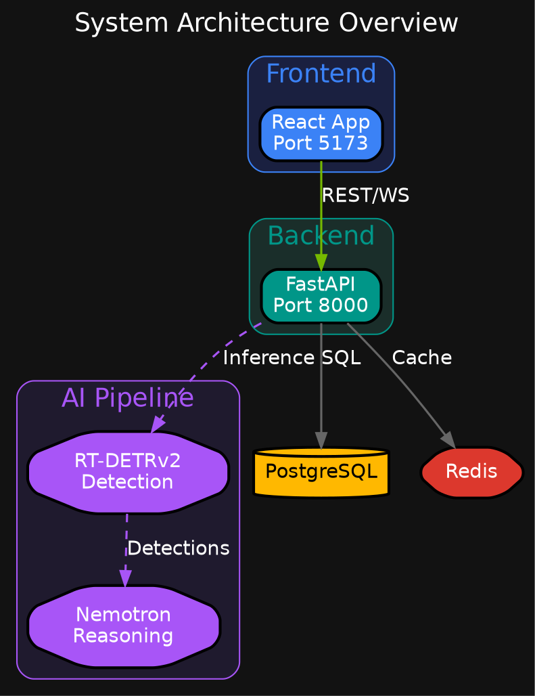
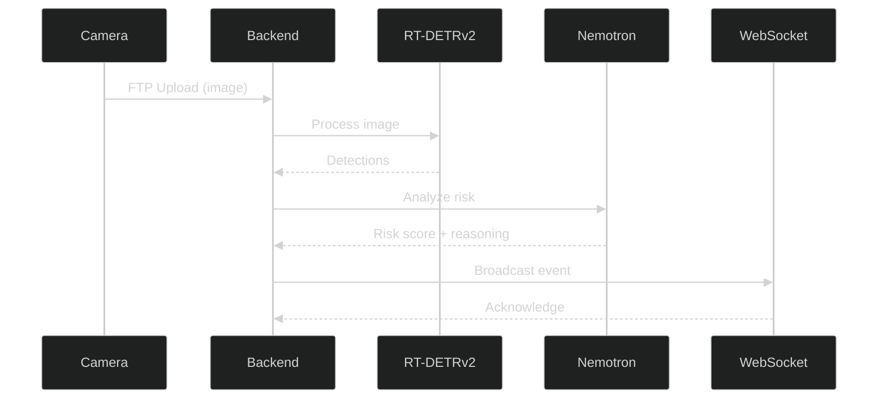

# Visual Style Guide for Documentation Diagrams

This style guide ensures visual consistency across all documentation diagrams for the Nemotron Home Security Intelligence system.

---

## Table of Contents

1. [Color Palette](#color-palette)
2. [Component Styling](#component-styling)
3. [Connection and Arrow Styles](#connection-and-arrow-styles)
4. [Typography](#typography)
5. [File Naming Convention](#file-naming-convention)
6. [Directory Structure](#directory-structure)
7. [Tool Recommendations](#tool-recommendations)
8. [Examples](#examples)

---

## Color Palette

### Primary Colors

These colors represent major system components and should be used consistently.

| Component Category | Color Name   | Hex Code  | RGB             | Usage                               |
| ------------------ | ------------ | --------- | --------------- | ----------------------------------- |
| NVIDIA Brand       | NVIDIA Green | `#76B900` | `118, 185, 0`   | Primary accent, success states, GPU |
| Frontend           | React Blue   | `#3B82F6` | `59, 130, 246`  | React components, frontend services |
| Backend            | FastAPI Teal | `#009688` | `0, 150, 136`   | Python backend, FastAPI endpoints   |
| AI/ML              | AI Purple    | `#A855F7` | `168, 85, 247`  | AI models, ML pipelines, inference  |
| Database           | DB Amber     | `#FFB800` | `255, 184, 0`   | PostgreSQL, data storage            |
| Cache              | Redis Red    | `#DC382D` | `220, 56, 45`   | Redis, caching layers               |
| Infrastructure     | Infra Gray   | `#64748B` | `100, 116, 139` | Docker, containers, infrastructure  |

### Background Colors

| Context          | Color Name | Hex Code  | Usage                             |
| ---------------- | ---------- | --------- | --------------------------------- |
| Dark Background  | Dark Base  | `#121212` | Diagram backgrounds (primary)     |
| Card Background  | Dark Card  | `#1a1a2e` | Subgraph/cluster backgrounds      |
| Alt Background   | Dark Alt   | `#0f3460` | Nested containers, emphasis areas |
| Light Background | Light Base | `#FFFFFF` | Light mode diagrams (if needed)   |

### Status Colors

Use these consistently for state representation across all diagrams.

| Status   | Color Name    | Hex Code  | Text Color | Usage                         |
| -------- | ------------- | --------- | ---------- | ----------------------------- |
| Success  | Success Green | `#4ADE80` | `#000000`  | Healthy, online, passing      |
| Warning  | Warning Amber | `#FBBF24` | `#000000`  | Degraded, pending, caution    |
| Error    | Error Red     | `#E74856` | `#FFFFFF`  | Failed, offline, critical     |
| Info     | Info Blue     | `#60A5FA` | `#FFFFFF`  | Informational, neutral states |
| Inactive | Inactive Gray | `#6B7280` | `#FFFFFF`  | Disabled, not applicable      |

### Risk Level Colors

These must be used consistently for security risk visualization.

| Risk Level | Color Name    | Hex Code  | Score Range | Usage                            |
| ---------- | ------------- | --------- | ----------- | -------------------------------- |
| Low        | Risk Low      | `#4ADE80` | 0-29        | Minimal threat, routine activity |
| Medium     | Risk Medium   | `#FBBF24` | 30-59       | Notable activity, monitor        |
| High       | Risk High     | `#F97316` | 60-84       | Significant concern, attention   |
| Critical   | Risk Critical | `#E74856` | 85-100      | Immediate threat, urgent action  |

### Cluster/Subgraph Background Colors

For grouped components, use semi-transparent or muted versions.

| Cluster Type   | Border Color | Fill Color | Usage                        |
| -------------- | ------------ | ---------- | ---------------------------- |
| Frontend Group | `#3B82F6`    | `#1a2040`  | React/UI component groupings |
| Backend Group  | `#009688`    | `#1a2e2a`  | API/service groupings        |
| AI Pipeline    | `#A855F7`    | `#1f1a2e`  | ML model groupings           |
| Data Layer     | `#FFB800`    | `#2e2a1a`  | Database/storage groupings   |
| Infrastructure | `#64748B`    | `#1a1a1a`  | Docker/container groupings   |

---

## Component Styling

### Frontend Components (React/TypeScript)

```
Shape: Rounded rectangle (box with rounded corners)
Fill: #3B82F6 (React Blue)
Border: 2px solid #60A5FA
Text: White (#FFFFFF)
Font: Helvetica or Inter, 12pt
```

**Graphviz example:**

```dot
node [shape=box, style="filled,rounded", fillcolor="#3B82F6",
      fontcolor="white", color="#60A5FA", penwidth=2];
```

**Subcategories:**
| Component | Modifier | Example Labels |
| ------------------ | --------------------------- | --------------------------------- |
| Page Component | Larger size, bold text | `Dashboard`, `Timeline` |
| UI Component | Standard size | `RiskGauge`, `CameraGrid` |
| Hook | Italic text | `useEvents`, `useWebSocket` |
| Context/Provider | Dashed border | `EventContext`, `AuthProvider` |

### Backend Services (Python FastAPI)

```
Shape: Rectangle with sharp corners
Fill: #009688 (FastAPI Teal)
Border: 2px solid #14B8A6
Text: White (#FFFFFF)
Font: Helvetica or Inter, 12pt
```

**Graphviz example:**

```dot
node [shape=box, style="filled", fillcolor="#009688",
      fontcolor="white", color="#14B8A6", penwidth=2];
```

**Subcategories:**
| Component | Modifier | Example Labels |
| ------------------ | --------------------------- | --------------------------------- |
| API Router | Standard rectangle | `/api/events`, `/api/cameras` |
| Service Layer | Double border | `EventService`, `DetectionService`|
| Background Task | Dashed fill pattern | `BatchAggregator`, `CleanupJob` |
| Middleware | Hexagon shape | `RateLimiter`, `CORSMiddleware` |

### Databases (PostgreSQL, SQLite)

```
Shape: Cylinder (3D database shape)
Fill: #FFB800 (DB Amber)
Border: 2px solid #F59E0B
Text: Black (#000000)
Font: Helvetica or Inter, 12pt bold
```

**Graphviz example:**

```dot
node [shape=cylinder, style="filled", fillcolor="#FFB800",
      fontcolor="black", color="#F59E0B", penwidth=2];
```

### Cache Layer (Redis)

```
Shape: Parallelogram or hexagon
Fill: #DC382D (Redis Red)
Border: 2px solid #EF4444
Text: White (#FFFFFF)
Font: Helvetica or Inter, 12pt
```

**Graphviz example:**

```dot
node [shape=hexagon, style="filled", fillcolor="#DC382D",
      fontcolor="white", color="#EF4444", penwidth=2];
```

### AI Models

```
Shape: Octagon or diamond
Fill: #A855F7 (AI Purple)
Border: 2px solid #C084FC
Text: White (#FFFFFF)
Font: Helvetica or Inter, 12pt bold
```

**Graphviz example:**

```dot
node [shape=octagon, style="filled", fillcolor="#A855F7",
      fontcolor="white", color="#C084FC", penwidth=2];
```

**Specific Models:**
| Model | Additional Styling | Label Format |
| ------------------ | --------------------------- | --------------------------------- |
| RT-DETRv2 | Green accent glow | `RT-DETRv2\nObject Detection` |
| Florence-2 | Blue accent glow | `Florence-2\nImage Captioning` |
| Nemotron | Purple accent glow | `Nemotron\nRisk Reasoning` |

### External Systems

```
Shape: Cloud or house shape
Fill: #64748B (Infra Gray)
Border: 2px dashed #94A3B8
Text: White (#FFFFFF)
Font: Helvetica or Inter, 12pt
```

**Graphviz example:**

```dot
node [shape=cloud, style="filled,dashed", fillcolor="#64748B",
      fontcolor="white", color="#94A3B8", penwidth=2];
```

**Subcategories:**
| System | Shape | Example Labels |
| ------------------ | --------------------------- | --------------------------------- |
| Camera/IoT | House shape | `Foscam Camera`, `FTP Server` |
| Filesystem | Folder shape | `/export/foscam/`, `Media Storage`|
| External API | Cloud shape | `SMTP Server`, `Webhook Endpoint` |
| Browser/Client | Monitor/screen shape | `Web Browser`, `Mobile App` |

### Queues and Message Passing

```
Shape: Queue (parallelogram or trapezoid)
Fill: #F97316 (Orange)
Border: 2px solid #FB923C
Text: White (#FFFFFF)
Font: Helvetica or Inter, 11pt
```

**Graphviz example:**

```dot
node [shape=parallelogram, style="filled", fillcolor="#F97316",
      fontcolor="white", color="#FB923C", penwidth=2];
```

**Queue Types:**
| Queue Type | Modifier | Example Labels |
| ------------------ | --------------------------- | --------------------------------- |
| Redis Queue | Red tint | `Detection Queue`, `Event Queue` |
| In-memory Queue | Gray tint | `Batch Buffer`, `Pending Tasks` |
| Dead Letter Queue | Error red | `DLQ`, `Failed Events` |

### Container/Infrastructure

```
Shape: Box3d or component shape
Fill: #64748B (Infra Gray)
Border: 2px solid #94A3B8
Text: White (#FFFFFF)
Font: Helvetica or Inter, 12pt
```

**Graphviz example:**

```dot
node [shape=box3d, style="filled", fillcolor="#64748B",
      fontcolor="white", color="#94A3B8", penwidth=2];
```

---

## Connection and Arrow Styles

### Synchronous Calls (Request/Response)

```
Style: Solid line
Color: #FFFFFF (white) or context-appropriate
Arrow: Filled triangle head
Width: 2px
Label: Action verb (e.g., "fetch", "query", "create")
```

**Graphviz example:**

```dot
edge [style="solid", color="white", arrowhead="normal", penwidth=2];
A -> B [label="HTTP GET"];
```

### Asynchronous/Event-Driven Flows

```
Style: Dashed line
Color: #A855F7 (AI Purple) or #F97316 (Orange)
Arrow: Open triangle head
Width: 2px
Label: Event name (e.g., "event:new_detection", "publish")
```

**Graphviz example:**

```dot
edge [style="dashed", color="#A855F7", arrowhead="open", penwidth=2];
A -> B [label="async"];
```

### Data Flow Direction

```
Style: Solid line with directional arrow
Color: #60A5FA (Info Blue)
Arrow: Normal or vee
Width: 1.5px
Label: Data type (e.g., "JSON", "Binary", "Stream")
```

**Graphviz example:**

```dot
edge [style="solid", color="#60A5FA", arrowhead="vee", penwidth=1.5];
A -> B [label="JSON payload"];
```

### Bidirectional Communication

```
Style: Solid line with arrows on both ends
Color: #76B900 (NVIDIA Green)
Arrow: Both ends (arrowhead and arrowtail)
Width: 2px
Label: Protocol (e.g., "WebSocket", "gRPC")
```

**Graphviz example:**

```dot
edge [style="solid", color="#76B900", arrowhead="normal",
      arrowtail="normal", dir="both", penwidth=2];
A -> B [label="WebSocket"];
```

### Optional/Conditional Paths

```
Style: Dotted line
Color: #6B7280 (Inactive Gray)
Arrow: Empty or open
Width: 1.5px
Label: Condition in brackets (e.g., "[if enabled]", "[optional]")
```

**Graphviz example:**

```dot
edge [style="dotted", color="#6B7280", arrowhead="empty", penwidth=1.5];
A -> B [label="[if configured]"];
```

### Error/Failure Paths

```
Style: Dashed line
Color: #E74856 (Error Red)
Arrow: Normal with X marker
Width: 2px
Label: Error type (e.g., "timeout", "failure", "reject")
```

**Graphviz example:**

```dot
edge [style="dashed", color="#E74856", arrowhead="normal", penwidth=2];
A -> B [label="on failure"];
```

### Success Paths

```
Style: Solid line
Color: #4ADE80 (Success Green)
Arrow: Normal
Width: 2px
Label: Success indicator (e.g., "success", "complete")
```

**Graphviz example:**

```dot
edge [style="solid", color="#4ADE80", arrowhead="normal", penwidth=2];
A -> B [label="success"];
```

### Edge Label Styling

| Flow Type    | Label Color | Font Style |
| ------------ | ----------- | ---------- |
| Primary flow | White       | Normal     |
| Success path | `#4ADE80`   | Normal     |
| Error path   | `#E74856`   | Normal     |
| Conditional  | `#6B7280`   | Italic     |
| Async event  | `#A855F7`   | Normal     |

---

## Typography

### Font Recommendations

| Context        | Primary Font   | Fallback  | Weight        |
| -------------- | -------------- | --------- | ------------- |
| Node Labels    | Inter          | Helvetica | Regular (400) |
| Titles         | Inter          | Helvetica | Bold (700)    |
| Edge Labels    | Inter          | Helvetica | Regular (400) |
| Code/Technical | JetBrains Mono | Consolas  | Regular (400) |
| Annotations    | Inter          | Helvetica | Light (300)   |

### Font Sizes

| Element       | Size (pt) | Usage                   |
| ------------- | --------- | ----------------------- |
| Diagram Title | 18-24     | Main diagram heading    |
| Cluster Label | 14-16     | Subgraph/group titles   |
| Node Label    | 11-13     | Component names         |
| Edge Label    | 9-11      | Connection descriptions |
| Annotation    | 8-10      | Notes, explanations     |
| Legend Text   | 10-12     | Legend entries          |

### Label Guidelines

1. **Node Labels:**

   - Use title case for component names: `Event Service`
   - Use monospace for technical identifiers: `/api/events`
   - Keep labels concise (max 3 lines)
   - Format multiline labels with `\n`

2. **Edge Labels:**

   - Use lowercase for actions: `fetch`, `query`
   - Use UPPERCASE for protocols: `HTTP`, `WS`
   - Keep to 1-2 words when possible

3. **Annotation Style:**
   - Use sentence case
   - Include version numbers where relevant
   - Add "(optional)" or "(required)" markers

### Multiline Node Label Format

```
Component Name
─────────────
Detail line 1
Detail line 2
```

**Graphviz example:**

```dot
node [label="Event Service\n─────────────\nHandles events\nManages state"];
```

---

## File Naming Convention

### Pattern

```
{category}-{diagram-name}.{extension}
```

### Category Prefixes

| Prefix    | Category                  | Example                      |
| --------- | ------------------------- | ---------------------------- |
| `arch-`   | Architecture              | `arch-system-overview.svg`   |
| `flow-`   | Process/Data flow         | `flow-ai-pipeline.svg`       |
| `seq-`    | Sequence diagram          | `seq-event-creation.svg`     |
| `state-`  | State machine             | `state-circuit-breaker.svg`  |
| `erd-`    | Entity relationship       | `erd-data-model.svg`         |
| `deploy-` | Deployment/Infrastructure | `deploy-docker-topology.svg` |
| `ui-`     | UI wireframe/mockup       | `ui-dashboard-layout.svg`    |
| `info-`   | Infographic               | `info-risk-scoring.svg`      |

### Naming Rules

1. Use lowercase letters only
2. Separate words with hyphens (`-`)
3. Be descriptive but concise
4. Include version suffix for iterations: `-v2`, `-v3`
5. Avoid special characters and spaces

### Acceptable Extensions

| Extension | Format | Use Case                     |
| --------- | ------ | ---------------------------- |
| `.svg`    | Vector | Preferred for all diagrams   |
| `.png`    | Raster | Screenshots, complex renders |
| `.dot`    | Source | Graphviz source files        |
| `.mmd`    | Source | Mermaid source files         |

### Examples

```
# Good naming
arch-system-overview.svg
flow-detection-pipeline.svg
seq-websocket-handshake.svg
state-batch-aggregator.svg
erd-event-relations.svg
deploy-container-network.svg
ui-event-modal.svg
info-risk-levels.svg

# Bad naming (avoid)
SystemOverview.svg          # No capitals
system overview.svg         # No spaces
arch_system_overview.svg    # No underscores
diagram1.svg                # Not descriptive
```

---

## Directory Structure

```
/docs/images/
├── style-guide.md              # This document
├── AGENTS.md                   # Agent navigation guide
├── SCREENSHOT_GUIDE.md         # Screenshot capture instructions
├── .gitkeep                    # Git tracking
│
├── architecture/               # System architecture diagrams
│   ├── arch-system-overview.svg
│   ├── arch-container-network.svg
│   ├── arch-service-dependencies.svg
│   └── ...
│
├── ai-pipeline/                # AI/ML pipeline diagrams
│   ├── flow-detection-pipeline.svg
│   ├── flow-risk-analysis.svg
│   ├── state-model-loader.svg
│   └── ...
│
├── data-model/                 # Database and data diagrams
│   ├── erd-core-entities.svg
│   ├── erd-event-relations.svg
│   ├── flow-data-lifecycle.svg
│   └── ...
│
├── real-time/                  # WebSocket and real-time diagrams
│   ├── seq-websocket-connection.svg
│   ├── flow-event-broadcast.svg
│   ├── arch-pubsub-system.svg
│   └── ...
│
├── resilience/                 # Error handling and resilience
│   ├── state-circuit-breaker.svg
│   ├── flow-retry-logic.svg
│   ├── arch-dlq-handling.svg
│   └── ...
│
├── admin/                      # Admin/operator diagrams
│   └── ...
│
└── user-guide/                 # User-facing diagrams
    └── ...
```

### Directory Purposes

| Directory       | Content                                         |
| --------------- | ----------------------------------------------- |
| `architecture/` | High-level system design, service relationships |
| `ai-pipeline/`  | ML model flows, inference pipelines, detection  |
| `data-model/`   | ERDs, data flows, schema relationships          |
| `real-time/`    | WebSocket, SSE, event broadcasting              |
| `resilience/`   | Circuit breakers, retries, error handling       |
| `admin/`        | Operator dashboards, monitoring, deployment     |
| `user-guide/`   | End-user documentation images                   |

---

## Tool Recommendations

### Diagram Creation Tools

| Tool                 | Best For                     | Output Format  |
| -------------------- | ---------------------------- | -------------- |
| Graphviz             | Architecture, state machines | DOT -> SVG/PNG |
| Mermaid              | Sequence, flowcharts         | MMD -> SVG/PNG |
| draw.io/diagrams.net | Complex diagrams             | SVG/PNG        |
| Excalidraw           | Informal sketches            | SVG/PNG        |
| Figma                | UI mockups, wireframes       | SVG/PNG        |
| PlantUML             | UML diagrams                 | SVG/PNG        |

### Graphviz Template


### Mermaid Template

```mermaid
%%{init: {
  'theme': 'dark',
  'themeVariables': {
    'primaryColor': '#3B82F6',
    'primaryTextColor': '#FFFFFF',
    'primaryBorderColor': '#60A5FA',
    'secondaryColor': '#A855F7',
    'tertiaryColor': '#009688',
    'background': '#121212',
    'mainBkg': '#1a1a2e',
    'lineColor': '#666666'
  }
}}%%
flowchart TB
    %% Diagram content
```

### Rendering Commands

```bash
# Graphviz DOT to SVG
dot -Tsvg input.dot -o output.svg

# Graphviz DOT to PNG (high resolution)
dot -Tpng -Gdpi=150 input.dot -o output.png

# Mermaid CLI
mmdc -i input.mmd -o output.svg -t dark
```

---

## Examples

### Example 1: Architecture Diagram (Graphviz)



### Example 2: Sequence Diagram (Mermaid)



### Example 3: State Machine (Graphviz)

```dot
digraph BatchState {
    rankdir=LR;
    bgcolor="#121212";
    fontname="Helvetica";
    fontcolor="white";
    label="Batch Aggregator States";
    fontsize=16;
    labelloc="t";

    node [fontname="Helvetica", fontcolor="white", style="filled",
          shape=circle, width=1.5, fixedsize=true, penwidth=2];
    edge [fontname="Helvetica", fontcolor="white", color="#666666", penwidth=2];

    // States
    IDLE [label="IDLE", fillcolor="#64748B"];
    COLLECTING [label="COLLECTING", fillcolor="#3B82F6"];
    PROCESSING [label="PROCESSING", fillcolor="#A855F7"];

    // Initial
    init [shape=point, width=0.2, fillcolor="white"];

    // Transitions
    init -> IDLE [color="#76B900"];
    IDLE -> COLLECTING [label="detection\narrived", color="#3B82F6"];
    COLLECTING -> COLLECTING [label="more\ndetections", color="#3B82F6", style="dashed"];
    COLLECTING -> PROCESSING [label="timeout or\nwindow full", color="#A855F7"];
    PROCESSING -> IDLE [label="complete", color="#4ADE80"];
    PROCESSING -> IDLE [label="error", color="#E74856", style="dashed"];
}
```

---

## Accessibility Considerations

1. **Color Contrast:** All color combinations meet WCAG AA standards (4.5:1 for normal text)
2. **Text Alternatives:** Always provide alt text for images in documentation
3. **Pattern Differentiation:** Use line styles (solid, dashed, dotted) in addition to colors
4. **Font Sizes:** Minimum 9pt for any text in diagrams
5. **Shape Differentiation:** Different component types use distinct shapes

### Color Blindness Safe Palette

For critical distinctions, pair colors with patterns or shapes:

| State   | Primary Color | Secondary Indicator        |
| ------- | ------------- | -------------------------- |
| Success | Green         | Checkmark icon, solid line |
| Warning | Amber         | Warning icon, dashed line  |
| Error   | Red           | X icon, dotted line        |
| Info    | Blue          | Info icon, solid line      |

---

## Version History

| Version | Date       | Author       | Changes                      |
| ------- | ---------- | ------------ | ---------------------------- |
| 1.0     | 2026-01-12 | Claude Agent | Initial style guide creation |

---

## Related Documentation

- [AGENTS.md](./AGENTS.md) - Image directory navigation
- [SCREENSHOT_GUIDE.md](./SCREENSHOT_GUIDE.md) - Screenshot capture instructions
- [Architecture Overview](../architecture/overview.md) - System architecture docs
- [AI Pipeline](../architecture/ai-pipeline.md) - AI pipeline documentation
