---
hide:
  - navigation
  - toc
---

# Home Security Intelligence

**Turn "dumb" security cameras into an intelligent threat detection system -- 100% local, no cloud APIs required.**

-   :material-rocket-launch: **Getting Started**

    ---

    Prerequisites, installation, and your first run

    [:octicons-arrow-right-24: Get started](getting-started/README.md)

-   :material-monitor-dashboard: **User Guide**

    ---

    Dashboard, alerts, timeline, analytics, and features

    [:octicons-arrow-right-24: User Guide](user/README.md)

-   :material-server-network: **Operator Guide**

    ---

    Deployment, monitoring, GPU setup, and administration

    [:octicons-arrow-right-24: Operator Guide](operator/README.md)

-   :material-code-braces: **Developer Guide**

    ---

    Architecture, API reference, patterns, and contributing

    [:octicons-arrow-right-24: Developer Guide](developer/README.md)

---

## How It Works

The system processes security camera footage through a multi-stage AI pipeline, turning raw images into explained security events with risk scores.

### 1. Camera Capture

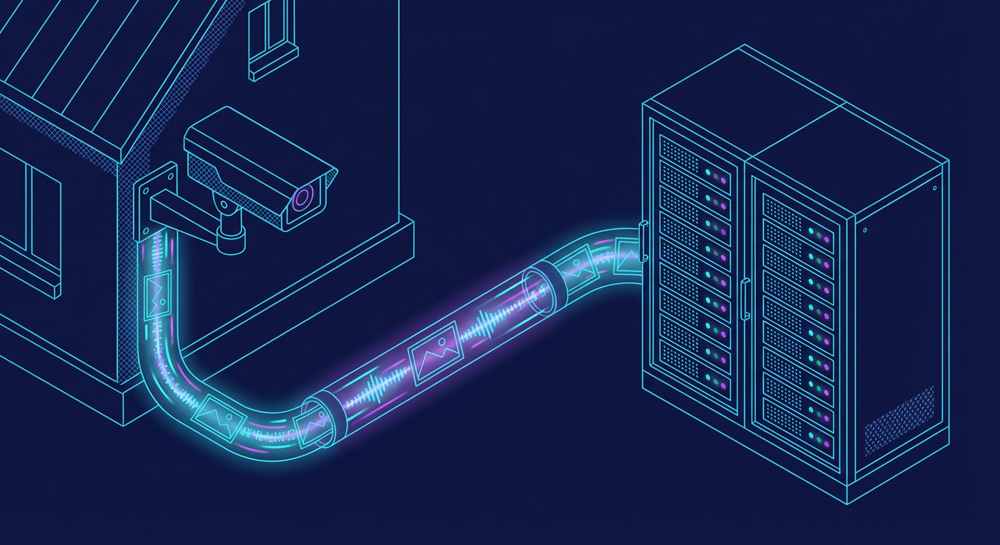

Security cameras upload images via FTP. A file watcher detects new uploads and submits them for analysis.

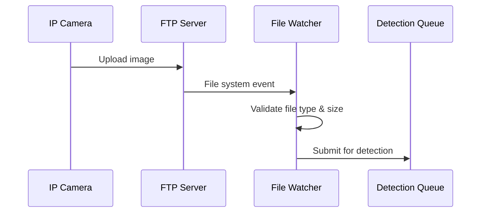

### 2. Object Detection

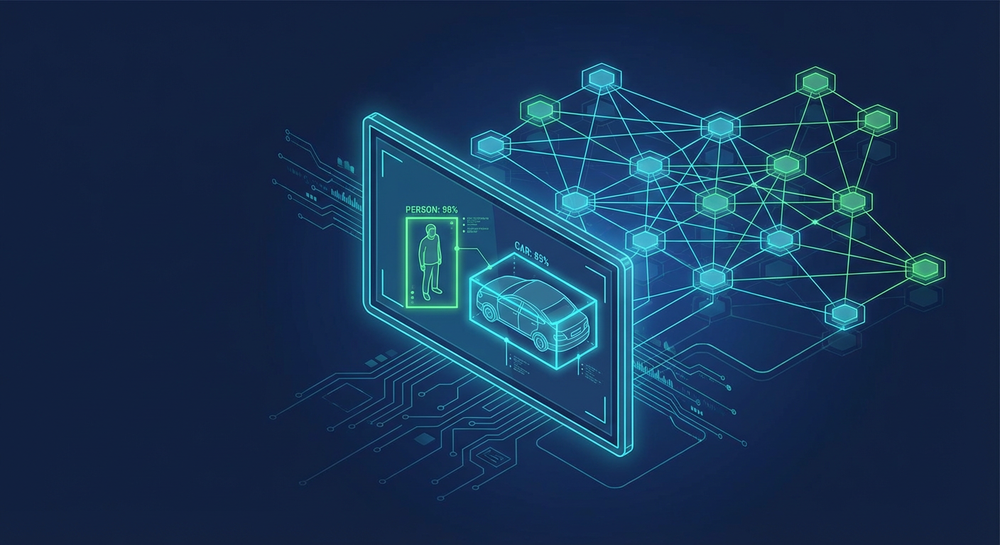

YOLO26 identifies people, vehicles, animals, and objects in real-time with bounding boxes and confidence scores.

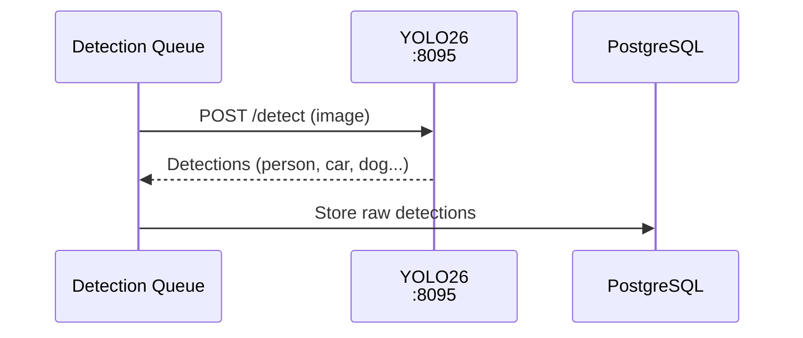

### 3. AI Enrichment

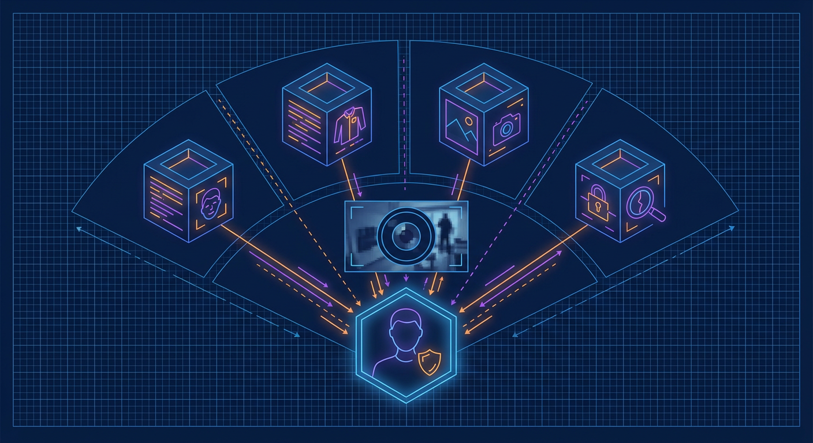

Multiple specialized models add context: Florence-2 captions the scene, CLIP detects anomalies, and enrichment models identify faces, clothing, vehicles, and more.

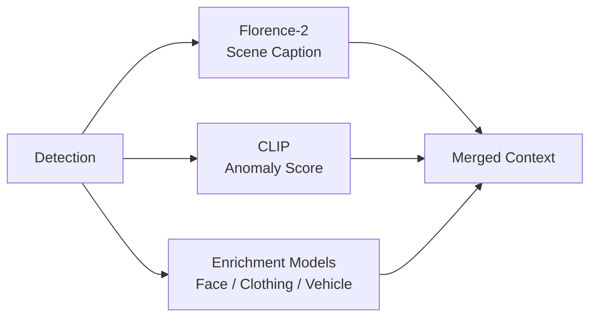

### 4. Event Batching

A 90-second window with 30-second idle timeout groups related detections into a single coherent event, preventing alert fatigue.

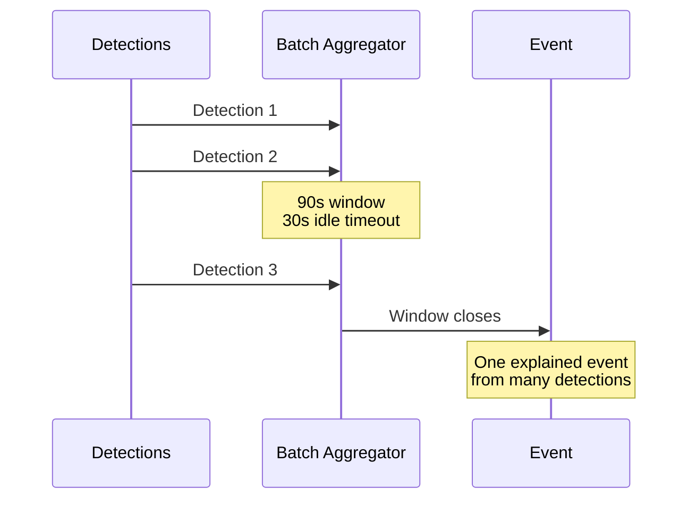

### 5. AI Risk Reasoning

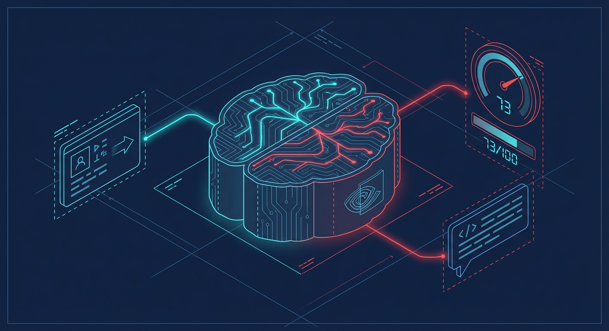

Nemotron-3-Nano-30B analyzes the full context -- detections, enrichments, time of day, camera location -- and produces a 0-100 risk score with natural language explanation.

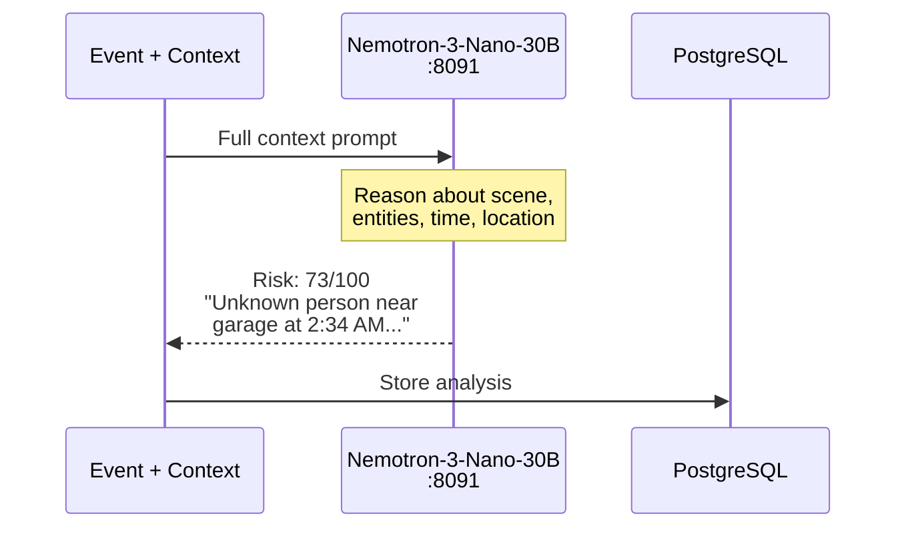

### 6. Real-Time Dashboard

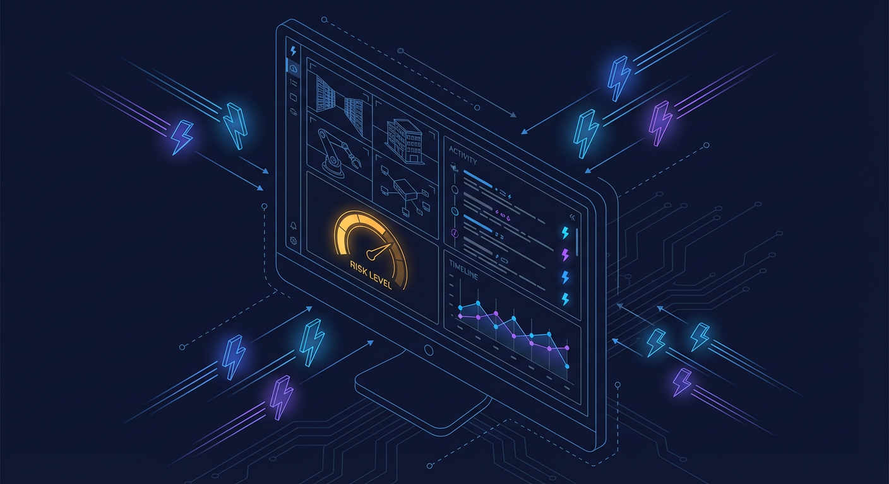

Events push to the React dashboard via WebSocket in real-time. The risk gauge updates, timeline entries appear, and entity tracking links detections across cameras.

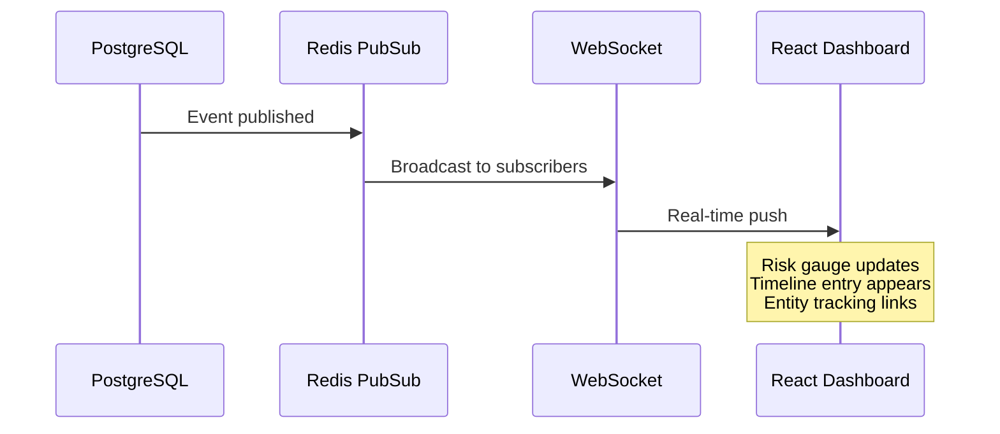

---

## Architecture Overview

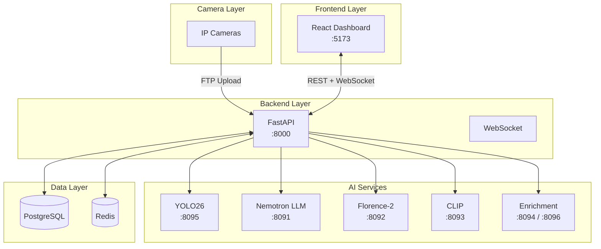

[:octicons-arrow-right-24: Full Architecture Documentation](architecture/README.md)

---

## AI Model Zoo

The system uses multiple AI models managed with VRAM-efficient on-demand loading. See the [complete Model Zoo documentation](ai/model-zoo.md).

| Model               | Purpose               | Always Loaded |
| ------------------- | --------------------- | :-----------: |
| YOLO26              | Object detection      |      Yes      |
| Florence-2          | Scene understanding   |      Yes      |
| CLIP ViT-L/14       | Anomaly detection     |      Yes      |
| Nemotron-3-Nano-30B | Risk reasoning (LLM)  |      Yes      |
| Threat Detection    | Weapon detection      |   On-demand   |
| Person Re-ID        | Cross-camera tracking |   On-demand   |
| FashionCLIP         | Clothing analysis     |   On-demand   |
| Demographics        | Age/gender estimation |   On-demand   |

---

## Quick Links

- [:fontawesome-brands-github: GitHub Repository](https://github.com/mikesvoboda/nemotron-v3-home-security-intelligence)
- [:material-api: Interactive API Docs](http://localhost:8000/docs) (when running locally)
- [:material-road-variant: Roadmap](ROADMAP.md)
- [:material-file-document: Contributing Guide](https://github.com/mikesvoboda/nemotron-v3-home-security-intelligence/blob/main/CONTRIBUTING.md)
