---
hide:
  - navigation
  - toc
---

# Home Security Intelligence

**Turn "dumb" security cameras into an intelligent threat detection system -- 100% local, no cloud APIs required.**

<!-- prettier-ignore-start -->

- :material-rocket-launch: **Getting Started**

  ***

  Prerequisites, installation, and your first run

  [:octicons-arrow-right-24: Get started](getting-started/README.md)

- :material-monitor-dashboard: **User Guide**

  ***

  Dashboard, alerts, timeline, analytics, and features

  [:octicons-arrow-right-24: User Guide](user/README.md)

- :material-server-network: **Operator Guide**

  ***

  Deployment, monitoring, GPU setup, and administration

  [:octicons-arrow-right-24: Operator Guide](operator/README.md)

- :material-code-braces: **Developer Guide**

  ***

  Architecture, API reference, patterns, and contributing

  [:octicons-arrow-right-24: Developer Guide](developer/README.md)

<!-- prettier-ignore-end -->

---

## How It Works

The system processes security camera footage through a multi-stage AI pipeline, turning raw images into explained security events with risk scores.

### 1. Camera Capture

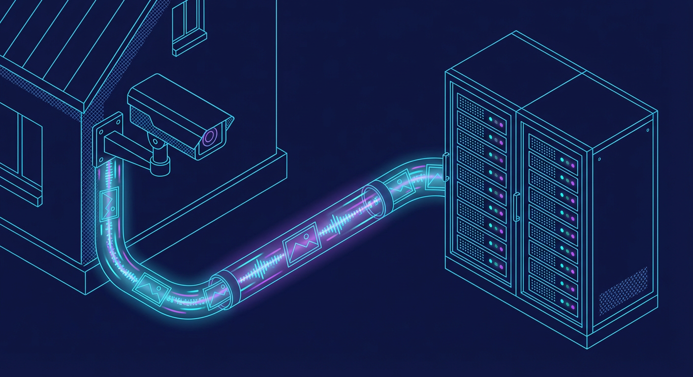

Security cameras upload images via FTP. A file watcher detects new uploads and submits them for analysis.

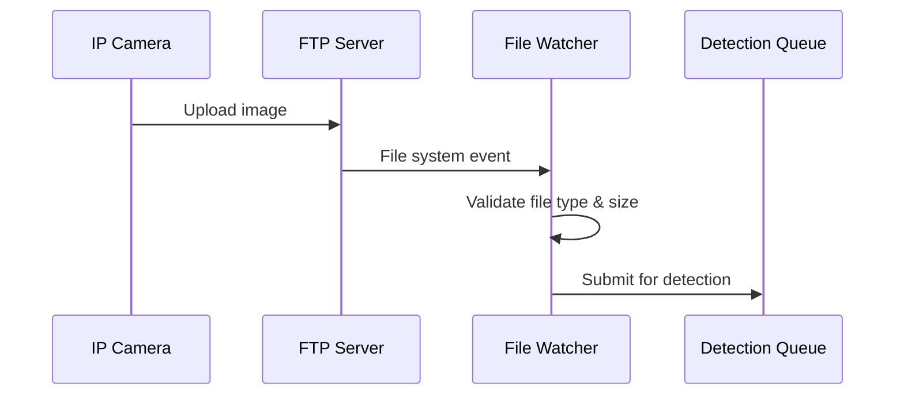
```mermaid
sequenceDiagram
    participant Camera as IP Camera
    participant FTP as FTP Server
    participant Watcher as File Watcher
    participant Queue as Detection Queue
    Camera->>FTP: Upload image
    FTP->>Watcher: File system event
    Watcher->>Watcher: Validate file type & size
    Watcher->>Queue: Submit for detection
```

### 2. Object Detection

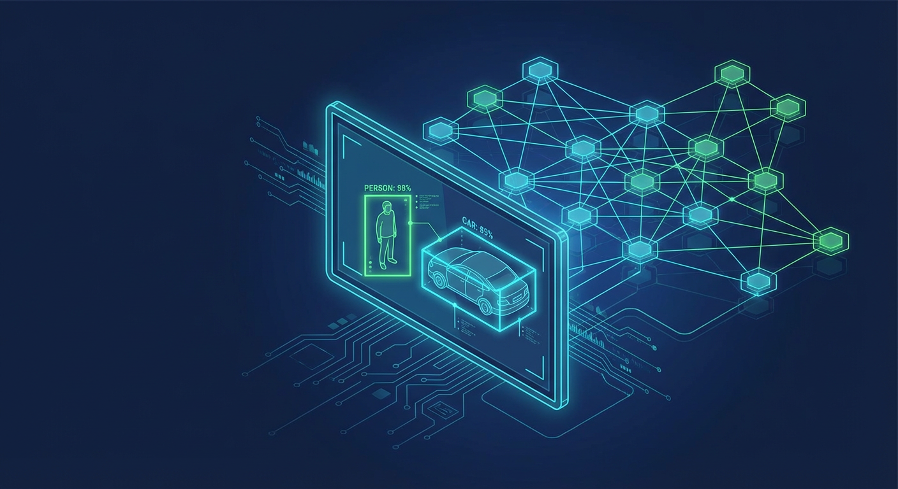

YOLO26 identifies people, vehicles, animals, and objects in real-time with bounding boxes and confidence scores.

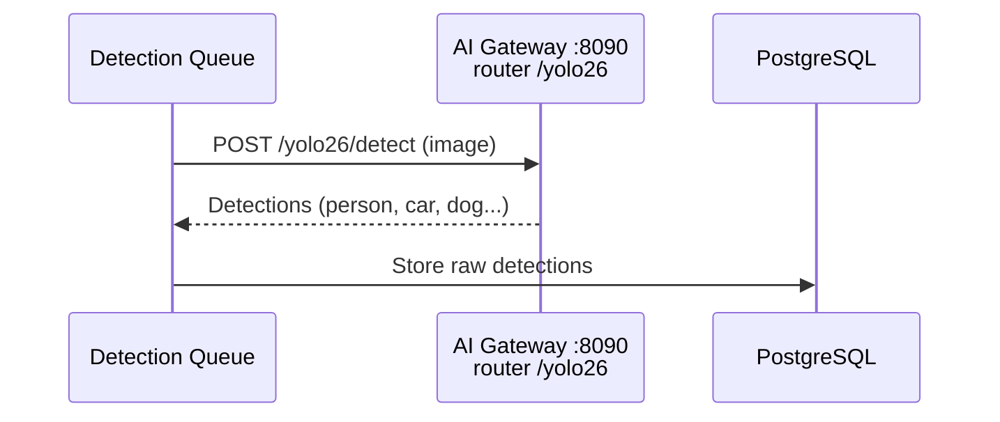
```mermaid
sequenceDiagram
    participant Queue as Detection Queue
    participant YOLO as AI Gateway :8090<br/>router /yolo26
    participant DB as PostgreSQL
    Queue->>YOLO: POST /yolo26/detect (image)
    YOLO-->>Queue: Detections (person, car, dog...)
    Queue->>DB: Store raw detections
```

### 3. Specialist Lookups

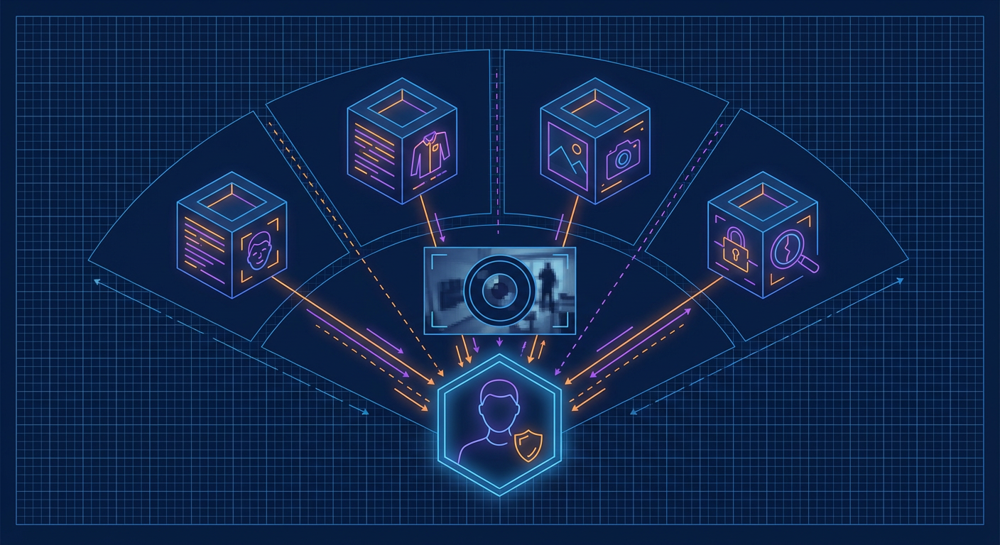

Three in-process legs run per batch and answer identity questions against your own
registrations: face recognition (SCRFD detection + w600k embeddings, gallery match),
license plates (FastALPR detection + OCR), and person re-identification (OSNet
embeddings, gallery match). Each leg degrades honestly to `unavailable: specialist did
not run` when its weights are not resident.

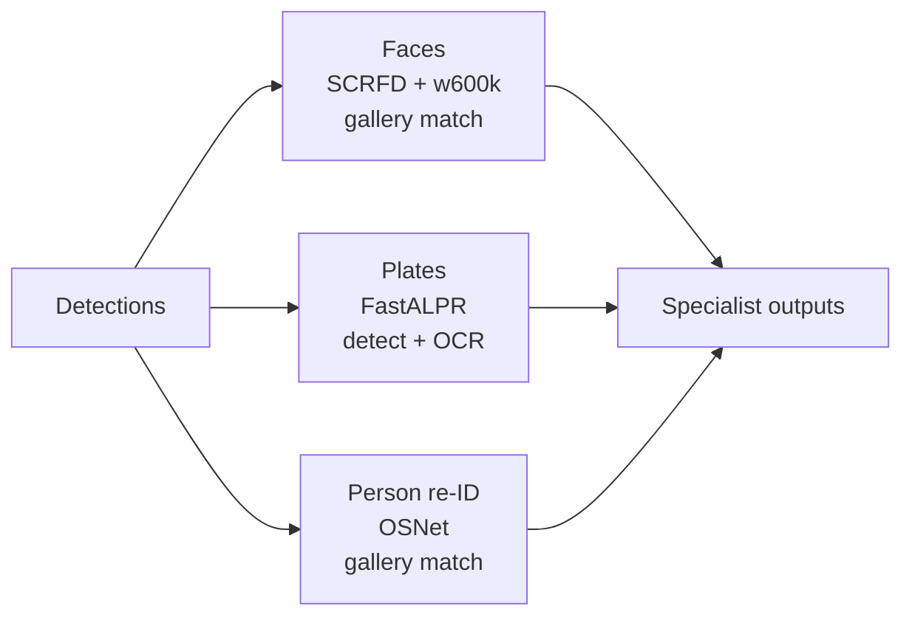
```mermaid
flowchart LR
    D[Detections] --> FA["Faces<br/>SCRFD + w600k<br/>gallery match"]
    D --> P["Plates<br/>FastALPR<br/>detect + OCR"]
    D --> R["Person re-ID<br/>OSNet<br/>gallery match"]
    FA --> S[Specialist outputs]
    P --> S
    R --> S
```

### 4. Event Batching

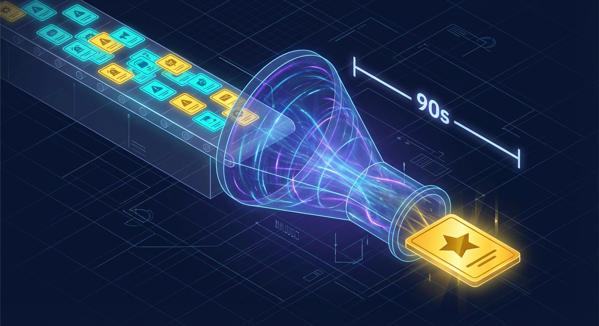

A 90-second window with 30-second idle timeout (or 500 detections) groups related
detections into a single coherent event, preventing alert fatigue.

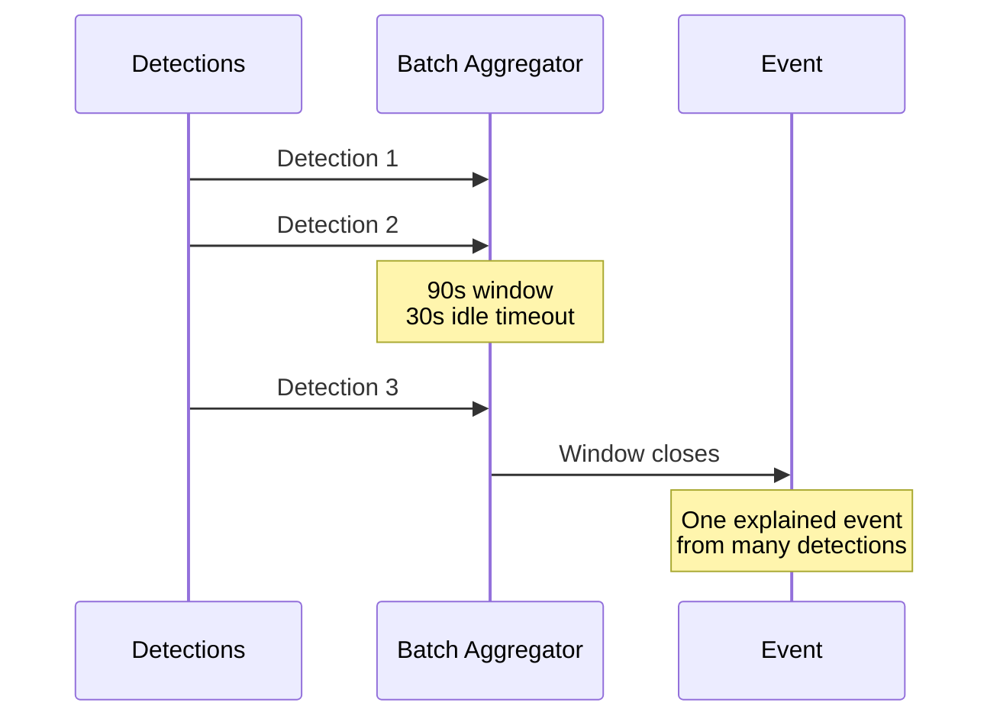
```mermaid
sequenceDiagram
    participant Det as Detections
    participant Agg as Batch Aggregator
    participant Event as Event
    Det->>Agg: Detection 1
    Det->>Agg: Detection 2
    Note over Agg: 90s window<br/>30s idle timeout
    Det->>Agg: Detection 3
    Agg->>Event: Window closes
    Note over Event: One explained event<br/>from many detections
```

### 5. AI Risk Reasoning

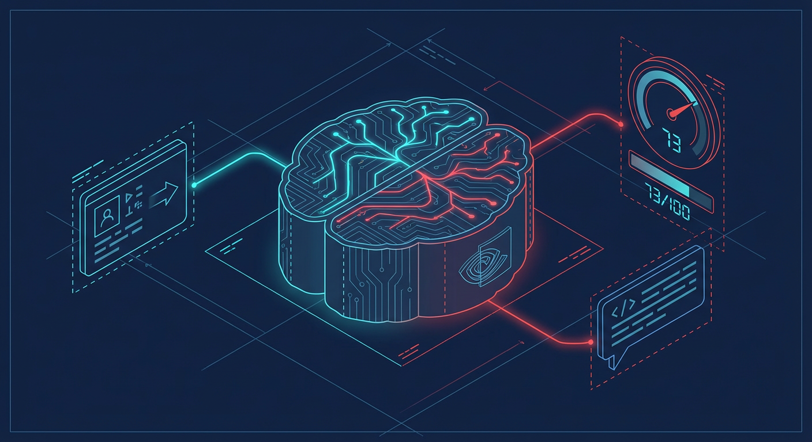

The VLM (`ai-vlm`, llama.cpp on port 8098) receives 1–4 key stills plus the detection
rows and the specialist lookup text, and returns a 0-100 risk score with a natural
language explanation.

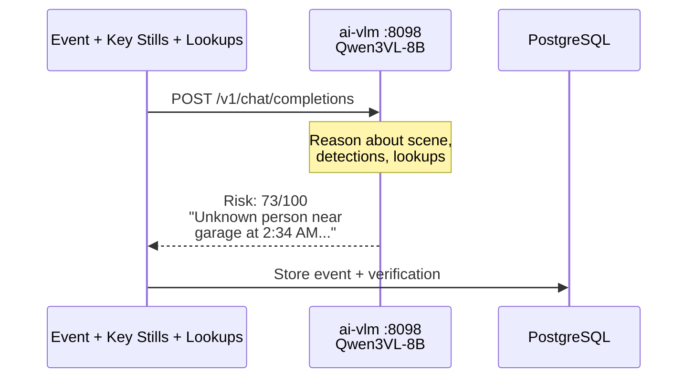
```mermaid
sequenceDiagram
    participant Event as Event + Key Stills + Lookups
    participant VLM as ai-vlm :8098<br/>Qwen3VL-8B
    participant DB as PostgreSQL
    Event->>VLM: POST /v1/chat/completions
    Note over VLM: Reason about scene,<br/>detections, lookups
    VLM-->>Event: Risk: 73/100<br/>"Unknown person near<br/>garage at 2:34 AM..."
    Event->>DB: Store event + verification
```

### 6. Real-Time Dashboard

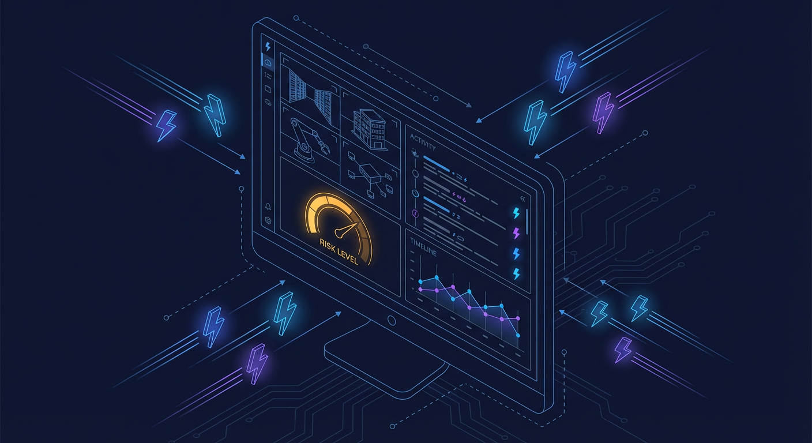

Events push to the React dashboard via WebSocket in real-time. The risk gauge updates, timeline entries appear, and entity tracking links detections across cameras.

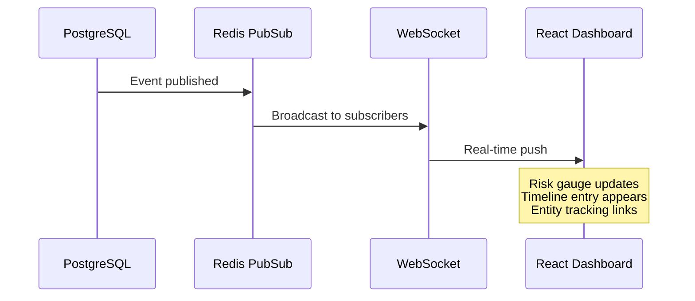
```mermaid
sequenceDiagram
    participant DB as PostgreSQL
    participant Redis as Redis PubSub
    participant WS as WebSocket
    participant UI as React Dashboard
    DB->>Redis: Event published
    Redis->>WS: Broadcast to subscribers
    WS->>UI: Real-time push
    Note over UI: Risk gauge updates<br/>Timeline entry appears<br/>Entity tracking links
```

---

## Architecture Overview

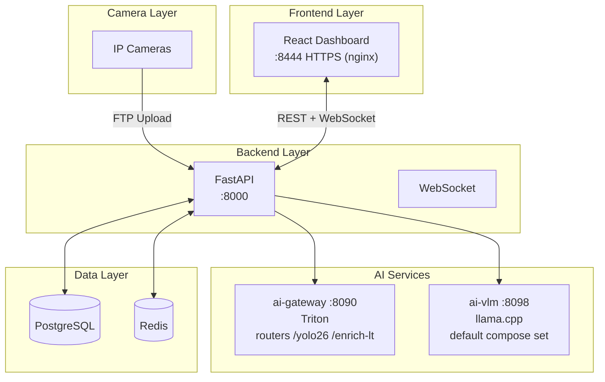
```mermaid
flowchart TB
    subgraph Cameras["Camera Layer"]
        CAM[IP Cameras]
    end
    subgraph Frontend["Frontend Layer"]
        UI["React Dashboard<br/>:8444 HTTPS (nginx)"]
    end
    subgraph Backend["Backend Layer"]
        API["FastAPI<br/>:8000"]
        WS["WebSocket"]
    end
    subgraph AI["AI Services"]
        GW["ai-gateway :8090<br/>Triton<br/>routers /yolo26 /enrich-lt"]
        VLM["ai-vlm :8098<br/>llama.cpp<br/>default compose set"]
    end
    subgraph Data["Data Layer"]
        DB[(PostgreSQL)]
        REDIS[(Redis)]
    end
    CAM -->|FTP Upload| API
    UI <-->|REST + WebSocket| API
    API --> GW
    API --> VLM
    API <--> DB & REDIS
```

[:octicons-arrow-right-24: Full Architecture Documentation](architecture/README.md)

---

## AI Models

Two AI services and three in-process lookup legs carry the shipped event path. See the
[complete Model Zoo documentation](ai/model-zoo.md) for the registry and the
[reference model table](reference/models.md) for per-model detail.

| Model                                    | Where it runs                     |                               Loads                                |
| ---------------------------------------- | --------------------------------- | :----------------------------------------------------------------: |
| YOLO26 (TensorRT)                        | `ai-gateway` Triton, `/yolo26`    |                          resident at boot                          |
| re-ID / threat (Triton)                  | `ai-gateway` Triton, `/enrich-lt` | resident at boot (`threat` only with `GATEWAY_ENABLE_THREAT=true`) |
| VLM (Qwen3VL-8B GGUF pair)               | `ai-vlm` llama.cpp, 8098          |               default compose set, `up -d` starts it               |
| Face detection + recognition (ONNX, CPU) | backend in-process                |            boot only with `BACKEND_MODEL_PRELOAD=true`             |
| Person re-ID (OSNet)                     | backend in-process                |            boot only with `BACKEND_MODEL_PRELOAD=true`             |
| License plates (FastALPR)                | backend in-process                |                            on first use                            |

---

## Quick Links

- [:fontawesome-brands-github: GitHub Repository](https://github.com/mikesvoboda/nemotron-v3-home-security-intelligence)
- [:material-api: Interactive API Docs](http://localhost:8000/docs) (when running locally)
- [:material-road-variant: Roadmap](ROADMAP.md)
- [:material-file-document: Contributing Guide](https://github.com/mikesvoboda/nemotron-v3-home-security-intelligence/blob/main/CONTRIBUTING.md)
