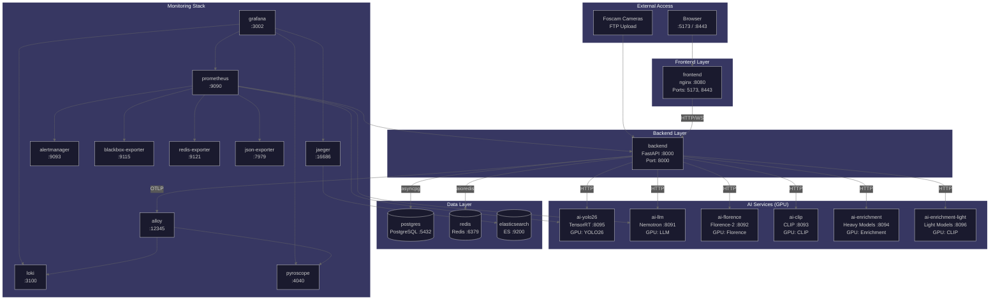

# Operator Hub

> Deploy, configure, and maintain Home Security Intelligence.

This hub is for **sysadmins, DevOps engineers, and technically savvy users** who deploy and maintain the system. For end-user documentation, see the [User Hub](../user/README.md). For development and contribution, see the [Developer Hub](../developer/README.md).

---

## Quick Navigation

| Section            | Description                                       | Link                       |
| ------------------ | ------------------------------------------------- | -------------------------- |
| **Deployment**     | Docker/Podman setup, GPU passthrough, AI services | [deployment/](deployment/) |
| **Monitoring**     | Health checks, GPU metrics, SLOs, alerting        | [monitoring/](monitoring/) |
| **Administration** | Configuration, secrets, security                  | [admin/](admin/)           |

---

## Quick Deploy

**Estimated deployment time:** 30-45 minutes (including model downloads)

```bash
# 1. Clone and setup
git clone https://github.com/your-org/home-security-intelligence.git
cd home-security-intelligence
./setup.sh              # Quick mode - generates .env with secure passwords

# 2. Download AI models (~2.7GB)
./ai/download_models.sh

# 3. Start services
docker compose -f docker-compose.prod.yml up -d

# 4. Verify
curl http://localhost:8000/api/system/health/ready
```

---

## System Requirements

| Component   | Minimum         | Recommended       |
| ----------- | --------------- | ----------------- |
| **GPU**     | NVIDIA 8GB VRAM | NVIDIA 12GB+ VRAM |
| **CPU**     | 4 cores         | 8+ cores          |
| **RAM**     | 8GB             | 16GB+             |
| **Storage** | 50GB            | 100GB+ SSD        |
| **CUDA**    | 11.8+           | 12.x              |

**AI VRAM Usage (Production):**

- YOLO26 (object detection): ~4GB
- Nemotron-3-Nano-30B (risk analysis): ~14.7GB
- **Total required:** ~19GB concurrent (dev: ~7GB with Mini 4B)

**Supported GPUs:** RTX 30/40 series, RTX A-series, Tesla/V100/A100

---

## Service Architecture

```
Camera uploads --> backend FileWatcher --> detection_queue
  --> YOLO26 (8095) --> detections (DB)
  --> batching + enrichment
  --> Nemotron (8091) --> events (DB)
  --> WebSocket dashboard
```

### Deployment Architecture Diagram

The following diagram shows the complete container topology, network connections, and data flows:



**Network:** All services connect via the `security-net` bridge network for internal DNS resolution.

**Volume Mounts:**

| Service                    | Volume                            | Purpose                 |
| -------------------------- | --------------------------------- | ----------------------- |
| postgres                   | `postgres_data`                   | Database persistence    |
| redis                      | `redis_data`                      | Cache persistence       |
| elasticsearch              | `elasticsearch_data`              | Trace storage           |
| prometheus                 | `prometheus_data`                 | Metrics storage         |
| grafana                    | `grafana_data`                    | Dashboard persistence   |
| loki                       | `loki_data`                       | Log storage             |
| pyroscope                  | `pyroscope_data`                  | Profile storage         |
| alertmanager               | `alertmanager_data`               | Alert state             |
| frontend                   | `frontend_certs`                  | SSL certificates        |
| ai-clip                    | `clip-tensorrt-cache`             | TensorRT engine cache   |
| ai-enrichment-light        | `enrichment-light-tensorrt-cache` | TensorRT engine cache   |
| ai-florence, ai-enrichment | `hf_cache`                        | HuggingFace model cache |
| backend                    | `/cameras` (bind mount)           | Camera FTP directory    |
| backend                    | `/models/model-zoo` (bind)        | AI model files          |

### Ports Reference

| Service    | Port | Purpose                               |
| ---------- | ---- | ------------------------------------- |
| Frontend   | 80   | Web dashboard (production)            |
| Frontend   | 5173 | Web dashboard (development)           |
| Backend    | 8000 | REST API + WebSocket                  |
| YOLO26     | 8095 | Object detection service              |
| Nemotron   | 8091 | LLM risk analysis service             |
| Florence-2 | 8092 | Vision extraction (optional)          |
| CLIP       | 8093 | Re-identification (optional)          |
| Enrichment | 8094 | Vehicle/pet classification (optional) |
| PostgreSQL | 5432 | Database                              |
| Redis      | 6379 | Cache + message broker                |

---

## Quick Commands

### Service Management

```bash
# Start all services (production)
docker compose -f docker-compose.prod.yml up -d

# Stop all services
docker compose -f docker-compose.prod.yml down

# View logs
docker compose -f docker-compose.prod.yml logs -f
docker compose -f docker-compose.prod.yml logs -f backend

# Restart a service
docker compose -f docker-compose.prod.yml restart backend
```

### Health Checks

```bash
# System health
curl http://localhost:8000/api/system/health

# Full health with circuit breakers
curl http://localhost:8000/api/system/health/full

# AI services
curl http://localhost:8095/health   # YOLO26
curl http://localhost:8091/health   # Nemotron

# Database
docker compose exec postgres pg_isready

# Redis
docker compose exec redis redis-cli ping
```

### GPU Management

```bash
# GPU status
nvidia-smi

# GPU memory usage
nvidia-smi --query-gpu=memory.used,memory.total --format=csv

# Kill GPU processes (emergency)
fuser -k /dev/nvidia*
```

---

## Detailed Guides

### Deployment

- [Complete Deployment Guide](deployment/) - Docker/Podman setup, compose files, GHCR images
- [GPU Setup Guide](gpu-setup.md) - NVIDIA drivers, container toolkit, CDI
- [AI Services Guide](ai-overview.md) - YOLO26, Nemotron, optional services
- [Deployment Modes](deployment-modes.md) - AI networking for different setups

### Monitoring

- [Monitoring Guide](monitoring/) - Health checks, GPU metrics, DLQ
- [Prometheus Alerting](prometheus-alerting.md) - Alert rules, Alertmanager
- [Service Level Objectives](monitoring/) - SLIs, SLOs, error budgets

### Administration

- [Administration Guide](admin/) - Configuration, secrets, security
- [Backup and Recovery](backup.md) - Database backup, disaster recovery
- [Redis Setup](redis.md) - Authentication, persistence

---

## Troubleshooting

### Quick Diagnostics

```bash
# Comprehensive health check
curl http://localhost:8000/api/system/health/full | jq

# Container status
docker compose -f docker-compose.prod.yml ps

# Recent logs
docker compose -f docker-compose.prod.yml logs --tail=100 backend

# GPU availability
nvidia-smi
```

### Common Issues

| Issue                      | Quick Fix                                                                  |
| -------------------------- | -------------------------------------------------------------------------- |
| AI services unreachable    | Check [Deployment Modes](deployment-modes.md) for correct URLs             |
| GPU out of memory          | Close other GPU apps, restart AI services                                  |
| Database connection failed | Verify `DATABASE_URL`, check PostgreSQL is running                         |
| Redis auth failed          | Check `REDIS_PASSWORD` in .env, see [Redis Setup](redis.md)                |
| WebSocket won't connect    | Check CORS settings, verify backend is healthy                             |
| Images not processing      | Check `FOSCAM_BASE_PATH`, enable `FILE_WATCHER_POLLING` for Docker Desktop |
| DLQ jobs accumulating      | Verify AI services healthy, check [DLQ Management](dlq-management.md)      |

### Getting Help

When reporting issues, collect:

```bash
# System health
curl http://localhost:8000/api/system/health | jq

# GPU info
nvidia-smi

# Container status
docker compose -f docker-compose.prod.yml ps

# Recent logs
docker compose -f docker-compose.prod.yml logs --tail=100 backend
```

---

## See Also

- [User Hub](../user/README.md) - End-user documentation
- [Developer Hub](../developer/README.md) - Development and contribution
- [API Reference](../developer/api/) - REST and WebSocket APIs
- [Architecture Overview](../architecture/overview.md) - System design
