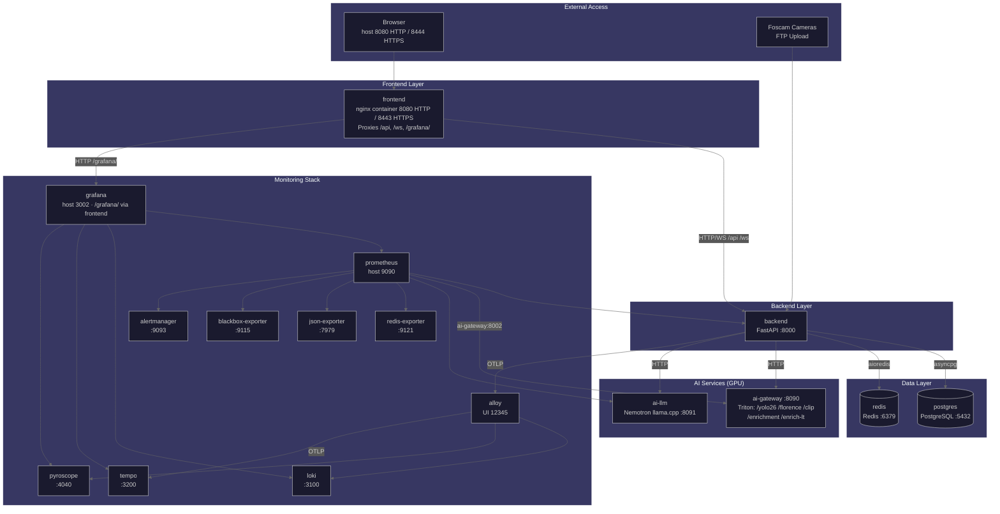
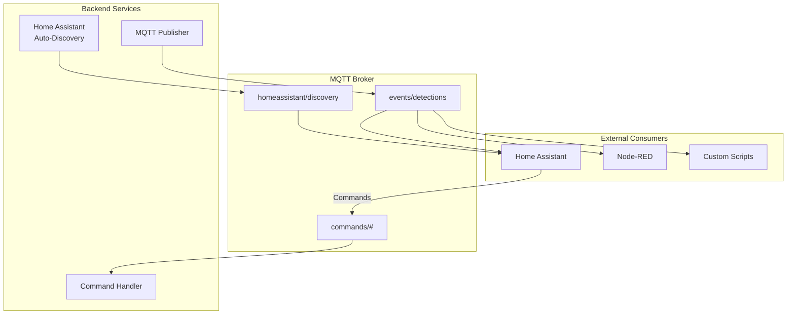

# Operator Hub

> Deploy, configure, and maintain Home Security Intelligence.

This hub is for **sysadmins, DevOps engineers, and technically savvy users** who deploy and maintain the system. For end-user documentation, see the [User Hub](../user/README.md). For development and contribution, see the [Developer Hub](../developer/README.md).

---

## Quick Navigation

| Section            | Description                                       | Link                                |
| ------------------ | ------------------------------------------------- | ----------------------------------- |
| **Deployment**     | Docker/Podman setup, GPU passthrough, AI services | [deployment/](deployment/README.md) |
| **Monitoring**     | Health checks, GPU metrics, SLOs, alerting        | [monitoring/](monitoring/README.md) |
| **Administration** | Configuration, secrets, security                  | [admin/](admin/README.md)           |

---

## Quick Deploy

**Estimated deployment time:** 30-45 minutes (including model downloads)

```bash
# 1. Clone and setup
git clone https://github.com/mikesvoboda/nemotron-v3-home-security-intelligence.git
cd nemotron-v3-home-security-intelligence
python setup.py         # Generates .env with secure passwords

# 2. Download AI models (~33GB total; Nemotron alone is 15GB)
./ai/download_models.sh

# 3. Start services
podman compose -f docker-compose.prod.yml up -d

# 4. Verify
curl http://localhost:8000/api/system/health/ready
```

---

## System Requirements

| Component   | Minimum         | Recommended       |
| ----------- | --------------- | ----------------- |
| **GPU**     | NVIDIA 8GB VRAM | NVIDIA 12GB+ VRAM |
| **CPU**     | 4 cores         | 8+ cores          |
| **RAM**     | 16GB            | 32GB+             |
| **Storage** | 50GB            | 100GB+ SSD        |
| **CUDA**    | 11.8+           | 12.x              |

**AI VRAM Usage (Production):**

<!-- prettier-ignore-start -->
--8<-- "docs/_includes/vram-requirements.md"
<!-- prettier-ignore-end -->

**Supported GPUs:** RTX 30/40 series, RTX A-series, Tesla/V100/A100

---

## Service Architecture

```
Camera uploads --> backend FileWatcher --> detection_queue
  --> YOLO26 via ai-gateway (8090/yolo26) --> detections (DB)
  --> batching + enrichment via ai-gateway (8090/enrichment, /enrich-lt)
  --> Nemotron (8091) --> events (DB)
  --> WebSocket dashboard
```

### Deployment Architecture Diagram

The following diagram shows the complete container topology, network connections, and data flows:


```mermaid
%%{init: {
  'theme': 'dark',
  'themeVariables': {
    'primaryColor': '#3B82F6',
    'primaryTextColor': '#FFFFFF',
    'primaryBorderColor': '#60A5FA',
    'secondaryColor': '#A855F7',
    'tertiaryColor': '#009688',
    'background': '#121212',
    'mainBkg': '#1a1a2e',
    'lineColor': '#666666'
  }
}}%%
flowchart TB
    subgraph External["External Access"]
        Browser["Browser<br/>host 8080 HTTP / 8444 HTTPS"]
        Camera["Foscam Cameras<br/>FTP Upload"]
    end

    subgraph Frontend["Frontend Layer"]
        FE["frontend<br/>nginx container 8080 HTTP / 8443 HTTPS<br/>Proxies /api, /ws, /grafana/"]
    end

    subgraph Backend["Backend Layer"]
        BE["backend<br/>FastAPI :8000"]
    end

    subgraph AI["AI Services (GPU)"]
        GW["ai-gateway :8090<br/>Triton: /yolo26 /florence /clip<br/>/enrichment /enrich-lt"]
        LLM["ai-llm<br/>Nemotron llama.cpp :8091"]
    end

    subgraph Data["Data Layer"]
        PG[("postgres<br/>PostgreSQL :5432")]
        RD[("redis<br/>Redis :6379")]
    end

    subgraph Monitoring["Monitoring Stack"]
        PROM["prometheus<br/>host 9090"]
        GRAF["grafana<br/>host 3002 · /grafana/ via frontend"]
        TEMPO["tempo<br/>:3200"]
        LOKI["loki<br/>:3100"]
        PYRO["pyroscope<br/>:4040"]
        ALLOY["alloy<br/>UI 12345"]
        AM["alertmanager<br/>:9093"]
        BB["blackbox-exporter<br/>:9115"]
        RE["redis-exporter<br/>:9121"]
        JE["json-exporter<br/>:7979"]
    end

    %% External connections
    Browser --> FE
    Camera --> BE

    %% Frontend proxies to Backend
    FE -->|"HTTP/WS /api /ws"| BE
    FE -->|"HTTP /grafana/"| GRAF

    %% Backend to Data
    BE -->|"asyncpg"| PG
    BE -->|"aioredis"| RD

    %% Backend to AI Services
    BE -->|"HTTP"| GW
    BE -->|"HTTP"| LLM

    %% Monitoring connections
    PROM --> BE
    PROM -->|"ai-gateway:8002"| GW
    PROM --> LLM
    PROM --> RE
    PROM --> JE
    PROM --> BB
    PROM --> AM
    GRAF --> PROM
    GRAF --> LOKI
    GRAF --> TEMPO
    GRAF --> PYRO
    ALLOY --> LOKI
    ALLOY --> PYRO
    ALLOY -->|"OTLP"| TEMPO
    BE -->|"OTLP"| ALLOY
```

### MQTT Integration

The backend publishes detection events to an MQTT broker, enabling integration with Home Assistant, Node-RED, and custom automation scripts. Home Assistant auto-discovery is supported via the `homeassistant/discovery` topic.


```mermaid
flowchart TB
    subgraph Backend["Backend Services"]
        PUB["MQTT Publisher"]
        CMD["Command Handler"]
        HA["Home Assistant<br/>Auto-Discovery"]
    end
    subgraph Broker["MQTT Broker"]
        T1["events/detections"]
        T2["commands/#"]
        T3["homeassistant/discovery"]
    end
    subgraph External["External Consumers"]
        HASS["Home Assistant"]
        NR["Node-RED"]
        CUSTOM["Custom Scripts"]
    end
    PUB --> T1
    T2 --> CMD
    HA --> T3
    T1 --> HASS & NR & CUSTOM
    T3 --> HASS
    HASS -->|Commands| T2
```

**Network:** All services connect via the `security-net` bridge network for internal DNS resolution.

**Volume Mounts:**

| Service      | Volume                                | Purpose                            |
| ------------ | ------------------------------------- | ---------------------------------- |
| postgres     | `postgres_data`                       | Database persistence               |
| redis        | `redis_data`                          | Cache persistence                  |
| tempo        | `tempo_data`                          | Trace storage                      |
| prometheus   | `prometheus_data`                     | Metrics storage                    |
| grafana      | `grafana_data`                        | Dashboard persistence              |
| loki         | `loki_data`                           | Log storage                        |
| pyroscope    | `pyroscope_data`                      | Profile storage                    |
| alertmanager | `alertmanager_data`                   | Alert state                        |
| alloy        | `alloy_symb_cache`                    | eBPF profiler symbol cache         |
| frontend     | `frontend_certs`                      | SSL certificates                   |
| ai-gateway   | `triton-kernel-cache`                 | CUDA kernel cache across redeploys |
| ai-gateway   | `triton-tmp-cache`                    | TensorRT compilation artifacts     |
| ai-gateway   | `${HF_CACHE_PATH}` (bind)             | HuggingFace model cache            |
| ai-gateway   | `${AI_MODELS_PATH}` (binds)           | `model-zoo`, `triton`, `quantized` |
| ai-llm       | `llama-cache`, `llama-nv-cache`       | llama.cpp / CUDA JIT caches        |
| ai-llm       | `${AI_MODELS_PATH}/nemotron/…` (bind) | Nemotron GGUF weights              |
| ai-llm-vllm  | `hf_cache`                            | HuggingFace model cache (profile)  |
| backend      | `/cameras` (bind mount)               | Camera FTP directory               |
| backend      | `/models/model-zoo` (bind)            | AI model files                     |

### Ports Reference

Host ports come from `.env`; every service except `frontend` binds `127.0.0.1` only.
Access Grafana and the API through the frontend nginx proxy for anything off-host.

| Service            | Env var                   | Host port | Container port | Purpose                                       |
| ------------------ | ------------------------- | --------- | -------------- | --------------------------------------------- |
| Frontend (HTTP)    | `FRONTEND_HTTP_PORT`      | 8080      | 8080           | Web dashboard via tunnel / plain HTTP         |
| Frontend (HTTPS)   | `FRONTEND_HTTPS_PORT`     | 8444      | 8443           | Web dashboard (TLS, opt-in via `SSL_ENABLED`) |
| Backend            | `API_PORT`                | 8000      | 8000           | REST API + WebSocket                          |
| AI gateway         | `AI_GATEWAY_PORT`         | 8090      | 8090           | YOLO26, Florence-2, CLIP, enrichment          |
| AI gateway metrics | `AI_GATEWAY_METRICS_PORT` | 8002      | 8002           | Triton Prometheus metrics                     |
| Nemotron           | `LLM_PORT`                | 8091      | 8091           | LLM risk analysis (llama.cpp)                 |
| vLLM (profile)     | `VLLM_PORT`               | 8097      | 8000           | Optional `vllm` profile engine                |
| PostgreSQL         | `POSTGRES_PORT`           | 5432      | 5432           | Database                                      |
| Redis              | `REDIS_PORT`              | 6379      | 6379           | Cache + message broker                        |
| go2rtc             | `GO2RTC_API_PORT`         | 1984      | 1984           | Stream REST API                               |
| go2rtc             | `GO2RTC_WEBRTC_PORT`      | 8555      | 8555           | WebRTC streaming                              |
| Prometheus         | `PROMETHEUS_PORT`         | 9090      | 9090           | Metrics                                       |
| Grafana            | `GRAFANA_PORT`            | 3002      | 3000           | Dashboards (served at `/grafana/`)            |
| Alertmanager       | `ALERTMANAGER_PORT`       | 9093      | 9093           | Alert routing                                 |
| Loki               | `LOKI_PORT`               | 3100      | 3100           | Logs                                          |
| Tempo              | `TEMPO_PORT`              | 3200      | 3200           | Traces (HTTP API/UI)                          |
| Pyroscope          | `PYROSCOPE_PORT`          | 4040      | 4040           | Continuous profiling                          |
| Alloy              | `ALLOY_UI_PORT`           | 12345     | 12345          | Collection pipeline UI                        |
| node-exporter      | `NODE_EXPORTER_PORT`      | 9100      | 9100           | Host metrics                                  |
| redis-exporter     | `REDIS_EXPORTER_PORT`     | 9121      | 9121           | Redis metrics                                 |
| json-exporter      | `JSON_EXPORTER_PORT`      | 7979      | 7979           | JSON API metrics                              |
| blackbox-exporter  | `BLACKBOX_EXPORTER_PORT`  | 9115      | 9115           | HTTP/TCP probes                               |
| dcgm-exporter      | `DCGM_EXPORTER_PORT`      | 9400      | 9400           | GPU metrics (`gpu-rootful` profile)           |

`docker-compose.prod.yml` defines 21 services; two are behind profiles (`vllm`,
`gpu-rootful`), so a default `up -d` starts 19. The `5173` Vite port in
`.env.example` (`FRONTEND_PORT`) is unused by the compose file — the Vite dev
server listens on HTTPS `8444` (see `frontend/vite.config.ts`).

---

## Quick Commands

### Service Management

```bash
# Start all services (production)
podman compose -f docker-compose.prod.yml up -d

# Stop all services
podman compose -f docker-compose.prod.yml down

# View logs
podman compose -f docker-compose.prod.yml logs -f
podman compose -f docker-compose.prod.yml logs -f backend

# Restart a service
podman compose -f docker-compose.prod.yml restart backend
```

### Health Checks

```bash
# System health
curl http://localhost:8000/api/system/health/ready

# Full health with circuit breakers
curl http://localhost:8000/api/system/health/full

# AI services
curl http://localhost:8090/health            # ai-gateway (YOLO26/Florence/CLIP/enrichment)
curl http://localhost:8090/yolo26/health     # per-router health
curl http://localhost:8091/health            # Nemotron

# Database
podman compose -f docker-compose.prod.yml exec postgres pg_isready

# Redis
podman compose -f docker-compose.prod.yml exec redis redis-cli ping
```

### GPU Management

```bash
# GPU status
nvidia-smi

# GPU memory usage
nvidia-smi --query-gpu=memory.used,memory.total --format=csv

# Kill GPU processes (emergency)
fuser -k /dev/nvidia*
```

---

## Detailed Guides

### Deployment

- [Complete Deployment Guide](deployment/README.md) - Docker/Podman setup, compose files, GHCR images
- [GPU Setup Guide](gpu-setup.md) - NVIDIA drivers, container toolkit, CDI
- [AI Services Guide](ai-overview.md) - YOLO26, Nemotron, optional services
- [Deployment Modes](deployment-modes.md) - AI networking for different setups

### Monitoring

- [Monitoring Guide](monitoring/README.md) - Health checks, GPU metrics, DLQ
- [Prometheus Alerting](prometheus-alerting.md) - Alert rules, Alertmanager
- [Service Level Objectives](monitoring/README.md) - SLIs, SLOs, error budgets

### Administration

- [Administration Guide](admin/README.md) - Configuration, secrets, security
- [Backup and Recovery](backup.md) - Database backup, disaster recovery
- [Redis Setup](redis.md) - Authentication, persistence

---

## Troubleshooting

### Quick Diagnostics

```bash
# Comprehensive health check
curl http://localhost:8000/api/system/health/full | jq

# Container status
podman compose -f docker-compose.prod.yml ps

# Recent logs
podman compose -f docker-compose.prod.yml logs --tail=100 backend

# GPU availability
nvidia-smi
```

### Common Issues

| Issue                      | Quick Fix                                                                  |
| -------------------------- | -------------------------------------------------------------------------- |
| AI services unreachable    | Check [Deployment Modes](deployment-modes.md) for correct URLs             |
| GPU out of memory          | Close other GPU apps, restart AI services                                  |
| Database connection failed | Verify `DATABASE_URL`, check PostgreSQL is running                         |
| Redis auth failed          | Check `REDIS_PASSWORD` in .env, see [Redis Setup](redis.md)                |
| WebSocket won't connect    | Check CORS settings, verify backend is healthy                             |
| Images not processing      | Check `FOSCAM_BASE_PATH`, enable `FILE_WATCHER_POLLING` for Docker Desktop |
| DLQ jobs accumulating      | Verify AI services healthy, check [DLQ Management](dlq-management.md)      |

### Getting Help

When reporting issues, collect:

```bash
# System health
curl http://localhost:8000/api/system/health | jq

# GPU info
nvidia-smi

# Container status
podman compose -f docker-compose.prod.yml ps

# Recent logs
podman compose -f docker-compose.prod.yml logs --tail=100 backend
```

---

## See Also

- [User Hub](../user/README.md) - End-user documentation
- [Developer Hub](../developer/README.md) - Development and contribution
- [API Reference](../developer/api/README.md) - REST and WebSocket APIs
- [Architecture Overview](../architecture/overview.md) - System design
