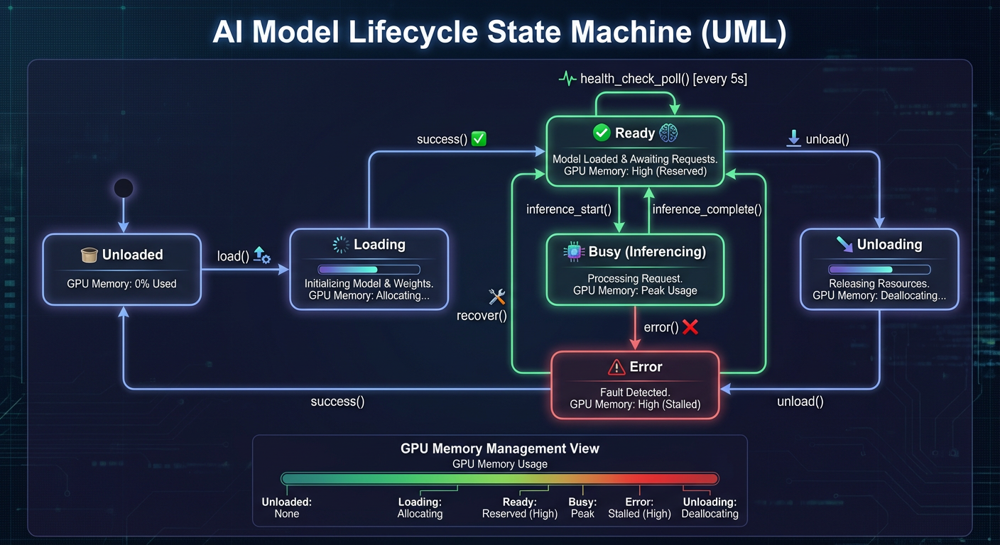

# AI Services Configuration

> Configure environment variables for AI inference services.

**Time to read:** ~12 min
**Prerequisites:** [AI Installation](ai-installation.md)

---

## Environment Variables

Set these in your shell profile (`~/.bashrc` or `~/.zshrc`) or in a `.env` file at the project root.

### Required Variables

| Variable       | Description                   | Example                                   |
| -------------- | ----------------------------- | ----------------------------------------- |
| `PROJECT_ROOT` | Root directory of the project | `$HOME/github/home-security-intelligence` |

### AI Service Startup

These control the startup script (`scripts/start-ai.sh`):

| Variable        | Description                         | Default |
| --------------- | ----------------------------------- | ------- |
| `YOLO26_PORT`   | Port for YOLO26 detection server    | `8095`  |
| `NEMOTRON_PORT` | Port for NVIDIA Nemotron LLM server | `8091`  |

**Note:** Log file paths are hardcoded:

- YOLO26: `/tmp/yolo26-detector.log`
- NVIDIA Nemotron: `/tmp/nemotron-llm.log`

### YOLO26 Detection Server

Configuration for `ai/yolo26/model.py`. The YOLO26 server uses TensorRT-optimized engines for efficient GPU inference.

#### Core Configuration

| Variable                       | Description                                        | Default                                      |
| ------------------------------ | -------------------------------------------------- | -------------------------------------------- |
| `YOLO26_MODEL_PATH`            | Path to TensorRT engine (.engine) or PyTorch model | `/models/yolo26/exports/yolo26m_fp16.engine` |
| `YOLO26_CONFIDENCE`            | Detection confidence threshold (0.0-1.0)           | `0.5`                                        |
| `YOLO26_CACHE_CLEAR_FREQUENCY` | Clear CUDA cache every N detections (0 to disable) | `1`                                          |
| `PORT`                         | Server port (direct execution)                     | `8095`                                       |
| `HOST`                         | Bind address                                       | `0.0.0.0`                                    |

#### TensorRT Engine Paths

TensorRT engines are GPU-architecture specific. Use the appropriate engine for your deployment:

| Precision | Engine Path                                  | VRAM   | Latency | Use Case                      |
| --------- | -------------------------------------------- | ------ | ------- | ----------------------------- |
| **FP16**  | `/models/yolo26/exports/yolo26m_fp16.engine` | ~2 GB  | 10-20ms | Default, highest accuracy     |
| **INT8**  | `/models/yolo26/exports/yolo26m_int8.engine` | ~1.5GB | 5-10ms  | High throughput, multi-camera |
| **PT**    | `/models/yolo26/yolo26m.pt` (fallback)       | ~3 GB  | 30-50ms | Development, TensorRT unavail |

Production engines should be stored at `/export/ai_models/model-zoo/yolo26/exports/`.

#### TensorRT Version Compatibility

TensorRT engines are version-specific. The server automatically handles version mismatches:

| Variable               | Description                                               | Default   |
| ---------------------- | --------------------------------------------------------- | --------- |
| `YOLO26_AUTO_REBUILD`  | Auto-rebuild engine on TensorRT version mismatch          | `true`    |
| `YOLO26_PT_MODEL_PATH` | Path to source .pt model for rebuilding (if auto-rebuild) | (derived) |

When the TensorRT runtime version differs from the engine version:

1. The server detects the version mismatch error
2. If `YOLO26_AUTO_REBUILD=true`, it rebuilds the engine from the .pt model
3. If rebuild fails or is disabled, it falls back to PyTorch inference

#### torch.compile Optimization (PyTorch fallback only)

When using PyTorch models (not TensorRT engines), torch.compile provides 15-30% speedup:

| Variable                  | Description                           | Default           |
| ------------------------- | ------------------------------------- | ----------------- |
| `TORCH_COMPILE_ENABLED`   | Enable PyTorch 2.0+ graph compilation | `true`            |
| `TORCH_COMPILE_MODE`      | Compilation mode                      | `reduce-overhead` |
| `TORCH_COMPILE_BACKEND`   | Compilation backend                   | `inductor`        |
| `TORCH_COMPILE_CACHE_DIR` | Cache directory for compiled graphs   | (system default)  |

**Compilation modes:**

- `default` - Balanced optimization
- `reduce-overhead` - Faster compilation, good speedup (recommended)
- `max-autotune` - Best performance, slower compilation

> **Note:** torch.compile is automatically skipped for TensorRT engines since they are already graph-optimized.

#### Exporting TensorRT Engines

Use the export script to generate TensorRT engines for your GPU:

```bash
# Export FP16 engine (default, higher accuracy)
python ai/yolo26/export_tensorrt.py --model yolo26m.pt --output exports/

# Export INT8 engine (2x throughput, requires calibration)
python ai/yolo26/export_tensorrt.py \
    --model yolo26m.pt \
    --int8 \
    --data config/yolo26_calibration.yaml \
    --output exports/

# Benchmark exported engine
python ai/yolo26/export_tensorrt.py --benchmark exports/yolo26m_fp16.engine
```

**INT8 calibration requirements:**

- 100-500 representative images from your deployment environment
- Cover various lighting conditions and camera angles
- Include all security-relevant object classes

For detailed export options, see `ai/yolo26/README.md`.

### NVIDIA Nemotron LLM Server

Configuration for `ai/start_llm.sh` (development) and `ai/start_nemotron.sh` (production):

| Variable              | Description             | Default (Dev)                                                     |
| --------------------- | ----------------------- | ----------------------------------------------------------------- |
| `NEMOTRON_MODEL_PATH` | Path to GGUF model file | `$PROJECT_ROOT/ai/nemotron/nemotron-mini-4b-instruct-q4_k_m.gguf` |
| `NEMOTRON_PORT`       | Server port             | `8091`                                                            |
| `GPU_LAYERS`          | Layers offloaded to GPU | `35`                                                              |
| `CTX_SIZE`            | Context window size     | `131072` (128K)                                                   |



_Model Zoo state machine showing model lifecycle transitions: loading, loaded, unloading, and error states._

**Model Options:**

| Deployment      | Model                                                                                        | File                                    | VRAM     | Context |
| --------------- | -------------------------------------------------------------------------------------------- | --------------------------------------- | -------- | ------- |
| **Production**  | [NVIDIA Nemotron-3-Nano-30B-A3B](https://huggingface.co/nvidia/Nemotron-3-Nano-30B-A3B-GGUF) | `Nemotron-3-Nano-30B-A3B-Q4_K_M.gguf`   | ~14.7 GB | 131,072 |
| **Development** | [Nemotron Mini 4B Instruct](https://huggingface.co/bartowski/nemotron-mini-4b-instruct-GGUF) | `nemotron-mini-4b-instruct-q4_k_m.gguf` | ~3 GB    | 4,096   |

For comprehensive NVIDIA Nemotron documentation, see `/ai/nemotron/AGENTS.md`.

### Backend Configuration

These configure how the backend connects to AI services (`backend/core/config.py`):

| Variable           | Description                                | Default                 |
| ------------------ | ------------------------------------------ | ----------------------- |
| `YOLO26_URL`       | Full URL to YOLO26 service                 | `http://localhost:8095` |
| `NEMOTRON_URL`     | Full URL to NVIDIA Nemotron service        | `http://localhost:8091` |
| `YOLO26_API_KEY`   | API key for YOLO26 authentication          | (none)                  |
| `NEMOTRON_API_KEY` | API key for NVIDIA Nemotron authentication | (none)                  |

---

## Setting Up Environment Variables

### Option 1: Shell Profile

Add to `~/.bashrc` or `~/.zshrc`:

```bash
export PROJECT_ROOT="$HOME/github/home-security-intelligence"
```

### Option 2: Project .env File

```bash
echo 'PROJECT_ROOT="$HOME/github/home-security-intelligence"' >> .env
```

### Option 3: Current Session Only

```bash
export PROJECT_ROOT="/path/to/your/project"
```

---

## Container Networking

When AI services run in containers, use appropriate host resolution:

> For a decision table and copy/paste `.env` snippets for every deployment mode, use: **[Deployment Modes & AI Networking](deployment-modes.md)**.

| Platform | Runtime        | AI Service URLs                        |
| -------- | -------------- | -------------------------------------- |
| macOS    | Docker Desktop | `http://host.docker.internal:8095`     |
| macOS    | Podman         | `http://host.containers.internal:8095` |
| Linux    | Docker/Podman  | `http://192.168.1.100:8095` (host IP)  |

### Production compose DNS (recommended)

When running `docker-compose.prod.yml`, the backend reaches AI services by compose DNS:

```bash
YOLO26_URL=http://ai-yolo26:8095
NEMOTRON_URL=http://ai-llm:8091
FLORENCE_URL=http://ai-florence:8092
CLIP_URL=http://ai-clip:8093
ENRICHMENT_URL=http://ai-enrichment:8094
```

**Example .env for macOS with Docker:**

```bash
YOLO26_URL=http://host.docker.internal:8095
NEMOTRON_URL=http://host.docker.internal:8091
```

**Example .env for macOS with Podman:**

```bash
export AI_HOST=host.containers.internal
YOLO26_URL=http://${AI_HOST}:8095
NEMOTRON_URL=http://${AI_HOST}:8091
```

**Example .env for Linux:**

```bash
# Get your host IP
export AI_HOST=$(hostname -I | awk '{print $1}')
YOLO26_URL=http://${AI_HOST}:8095
NEMOTRON_URL=http://${AI_HOST}:8091
```

---

## Detection Settings

Fine-tune object detection behavior:

| Variable                         | Description                  | Default      |
| -------------------------------- | ---------------------------- | ------------ |
| `DETECTION_CONFIDENCE_THRESHOLD` | Minimum confidence to store  | `0.5`        |
| `FAST_PATH_CONFIDENCE_THRESHOLD` | Threshold for fast-path      | `0.90`       |
| `FAST_PATH_OBJECT_TYPES`         | Types eligible for fast-path | `["person"]` |

**Confidence threshold trade-offs:**

- **Lower (0.3-0.5):** More detections, more false positives
- **Higher (0.6-0.8):** Fewer detections, fewer false positives

---

## Timeout Settings

Control connection and read timeouts:

| Variable                | Description                  | Default |
| ----------------------- | ---------------------------- | ------- |
| `AI_CONNECT_TIMEOUT`    | Connection timeout (seconds) | `10.0`  |
| `YOLO26_READ_TIMEOUT`   | Detection read timeout       | `60.0`  |
| `NEMOTRON_READ_TIMEOUT` | LLM analysis read timeout    | `120.0` |

---

## Systemd Services

For production deployment with systemd:

| Variable          | Description                     | Default      |
| ----------------- | ------------------------------- | ------------ |
| `AI_SERVICE_USER` | User to run systemd services as | Current user |

---

## Complete Example .env

```bash
# Project root
PROJECT_ROOT=/home/user/home-security-intelligence

# AI service ports (for startup scripts)
YOLO26_PORT=8095
NEMOTRON_PORT=8091

# AI service URLs (for backend)
YOLO26_URL=http://localhost:8095
NEMOTRON_URL=http://localhost:8091

# YOLO26 TensorRT configuration
YOLO26_MODEL_PATH=/models/yolo26/exports/yolo26m_fp16.engine
YOLO26_CONFIDENCE=0.5
YOLO26_CACHE_CLEAR_FREQUENCY=1
YOLO26_AUTO_REBUILD=true
# YOLO26_PT_MODEL_PATH=/models/yolo26/yolo26m.pt  # Optional: explicit fallback path

# torch.compile (PyTorch fallback only)
TORCH_COMPILE_ENABLED=true
TORCH_COMPILE_MODE=reduce-overhead

# Detection tuning
DETECTION_CONFIDENCE_THRESHOLD=0.5
FAST_PATH_CONFIDENCE_THRESHOLD=0.90
FAST_PATH_OBJECT_TYPES=["person"]

# Timeouts
AI_CONNECT_TIMEOUT=10.0
YOLO26_READ_TIMEOUT=60.0
NEMOTRON_READ_TIMEOUT=120.0
```

---

## Next Steps

- [AI Services](ai-services.md) - Start and verify services
- [AI Troubleshooting](ai-troubleshooting.md) - Common issues and solutions
- [AI Performance](ai-performance.md) - Performance tuning

---

## See Also

- [Environment Variable Reference](../reference/config/env-reference.md) - Complete configuration reference
- [Risk Levels Reference](../reference/config/risk-levels.md) - Severity threshold configuration
- [AI TLS](ai-tls.md) - Secure communications setup

---

[Back to Operator Hub](./)
