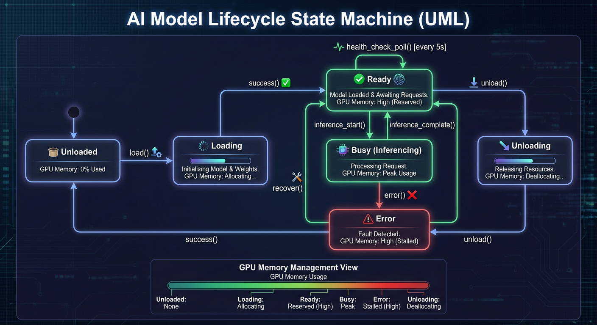

# AI Services Configuration

> Configure environment variables for AI inference services.

**Time to read:** ~12 min
**Prerequisites:** [AI Installation](ai-installation.md)

---

## Environment Variables

Set these in your shell profile (`~/.bashrc` or `~/.zshrc`) or in a `.env` file at the project root.

### Startup Script Variables

There is no `scripts/start-ai.sh` — the host-run startup scripts are `ai/start_detector.sh`,
`ai/start_llm.sh` and `ai/start_nemotron.sh` (each derives its own paths from its location).
These read:

| Variable              | Used by                | Default                                                                                                                    |
| --------------------- | ---------------------- | -------------------------------------------------------------------------------------------------------------------------- |
| `YOLO26_PORT`         | `ai/start_detector.sh` | `8090` (`.env.example` ships `8095`)                                                                                       |
| `NEMOTRON_PORT`       | all LLM scripts        | `8091`                                                                                                                     |
| `NEMOTRON_MODEL_PATH` | LLM scripts            | see each script's model search list                                                                                        |
| `PROJECT_ROOT`        | optional               | not set by `.env.example`; only `backend/services/lifecycle_manager.py` reads it (defaults to `/app` inside the container) |

**Log files:** `ai/start_nemotron.sh` writes to `/tmp/nemotron.log`; `ai/start_llm.sh` and
`ai/start_detector.sh` run in the foreground and log to the terminal. In compose, read logs
with `podman compose -f docker-compose.prod.yml logs ai-gateway` / `… logs ai-llm`.

### YOLO26 Detection Server (standalone, host-run)

Configuration for `ai/yolo26/model.py` when you run it directly on the host. **Production
detection does not use this server** — YOLO26 runs as an ONNX Runtime model inside the
`ai-gateway` Triton container (`/yolo26` router); the TensorRT and `torch.compile` variables
below apply only to the standalone host-run server. The server uses TensorRT-optimized
engines for efficient GPU inference.

#### Core Configuration

| Variable                       | Description                                        | Default                                      |
| ------------------------------ | -------------------------------------------------- | -------------------------------------------- |
| `YOLO26_MODEL_PATH`            | Path to TensorRT engine (.engine) or PyTorch model | `/models/yolo26/exports/yolo26m_fp16.engine` |
| `YOLO26_CONFIDENCE`            | Detection confidence threshold (0.0-1.0)           | `0.5`                                        |
| `YOLO26_CACHE_CLEAR_FREQUENCY` | Clear CUDA cache every N detections (0 to disable) | `1`                                          |
| `PORT`                         | Server port (direct execution)                     | `8095`                                       |
| `HOST`                         | Bind address                                       | `0.0.0.0`                                    |

#### TensorRT Engine Paths

TensorRT engines are GPU-architecture specific. Use the appropriate engine for your deployment:

| Precision | Engine Path                                  | VRAM   | Latency | Use Case                      |
| --------- | -------------------------------------------- | ------ | ------- | ----------------------------- |
| **FP16**  | `/models/yolo26/exports/yolo26m_fp16.engine` | ~2 GB  | 10-20ms | Default, highest accuracy     |
| **INT8**  | `/models/yolo26/exports/yolo26m_int8.engine` | ~1.5GB | 5-10ms  | High throughput, multi-camera |
| **PT**    | `/models/yolo26/yolo26m.pt` (fallback)       | ~3 GB  | 30-50ms | Development, TensorRT unavail |

Host-run engines are conventionally stored under
`${AI_MODELS_PATH:-/export/ai_models}/model-zoo/yolo26/exports/`. The gateway path is
different: `ai/triton/model_repository/yolo26` runs an FP32 **ONNX** model on the ONNX
Runtime CUDA execution provider (NEM-5551 — INT8 ONNX was incompatible with the CUDA
provider), so no TensorRT engine is involved in the compose stack.

#### TensorRT Version Compatibility

TensorRT engines are version-specific. The server automatically handles version mismatches:

| Variable               | Description                                               | Default   |
| ---------------------- | --------------------------------------------------------- | --------- |
| `YOLO26_AUTO_REBUILD`  | Auto-rebuild engine on TensorRT version mismatch          | `true`    |
| `YOLO26_PT_MODEL_PATH` | Path to source .pt model for rebuilding (if auto-rebuild) | (derived) |

When the TensorRT runtime version differs from the engine version:

1. The server detects the version mismatch error
2. If `YOLO26_AUTO_REBUILD=true`, it rebuilds the engine from the .pt model
3. If rebuild fails or is disabled, it falls back to PyTorch inference

#### torch.compile Optimization (PyTorch fallback only)

When using PyTorch models (not TensorRT engines), torch.compile provides 15-30% speedup:

| Variable                  | Description                           | Default           |
| ------------------------- | ------------------------------------- | ----------------- |
| `TORCH_COMPILE_ENABLED`   | Enable PyTorch 2.0+ graph compilation | `true`            |
| `TORCH_COMPILE_MODE`      | Compilation mode                      | `reduce-overhead` |
| `TORCH_COMPILE_BACKEND`   | Compilation backend                   | `inductor`        |
| `TORCH_COMPILE_CACHE_DIR` | Cache directory for compiled graphs   | (system default)  |

**Compilation modes:**

- `default` - Balanced optimization
- `reduce-overhead` - Faster compilation, good speedup (recommended)
- `max-autotune` - Best performance, slower compilation

> **Note:** torch.compile is automatically skipped for TensorRT engines since they are already graph-optimized.

#### Exporting TensorRT Engines

Use the export script to generate TensorRT engines for your GPU:

```bash
# Export FP16 engine (default, higher accuracy)
python ai/yolo26/export_tensorrt.py --model yolo26m.pt --output exports/

# Export INT8 engine (2x throughput, requires calibration)
python ai/yolo26/export_tensorrt.py \
    --model yolo26m.pt \
    --int8 \
    --data config/yolo26_calibration.yaml \
    --output exports/

# Benchmark exported engine
python ai/yolo26/export_tensorrt.py --benchmark exports/yolo26m_fp16.engine
```

**INT8 calibration requirements:**

- 100-500 representative images from your deployment environment
- Cover various lighting conditions and camera angles
- Include all security-relevant object classes

For detailed export options, see `ai/yolo26/README.md`.

### NVIDIA Nemotron LLM Server

Host-run scripts: `ai/start_llm.sh` (dev, Mini 4B) and `ai/start_nemotron.sh` (Nano 30B,
also called by the backend's ServiceHealthMonitor for auto-recovery). In compose the
`ai-llm` container runs llama.cpp instead and reads `LLM_MODEL_PATH`, `GPU_LAYERS`,
`CTX_SIZE`, `PARALLEL` (see below).

| Variable                | Used by             | Default                                                                                                                                                                                    |
| ----------------------- | ------------------- | ------------------------------------------------------------------------------------------------------------------------------------------------------------------------------------------ |
| `NEMOTRON_MODEL_PATH`   | both scripts        | `ai/nemotron/nemotron-mini-4b-instruct-q4_k_m.gguf` (dev); `start_nemotron.sh` falls back to `/export/ai_models/nemotron/nemotron-3-nano-30b-a3b-q4km/Nemotron-3-Nano-30B-A3B-Q4_K_M.gguf` |
| `NEMOTRON_PORT`         | both scripts        | `8091`                                                                                                                                                                                     |
| `NEMOTRON_HOST`         | `start_nemotron.sh` | `0.0.0.0`                                                                                                                                                                                  |
| `NEMOTRON_GPU_LAYERS`   | `start_nemotron.sh` | `35` (dev script hardcodes `99` = all)                                                                                                                                                     |
| `NEMOTRON_CONTEXT_SIZE` | `start_nemotron.sh` | `12288` (dev script hardcodes `4096`)                                                                                                                                                      |
| `LLAMA_SERVER_PATH`     | `start_nemotron.sh` | searches `/usr/bin/llama-server`, `/export/ai_models/nemotron/llama.cpp/build/bin/llama-server`                                                                                            |

**Compose `ai-llm` variables** (from `.env.example` / compose defaults):

| Variable         | Default                                       | Notes                                                                                                                                                                                      |
| ---------------- | --------------------------------------------- | ------------------------------------------------------------------------------------------------------------------------------------------------------------------------------------------ |
| `LLM_MODEL_PATH` | `/models/Nemotron-3-Nano-30B-A3B-Q4_K_M.gguf` | exposed to the container as `MODEL_PATH`                                                                                                                                                   |
| `GPU_LAYERS`     | `auto` (all layers)                           |                                                                                                                                                                                            |
| `CTX_SIZE`       | `262144`                                      | llama.cpp total, split across `PARALLEL` slots; **must not** be exported to the Python backend — its `nemotron_context_window` validator caps at 131,072 (see [Monitoring](monitoring.md)) |
| `PARALLEL`       | `8`                                           | 8 × 32,768 tokens                                                                                                                                                                          |



_Model Zoo state machine showing model lifecycle transitions: loading, loaded, unloading, and error states._

**Model Options:**

| Deployment      | Model                                                                                        | File                                    | VRAM     | Context |
| --------------- | -------------------------------------------------------------------------------------------- | --------------------------------------- | -------- | ------- |
| **Production**  | [NVIDIA Nemotron-3-Nano-30B-A3B](https://huggingface.co/nvidia/Nemotron-3-Nano-30B-A3B-GGUF) | `Nemotron-3-Nano-30B-A3B-Q4_K_M.gguf`   | ~14.7 GB | 131,072 |
| **Development** | [Nemotron Mini 4B Instruct](https://huggingface.co/bartowski/nemotron-mini-4b-instruct-GGUF) | `nemotron-mini-4b-instruct-q4_k_m.gguf` | ~3 GB    | 4,096   |

For comprehensive NVIDIA Nemotron documentation, see `/ai/nemotron/AGENTS.md`.

### Backend Configuration

These configure how the backend connects to AI services (`backend/core/config.py`):

| Variable               | Description                                  | Default                                                 |
| ---------------------- | -------------------------------------------- | ------------------------------------------------------- |
| `USE_AI_GATEWAY`       | Route all AI clients through the gateway     | `false` in code, `true` in compose/`.env`               |
| `AI_GATEWAY_URL`       | Gateway base URL when `USE_AI_GATEWAY=true`  | none in code, `http://ai-gateway:8090` in compose       |
| `YOLO26_URL`           | Full URL to the detection router             | `http://ai-gateway:8090/yolo26`                         |
| `NEMOTRON_URL`         | Full URL to the Nemotron (llama.cpp) service | `http://localhost:8091` (compose: `http://ai-llm:8091`) |
| `FLORENCE_URL`         | Florence-2 router                            | compose: `http://ai-gateway:8090/florence`              |
| `CLIP_URL`             | CLIP/SigLIP router                           | compose: `http://ai-gateway:8090/clip`                  |
| `ENRICHMENT_URL`       | Heavy enrichment router                      | compose: `http://ai-gateway:8090/enrichment`            |
| `ENRICHMENT_LIGHT_URL` | Light enrichment router                      | compose: `http://ai-gateway:8090/enrich-lt`             |
| `YOLO26_API_KEY`       | API key for YOLO26 authentication            | (none)                                                  |
| `NEMOTRON_API_KEY`     | API key for NVIDIA Nemotron authentication   | (none)                                                  |

---

## Setting Up Environment Variables

The backend reads settings from the process environment first, then `data/runtime.env`,
then the `.env` file at the project root (`backend/core/config.py` via pydantic-settings).
Copy the template once and edit it:

```bash
cp .env.example .env
chmod 600 .env
# edit values with your editor
```

Host-run AI scripts (`ai/start_*.sh`) inherit variables from your shell, so export them
there if you run the services outside compose.

---

## Container Networking

When AI services run in containers, use appropriate host resolution:

> For a decision table and copy/paste `.env` snippets for every deployment mode, use: **[Deployment Modes & AI Networking](deployment-modes.md)**.

| Platform | Runtime        | AI Service URLs                        |
| -------- | -------------- | -------------------------------------- |
| macOS    | Docker Desktop | `http://host.docker.internal:8090`     |
| macOS    | Podman         | `http://host.containers.internal:8090` |
| Linux    | Docker/Podman  | `http://192.168.1.100:8090` (host IP)  |

(The gateway host port is `127.0.0.1:${AI_GATEWAY_PORT:-8090}` by default — expose it via a
reverse proxy or SSH tunnel before pointing a remote backend at a host IP.)

### Production compose DNS (recommended)

When running `docker-compose.prod.yml`, the backend reaches AI services by compose DNS —
these are the values compose itself sets, no `.env` entries needed:

```bash
USE_AI_GATEWAY=true
AI_GATEWAY_URL=http://ai-gateway:8090
YOLO26_URL=http://ai-gateway:8090/yolo26
NEMOTRON_URL=http://ai-llm:8091
FLORENCE_URL=http://ai-gateway:8090/florence
CLIP_URL=http://ai-gateway:8090/clip
ENRICHMENT_URL=http://ai-gateway:8090/enrichment
ENRICHMENT_LIGHT_URL=http://ai-gateway:8090/enrich-lt
```

**Example .env for macOS with Docker:**

```bash
YOLO26_URL=http://host.docker.internal:8090/yolo26
NEMOTRON_URL=http://host.docker.internal:8091
```

**Example .env for macOS with Podman:**

```bash
export AI_HOST=host.containers.internal
YOLO26_URL=http://${AI_HOST}:8090/yolo26
NEMOTRON_URL=http://${AI_HOST}:8091
```

**Example .env for Linux:**

```bash
# Get your host IP
export AI_HOST=$(hostname -I | awk '{print $1}')
YOLO26_URL=http://${AI_HOST}:8090/yolo26
NEMOTRON_URL=http://${AI_HOST}:8091
```

---

## Detection Settings

Fine-tune object detection behavior:

| Variable                         | Description                  | Default                                          |
| -------------------------------- | ---------------------------- | ------------------------------------------------ |
| `DETECTION_CONFIDENCE_THRESHOLD` | Minimum confidence to store  | `0.40` in `config.py`; `.env.example` sets `0.5` |
| `FAST_PATH_CONFIDENCE_THRESHOLD` | Threshold for fast-path      | compose sets `0.90`                              |
| `FAST_PATH_OBJECT_TYPES`         | Types eligible for fast-path | `["person"]` in `.env.example` (commented out)   |

> [!WARNING] > **The fast path is disabled by design.** `config.py` ships
> `fast_path_confidence_threshold = 2.0` (an impossible value) and an empty
> `FAST_PATH_OBJECT_TYPES`, because the fast path bypasses enrichment and Nemotron then
> scores on partial data. Do not lower these unless enrichment is added to the fast path.

**Confidence threshold trade-offs:**

- **Lower (0.3-0.5):** More detections, more false positives
- **Higher (0.6-0.8):** Fewer detections, fewer false positives

---

## Timeout Settings

Control connection and read timeouts:

| Variable                | Description                  | Default                |
| ----------------------- | ---------------------------- | ---------------------- |
| `AI_CONNECT_TIMEOUT`    | Connection timeout (seconds) | `10.0`                 |
| `AI_HEALTH_TIMEOUT`     | Health-check timeout         | `5.0`                  |
| `YOLO26_READ_TIMEOUT`   | Detection read timeout       | `30.0` (range 5–120)   |
| `NEMOTRON_READ_TIMEOUT` | LLM analysis read timeout    | `120.0` (range 30–600) |

> [!NOTE]
> Older docs said `YOLO26_READ_TIMEOUT` defaults to `60.0`; `backend/core/config.py`
> currently defaults to `30.0`.

---

## Systemd Services

There are no systemd units for the AI services in this repository — the supported
production path is `docker-compose.prod.yml` (Podman). The only systemd units that ship are
monitoring extras (`monitoring/cadvisor/cadvisor.service`,
`monitoring/dcgm/dcgm-exporter.service`, both rootful).

---

## Complete Example .env

```bash
# AI gateway (production compose sets these itself — needed only when the backend
# runs on the host against AI on the host)
USE_AI_GATEWAY=true
AI_GATEWAY_URL=http://localhost:8090
YOLO26_URL=http://localhost:8090/yolo26
NEMOTRON_URL=http://localhost:8091
FLORENCE_URL=http://localhost:8090/florence
CLIP_URL=http://localhost:8090/clip
ENRICHMENT_URL=http://localhost:8090/enrichment
ENRICHMENT_LIGHT_URL=http://localhost:8090/enrich-lt

# Enrichment tier routing (light = /enrich-lt, heavy = /enrichment)
ENRICHMENT_POSE_SERVICE=light
ENRICHMENT_THREAT_SERVICE=light
ENRICHMENT_REID_SERVICE=light
ENRICHMENT_PET_SERVICE=light
ENRICHMENT_DEPTH_SERVICE=light

# ai-llm container (llama.cpp) — CTX_SIZE is for the LLM container only; the
# Python backend's validator rejects values above 131072
LLM_MODEL_PATH=/models/Nemotron-3-Nano-30B-A3B-Q4_K_M.gguf
GPU_LAYERS=auto
CTX_SIZE=262144
PARALLEL=8

# Standalone host-run YOLO26 server only (not used by the compose gateway)
# YOLO26_MODEL_PATH=${AI_MODELS_PATH:-/export/ai_models}/model-zoo/yolo26/exports/yolo26m_fp16.engine
# TORCH_COMPILE_ENABLED=true

# Detection tuning
DETECTION_CONFIDENCE_THRESHOLD=0.5

# Timeouts
AI_CONNECT_TIMEOUT=10.0
YOLO26_READ_TIMEOUT=30.0
NEMOTRON_READ_TIMEOUT=120.0
```

---

## Next Steps

- [AI Services](ai-services.md) - Start and verify services
- [AI Troubleshooting](ai-troubleshooting.md) - Common issues and solutions
- [AI Performance](ai-performance.md) - Performance tuning

---

## See Also

- [Environment Variable Reference](../reference/config/env-reference.md) - Complete configuration reference
- [Risk Levels Reference](../reference/config/risk-levels.md) - Severity threshold configuration
- [AI TLS](ai-tls.md) - Secure communications setup

---

[Back to Operator Hub](README.md)
