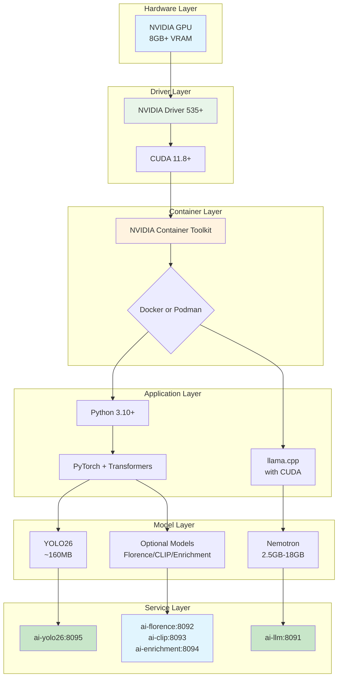
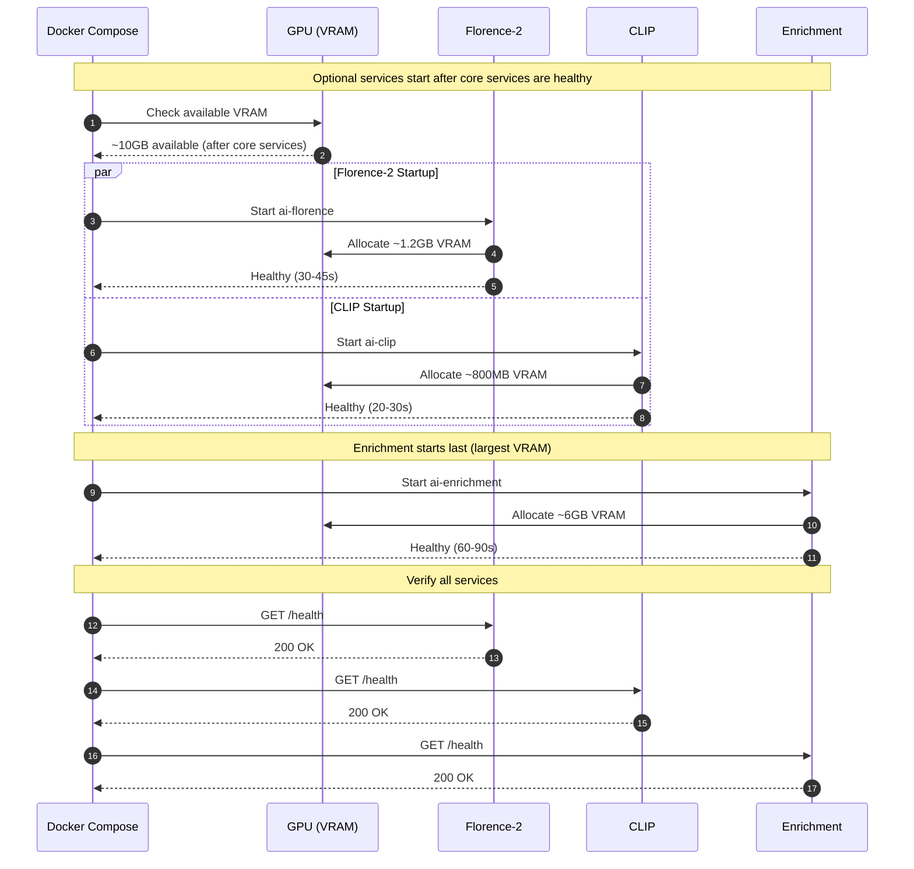

# AI Services Installation

> Install prerequisites and dependencies for AI inference services.

**Time to read:** ~10 min
**Prerequisites:** [AI Overview](ai-overview.md)

---

## Hardware Requirements

### VRAM Requirements by Deployment Scenario

| Scenario                       | Models Used                                      | VRAM Required     | Recommended GPU |
| ------------------------------ | ------------------------------------------------ | ----------------- | --------------- |
| **Dev (host-run)**             | Nemotron Mini 4B + YOLO26                        | 8GB minimum       | RTX 3060/4060   |
| **Prod (containerized, core)** | Nemotron-3-Nano-30B + YOLO26                     | 16GB minimum      | RTX 4080/A4000  |
| **Prod (all services)**        | Nano 30B + YOLO26 + Florence + CLIP + Enrichment | 24GB+ recommended | RTX A5500/4090  |

### Minimum

- **GPU**: NVIDIA RTX 3060 (8GB+ VRAM) or equivalent
- **VRAM**: 8GB minimum (~7GB used + buffer)
- **CUDA**: Version 11.8 or later
- **System RAM**: 16GB
- **Storage**: 10GB free space for models and cache

### Recommended (Tested Configuration)

- **GPU**: NVIDIA RTX A5500 (24GB VRAM)
- **VRAM**: 12GB+ (comfortable headroom)
- **CUDA**: Version 12.x
- **System RAM**: 32GB
- **Storage**: 20GB free space

### GPU Compatibility

Works with any NVIDIA GPU supporting CUDA compute capability 7.0+:

- RTX 20xx series and newer
- RTX 30xx series (3060, 3070, 3080, 3090)
- RTX 40xx series (4060, 4070, 4080, 4090)
- RTX A-series workstation GPUs
- Tesla/V100/A100 datacenter GPUs

**Not compatible**: AMD GPUs, Intel GPUs, Apple Silicon

---

## Software Prerequisites

### Installation Prerequisite Chain

The following flowchart shows the dependency chain for AI service installation:



### Operating System

| OS      | Supported Versions                           |
| ------- | -------------------------------------------- |
| Linux   | Ubuntu 20.04+, Fedora 36+ (tested on Fed 43) |
| Windows | WSL2 with Ubuntu                             |
| macOS   | Not supported (requires CUDA)                |

### 1. NVIDIA Drivers and CUDA

```bash
# Check NVIDIA driver installation
nvidia-smi

# Expected output includes:
# Driver Version: 550.54.15
# CUDA Version: 12.4
```

**Install if missing:**

```bash
# Ubuntu/Debian
sudo apt install nvidia-driver-550 nvidia-cuda-toolkit

# Fedora
sudo dnf install akmod-nvidia xorg-x11-drv-nvidia-cuda
```

### 2. Python 3.10+

```bash
# Check Python version
python3 --version  # Should be 3.10 or later

# Ubuntu/Debian
sudo apt install python3.10 python3-pip python3-venv

# Fedora
sudo dnf install python3.10 python3-pip
```

### 3. llama.cpp (for Nemotron)

llama.cpp provides the `llama-server` command for running the LLM.

**Option A: Check if installed**

```bash
which llama-server
```

**Option B: Build from source** (recommended for best performance)

```bash
# Install build dependencies
# Ubuntu/Debian
sudo apt install build-essential cmake git libcurl4-openssl-dev

# Fedora
sudo dnf install gcc-c++ cmake git libcurl-devel

# Clone and build
cd /tmp
git clone https://github.com/ggerganov/llama.cpp
cd llama.cpp
make LLAMA_CUDA=1 -j$(nproc)

# Install binary (choose one)
# System-wide
sudo install -m 755 llama-server /usr/local/bin/llama-server

# User-local
mkdir -p ~/.local/bin
install -m 755 llama-server ~/.local/bin/llama-server

# Verify
llama-server --version
```

Build time: ~5-10 minutes depending on CPU.

### 4. Python Dependencies (YOLO26)

```bash
cd $PROJECT_ROOT

# Install dependencies using uv (recommended - 10-100x faster than pip)
# Install uv: curl -LsSf https://astral.sh/uv/install.sh | sh
uv sync --extra dev

# This creates .venv and installs all dependencies from pyproject.toml
# The YOLO26 dependencies are included in the main project
```

Key dependencies (defined in `pyproject.toml`):

- `torch` + `torchvision` - PyTorch for deep learning
- `transformers` - HuggingFace model loading/inference (YOLO26)
- `fastapi` + `uvicorn` - Web server
- `pillow` + `opencv-python` - Image processing
- `pynvml` - NVIDIA GPU monitoring

---

## Model Downloads

### LLM Model Versions

This project supports two Nemotron LLM models for different deployment scenarios:

| Model                         | Size   | VRAM  | Use Case                   | Location                                                   |
| ----------------------------- | ------ | ----- | -------------------------- | ---------------------------------------------------------- |
| **Nemotron Mini 4B Instruct** | ~2.5GB | ~3GB  | Development (host-run)     | `ai/nemotron/nemotron-mini-4b-instruct-q4_k_m.gguf`        |
| **Nemotron-3-Nano-30B-A3B**   | ~18GB  | ~14GB | Production (containerized) | `/export/ai_models/nemotron/nemotron-3-nano-30b-a3b-q4km/` |

**When to use each:**

- **Mini 4B**: Fast iteration during development, lower quality reasoning but sufficient for testing pipelines
- **Nano 30B**: Production deployment with higher quality risk analysis, requires more VRAM

### Development Model (Mini 4B)

#### Automated Download

```bash
cd $PROJECT_ROOT
./ai/download_models.sh
```

**Downloads:**

1. **Nemotron Mini 4B Instruct (Q4_K_M)** - ~2.5GB

   - Source: HuggingFace (bartowski/nemotron-mini-4b-instruct-GGUF)
   - Location: `ai/nemotron/nemotron-mini-4b-instruct-q4_k_m.gguf`
   - Download time: ~5-10 minutes

2. **YOLO26** - ~160MB
   - Auto-downloaded on first use via HuggingFace transformers
   - Location: `~/.cache/huggingface/`

#### Manual Download (if automatic fails)

```bash
cd ai/nemotron
wget https://huggingface.co/bartowski/nemotron-mini-4b-instruct-GGUF/resolve/main/nemotron-mini-4b-instruct-Q4_K_M.gguf \
  -O nemotron-mini-4b-instruct-q4_k_m.gguf
```

### Production Model (Nano 30B)

For production deployments with better reasoning quality, download from the official NVIDIA HuggingFace repository: [nvidia/Nemotron-3-Nano-30B-A3B-GGUF](https://huggingface.co/nvidia/Nemotron-3-Nano-30B-A3B-GGUF)

```bash
# Create production model directory
mkdir -p /export/ai_models/nemotron/nemotron-3-nano-30b-a3b-q4km

# Download the model (large download, ~18GB)
cd /export/ai_models/nemotron/nemotron-3-nano-30b-a3b-q4km
wget https://huggingface.co/nvidia/Nemotron-3-Nano-30B-A3B-GGUF/resolve/main/Nemotron-3-Nano-30B-A3B-Q4_K_M.gguf \
  -O Nemotron-3-Nano-30B-A3B-Q4_K_M.gguf
```

The `docker-compose.prod.yml` expects this model at `/export/ai_models/nemotron/nemotron-3-nano-30b-a3b-q4km/`.

### Verify Downloads

```bash
# Check development model
ls -lh ai/nemotron/nemotron-mini-4b-instruct-q4_k_m.gguf
# Expected: ~2.5GB file

# Check production model (if downloaded)
ls -lh /export/ai_models/nemotron/nemotron-3-nano-30b-a3b-q4km/
# Expected: ~18GB file

# YOLO26 downloads automatically on first inference
```

---

## Verification

Run the startup script with status check:

```bash
./scripts/start-ai.sh status
```

This identifies any missing prerequisites.

---

## Optional AI Services Setup

Beyond the core YOLO26 and Nemotron services, three optional AI services provide enhanced detection capabilities. These are only needed for production deployments requiring advanced features.

### Optional AI Services Startup Sequence



### Service Overview

| Service        | Port | VRAM   | Purpose                                                              |
| -------------- | ---- | ------ | -------------------------------------------------------------------- |
| **Florence-2** | 8092 | ~1.2GB | Vision-language captions, OCR, dense region descriptions             |
| **CLIP**       | 8093 | ~800MB | Entity re-identification, scene anomaly detection                    |
| **Enrichment** | 8094 | ~6GB   | Vehicle/pet/clothing classification, depth estimation, pose analysis |

### Florence-2 Setup

Provides detailed scene descriptions and OCR capabilities.

```bash
# Download Florence-2-large model
mkdir -p /export/ai_models/model-zoo/florence-2-large
cd /export/ai_models/model-zoo/florence-2-large

# Clone from HuggingFace (requires git-lfs)
git lfs install
git clone https://huggingface.co/microsoft/Florence-2-large .
```

### CLIP Setup

Enables entity tracking across cameras and anomaly detection.

```bash
# Download CLIP ViT-L model
mkdir -p /export/ai_models/model-zoo/clip-vit-l
cd /export/ai_models/model-zoo/clip-vit-l

# Clone from HuggingFace
git lfs install
git clone https://huggingface.co/openai/clip-vit-large-patch14 .
```

### Enrichment Service Setup

Requires multiple specialized models:

```bash
# Create model directories
mkdir -p /export/ai_models/model-zoo/{vehicle-segment-classification,pet-classifier,fashion-clip,depth-anything-v2-small}

# Vehicle classification model
cd /export/ai_models/model-zoo/vehicle-segment-classification
git lfs install
git clone https://huggingface.co/lxyuan/vit-base-patch16-224-vehicle-segment-classification .

# Pet classifier
cd /export/ai_models/model-zoo/pet-classifier
git clone https://huggingface.co/microsoft/resnet-18 .

# FashionCLIP for clothing analysis
cd /export/ai_models/model-zoo/fashion-clip
git clone https://huggingface.co/patrickjohncyh/fashion-clip .

# Depth estimation
cd /export/ai_models/model-zoo/depth-anything-v2-small
git clone https://huggingface.co/depth-anything/Depth-Anything-V2-Small .
```

### Starting Optional Services

Start individual services:

```bash
# Start Florence-2 only
docker compose -f docker-compose.prod.yml up ai-florence -d

# Start CLIP only
docker compose -f docker-compose.prod.yml up ai-clip -d

# Start Enrichment service only
docker compose -f docker-compose.prod.yml up ai-enrichment -d
```

Or start all services including optional ones:

```bash
docker compose -f docker-compose.prod.yml up -d
```

### Verifying Optional Services

```bash
# Health checks
curl http://localhost:8092/health  # Florence-2
curl http://localhost:8093/health  # CLIP
curl http://localhost:8094/health  # Enrichment
```

---

## Next Steps

- [AI Configuration](ai-configuration.md) - Configure environment variables
- [AI GHCR Deployment](ai-ghcr-deployment.md) - Deploy AI services from GHCR
- [AI Services](ai-services.md) - Start and verify services
- [AI Troubleshooting](ai-troubleshooting.md) - Common issues and solutions

---

## See Also

- [GPU Setup](gpu-setup.md) - Detailed GPU driver and container configuration
- [GPU Troubleshooting](../reference/troubleshooting/gpu-issues.md) - CUDA and VRAM problems
- [AI Overview](ai-overview.md) - Architecture and capabilities

---

[Back to Operator Hub](./)
