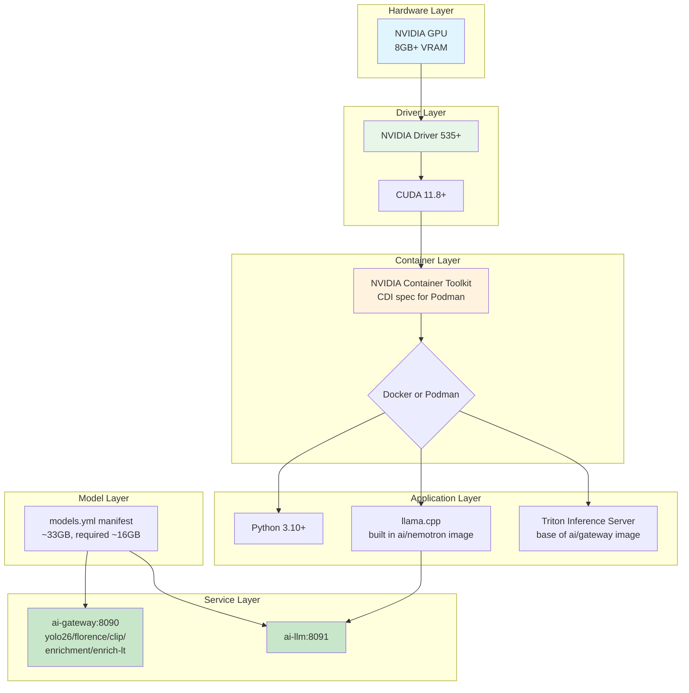

# AI Services Installation

> Install prerequisites and dependencies for AI inference services.

**Time to read:** ~10 min
**Prerequisites:** [AI Overview](ai-overview.md)

---

## Hardware Requirements

### VRAM Requirements by Deployment Scenario

| Scenario                       | Models Used                                                     | VRAM Required     | Recommended GPU |
| ------------------------------ | --------------------------------------------------------------- | ----------------- | --------------- |
| **Dev (host-run)**             | Nemotron Mini 4B + standalone YOLO26                            | 8GB minimum       | RTX 3060/4060   |
| **Prod (containerized, core)** | Nemotron-3-Nano-30B + ai-gateway (YOLO26, Florence-2, SigLIP 2) | 20GB minimum      | RTX 4080/A4000  |
| **Prod (all services)**        | Nano 30B + full gateway (enrichment loaded on demand)           | 24GB+ recommended | RTX A5500/4090  |

### Minimum

- **GPU**: NVIDIA RTX 3060 (8GB+ VRAM) or equivalent
- **VRAM**: 8GB minimum (~7GB used + buffer)
- **CUDA**: Version 11.8 or later
- **System RAM**: 16GB
- **Storage**: 40GB+ free space for models and cache (the `models.yml` manifest totals
  ~33GB; the four required models are ~16GB)

### Recommended (Tested Configuration)

- **GPU**: NVIDIA RTX A5500 (24GB VRAM) — or two GPUs, the default split is
  `GPU_LLM=0` + `GPU_AI_SERVICES=1`
- **VRAM**: 24GB+ (comfortable headroom)
- **CUDA**: Version 12.x
- **System RAM**: 32GB
- **Storage**: 60GB free space

### GPU Compatibility

Works with any NVIDIA GPU supporting CUDA compute capability 7.0+:

- RTX 20xx series and newer
- RTX 30xx series (3060, 3070, 3080, 3090)
- RTX 40xx series (4060, 4070, 4080, 4090)
- RTX A-series workstation GPUs
- Tesla/V100/A100 datacenter GPUs

**Not compatible**: AMD GPUs, Intel GPUs, Apple Silicon

---

## Software Prerequisites

### Installation Prerequisite Chain

The following flowchart shows the dependency chain for AI service installation:


```mermaid
flowchart TD
    subgraph "Hardware Layer"
        GPU[NVIDIA GPU<br/>8GB+ VRAM]
    end

    subgraph "Driver Layer"
        Driver[NVIDIA Driver 535+]
        CUDA[CUDA 11.8+]
    end

    subgraph "Container Layer"
        Toolkit[NVIDIA Container Toolkit<br/>CDI spec for Podman]
        Runtime{Docker or Podman}
    end

    subgraph "Application Layer"
        Python[Python 3.10+]
        Llama[llama.cpp<br/>built in ai/nemotron image]
        Triton[Triton Inference Server<br/>base of ai/gateway image]
    end

    subgraph "Model Layer"
        Models[models.yml manifest<br/>~33GB, required ~16GB]
    end

    subgraph "Service Layer"
        Gateway[ai-gateway:8090<br/>yolo26/florence/clip/<br/>enrichment/enrich-lt]
        LLM[ai-llm:8091]
    end

    GPU --> Driver
    Driver --> CUDA
    CUDA --> Toolkit
    Toolkit --> Runtime

    Runtime --> Python
    Runtime --> Llama
    Runtime --> Triton

    Models --> Gateway
    Models --> LLM
    Llama --> LLM

    style GPU fill:#e1f5fe
    style Driver fill:#e8f5e9
    style Toolkit fill:#fff3e0
    style Gateway fill:#c8e6c9
    style LLM fill:#c8e6c9
```

### Operating System

| OS      | Supported Versions                           |
| ------- | -------------------------------------------- |
| Linux   | Ubuntu 20.04+, Fedora 36+ (tested on Fed 43) |
| Windows | WSL2 with Ubuntu                             |
| macOS   | Not supported (requires CUDA)                |

### 1. NVIDIA Drivers and CUDA

```bash
# Check NVIDIA driver installation
nvidia-smi

# Expected output includes:
# Driver Version: 550.54.15
# CUDA Version: 12.4
```

**Install if missing:**

```bash
# Ubuntu/Debian
sudo apt install nvidia-driver-550 nvidia-cuda-toolkit

# Fedora
sudo dnf install akmod-nvidia xorg-x11-drv-nvidia-cuda
```

For the container path, also install `nvidia-container-toolkit` and generate the CDI
spec used by Podman (`sudo nvidia-ctk cdi generate --output=/etc/cdi/nvidia.yaml`) —
see [GPU Setup](gpu-setup.md).

### 2. Python 3.10+

```bash
# Check Python version
python3 --version  # Should be 3.10 or later

# Ubuntu/Debian
sudo apt install python3.10 python3-pip python3-venv

# Fedora
sudo dnf install python3.10 python3-pip
```

### 3. llama.cpp (host-run development only)

Only needed if you run `./ai/start_llm.sh` / `./ai/start_nemotron.sh` on the host. The
containerized `ai-llm` image builds llama.cpp from source inside the image
(`ai/nemotron/Dockerfile`) — you do **not** need a host install for the compose stack.

```bash
# Build from source (the ai/nemotron Dockerfile does the same inside the image)
sudo dnf install gcc-c++ cmake git libcurl-devel   # Ubuntu: build-essential cmake git libcurl4-openssl-dev
cd /tmp
git clone https://github.com/ggml-org/llama.cpp
cd llama.cpp
cmake -B build -DGGML_CUDA=ON && cmake --build build --config Release -j$(nproc)

# Verify
build/bin/llama-server --version
```

### 4. Python Dependencies (YOLO26 / dev tooling)

```bash
cd $PROJECT_ROOT

# Install dependencies using uv (recommended - 10-100x faster than pip)
# Install uv: curl -LsSf https://astral.sh/uv/install.sh | sh
uv sync --extra dev

# This creates .venv and installs all dependencies from pyproject.toml
```

Key dependencies (defined in `pyproject.toml`):

- `torch` + `torchvision` - PyTorch for deep learning (standalone `ai/yolo26/model.py` server)
- `transformers` - HuggingFace model loading/inference
- `fastapi` + `uvicorn` - Web server
- `pillow` + `opencv-python` - Image processing
- `pynvml` - NVIDIA GPU monitoring

---

## Model Downloads

All model weights are listed in the `models.yml` manifest at the repo root (30 models,
~33GB total). `./ai/download_models.sh` reads that manifest and downloads into
`${AI_MODELS_PATH:-/export/ai_models}`.

### Models You Actually Need

| Model                                                           | Size           | Required | Use Case                                      | Location (under `$AI_MODELS_PATH`)                  |
| --------------------------------------------------------------- | -------------- | -------- | --------------------------------------------- | --------------------------------------------------- |
| **Nemotron-3-Nano-30B-A3B**                                     | ~15GB (Q4_K_M) | yes      | Production LLM (`ai-llm`)                     | `nemotron/nemotron-3-nano-30b-a3b-q4km/`            |
| **YOLO26**                                                      | ~67MB          | yes      | Detection (`ai-gateway /yolo26`)              | `model-zoo/yolo26/` (Triton)                        |
| **Florence-2-base**                                             | ~1GB           | yes      | Vision-language (`/florence`)                 | `model-zoo/florence-2-base/`                        |
| **SigLIP 2 base**                                               | ~400MB         | yes      | Embeddings/ReID (`/clip`)                     | `model-zoo/siglip2-base-patch16-224/`               |
| Enrichment zoo (vehicle, pet, clothing, depth, pose, threat, …) | ~15GB combined | no       | `/enrichment`, `/enrich-lt`                   | `model-zoo/…`                                       |
| **Nemotron Mini 4B Instruct**                                   | ~2.5GB         | no       | Host-run dev fallback for `./ai/start_llm.sh` | `ai/nemotron/nemotron-mini-4b-instruct-q4_k_m.gguf` |

**When to use each LLM:**

- **Mini 4B**: Fast iteration during development, lower quality reasoning but sufficient for testing pipelines
- **Nano 30B**: Production deployment with higher quality risk analysis, requires more VRAM

### Automated Download

```bash
cd $PROJECT_ROOT
./ai/download_models.sh
```

This clones/downloads every model listed in `models.yml` into
`${AI_MODELS_PATH:-/export/ai_models}/{nemotron,model-zoo}/`. Set `AI_MODELS_PATH` to
use a different disk.

### Development Model (Mini 4B)

`ai/start_llm.sh` looks for the mini model at `ai/nemotron/nemotron-mini-4b-instruct-q4_k_m.gguf`
(not under `$AI_MODELS_PATH`). Download it manually:

```bash
cd ai/nemotron
wget https://huggingface.co/bartowski/nemotron-mini-4b-instruct-GGUF/resolve/main/nemotron-mini-4b-instruct-Q4_K_M.gguf \
  -O nemotron-mini-4b-instruct-q4_k_m.gguf
```

### Production Model (Nano 30B)

If you skip `download_models.sh`, download the LLM directly. The manifest fetches the
`unsloth/Nemotron-3-Nano-30B-A3B-GGUF` build; NVIDIA's own repository is
[nvidia/Nemotron-3-Nano-30B-A3B-GGUF](https://huggingface.co/nvidia/Nemotron-3-Nano-30B-A3B-GGUF):

```bash
# Create production model directory
mkdir -p /export/ai_models/nemotron/nemotron-3-nano-30b-a3b-q4km

# Download the model (large download, ~15GB)
cd /export/ai_models/nemotron/nemotron-3-nano-30b-a3b-q4km
wget https://huggingface.co/nvidia/Nemotron-3-Nano-30B-A3B-GGUF/resolve/main/Nemotron-3-Nano-30B-A3B-Q4_K_M.gguf \
  -O Nemotron-3-Nano-30B-A3B-Q4_K_M.gguf
```

The `docker-compose.prod.yml` `ai-llm` service expects this file under
`/export/ai_models/nemotron/nemotron-3-nano-30b-a3b-q4km/` (mounted at `/models`,
selected via `LLM_MODEL_PATH`).

### Verify Downloads

```bash
# Check development model (if downloaded)
ls -lh ai/nemotron/nemotron-mini-4b-instruct-q4_k_m.gguf
# Expected: ~2.5GB file

# Check production model
ls -lh /export/ai_models/nemotron/nemotron-3-nano-30b-a3b-q4km/
# Expected: ~15GB file

# Check gateway models
ls /export/ai_models/model-zoo/
# Expected: yolo26/, florence-2-base/, siglip2-base-patch16-224/, enrichment dirs
```

---

## Verification

There is no unified `scripts/start-ai.sh` (it was removed). Verify prerequisites
directly:

```bash
# GPU + driver
nvidia-smi

# Container GPU access (Podman CDI)
podman run --rm --device nvidia.com/gpu=all docker.io/nvidia/cuda:12.0-base-ubuntu22.04 nvidia-smi

# Model files present
ls /export/ai_models/model-zoo/ /export/ai_models/nemotron/
```

---

## Enrichment Services (inside ai-gateway)

Florence-2, CLIP/SigLIP 2 and the enrichment models are **not separate services**
anymore — they run inside the single `ai-gateway` container behind routers
`/florence`, `/clip`, `/enrichment` (heavy) and `/enrich-lt` (light). The old
standalone containers and ports (8092 Florence, 8093 CLIP, 8094 enrichment, 8096
enrichment-light) no longer exist.

To enable enrichment features you only need the model weights on disk and the
gateway running:

```bash
# 1. Models already fetched by ./ai/download_models.sh (manifest: models.yml)

# 2. Start the gateway
podman compose -f docker-compose.prod.yml up -d ai-gateway

# 3. Verify each router
curl -s http://localhost:8090/florence/health | jq
curl -s http://localhost:8090/clip/health | jq
curl -s http://localhost:8090/enrichment/health | jq
curl -s http://localhost:8090/enrich-lt/health | jq
```

Which enrichment tier (heavy vs light) handles a given model is set by the
`ENRICHMENT_*_SERVICE` variables — see [AI Configuration](ai-configuration.md).

---

## Next Steps

- [AI Configuration](ai-configuration.md) - Configure environment variables
- [AI GHCR Deployment](ai-ghcr-deployment.md) - Deploy AI services from GHCR
- [AI Services](ai-services.md) - Start and verify services
- [AI Troubleshooting](ai-troubleshooting.md) - Common issues and solutions

---

## See Also

- [GPU Setup](gpu-setup.md) - Detailed GPU driver and container configuration
- [GPU Troubleshooting](../reference/troubleshooting/gpu-issues.md) - CUDA and VRAM problems
- [AI Overview](ai-overview.md) - Architecture and capabilities

---

[Back to Operator Hub](README.md)
