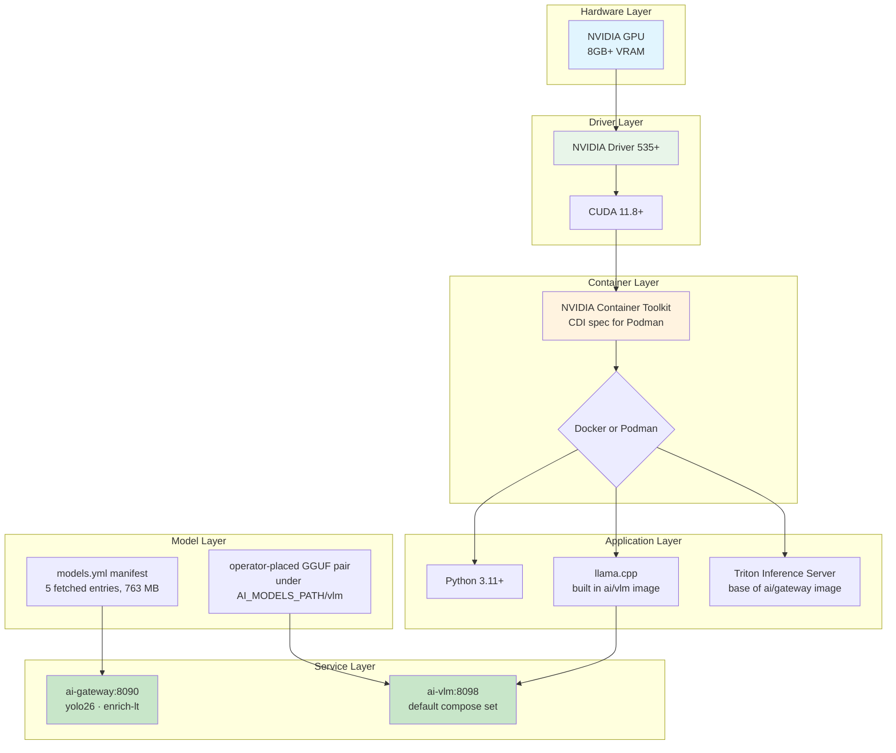

# AI Services Installation

> Install prerequisites and dependencies for AI inference services.

**Time to read:** ~10 min
**Prerequisites:** [AI Overview](ai-overview.md)

---

## Hardware Requirements

### VRAM Requirements by Deployment Scenario

| Scenario                | What runs                                                            | VRAM Required     | Recommended GPU  |
| ----------------------- | -------------------------------------------------------------------- | ----------------- | ---------------- |
| **Detection only**      | `ai-gateway` (Triton: yolo26 + reid)                                 | 8GB minimum       | RTX 3060         |
| **Full shipped path**   | `ai-gateway` + `ai-vlm` (Qwen3VL-8B + mmproj)                        | 20GB minimum      | RTX 4080/A4000   |
| **Everything resident** | As above with `BACKEND_MODEL_PRELOAD=true` (face + re-ID in-process) | 24GB+ recommended | RTX A5500 / 4090 |

The third row is not a preference. `setup.py` writes `BACKEND_MODEL_PRELOAD=true` only
when it detects **>= 24 GB** of VRAM, and below that the face and person-re-ID lookup
legs stay unloaded — every event reads `unavailable` for those two lines, and nothing
errors.

### Minimum

- **GPU**: NVIDIA RTX 3060 (8GB+ VRAM) or equivalent
- **VRAM**: 8GB minimum for detection alone
- **CUDA**: Version 11.8 or later
- **System RAM**: 16GB
- **Storage**: 10GB+ free for the provisioned models, plus the ~5.8 GB VLM GGUF pair you
  place yourself (see [Model Downloads](#model-downloads))

### Recommended (Tested Configuration)

- **GPU**: NVIDIA RTX A5500 (24GB VRAM) — or two GPUs, the default split is
  `GPU_LLM=0` + `GPU_AI_SERVICES=1`
- **VRAM**: 24GB+ (comfortable headroom, and it is the threshold `setup.py` uses to
  enable backend model residency)
- **CUDA**: Version 12.x
- **System RAM**: 32GB
- **Storage**: 60GB free space

### GPU Compatibility

Works with any NVIDIA GPU supporting CUDA compute capability 7.0+:

- RTX 20xx series and newer
- RTX 30xx series (3060, 3070, 3080, 3090)
- RTX 40xx series (4060, 4070, 4080, 4090)
- RTX A-series workstation GPUs
- Tesla/V100/A100 datacenter GPUs

**Not compatible**: AMD GPUs, Intel GPUs, Apple Silicon

---

## Software Prerequisites

### Installation Prerequisite Chain


```mermaid
flowchart TD
    subgraph "Hardware Layer"
        GPU[NVIDIA GPU<br/>8GB+ VRAM]
    end

    subgraph "Driver Layer"
        Driver[NVIDIA Driver 535+]
        CUDA[CUDA 11.8+]
    end

    subgraph "Container Layer"
        Toolkit[NVIDIA Container Toolkit<br/>CDI spec for Podman]
        Runtime{Docker or Podman}
    end

    subgraph "Application Layer"
        Python[Python 3.11+]
        Llama[llama.cpp<br/>built in ai/vlm image]
        Triton[Triton Inference Server<br/>base of ai/gateway image]
    end

    subgraph "Model Layer"
        Models[models.yml manifest<br/>5 fetched entries, 763 MB]
        VlmW[operator-placed GGUF pair<br/>under AI_MODELS_PATH/vlm]
    end

    subgraph "Service Layer"
        Gateway[ai-gateway:8090<br/>yolo26 · enrich-lt]
        Vlm[ai-vlm:8098<br/>default compose set]
    end

    GPU --> Driver
    Driver --> CUDA
    CUDA --> Toolkit
    Toolkit --> Runtime

    Runtime --> Python
    Runtime --> Llama
    Runtime --> Triton

    Models --> Gateway
    VlmW --> Vlm
    Llama --> Vlm

    style GPU fill:#e1f5fe
    style Driver fill:#e8f5e9
    style Toolkit fill:#fff3e0
    style Gateway fill:#c8e6c9
    style Vlm fill:#c8e6c9
```

### Operating System

| OS      | Supported Versions                           |
| ------- | -------------------------------------------- |
| Linux   | Ubuntu 20.04+, Fedora 36+ (tested on Fed 43) |
| Windows | WSL2 with Ubuntu                             |
| macOS   | Not supported (requires CUDA)                |

### 1. NVIDIA Drivers and CUDA

```bash
# Check NVIDIA driver installation
nvidia-smi

# Expected output includes:
# Driver Version: 550.54.15
# CUDA Version: 12.4
```

**Install if missing:**

```bash
# Ubuntu/Debian
sudo apt install nvidia-driver-550 nvidia-cuda-toolkit

# Fedora
sudo dnf install akmod-nvidia xorg-x11-drv-nvidia-cuda
```

For the container path, also install `nvidia-container-toolkit` and generate the CDI
spec used by Podman (`sudo nvidia-ctk cdi generate --output=/etc/cdi/nvidia.yaml`) —
see [GPU Setup](gpu-setup.md).

### 2. Python

```bash
python3 --version   # the interpreter the project pins; see .python-version
```

### 3. llama.cpp (you do not need it)

The `ai-vlm` image builds llama.cpp from source inside the image
(`ai/vlm/Dockerfile`) — you do **not** need a host install for the compose stack. Set
`CUDA_ARCHITECTURES` in `.env` to your card's compute capability (for example `89` for
Ada, `86` for Ampere) before building: it cuts the llama.cpp build time by roughly 6x.

### 4. Python Dependencies (YOLO26 / dev tooling)

```bash
cd $PROJECT_ROOT

# Install dependencies using uv (recommended - 10-100x faster than pip)
# Install uv: curl -LsSf https://astral.sh/uv/install.sh | sh
uv sync --extra dev

# This creates .venv and installs all dependencies from pyproject.toml
```

Key dependencies (defined in `pyproject.toml`):

- `torch` + `torchvision` - PyTorch for deep learning (standalone `ai/yolo26/model.py` server)
- `transformers` - HuggingFace model loading/inference
- `fastapi` + `uvicorn` - Web server
- `pillow` + `opencv-python` - Image processing
- `pynvml` - NVIDIA GPU monitoring

---

## Model Downloads

Two different provisioning mechanisms feed the shipped stack, and conflating them is
the most common install failure.

### 1. Script-provisioned (manifest: `models.yml`)

`./ai/download_models.sh` reads `models.yml` and fetches the entries its rule selects —
**5 entries, 763 MB by the manifest's `size_mb` estimates**:

| Model                    | Use Case                                                 | Location (under `$AI_MODELS_PATH`)    |
| ------------------------ | -------------------------------------------------------- | ------------------------------------- |
| YOLO26 n/s/m `.pt`       | Detection — gateway Triton export input                  | `model-zoo/yolo26/`                   |
| OSNet-AIN x1.0           | Person re-ID (Triton `reid` + in-process `osnet_loader`) | `model-zoo/osnet-ain-x1-0/`           |
| Threat-Detection-YOLOv8n | Weapons — Triton `threat` (opt-in lane)                  | `model-zoo/threat-detection-yolov8n/` |
| YOLO11 face detection    | Face detection on person crops                           | `model-zoo/yolo11-face-detection/`    |
| YOLO11 license-plate     | Plate detection                                          | `model-zoo/yolo11-license-plate/`     |

```bash
cd $PROJECT_ROOT
./ai/download_models.sh                       # default ${AI_MODELS_PATH:-/export/ai_models}
AI_MODELS_PATH=/mnt/big/models ./ai/download_models.sh
```

Five manifest entries are deliberately **not** fetched because their libraries pull what
they need at runtime: `face-detector-scrfd`, `face-recognizer` (insightface /
onnxruntime), `fast-alpr`, `paddleocr`, and `yolo26-general` (weights unreleased).

### 2. Operator-placed: the VLM GGUF pair

Nothing in this repository downloads the reasoning engine's weights — its identity is
operator config. Place **both** files under `${AI_MODELS_PATH}/vlm/`, which compose
mounts read-only into `ai-vlm` at `/models`:

```bash
mkdir -p "${AI_MODELS_PATH:-/export/ai_models}/vlm"
cd "${AI_MODELS_PATH:-/export/ai_models}/vlm"

# The pair named by VLM_MODEL_PATH + VLM_MMPROJ_PATH — one identity.
# 5,027,784,800 B main + 752,289,728 B projector for the shipped 8B.
wget https://huggingface.co/Qwen/Qwen3-VL-8B-Instruct-GGUF/resolve/main/Qwen3VL-8B-Instruct-Q4_K_M.gguf
wget https://huggingface.co/Qwen/Qwen3-VL-8B-Instruct-GGUF/resolve/main/mmproj-Qwen3VL-8B-Instruct-Q8_0.gguf

# The AI service runs as uid 1000; files fetched into the weights root commonly
# land mode 640 and the serve then dies on "Permission denied" reading a file the
# host operator can read fine.
chmod 644 Qwen3VL-8B-Instruct-Q4_K_M.gguf mmproj-Qwen3VL-8B-Instruct-Q8_0.gguf

# Pin them against the measured sizes before starting anything
ls -l Qwen3VL-8B-Instruct-Q4_K_M.gguf mmproj-Qwen3VL-8B-Instruct-Q8_0.gguf
```

`AI_MODELS_PATH` is **never assigned** in `.env.example` — `setup.py` writes it. If you
skip `setup.py`, set it yourself or the compose mount silently targets the
`/export/ai_models` default.

> [!WARNING]
>
> **Fetch the Q8_0 projector, not the F16.** The same repo also ships
> `mmproj-Qwen3VL-8B-Instruct-F16.gguf`; taking it yields a serve that starts and a file
> that matches no pin anyone has. **And the mmproj file is not optional** — llama.cpp
> starts and answers `/health` with 200 without a projector, the compose healthcheck
> passes, and every `vlm_assess` call then degrades silently against a text-only server.
> If the two filenames differ from the defaults in `.env.example`, update
> `VLM_MODEL_PATH` and `VLM_MMPROJ_PATH` together, and move `VLM_MODEL_ID` with them.

The measured 4B pair (`Qwen/Qwen3-VL-4B-Instruct-GGUF`: 2,497,281,664 B + 453,974,304 B)
is the named fallback when the 8B does not fit a 24 GB card.

### Verify Downloads

```bash
# Script-provisioned models
ls "${AI_MODELS_PATH:-/export/ai_models}/model-zoo/"
# Expected: yolo26/, osnet-ain-x1-0/, threat-detection-yolov8n/,
#           yolo11-face-detection/, yolo11-license-plate/

# The VLM pair (the script creates the directory; it does not fill it)
ls -lh "${AI_MODELS_PATH:-/export/ai_models}/vlm/"
# Expected: BOTH .gguf files, not one
```

---

## Verification

There is no unified `scripts/start-ai.sh`. Verify prerequisites directly:

```bash
# GPU + driver
nvidia-smi

# Container GPU access (Podman CDI)
podman run --rm --device nvidia.com/gpu=all docker.io/nvidia/cuda:12.0-base-ubuntu22.04 nvidia-smi

# Model files present
ls "${AI_MODELS_PATH:-/export/ai_models}/model-zoo/" "${AI_MODELS_PATH:-/export/ai_models}/vlm/"
```

---

## Starting the AI Services

```bash
# Gateway: starts with a plain up
podman compose -f docker-compose.prod.yml up -d ai-gateway

# VLM: starts with the same default set, no flag needed
podman compose -f docker-compose.prod.yml up -d ai-vlm

# Verify each gateway router and the VLM
curl -s http://localhost:8090/yolo26/health | jq
curl -s http://localhost:8090/enrich-lt/health | jq
curl -s http://localhost:8098/health | jq

# Prove the projector loaded — /health passing does NOT prove this
podman logs ai-vlm 2>&1 | grep -i mmproj
curl -s http://localhost:8098/props | jq
```

`ai-vlm` is in the default compose set, so the command above resolves with no flag. Until
UR-18 it sat behind a gate that had to be named explicitly, and a plain
`podman compose ... up -d ai-vlm` started nothing while reporting success; that behaviour
is gone. The drop-before-resolve rule still applies to the services that remain gated —
`ai-llm-vllm` resolves only with `--profile vllm` on the command line.

---

## Next Steps

- [AI Configuration](ai-configuration.md) - Configure environment variables
- [AI GHCR Deployment](ai-ghcr-deployment.md) - Deploy AI services from GHCR
- [AI Services](ai-services.md) - Start and verify services
- [AI Troubleshooting](ai-troubleshooting.md) - Common issues and solutions

---

## See Also

- [GPU Setup](gpu-setup.md) - Detailed GPU driver and container configuration
- [GPU Troubleshooting](../reference/troubleshooting/gpu-issues.md) - CUDA and VRAM problems
- [AI Overview](ai-overview.md) - Architecture and capabilities

---

[Back to Operator Hub](README.md)
