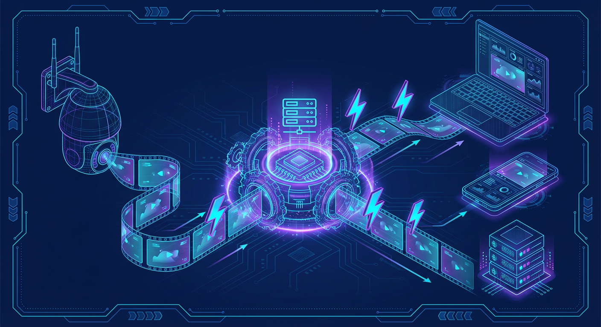
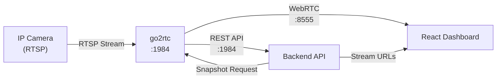

# AI Services Overview

> Understanding the AI inference services that power object detection and risk analysis.

**Time to read:** ~5 min
**Prerequisites:** None

---

## What the AI Does

The AI pipeline transforms raw camera images into risk-scored security events using **core AI services** plus
an **enrichment layer** that adds context (attributes, captions, re-ID, and other signals).

Two containers do all the AI work in production:

| Container    | Host port           | Runtime          | What it serves                                         |
| ------------ | ------------------- | ---------------- | ------------------------------------------------------ |
| `ai-gateway` | 8090 (metrics 8002) | Triton + FastAPI | YOLO26, Florence-2, CLIP, enrichment (light and heavy) |
| `ai-llm`     | 8091                | llama.cpp        | Nemotron 30B risk reasoning                            |

The gateway exposes one router per model family: `/yolo26`, `/florence`, `/clip`,
`/enrichment`, `/enrich-lt`. The older per-model containers and their ports (8092,
8093, 8094, 8095, 8096) no longer exist — they were consolidated into Triton.

### YOLO26 Detection (`/yolo26` on the gateway, port 8090)

**Purpose:** Real-time object detection from camera images

- Identifies security-relevant objects: person, car, truck, dog, cat, bird, bicycle, motorcycle, bus
- Returns bounding boxes with confidence scores (0-100%)
- Processes images in 30-50ms on GPU

**Technology:**

- YOLO26 TensorRT engine served by Triton; ~2GB VRAM resident
- Routes: `POST /yolo26/detect` (multipart `file` upload), `/yolo26/detect/batch`,
  `/yolo26/segment`, `GET /yolo26/health`

### NVIDIA Nemotron LLM Server (Port 8091)

**Purpose:** Risk reasoning and natural language generation

- Analyzes batched detections for context
- Assigns risk scores (0-100) based on what, when, and how
- Generates human-readable summaries and reasoning

**Technology:**

- llama.cpp server with NVIDIA Nemotron GGUF models
- ChatML format with `<|im_start|>` / `<|im_end|>` message delimiters
- Model options by deployment:

| Deployment     | Model                                                                                                                                                 | VRAM     | Context              |
| -------------- | ----------------------------------------------------------------------------------------------------------------------------------------------------- | -------- | -------------------- |
| **Production** | [NVIDIA Nemotron-3-Nano-30B-A3B Q4_K_M](https://huggingface.co/nvidia/Nemotron-3-Nano-30B-A3B-GGUF) (`models.yml` fetches the `unsloth/…-GGUF` build) | ~14.7 GB | 262,144 (`CTX_SIZE`) |
| **Fallback**   | Nemotron Mini 4B Instruct — only `ai/start_llm.sh` and the host-run `ai/start_nemotron.sh` fall back to it                                            | ~3 GB    | 4,096                |

`CTX_SIZE=262144` is 8 parallel slots × 32,768 tokens each. The 30B model at that
context enables:

- Analyzing all detections across extended time windows (hours of activity)
- Rich historical baseline comparisons
- Cross-camera activity correlation in a single prompt

### go2rtc Video Streaming Integration



Camera streams are proxied through go2rtc, which provides WebRTC for low-latency live viewing in the dashboard and a REST API for the backend to request snapshots and manage streams.



## Enrichment Services (gateway routers `/enrichment` and `/enrich-lt`)

Everything below runs inside the single `ai-gateway` container on port 8090:

- **`/florence`**: Florence-2 vision-language extraction — `/extract`, `/ocr`,
  `/dense-caption`, `/phrase-grounding`, `/detect_security_objects`
- **`/clip`**: SigLIP 2 embeddings and re-identification — `/embed`, `/classify`,
  `/similarity`, `/anomaly-score`
- **`/enrichment`** (heavy): vehicle, clothing, demographics, action
- **`/enrich-lt`** (light): pose, threat, person ReID, pet, depth

Which of the two enrichment tiers handles a given model is decided by the
`ENRICHMENT_*_SERVICE` variables in `.env` (`light` or `heavy`); the defaults send
pose/threat/reid/pet/depth to the light tier and vehicle/clothing/action/demographics
to the heavy tier.

These feed into the backend's enrichment pipeline and ultimately improve the context
sent to the LLM.

> [!NOTE]
> The backend also has a "model zoo" (`backend/services/model_zoo.py`, manifest
> `models.yml`) that can run additional enrichment steps in-process when VRAM allows,
> instead of calling the gateway.

## Architecture Diagram

```
+---------------------------------------------+  +---------------------------+
|           ai-gateway  :8090 (Triton)        |  |   ai-llm  :8091 (llama.cpp)|
|                                             |  |                           |
|  /yolo26   /florence   /clip                |  |   NVIDIA Nemotron         |
|  /enrichment           /enrich-lt           |  |   Risk Analysis           |
|                                             |  |                           |
|  Detection + enrichment                     |  |   VRAM ~14.7GB*           |
|  VRAM ~4-6GB   detect latency 30-50ms       |  |   analyze latency 2-5s    |
+---------------------------------------------+  +---------------------------+
           ^                                             ^
           | POST /yolo26/detect (multipart)             | POST /completion
           |                                             | (ChatML prompt + JSON)
    +------+--------+                          +---------+---------+
    | DetectorClient|                          | NemotronAnalyzer  |
    | (backend)     |                          | (backend)         |
    +---------------+                          +-------------------+

* Nemotron VRAM: ~3GB (Mini 4B host-run) or ~14.7GB (30B production)
```

## Resource Requirements

VRAM depends heavily on which services/models are enabled.

| Profile                  | Typical VRAM | Notes                                                            |
| ------------------------ | ------------ | ---------------------------------------------------------------- |
| **Minimal (dev)**        | ~8-12GB      | YOLO26 (~2GB) + Nemotron Mini 4B (~3GB) or offloaded 30B         |
| **Full AI stack (prod)** | ~22-24GB     | YOLO26 + Florence-2 + CLIP + enrichment + Nemotron 30B (~14.7GB) |

**Production Breakdown (per `models.yml`, all core models on one GPU):**

- ai-gateway resident (YOLO26 ~2GB, Florence-2 ~1.5GB, SigLIP 2 ~200MB): ~4GB
- NVIDIA Nemotron-3-Nano-30B-A3B (Q4_K_M): ~14.7GB
- Enrichment models load on demand on top of the ~4GB base

The default two-GPU split (`GPU_LLM=0`, `GPU_AI_SERVICES=1`) puts ~16GB on GPU 0 and
~6GB on GPU 1. See [GPU Setup](gpu-setup.md) for the full breakdown.

## Deployment Model

AI services can run either:

- **Fully containerized** (recommended for production): `docker-compose.prod.yml`
- **Host-run** (useful for development): `./ai/start_detector.sh`, `./ai/start_llm.sh`,
  `./ai/start_nemotron.sh`

There is no unified `scripts/start-ai.sh` wrapper in this repository.

## Service Endpoints

| Router (ai-gateway :8090) | Endpoint      | Method | Purpose                              |
| ------------------------- | ------------- | ------ | ------------------------------------ |
| `/yolo26`                 | `/health`     | GET    | Health check                         |
| `/yolo26`                 | `/detect`     | POST   | Object detection (multipart image)   |
| `/florence`               | `/health`     | GET    | Health check                         |
| `/clip`                   | `/health`     | GET    | Health check                         |
| `/enrichment`             | `/health`     | GET    | Health check                         |
| `/enrich-lt`              | `/health`     | GET    | Health check                         |
| `ai-llm` :8091            | `/health`     | GET    | Health check                         |
| `ai-llm` :8091            | `/completion` | POST   | Risk analysis (ChatML prompt + JSON) |

---

## Next Steps

- [AI Installation](ai-installation.md) - Set up prerequisites and dependencies
- [AI Configuration](ai-configuration.md) - Configure environment variables
- [AI Services](ai-services.md) - Starting, stopping, verifying services

---

## See Also

- [GPU Setup](gpu-setup.md) - GPU drivers and container access
- [Pipeline Overview](../developer/pipeline-overview.md) - How images flow through AI services
- [Risk Levels Reference](../reference/config/risk-levels.md) - How risk scores are interpreted
- [AI Troubleshooting](ai-troubleshooting.md) - Common issues and solutions

---

[Back to Operator Hub](README.md)
