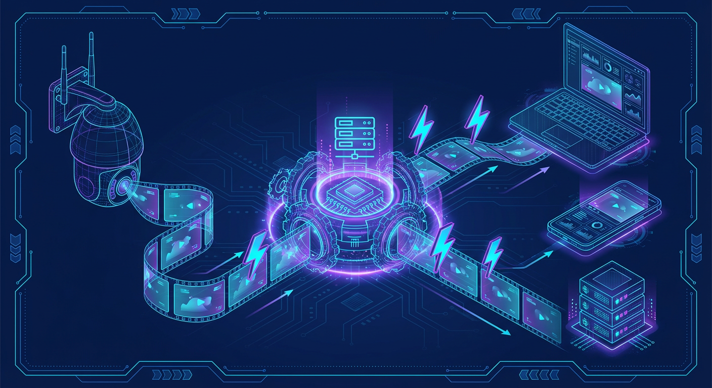
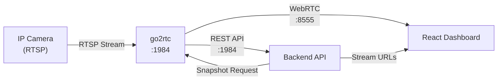

# AI Services Overview

> Understanding the AI inference services that power object detection and risk analysis.

**Time to read:** ~5 min
**Prerequisites:** None

---

## What the AI Does

The AI pipeline turns camera images into risk-scored security events. Two containers do
all of the GPU inference in production:

| Container    | Host port           | Runtime          | What it serves                                          |
| ------------ | ------------------- | ---------------- | ------------------------------------------------------- |
| `ai-gateway` | 8090 (metrics 8002) | Triton + FastAPI | `/yolo26` detection, `/enrich-lt` resident specialists  |
| `ai-vlm`     | 8098                | llama.cpp        | Qwen3VL-8B multimodal verdicts (`/v1/chat/completions`) |

`ai-vlm` is behind the compose profile `vlm` and is off until you start it with
`--profile vlm`. It is the reasoning engine the pipeline calls. The optional `vllm`
profile's `ai-llm-vllm` (host `VLLM_PORT`, default 8097) is a benchmarking target:
nothing in the backend sends it traffic, and it appears in no `depends_on`.

Everything else the pipeline needs runs **in-process in the backend**, not in a
container: the face, license-plate and person-re-ID legs are database **lookups**
(`face_recognizer_loader`, `fast_alpr_loader`, `osnet_loader`) whose outputs are handed
to the VLM as prompt text. Their weights load only when `BACKEND_MODEL_PRELOAD=true`,
which ships `false` — see [Resource Requirements](#resource-requirements).

### The path, hop by hop

```
camera drop -> FileWatcher -> Redis Streams (detections:stream)
  -> DetectorClient -> POST ai-gateway:8090/yolo26/detect
  -> Detection rows -> BatchAggregator -> analysis:stream
  -> VlmAnalyzer: select 1..4 key frames, collect the three lookup legs,
     POST ai-vlm:8098/v1/chat/completions, apply verdict invariants
  -> Event row (+ event_verifications) -> WS /ws/events + GET /api/events
```

The fuller version, with the silent-failure surfaces, is
[AI pipeline: current state](../architecture/ai-pipeline-current-state.md).

### YOLO26 Detection (`/yolo26` on the gateway, port 8090)

**Purpose:** Object detection from camera images

- Identifies security-relevant objects: person, car, truck, dog, cat, bird, bicycle, motorcycle, bus
- Returns bounding boxes with confidence scores (0-100%)
- Processes images in 30-50ms on GPU

**Technology:**

- YOLO26 served by Triton on the ONNX Runtime CUDA execution provider (`ai/triton/model_repository/yolo26`)
- Routes: `POST /yolo26/detect` (multipart `file` upload), `/yolo26/detect/batch`,
  `/yolo26/segment`, `GET /yolo26/health`

### The resident Triton specialists (`/enrich-lt` on the gateway)

Triton keeps two more models resident alongside YOLO26: `reid` (OSNet-AIN x1.0, ONNX
Runtime) and `threat` (YOLOv8n weapons, joined only when `GATEWAY_ENABLE_THREAT=true`,
which ships `false`). The router exposes `POST /enrich-lt/person-reid`,
`POST /enrich-lt/threat-detect` and `GET /enrich-lt/health`.

Today `/enrich-lt` is a **readiness lane**: the backend's model-management route probes
`ENRICHMENT_LIGHT_URL` to report whether the gateway is up, and the live re-ID work is
done in-process by `osnet_loader`. That mismatch is a settled owner question, not a
fault you should debug — see §4 of
[AI pipeline: current state](../architecture/ai-pipeline-current-state.md).

### VLM Reasoning (`ai-vlm`, port 8098)

**Purpose:** Risk reasoning and natural language generation

- Reads the batched detections plus the three lookup legs
- Assigns risk scores (0-100) based on what, when, and how
- Generates the summary, the reasoning, and the `event_verifications` verdict

**Technology:**

- `llama-server` serving a Qwen3-VL GGUF plus its **mmproj projector**; the projector
  is what makes the serve multimodal
- `POST /v1/chat/completions` with up to four base64 key frames; the prompt is fitted
  to the served slot before it is sent
- A rejected verdict is clamped to at most `severity_low_max` with the clamp left
  visible in the reasoning; an unreachable VLM writes a `verification_failed` row with
  a NULL score — the Event row still lands

| Deployment   | Model                                                                                                                           | Context               |
| ------------ | ------------------------------------------------------------------------------------------------------------------------------- | --------------------- |
| **Shipped**  | `Qwen3VL-8B-Instruct-Q4_K_M` + `mmproj-Qwen3VL-8B-Instruct-Q8_0` (`VLM_MODEL_PATH`)                                             | 32,768 across 2 slots |
| **Fallback** | The measured 4B pair, if the 8B does not fit a 24 GB card (`VLM_MODEL_PATH` + `VLM_MMPROJ_PATH` + `VLM_MODEL_ID` move together) | same slot sizing      |

`VLM_CTX_SIZE=32768` split across `VLM_PARALLEL=2` gives each request 16,384 tokens,
which is what a four-image batch shares with its own verdict.

### go2rtc Video Streaming Integration



Camera streams are proxied through go2rtc, which provides WebRTC for low-latency live viewing in the dashboard and a REST API for the backend to request snapshots and manage streams.


```mermaid
flowchart LR
    CAM["IP Camera<br/>(RTSP)"] -->|RTSP Stream| G2R["go2rtc<br/>:1984"]
    G2R -->|"WebRTC<br/>:8555"| UI["React Dashboard"]
    G2R -->|"REST API<br/>:1984"| BE["Backend API"]
    BE -->|Stream URLs| UI
    BE -->|Snapshot Request| G2R
```

> [!NOTE]
> The backend also has a "model zoo" (`backend/services/model_zoo.py`, manifest
> `models.yml`) that provisions the in-process lookup weights and reports their VRAM
> reservations.

## Architecture Diagram

```
+---------------------------------------------+  +--------------------------------+
|        ai-gateway  :8090 (Triton)           |  |     ai-vlm :8098 (llama.cpp)   |
|                                             |  |   behind profile `vlm`         |
|  /yolo26      detect · batch · segment      |  |                                |
|  /enrich-lt   person-reid · threat-detect   |  |  Qwen3VL-8B + mmproj           |
|             (readiness lane)                |  |  POST /v1/chat/completions     |
|                                             |  |  (<=4 key frames -> verdict)   |
+---------------------------------------------+  +--------------------------------+
           ^                                             ^
           | POST /yolo26/detect (multipart)             | POST /v1/chat/completions
           |                                             | (images + specialist text)
    +------+---------+   three in-process lookups  +-----+---------+
    | DetectorClient |   faces · plates · person_  |  VlmAnalyzer  |
    | (backend)      |   reid -> prompt text       |  (backend)    |
    +----------------+                             +---------------+
```

## Resource Requirements

| Profile               | Typical VRAM | Notes                                                                          |
| --------------------- | ------------ | ------------------------------------------------------------------------------ |
| **Detection only**    | ~4-6 GB      | `ai-gateway` with the shipped `vlm` model set                                  |
| **Full shipped path** | ~14-16 GB    | `ai-gateway` + `ai-vlm` on the 8B pair; a 24 GB card is the comfortable target |

`setup.py` sets `BACKEND_MODEL_PRELOAD=true` only when it detects **>= 24 GB** of VRAM.
Below that — or if you answer no — the `faces` and `person_reid` lines read
`unavailable` on every event and nothing fails; the plate leg loads on demand. The
counter that answers "has this ever run" is `hsi_specialist_unavailable_total`, exported
at `GET /api/metrics` on the backend (`curl http://localhost:8000/api/metrics`).

The default two-GPU split (`GPU_LLM=0`, `GPU_AI_SERVICES=1`) puts the VLM on GPU 0 and
Triton on GPU 1. See [GPU Setup](gpu-setup.md) for the full breakdown.

## Deployment Model

AI services run:

- **Fully containerized** (the supported path): `docker-compose.prod.yml`, with
  `ai-vlm` started by `--profile vlm`
- **Host-run detection** (development only): `./ai/start_detector.sh`, which collides
  with the gateway's host port unless you move `YOLO26_PORT`

There is no unified `scripts/start-ai.sh` wrapper in this repository.

## Service Endpoints

| Router (ai-gateway :8090) | Endpoint               | Method | Purpose                                  |
| ------------------------- | ---------------------- | ------ | ---------------------------------------- |
| `/yolo26`                 | `/health`              | GET    | Health check                             |
| `/yolo26`                 | `/detect`              | POST   | Object detection (multipart image)       |
| `/enrich-lt`              | `/health`              | GET    | Readiness probe                          |
| `ai-vlm` :8098            | `/health`              | GET    | Health check (does not prove multimodal) |
| `ai-vlm` :8098            | `/props`               | GET    | Served model identity + build            |
| `ai-vlm` :8098            | `/v1/chat/completions` | POST   | Risk analysis (images + text)            |

---

## Next Steps

- [AI Installation](ai-installation.md) - Set up prerequisites and dependencies
- [AI Configuration](ai-configuration.md) - Configure environment variables
- [AI Services](ai-services.md) - Starting, stopping, verifying services

---

## See Also

- [GPU Setup](gpu-setup.md) - GPU drivers and container access
- [Pipeline Overview](../developer/pipeline-overview.md) - How images flow through AI services
- [Risk Levels Reference](../reference/config/risk-levels.md) - How risk scores are interpreted
- [AI Troubleshooting](ai-troubleshooting.md) - Common issues and solutions

---

[Back to Operator Hub](README.md)
