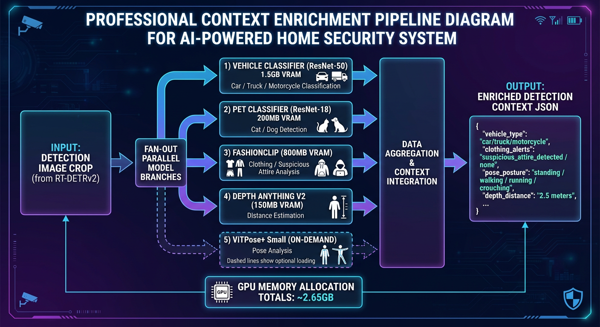

# AI Services Management

> Start, stop, verify, and monitor AI inference services.

**Time to read:** ~8 min
**Prerequisites:** [AI Configuration](ai-configuration.md)

---

## Starting Services

> [!IMPORTANT]
> This doc covers **host-run AI** (useful for development) and **containerized AI** (recommended for production).
> In production, `docker-compose.prod.yml` defines _all_ AI services (8090–8094).
>
> For “which URL should I use?” (container DNS vs host vs remote), start with: [Deployment Modes & AI Networking](deployment-modes.md).

### Unified Startup (Recommended)

Use the unified startup script to manage the **core host-run** AI services (YOLO26 + Nemotron):

```bash
./scripts/start-ai.sh start
```

**Expected output:**

```
==========================================
Starting AI Services
==========================================

[INFO] Checking prerequisites...
[OK] NVIDIA GPU detected: NVIDIA RTX A5500
[OK] CUDA available
[OK] llama-server found: /usr/bin/llama-server
[OK] Python found: /usr/bin/python3
[OK] Nemotron model found (2.5G)
[WARN] YOLO26 model not found (will auto-download)
[OK] All prerequisites satisfied

[INFO] Starting YOLO26 detection server...
[OK] YOLO26 detection server started successfully
  Port: 8090
  PID: 12345
  Log: /tmp/yolo26-detector.log
  Expected VRAM: ~4GB

[INFO] Starting Nemotron LLM server...
[OK] Nemotron LLM server started successfully
  Port: 8091
  PID: 12346
  Log: /tmp/nemotron-llm.log
  Expected VRAM: ~3GB
```

First startup takes longer (~2-3 minutes) due to:

- Model loading into VRAM
- CUDA initialization
- GPU warmup inferences

### Individual Service Startup

Start services separately for debugging:

```bash
# YOLO26 detection server
./ai/start_detector.sh

# Nemotron LLM server (in separate terminal)
./ai/start_llm.sh
```

---

## Production (containerized AI services)

Start the full stack (including Florence/CLIP/Enrichment):

```bash
docker compose -f docker-compose.prod.yml up -d
```

Start only the core services:

```bash
docker compose -f docker-compose.prod.yml up -d postgres redis backend frontend ai-yolo26 ai-llm
```

Start only AI services (all 5):

```bash
docker compose -f docker-compose.prod.yml up -d ai-yolo26 ai-llm ai-florence ai-clip ai-enrichment
```

Stop:

```bash
docker compose -f docker-compose.prod.yml down
```

---

## Service Management

### Check Status

```bash
./scripts/start-ai.sh status
```

Output shows:

- Service status (RUNNING/STOPPED)
- Process IDs
- Health check results
- GPU memory usage
- Log file locations

### Stop Services

```bash
./scripts/start-ai.sh stop
```

Performs graceful shutdown (10 second timeout), force kills if not responding.

### Restart Services

```bash
./scripts/start-ai.sh restart
```

Useful after:

- Model updates
- Configuration changes
- Service crashes

### Health Check

```bash
./scripts/start-ai.sh health
```

Returns:

- HTTP health check results
- Service response times
- Detailed status JSON

---

## Verification

### Test YOLO26 Detection

```bash
# Health check
curl http://localhost:8095/health
```

**Expected response:**

```json
{
  "status": "healthy",
  "model_loaded": true,
  "device": "cuda:0",
  "cuda_available": true,
  "vram_used_gb": 4.2
}
```

**Test detection (requires test image):**

```bash
cd ai/yolo26
python example_client.py path/to/test/image.jpg
```

### Test Nemotron LLM

### Test Florence / CLIP / Enrichment (production)

```bash
curl http://localhost:8092/health  # Florence-2
curl http://localhost:8093/health  # CLIP
curl http://localhost:8094/health  # Enrichment
```

```bash
# Health check
curl http://localhost:8091/health

# Test completion
curl -X POST http://localhost:8091/completion \
  -H "Content-Type: application/json" \
  -d '{
    "prompt": "Analyze: A person detected at front door at 14:30.",
    "temperature": 0.7,
    "max_tokens": 200
  }'
```

### Integration Test

Test full pipeline from backend:

```bash
cd backend

# Run integration tests
pytest tests/integration/ -v -k "test_ai_pipeline"

# Run full test suite
pytest tests/ -v
```

---

## Service Logs

### View Logs

```bash
# YOLO26 logs
tail -f /tmp/yolo26-detector.log

# Nemotron LLM logs
tail -f /tmp/nemotron-llm.log

# Both logs (parallel)
tail -f /tmp/yolo26-detector.log -f /tmp/nemotron-llm.log
```

### Backend Integration Logging

The backend automatically monitors AI service health:

```bash
# Check backend logs for AI service status
cd backend
tail -f logs/app.log | grep -E "yolo26|nemotron"
```

Backend logs include:

- Connection failures
- Timeout errors
- Health check results
- Inference latencies

---

## Production Deployment

### Systemd Service Units

Create systemd services for production. Replace placeholders with actual values.

**YOLO26 Service:**

```bash
sudo tee /etc/systemd/system/ai-yolo26.service > /dev/null << EOF
[Unit]
Description=YOLO26 Object Detection Service
After=network.target

[Service]
Type=simple
User=$(whoami)
WorkingDirectory=${PROJECT_ROOT}/ai/yolo26
ExecStart=/usr/bin/python3 model.py
Restart=always
RestartSec=10

[Install]
WantedBy=multi-user.target
EOF
```

**Nemotron LLM Service:**

```bash
sudo tee /etc/systemd/system/ai-llm.service > /dev/null << EOF
[Unit]
Description=Nemotron LLM Service
After=network.target

[Service]
Type=simple
User=$(whoami)
ExecStart=/usr/bin/llama-server --model ${PROJECT_ROOT}/ai/nemotron/nemotron-mini-4b-instruct-q4_k_m.gguf --port 8091 --ctx-size 4096 --n-gpu-layers 99 --host 0.0.0.0 --parallel 2 --cont-batching
Restart=always
RestartSec=10

[Install]
WantedBy=multi-user.target
EOF
```

**Enable and start:**

```bash
sudo systemctl daemon-reload
sudo systemctl enable ai-yolo26 ai-llm
sudo systemctl start ai-yolo26 ai-llm
```

### Auto-start on Boot

Add to crontab:

```bash
crontab -e

# Add line:
@reboot /path/to/project/scripts/start-ai.sh start
```

---

## Quick Reference

### Common Commands

```bash
# Start all AI services
./scripts/start-ai.sh start

# Stop all AI services
./scripts/start-ai.sh stop

# Check status
./scripts/start-ai.sh status

# Health check
./scripts/start-ai.sh health

# Check GPU
nvidia-smi

# Download models
./ai/download_models.sh
```



_Context enrichment pipeline showing how detection data flows through zone analysis, baseline comparison, and cross-camera correlation._

### Service Endpoints

| Service  | Endpoint                  | Purpose          |
| -------- | ------------------------- | ---------------- |
| YOLO26   | GET /health               | Health check     |
| YOLO26   | POST /detect              | Object detection |
| YOLO26   | POST /detect/batch        | Batch detection  |
| Nemotron | GET /health               | Health check     |
| Nemotron | POST /completion          | Text completion  |
| Nemotron | POST /v1/chat/completions | Chat API         |

### Expected Resource Usage

| Service  | VRAM | CPU    | Latency | Throughput    |
| -------- | ---- | ------ | ------- | ------------- |
| YOLO26   | ~4GB | 10-20% | 30-50ms | 20-30 img/s   |
| Nemotron | ~3GB | 5-10%  | 2-5s    | 0.2-0.5 req/s |

---

## Next Steps

- [AI GHCR Deployment](ai-ghcr-deployment.md) - Deploy AI services from GHCR
- [AI Troubleshooting](ai-troubleshooting.md) - Common issues and solutions
- [AI Performance](ai-performance.md) - Performance tuning
- [AI TLS](ai-tls.md) - Secure communications

---

## See Also

- [GPU Setup](gpu-setup.md) - GPU driver and container configuration
- [AI Issues (Troubleshooting)](../reference/troubleshooting/ai-issues.md) - Detailed problem-solving guide
- [AI Configuration](ai-configuration.md) - Environment variables

---

[Back to Operator Hub](./)
