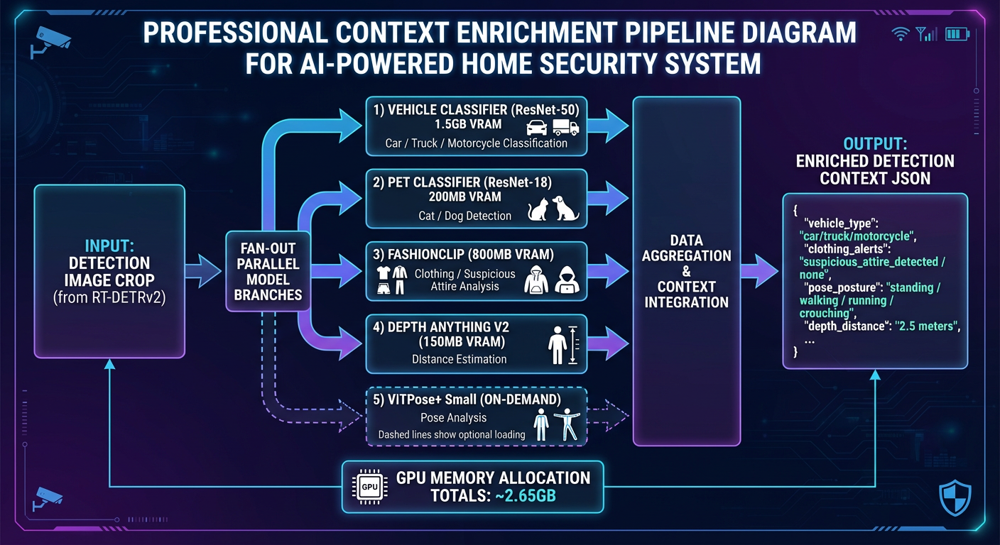

# AI Services Management

> Start, stop, verify, and monitor AI inference services.

**Time to read:** ~8 min
**Prerequisites:** [AI Configuration](ai-configuration.md)

---

## Two Ways To Run AI

| Mode                                        | What runs                                                                                                                      | Use for                               |
| ------------------------------------------- | ------------------------------------------------------------------------------------------------------------------------------ | ------------------------------------- |
| **Containerized** (production, recommended) | `ai-gateway` (Triton: YOLO26, Florence-2, CLIP, enrichment light + heavy) on host port 8090, plus `ai-llm` (llama.cpp) on 8091 | Everything except local development   |
| **Host-run**                                | `./ai/start_detector.sh` (standalone YOLO26 server) and `./ai/start_llm.sh` / `./ai/start_nemotron.sh` (llama.cpp)             | Debugging a model outside a container |

The containerized stack is what `docker-compose.prod.yml` starts; there is no
`scripts/start-ai.sh` in this repository — that wrapper was removed. Manage host-run
services with the `./ai/start_*.sh` scripts below and `pkill`.

For "which URL should I use?" (container DNS vs host vs remote), start with:
[Deployment Modes & AI Networking](deployment-modes.md).

### Host-run services

```bash
# Terminal 1: standalone YOLO26 detection server (PORT defaults to ${YOLO26_PORT:-8090})
./ai/start_detector.sh

# Terminal 2: Nemotron via llama.cpp (port ${NEMOTRON_PORT:-8091})
./ai/start_nemotron.sh      # prefers the 30B GGUF, falls back to the mini 4B
./ai/start_llm.sh           # mini 4B only, 4096 ctx, --n-gpu-layers 99
```

Both bind `0.0.0.0` so a containerised backend can reach them. First startup takes
2-3 minutes for model loading, CUDA initialisation and warmup inferences.

Stop them with `pkill -f model.py` and `pkill -f llama-server`.

---

## Production (containerized AI services)

Start the full stack:

```bash
podman compose -f docker-compose.prod.yml up -d
```

Start only the core services:

```bash
podman compose -f docker-compose.prod.yml up -d postgres redis backend frontend ai-gateway ai-llm
```

Start only the AI services:

```bash
podman compose -f docker-compose.prod.yml up -d ai-gateway ai-llm
```

Stop:

```bash
podman compose -f docker-compose.prod.yml down
```

---

## Service Management

### Check Status

```bash
podman compose -f docker-compose.prod.yml ps ai-gateway ai-llm
podman inspect --format '{{.State.Health.Status}}' ai-gateway ai-llm
```

### Restart

```bash
podman compose -f docker-compose.prod.yml restart ai-gateway
podman compose -f docker-compose.prod.yml restart ai-llm
```

Useful after model updates, configuration changes, or a crash loop. Rebuilding after a
code change always takes `--no-cache` (cached layers hold stale code):

```bash
podman compose -f docker-compose.prod.yml build --no-cache ai-gateway
podman compose -f docker-compose.prod.yml up -d ai-gateway
```

### Startup Timing

| Service      | `start_period` | Why                                            |
| ------------ | -------------- | ---------------------------------------------- |
| `ai-gateway` | 180s           | Triton initialises 13 models                   |
| `ai-llm`     | 300s           | 31B parameter model loads tensors onto the GPU |

A service reported `unhealthy` inside its `start_period` is still loading, not broken.

---

## Verification

### Aggregate health

```bash
curl -s http://localhost:8090/health | jq    # ai-gateway (all Triton models)
curl -s http://localhost:8091/health | jq    # ai-llm (llama.cpp)
```

`ai-gateway/health` returns `"healthy"` only when Triton's server is ready **and**
every model reports ready; otherwise `"degraded"`.

### Per-router health

```bash
curl -s http://localhost:8090/yolo26/health | jq
curl -s http://localhost:8090/florence/health | jq
curl -s http://localhost:8090/clip/health | jq
curl -s http://localhost:8090/enrichment/health | jq
curl -s http://localhost:8090/enrich-lt/health | jq
```

Each returns the model name and a `model_loaded` boolean, e.g.
`{"status":"healthy","model":"yolo26","model_loaded":true}`.

### Test a detection

`/yolo26/detect` takes a **multipart** upload in the `file` field (this is what the
backend's `detector_client.py` sends — there is no JSON body):

```bash
curl -s -X POST http://localhost:8090/yolo26/detect \
  -F "file=@/path/to/test.jpg" | jq '.detections | length'
```

Against the standalone host server the same upload goes to `http://localhost:8090/detect`;
that server additionally accepts an `image_base64` form field (`-F "image_base64=$(base64 -w0 /path/to/test.jpg)"`)
as an alternative to the `file` field.

### Test the LLM

```bash
curl -s http://localhost:8091/health | jq

curl -s -X POST http://localhost:8091/completion \
  -H "Content-Type: application/json" \
  -d '{
    "prompt": "Analyze: A person detected at front door at 14:30.",
    "temperature": 0.7,
    "max_tokens": 200
  }' | jq
```

### Integration Test

```bash
uv run pytest backend/tests/integration/ -v -k "ai"
```

---

## Service Logs

### Containerized

```bash
podman compose -f docker-compose.prod.yml logs -f ai-gateway
podman compose -f docker-compose.prod.yml logs -f ai-llm

# Triton's own startup log (model load failures show here first)
podman logs ai-gateway 2>&1 | grep -iE "error|failed|model"
```

### Host-run

```bash
tail -f /tmp/nemotron.log          # ./ai/start_nemotron.sh
tail -f /tmp/yolo26-detector.log   # ./ai/start_detector.sh (when launched via the old wrapper)
```

### Backend Integration Logging

The backend monitors AI service health continuously (`ServiceHealthMonitor`):

```bash
podman compose -f docker-compose.prod.yml logs -f backend | grep -iE "yolo26|nemotron|gateway"
```

Backend logs include connection failures, timeout errors, health-check results and
inference latencies.

---

## Production Deployment

Production runs AI inside the compose stack with `restart: unless-stopped`; no systemd
unit is needed. If you deliberately run the LLM on the host (for example to share a GPU
with another workload), use `ai/start_nemotron.sh` under a unit like this:

```bash
sudo tee /etc/systemd/system/ai-llm.service > /dev/null << 'EOF'
[Unit]
Description=Nemotron LLM Service (llama.cpp)
After=network.target

[Service]
Type=simple
User=CHANGE_ME
Environment=NEMOTRON_MODEL_PATH=/export/ai_models/nemotron/nemotron-3-nano-30b-a3b-q4km/Nemotron-3-Nano-30B-A3B-Q4_K_M.gguf
Environment=NEMOTRON_GPU_LAYERS=35
Environment=NEMOTRON_CONTEXT_SIZE=12288
ExecStart=/path/to/project/ai/start_nemotron.sh
Restart=always
RestartSec=10

[Install]
WantedBy=multi-user.target
EOF

sudo systemctl daemon-reload
sudo systemctl enable --now ai-llm
```

`ai/start_nemotron.sh` exits early when the health endpoint already answers, so a
systemd unit and a manual start can coexist. Note that the backend's auto-recovery
allowlist (`backend/services/service_managers.py`, `ALLOWED_RESTART_SCRIPTS`) names
`scripts/restart_nemotron.sh` and `scripts/restart_yolo26.sh`, neither of which exists
in the tree — container recovery goes through the Podman socket and
`health_monitor_orchestrator.py`, not these scripts.

---

## Quick Reference

### Common Commands

```bash
# Containerized AI
podman compose -f docker-compose.prod.yml up -d ai-gateway ai-llm
podman compose -f docker-compose.prod.yml restart ai-gateway
podman compose -f docker-compose.prod.yml logs -f ai-llm

# Host-run AI
./ai/start_detector.sh
./ai/start_nemotron.sh

# GPU
nvidia-smi

# Download models (manifest: models.yml)
./ai/download_models.sh
```



_Context enrichment pipeline showing how detection data flows through zone analysis, baseline comparison, and cross-camera correlation._

### Service Endpoints

| Router         | Endpoint                                            | Purpose          |
| -------------- | --------------------------------------------------- | ---------------- |
| `/yolo26`      | GET /health                                         | Health check     |
| `/yolo26`      | POST /detect                                        | Object detection |
| `/yolo26`      | POST /detect/batch                                  | Batch detection  |
| `/yolo26`      | POST /segment                                       | Segmentation     |
| `/florence`    | POST /extract, /ocr, /dense-caption                 | Vision-language  |
| `/clip`        | POST /embed, /similarity, /anomaly-score            | Embeddings       |
| `/enrichment`  | POST /enrich, /vehicle-classify, /clothing-classify | Heavy enrichment |
| `/enrich-lt`   | POST /pose-analyze, /threat-detect, /person-reid    | Light enrichment |
| `ai-llm` :8091 | GET /health                                         | Health check     |
| `ai-llm` :8091 | POST /completion                                    | Text completion  |

All `/yolo26`, `/florence`, `/clip`, `/enrichment` and `/enrich-lt` paths are prefixed
with the router name and served on `AI_GATEWAY_PORT` (default 8090).

### Expected Resource Usage

| Container    | VRAM (resident)      | GPU                   | Notes                                                               |
| ------------ | -------------------- | --------------------- | ------------------------------------------------------------------- |
| `ai-llm`     | ~14.7GB              | `GPU_LLM` (0)         | Nemotron-3-Nano-30B Q4_K_M                                          |
| `ai-gateway` | ~4GB base, ~6GB peak | `GPU_AI_SERVICES` (1) | YOLO26 + Florence-2 + SigLIP 2 resident; enrichment loads on demand |

See [GPU Setup](gpu-setup.md) for the full per-model VRAM breakdown.

---

## Next Steps

- [AI GHCR Deployment](ai-ghcr-deployment.md) - Deploy AI services from GHCR
- [AI Troubleshooting](ai-troubleshooting.md) - Common issues and solutions
- [AI Performance](ai-performance.md) - Performance tuning
- [AI TLS](ai-tls.md) - Secure communications

---

## See Also

- [GPU Setup](gpu-setup.md) - GPU driver and container configuration
- [AI Issues (Troubleshooting)](../reference/troubleshooting/ai-issues.md) - Detailed problem-solving guide
- [AI Configuration](ai-configuration.md) - Environment variables

---

[Back to Operator Hub](README.md)
