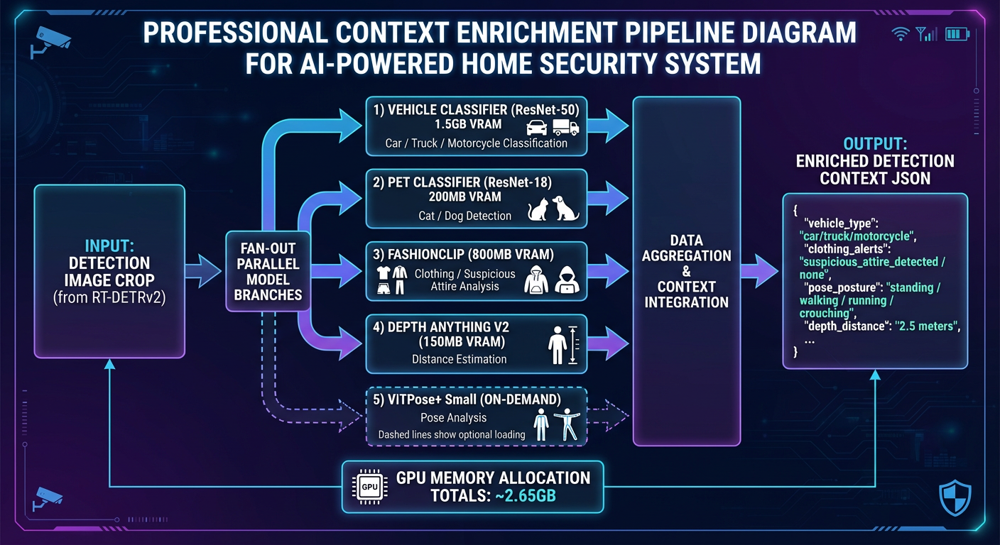

# AI Services Management

> Start, stop, verify, and monitor AI inference services.

**Time to read:** ~8 min
**Prerequisites:** [AI Configuration](ai-configuration.md)

---

## Two Ways To Run AI

| Mode                                        | What runs                                                                            | Use for                               |
| ------------------------------------------- | ------------------------------------------------------------------------------------ | ------------------------------------- |
| **Containerized** (production, recommended) | `ai-gateway` (Triton + FastAPI) on host port 8090, plus `ai-vlm` (llama.cpp) on 8098 | Everything except local development   |
| **Host-run**                                | `./ai/start_detector.sh` (standalone YOLO26 server)                                  | Debugging a model outside a container |

The containerized stack is what `docker-compose.prod.yml` starts; there is no
`scripts/start-ai.sh` in this repository. `ai-vlm` sits behind the compose profile
`vlm`, so every compose call that names it must carry `--profile vlm` (see
[Starting ai-vlm](#starting-ai-vlm)).

For "which URL should I use?" (container DNS vs host vs remote), start with:
[Deployment Modes & AI Networking](deployment-modes.md).

### Host-run detection server

```bash
# PORT defaults to ${YOLO26_PORT:-8090} — the same host port ai-gateway publishes,
# so run it with ai-gateway down or point YOLO26_PORT at a free port.
./ai/start_detector.sh
```

It binds `0.0.0.0` so a containerised backend can reach it. Stop it with
`pkill -f model.py`.

---

## Production (containerized AI services)

### Starting ai-vlm

`ai-vlm` is the only shipped AI service behind a compose profile. A plain `up -d`
starts `ai-gateway` and leaves the reasoning engine down:

```bash
# Correct: the profile must be on the command line.
podman compose -f docker-compose.prod.yml --profile vlm up -d ai-vlm
```

This is not a style preference. podman-compose drops a service whose profile is
inactive **before** it resolves the service names on the command line, so
`up -d ai-vlm` without `--profile vlm` reports success and starts nothing.
`setup_lib/deploy_phases.py` threads `--profile vlm` through every compose call
that names `ai-vlm`; `scripts/restart-all.sh` does not (see
[Troubleshooting a missing ai-vlm](ai-troubleshooting.md#ai-vlm-is-not-running)).

### Start commands

```bash
# Full stack, VLM included
podman compose -f docker-compose.prod.yml --profile vlm up -d

# Core services only
podman compose -f docker-compose.prod.yml up -d postgres redis backend frontend ai-gateway

# Only the AI services
podman compose -f docker-compose.prod.yml --profile vlm up -d ai-gateway ai-vlm
```

Stop:

```bash
podman compose -f docker-compose.prod.yml --profile vlm down
```

---

## Service Management

### Check Status

```bash
podman compose -f docker-compose.prod.yml --profile vlm ps ai-gateway ai-vlm
podman inspect --format '{{.State.Health.Status}}' ai-gateway ai-vlm
```

### Restart

```bash
podman compose -f docker-compose.prod.yml restart ai-gateway
podman compose -f docker-compose.prod.yml --profile vlm up -d --force-recreate ai-vlm
```

Useful after model updates, configuration changes, or a crash loop. Rebuilding after a
code change always takes `--no-cache` (cached layers hold stale code):

```bash
podman compose -f docker-compose.prod.yml build --no-cache ai-gateway
podman compose -f docker-compose.prod.yml up -d ai-gateway
```

### Startup Timing

| Service      | `start_period` | Why                                         |
| ------------ | -------------- | ------------------------------------------- |
| `ai-gateway` | 180s           | Triton initialises the resident models      |
| `ai-vlm`     | 120s           | llama.cpp copies the GGUF pair onto the GPU |

A service reported `unhealthy` inside its `start_period` is still loading, not broken.

---

## Verification

### Aggregate health

```bash
curl -s http://localhost:8090/health | jq    # ai-gateway (all Triton models)
curl -s http://localhost:8098/health | jq    # ai-vlm (llama.cpp)
```

`ai-gateway/health` returns `"healthy"` only when Triton's server is ready **and**
every model reports ready; otherwise `"degraded"`.

> [!WARNING]
> A `200` from `http://localhost:8098/health` does **not** prove the serve can see
> images. llama.cpp starts happily without its `--mmproj` projector, and the
> projector is what makes it multimodal; a text-only server answers `/health`, and
> so does the compose healthcheck. Prove the projector is loaded before trusting a
> green check — [AI Troubleshooting](ai-troubleshooting.md#the-vlm-answers-but-cannot-see).

### Per-router health

```bash
curl -s http://localhost:8090/yolo26/health | jq
curl -s http://localhost:8090/enrich-lt/health | jq
```

Each returns the model name and a `model_loaded` boolean, e.g.
`{"status":"healthy","model":"yolo26","model_loaded":true}`.

### Test a detection

`/yolo26/detect` takes a **multipart** upload in the `file` field (this is what the
backend's `detector_client.py` sends — there is no JSON body):

```bash
curl -s -X POST http://localhost:8090/yolo26/detect \
  -F "file=@/path/to/test.jpg" | jq '.detections | length'
```

Against the standalone host server the same upload goes to `http://localhost:8090/detect`;
that server additionally accepts an `image_base64` form field (`-F "image_base64=$(base64 -w0 /path/to/test.jpg)"`)
as an alternative to the `file` field.

### Test the VLM

The reasoning engine is OpenAI-compatible; the backend posts base64 key frames to
`/v1/chat/completions`:

```bash
curl -s http://localhost:8098/health | jq
curl -s http://localhost:8098/props | jq          # served model path + build info

curl -s -X POST http://localhost:8098/v1/chat/completions \
  -H "Content-Type: application/json" \
  -d '{
    "model": "Qwen3VL-8B",
    "messages": [{"role": "user", "content": "One sentence: what is a porch camera likely to capture at 14:30?"}],
    "max_tokens": 120
  }' | jq
```

`/props` is also where the backend's enforcement probe reads the build string it
asserts against `VLM_REQUIRED_BUILD`.

### Integration Test

```bash
uv run pytest backend/tests/integration/ -v -k "ai"
```

---

## Service Logs

### Containerized

```bash
podman compose -f docker-compose.prod.yml logs -f ai-gateway
podman compose -f docker-compose.prod.yml --profile vlm logs -f ai-vlm

# Triton's own startup log (model load failures show here first)
podman logs ai-gateway 2>&1 | grep -iE "error|failed|model"

# Whether the multimodal projector actually loaded
podman logs ai-vlm 2>&1 | grep -i mmproj
```

### Host-run

```bash
tail -f /tmp/yolo26-detector.log   # ./ai/start_detector.sh, when redirected
```

### Backend Integration Logging

The backend monitors AI service health continuously (`ServiceHealthMonitor`):

```bash
podman compose -f docker-compose.prod.yml logs -f backend | grep -iE "yolo26|vlm|gateway"
```

Backend logs include connection failures, timeout errors, health-check results and
inference latencies.

---

## Production Deployment

Production runs AI inside the compose stack with `restart: unless-stopped`; no systemd
unit is needed, and a systemd unit competing with compose for a profile-gated,
loopback-published service is the wrong shape here.

The backend's auto-recovery allowlist (`backend/services/service_managers.py`,
`ALLOWED_RESTART_SCRIPTS`) contains exactly one host script, `ai/start_detector.sh`;
anything else it accepts is a `docker restart <container>` against a name that passes
`CONTAINER_NAME_PATTERN`. Container recovery goes through the Podman socket and
`health_monitor_orchestrator.py`. Because `ai-vlm` needs `--profile vlm` to exist at
all, a recovery path that only knows how to restart a running container cannot bring it
back — start it yourself with the profile.

---

## Quick Reference

### Common Commands

```bash
# Containerized AI
podman compose -f docker-compose.prod.yml --profile vlm up -d ai-gateway ai-vlm
podman compose -f docker-compose.prod.yml restart ai-gateway
podman compose -f docker-compose.prod.yml --profile vlm logs -f ai-vlm

# Host-run detection
./ai/start_detector.sh

# GPU
nvidia-smi

# Download models (manifest: models.yml)
./ai/download_models.sh
```



_Context enrichment pipeline showing how detection data flows through zone analysis, baseline comparison, and cross-camera correlation._

### Service Endpoints

| Router         | Endpoint                          | Purpose                           |
| -------------- | --------------------------------- | --------------------------------- |
| `/yolo26`      | GET /health                       | Health check                      |
| `/yolo26`      | POST /detect                      | Object detection                  |
| `/yolo26`      | POST /detect/batch                | Batch detection                   |
| `/yolo26`      | POST /segment                     | Segmentation                      |
| `/enrich-lt`   | GET /health                       | Readiness probe                   |
| `/enrich-lt`   | POST /threat-detect, /person-reid | Resident Triton specialists       |
| `ai-vlm` :8098 | GET /health                       | Health check                      |
| `ai-vlm` :8098 | GET /props, /v1/models            | Served-model identity and build   |
| `ai-vlm` :8098 | POST /v1/chat/completions         | Multimodal verdict (`vlm_assess`) |

`/yolo26` and `/enrich-lt` are prefixed with the router name and served on
`AI_GATEWAY_PORT` (default 8090).

### Expected Resource Usage

| Container    | GPU                   | Notes                                                                                                   |
| ------------ | --------------------- | ------------------------------------------------------------------------------------------------------- |
| `ai-gateway` | `GPU_AI_SERVICES` (1) | Triton holds `yolo26` + `reid`; `threat` joins only when `GATEWAY_ENABLE_THREAT=true`                   |
| `ai-vlm`     | `GPU_LLM` (0)         | llama.cpp with the Qwen3VL-8B GGUF + mmproj pair; sleeps to CPU RAM after `VLM_SLEEP_IDLE_SECONDS` idle |

The face, plate and person-re-ID **lookup** legs do not run in either container — they
run in-process in the backend (`osnet_loader`, `face_recognizer_loader`,
`fast_alpr_loader`) and are residency-gated on `BACKEND_MODEL_PRELOAD`, which ships
`false`. See [GPU Setup](gpu-setup.md) for the per-model VRAM breakdown.

---

## Next Steps

- [AI GHCR Deployment](ai-ghcr-deployment.md) - Deploy AI services from GHCR
- [AI Troubleshooting](ai-troubleshooting.md) - Common issues and solutions
- [AI Performance](ai-performance.md) - Performance tuning
- [AI TLS](ai-tls.md) - Secure communications

---

## See Also

- [GPU Setup](gpu-setup.md) - GPU driver and container configuration
- [AI Issues (Troubleshooting)](../reference/troubleshooting/ai-issues.md) - Detailed problem-solving guide
- [AI Configuration](ai-configuration.md) - Environment variables

---

[Back to Operator Hub](README.md)
