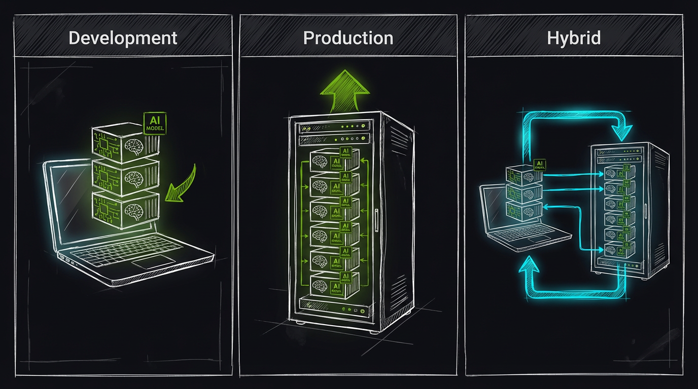
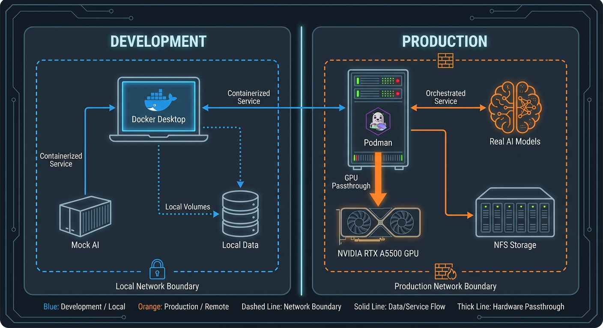

# Deployment Modes & AI Networking



_AI-generated visualization comparing Development, Production, and Hybrid deployment modes._

> A practical operator guide for choosing a deployment mode and setting `RTDETR_URL` / `NEMOTRON_URL` / `FLORENCE_URL` / `CLIP_URL` / `ENRICHMENT_URL` correctly.

If you're seeing "AI services unreachable" in health checks, **it's almost always a networking mode mismatch**: the backend is trying to reach the AI services using the wrong hostname.

---

## Deployment Topology Overview



_Visual overview of deployment topologies and AI service connectivity options._

---

## Decision Table (pick one)


_Decision flowchart for choosing between Production (recommended), Development, and Hybrid deployment modes._

| Mode                            | When to choose                                                          | Backend runs                              | AI runs                            | What URLs should look like                                                             |
| ------------------------------- | ----------------------------------------------------------------------- | ----------------------------------------- | ---------------------------------- | -------------------------------------------------------------------------------------- |
| **Production (recommended)**    | You want the simplest “it just runs” setup                              | **Container** (`docker-compose.prod.yml`) | **Containers** (`ai-*`)            | `http://ai-detector:8090`, `http://ai-llm:8091`, ...                                   |
| **All-host development**        | You’re developing locally and want zero container networking complexity | **Host** (uvicorn)                        | **Host** (`./scripts/start-ai.sh`) | `http://localhost:8090`, `http://localhost:8091`, ...                                  |
| **Backend container + host AI** | You want hot-reload containers, but AI runs on the host (GPU reasons)   | **Container** (`docker-compose.yml`)      | **Host**                           | `http://host.docker.internal:8090` (Docker Desktop) or `http://<host-ip>:8090` (Linux) |
| **Remote AI host**              | AI runs on a separate GPU box                                           | Host or container                         | **Remote host**                    | `http://<gpu-host>:8090` etc.                                                          |

> For authoritative ports/env defaults, see `docs/reference/config/env-reference.md`.

---

## Mode 1: Production (docker-compose.prod.yml)

### Start

```bash
docker compose -f docker-compose.prod.yml up -d
```

### `.env` (backend → AI via compose DNS)

```bash
RTDETR_URL=http://ai-detector:8090
NEMOTRON_URL=http://ai-llm:8091
FLORENCE_URL=http://ai-florence:8092
CLIP_URL=http://ai-clip:8093
ENRICHMENT_URL=http://ai-enrichment:8094
```

### Verify from inside the backend container

```bash
docker compose -f docker-compose.prod.yml exec -T backend curl -fsS http://ai-detector:8090/health
docker compose -f docker-compose.prod.yml exec -T backend curl -fsS http://ai-llm:8091/health
docker compose -f docker-compose.prod.yml exec -T backend curl -fsS http://ai-florence:8092/health
docker compose -f docker-compose.prod.yml exec -T backend curl -fsS http://ai-clip:8093/health
docker compose -f docker-compose.prod.yml exec -T backend curl -fsS http://ai-enrichment:8094/health
```

---

## Mode 2: All-host development (no containers for backend/AI)

### Start AI (host)

```bash
./scripts/start-ai.sh start
```

### Start backend (host)

```bash
uvicorn backend.main:app --host 0.0.0.0 --port 8000 --reload
```

### `.env`

```bash
RTDETR_URL=http://localhost:8090
NEMOTRON_URL=http://localhost:8091
FLORENCE_URL=http://localhost:8092
CLIP_URL=http://localhost:8093
ENRICHMENT_URL=http://localhost:8094
```

---

## Mode 3: Backend container + host AI

This is the most common “works on my machine” failure mode. The backend is in a container; `localhost:8090` points to the container itself, **not your host**.

### Docker Desktop (macOS/Windows)

```bash
RTDETR_URL=http://host.docker.internal:8090
NEMOTRON_URL=http://host.docker.internal:8091
FLORENCE_URL=http://host.docker.internal:8092
CLIP_URL=http://host.docker.internal:8093
ENRICHMENT_URL=http://host.docker.internal:8094
```

### Podman on macOS

```bash
RTDETR_URL=http://host.containers.internal:8090
NEMOTRON_URL=http://host.containers.internal:8091
FLORENCE_URL=http://host.containers.internal:8092
CLIP_URL=http://host.containers.internal:8093
ENRICHMENT_URL=http://host.containers.internal:8094
```

### Linux (Docker/Podman)

Use your host IP:

```bash
export AI_HOST=$(ip route get 1 | awk '{print $7}')
RTDETR_URL=http://${AI_HOST}:8090
NEMOTRON_URL=http://${AI_HOST}:8091
FLORENCE_URL=http://${AI_HOST}:8092
CLIP_URL=http://${AI_HOST}:8093
ENRICHMENT_URL=http://${AI_HOST}:8094
```

---

## Mode 4: Remote AI host (separate GPU machine)

```bash
export GPU_HOST=10.0.0.50
RTDETR_URL=http://${GPU_HOST}:8090
NEMOTRON_URL=http://${GPU_HOST}:8091
FLORENCE_URL=http://${GPU_HOST}:8092
CLIP_URL=http://${GPU_HOST}:8093
ENRICHMENT_URL=http://${GPU_HOST}:8094
```

**Tips:**

- Prefer a private LAN/VPN link; don’t expose these ports to the public internet.
- If you add TLS/reverse proxying for AI, keep the backend URLs aligned (see `docs/operator/ai-tls.md`).

---

## Common Pitfalls

- **Using `localhost` from inside a container**: it points to that container, not the host.
- **Mixing prod + dev assumptions**: prod uses compose DNS (`ai-detector`), dev host AI uses `localhost`.
- **Optional services down**: the system can still run (events still created) but “extra context” may be missing. See `docs/reference/troubleshooting/ai-issues.md`.
