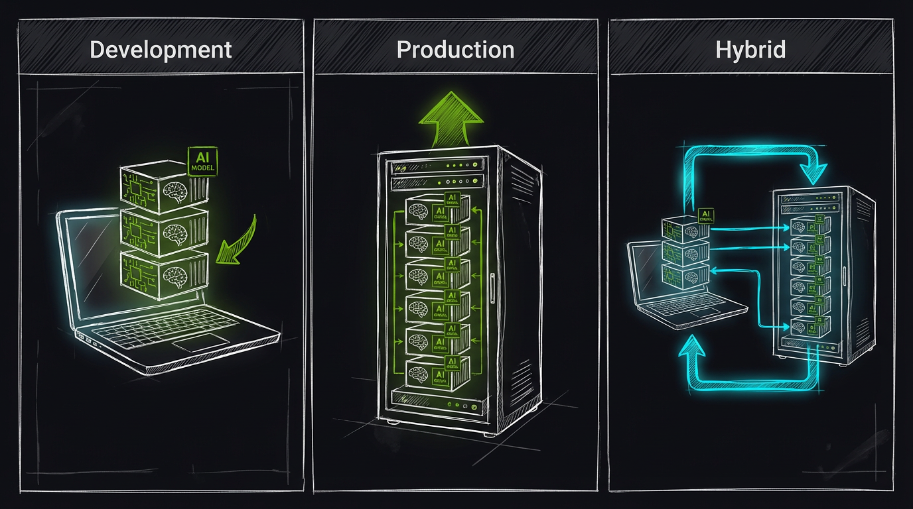
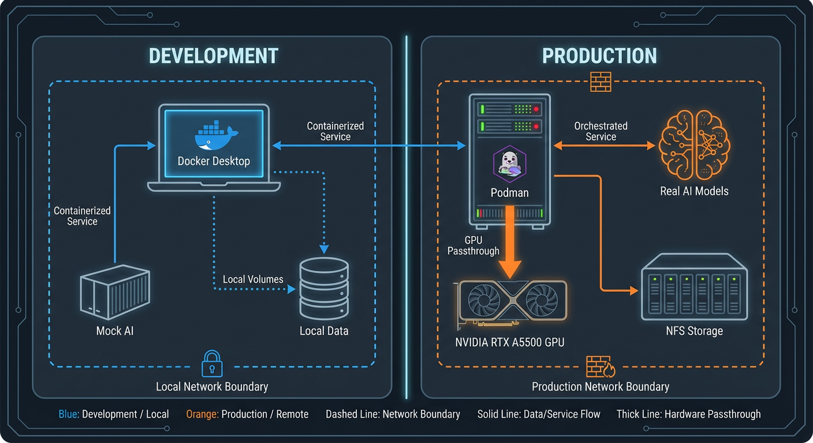

# Deployment Modes & AI Networking



_AI-generated visualization comparing Development, Production, and Hybrid deployment modes._

> A practical operator guide for choosing a deployment mode and setting
> `AI_GATEWAY_URL` / `NEMOTRON_URL` correctly.

If you're seeing "AI services unreachable" in health checks, **it's almost always a
networking mode mismatch**: the backend is trying to reach the AI services using the
wrong hostname.

All vision models (YOLO26, Florence-2, CLIP, enrichment heavy + light) live in one
`ai-gateway` container, so there are only two AI hostnames to get right:

| Setting          | Default in `docker-compose.prod.yml` |
| ---------------- | ------------------------------------ |
| `USE_AI_GATEWAY` | `true`                               |
| `AI_GATEWAY_URL` | `http://ai-gateway:8090`             |
| `NEMOTRON_URL`   | `http://ai-llm:8091`                 |

The per-service URLs (`YOLO26_URL`, `FLORENCE_URL`, `CLIP_URL`, `ENRICHMENT_URL`,
`ENRICHMENT_LIGHT_URL`) are derived from `AI_GATEWAY_URL` plus the router prefix
(`/yolo26`, `/florence`, `/clip`, `/enrichment`, `/enrich-lt`) and the compose file
sets them explicitly. Note that they carry a **path**, not a distinct port — the
standalone `8092`/`8093`/`8094`/`8096` ports no longer exist.

---

## Deployment Topology Overview



_Visual overview of deployment topologies and AI service connectivity options._

---

## Decision Table (pick one)


_Decision flowchart for choosing between Production (recommended), Development, and Hybrid deployment modes._

| Mode                            | When to choose                                                          | Backend runs                              | AI runs                                                  | What URLs should look like                                                             |
| ------------------------------- | ----------------------------------------------------------------------- | ----------------------------------------- | -------------------------------------------------------- | -------------------------------------------------------------------------------------- |
| **Production (recommended)**    | You want the simplest "it just runs" setup                              | **Container** (`docker-compose.prod.yml`) | **Containers** (`ai-gateway`, `ai-llm`)                  | `http://ai-gateway:8090`, `http://ai-llm:8091`                                         |
| **All-host development**        | You're developing locally and want zero container networking complexity | **Host** (uvicorn)                        | **Host** (`./ai/start_detector.sh`, `./ai/start_llm.sh`) | `http://localhost:8090`, `http://localhost:8091`                                       |
| **Backend container + host AI** | You want hot-reload containers, but AI runs on the host (GPU reasons)   | **Container**                             | **Host**                                                 | `http://host.docker.internal:8090` (Docker Desktop) or `http://<host-ip>:8090` (Linux) |
| **Remote AI host**              | AI runs on a separate GPU box                                           | Host or container                         | **Remote host**                                          | `http://<gpu-host>:8090` etc.                                                          |

> For authoritative ports/env defaults, see `docs/reference/config/env-reference.md`.

---

## Mode 1: Production (docker-compose.prod.yml)

### Start

```bash
podman compose -f docker-compose.prod.yml up -d
```

### `.env` (backend → AI via compose DNS)

`docker-compose.prod.yml` already sets these for you; listed for reference:

```bash
USE_AI_GATEWAY=true
AI_GATEWAY_URL=http://ai-gateway:8090
NEMOTRON_URL=http://ai-llm:8091
YOLO26_URL=http://ai-gateway:8090/yolo26
FLORENCE_URL=http://ai-gateway:8090/florence
CLIP_URL=http://ai-gateway:8090/clip
ENRICHMENT_URL=http://ai-gateway:8090/enrichment
ENRICHMENT_LIGHT_URL=http://ai-gateway:8090/enrich-lt
```

### Verify from inside the backend container

```bash
podman compose -f docker-compose.prod.yml exec -T backend curl -fsS http://ai-gateway:8090/health
podman compose -f docker-compose.prod.yml exec -T backend curl -fsS http://ai-gateway:8090/yolo26/health
podman compose -f docker-compose.prod.yml exec -T backend curl -fsS http://ai-llm:8091/health
```

---

## Mode 2: All-host development (no containers for backend/AI)

### Start AI (host)

```bash
# ai-gateway (Triton) — needs the Triton image; see ai/gateway/Dockerfile
./ai/start_detector.sh

# Nemotron via llama.cpp
./ai/start_llm.sh
```

Bring up only the infrastructure containers you still need:

```bash
podman compose -f docker-compose.prod.yml up -d postgres redis
```

### Start backend (host)

```bash
uv run uvicorn backend.main:app --host 0.0.0.0 --port 8000 --reload
```

### `.env`

```bash
AI_GATEWAY_URL=http://localhost:8090
NEMOTRON_URL=http://localhost:8091
YOLO26_URL=http://localhost:8090/yolo26
FLORENCE_URL=http://localhost:8090/florence
CLIP_URL=http://localhost:8090/clip
ENRICHMENT_URL=http://localhost:8090/enrichment
ENRICHMENT_LIGHT_URL=http://localhost:8090/enrich-lt
```

---

## Mode 3: Backend container + host AI

This is the most common "works on my machine" failure mode. The backend is in a
container; `localhost:8090` points to the container itself, **not your host**.

### Docker Desktop (macOS/Windows)

```bash
AI_GATEWAY_URL=http://host.docker.internal:8090
NEMOTRON_URL=http://host.docker.internal:8091
```

### Podman on macOS

```bash
AI_GATEWAY_URL=http://host.containers.internal:8090
NEMOTRON_URL=http://host.containers.internal:8091
```

### Linux (Docker/Podman)

Use your host IP:

```bash
export AI_HOST=$(ip route get 1 | awk '{print $7}')
AI_GATEWAY_URL=http://${AI_HOST}:8090
NEMOTRON_URL=http://${AI_HOST}:8091
```

`AI_HOST` is a convenience variable for the shell snippet above — no compose file or
backend code reads it. Set the resolved value in `AI_GATEWAY_URL` / `NEMOTRON_URL`.

---

## Mode 4: Remote AI host (separate GPU machine)

```bash
export GPU_HOST=10.0.0.50
AI_GATEWAY_URL=http://${GPU_HOST}:8090
NEMOTRON_URL=http://${GPU_HOST}:8091
```

**Tips:**

- Prefer a private LAN/VPN link; don't expose these ports to the public internet.
- The gateway and LLM bind `127.0.0.1` on the host by default, so a remote box needs
  its own reverse proxy or an SSH tunnel — see
  [AI TLS](ai-tls.md) for aligning TLS and hostnames.
- If you add TLS/reverse proxying for AI, keep the backend URLs aligned (see `docs/operator/ai-tls.md`).

---

## Common Pitfalls

- **Using `localhost` from inside a container**: it points to that container, not the host.
- **Mixing prod + dev assumptions**: prod uses compose DNS (`ai-gateway`), dev host AI uses `localhost`.
- **Setting `USE_AI_GATEWAY=false`**: the per-service URLs must then include the
  router path, or requests 404. Leave it `true` unless you have a specific reason.
- **Gateway not ready yet**: `ai-gateway` has a `start_period` of 180s while Triton
  loads its models. "Unreachable" in the first three minutes is usually just slow,
  not misconfigured.
