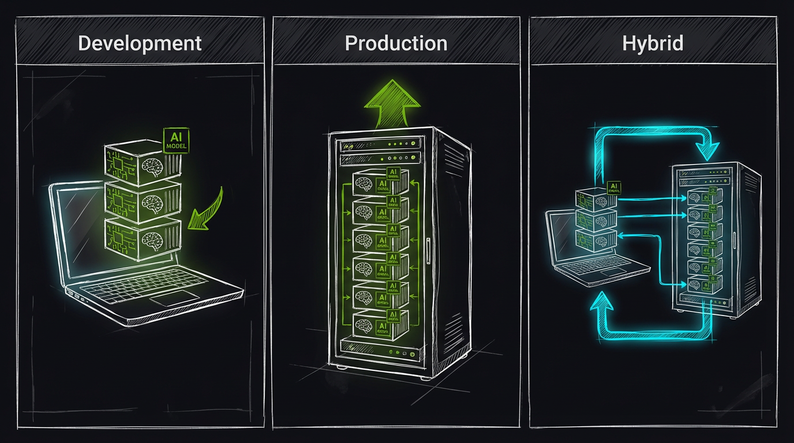
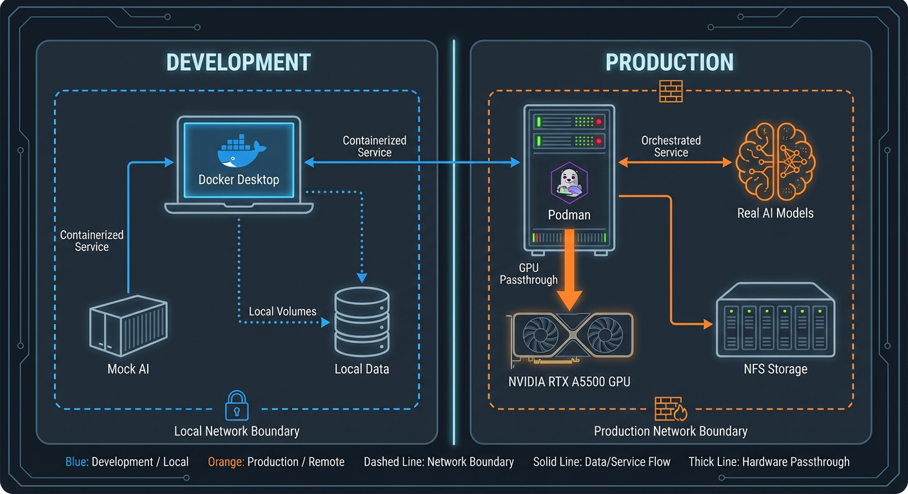
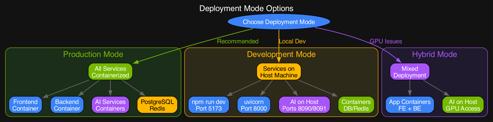

# Deployment Modes & AI Networking



_AI-generated visualization comparing Development, Production, and Hybrid deployment modes._

> A practical operator guide for choosing a deployment mode and setting
> `AI_GATEWAY_URL` / `AI_VLM_URL` correctly.

If you're seeing "AI services unreachable" in health checks, **it's almost always a
networking mode mismatch**: the backend is trying to reach the AI services using the
wrong hostname.

There are two AI hostnames to get right. Detection runs in the `ai-gateway` container;
the reasoning engine runs in `ai-vlm`, which is in the default compose set.

| Setting                | Default in `docker-compose.prod.yml`                         |
| ---------------------- | ------------------------------------------------------------ |
| `USE_AI_GATEWAY`       | `true`                                                       |
| `AI_GATEWAY_URL`       | `http://ai-gateway:8090`                                     |
| `YOLO26_URL`           | `http://ai-gateway:8090/yolo26`                              |
| `AI_VLM_URL`           | `http://ai-vlm:8098` (code default: `http://localhost:8098`) |
| `ENRICHMENT_LIGHT_URL` | `http://ai-gateway:8090/enrich-lt` (readiness probe only)    |

`YOLO26_URL` and `ENRICHMENT_LIGHT_URL` carry a **router path** on the gateway's single
port — they are not separate services on separate ports.

> [!IMPORTANT]
> `AI_VLM_URL` is the URL that gets missed. The backend reads a code default of
> `http://localhost:8098`, which inside a container is the container itself: every
> verdict lands `verification_failed` with a NULL `risk_score`, and the events keep
> arriving as if nothing were wrong. `docker-compose.prod.yml` threads
> `AI_VLM_URL=${AI_VLM_URL:-http://ai-vlm:8098}` to close exactly that hole; a remote or
> host-run AI setup must set it explicitly.

---

## Deployment Topology Overview



_Visual overview of deployment topologies and AI service connectivity options._

---

## Decision Table (pick one)



_Decision flowchart for choosing between Production (recommended), Development, and Hybrid deployment modes._

| Mode                            | When to choose                                                          | Backend runs                              | AI runs                                                          | What URLs should look like                                                             |
| ------------------------------- | ----------------------------------------------------------------------- | ----------------------------------------- | ---------------------------------------------------------------- | -------------------------------------------------------------------------------------- |
| **Production (recommended)**    | You want the simplest "it just runs" setup                              | **Container** (`docker-compose.prod.yml`) | **Containers** (`ai-gateway`, `ai-vlm`, both in the default set) | `http://ai-gateway:8090`, `http://ai-vlm:8098`                                         |
| **All-host development**        | You're developing locally and want zero container networking complexity | **Host** (uvicorn)                        | **Host** (`./ai/start_detector.sh`, your own llama.cpp serve)    | `http://localhost:8090`, `http://localhost:8098`                                       |
| **Backend container + host AI** | You want hot-reload containers, but AI runs on the host (GPU reasons)   | **Container**                             | **Host**                                                         | `http://host.docker.internal:8090` (Docker Desktop) or `http://<host-ip>:8090` (Linux) |
| **Remote AI host**              | AI runs on a separate GPU box                                           | Host or container                         | **Remote host**                                                  | `http://<gpu-host>:8090`, `http://<gpu-host>:8098`                                     |

> For authoritative ports/env defaults, see `docs/reference/config/env-reference.md`.

---

## Mode 1: Production (docker-compose.prod.yml)

### Start

```bash
# the plain up starts everything, ai-vlm included
podman compose -f docker-compose.prod.yml up -d
```

### `.env` (backend → AI via compose DNS)

`docker-compose.prod.yml` already sets these for you; listed for reference:

```bash
USE_AI_GATEWAY=true
AI_GATEWAY_URL=http://ai-gateway:8090
YOLO26_URL=http://ai-gateway:8090/yolo26
ENRICHMENT_LIGHT_URL=http://ai-gateway:8090/enrich-lt
AI_VLM_URL=http://ai-vlm:8098
```

### Verify from inside the backend container

```bash
podman compose -f docker-compose.prod.yml exec -T backend curl -fsS http://ai-gateway:8090/health
podman compose -f docker-compose.prod.yml exec -T backend curl -fsS http://ai-gateway:8090/yolo26/health
podman compose -f docker-compose.prod.yml exec -T backend curl -fsS http://ai-vlm:8098/health
```

A 404/connection-refused on the last line while everything else is green means `ai-vlm`
is not running — the default `up -d` asks for it, so it started and failed (a machine with
no GPU is the common case) rather than being skipped — see
[Troubleshooting a missing ai-vlm](ai-troubleshooting.md#ai-vlm-is-not-running).

---

## Mode 2: All-host development (no containers for backend/AI)

### Start AI (host)

```bash
# Host-run detection stand-in (port collides with ai-gateway's — see the script header)
./ai/start_detector.sh
```

There is no host-run script for the reasoning engine in this repository: llama.cpp is
built inside `ai/vlm/Dockerfile`. To run the VLM on the host, start `llama-server` with
the same pair compose passes it:

```bash
llama-server \
  --model  "${AI_MODELS_PATH:-/export/ai_models}/vlm/Qwen3VL-8B-Instruct-Q4_K_M.gguf" \
  --mmproj "${AI_MODELS_PATH:-/export/ai_models}/vlm/mmproj-Qwen3VL-8B-Instruct-Q8_0.gguf" \
  --host 0.0.0.0 --port 8098 --ctx-size 32768 --parallel 2
```

The `--mmproj` flag is not decoration: without it the serve is text-only and still
answers `/health`.

Bring up only the infrastructure containers you still need:

```bash
podman compose -f docker-compose.prod.yml up -d postgres redis
```

### Start backend (host)

```bash
uv run uvicorn backend.main:app --host 0.0.0.0 --port 8000 --reload
```

### `.env`

```bash
USE_AI_GATEWAY=true
AI_GATEWAY_URL=http://localhost:8090
YOLO26_URL=http://localhost:8090/yolo26
ENRICHMENT_LIGHT_URL=http://localhost:8090/enrich-lt
AI_VLM_URL=http://localhost:8098
```

---

## Mode 3: Backend container + host AI

This is the most common "works on my machine" failure mode. The backend is in a
container; `localhost:8090` points to the container itself, **not your host**.

### Docker Desktop (macOS/Windows)

```bash
AI_GATEWAY_URL=http://host.docker.internal:8090
AI_VLM_URL=http://host.docker.internal:8098
```

### Podman on macOS

```bash
AI_GATEWAY_URL=http://host.containers.internal:8090
AI_VLM_URL=http://host.containers.internal:8098
```

### Linux (Docker/Podman)

Use your host IP:

```bash
export AI_HOST=$(ip route get 1 | awk '{print $7}')
AI_GATEWAY_URL=http://${AI_HOST}:8090
AI_VLM_URL=http://${AI_HOST}:8098
```

`AI_HOST` is a convenience variable for the shell snippet above — no compose file or
backend code reads it. Set the resolved value in `AI_GATEWAY_URL` / `AI_VLM_URL`.

---

## Mode 4: Remote AI host (separate GPU machine)

```bash
export GPU_HOST=10.0.0.50
AI_GATEWAY_URL=http://${GPU_HOST}:8090
AI_VLM_URL=http://${GPU_HOST}:8098
```

**Tips:**

- Prefer a private LAN/VPN link; don't expose these ports to the public internet.
- Both AI services bind `127.0.0.1` on the host by default, so a remote box needs
  its own reverse proxy or an SSH tunnel — see
  [AI TLS](ai-tls.md) for aligning TLS and hostnames.
- If you add TLS/reverse proxying for AI, keep the backend URLs aligned (see `docs/operator/ai-tls.md`).
- `AI_VLM_READ_TIMEOUT` (default 25.0 s) is a per-read idle budget for a verdict
  attempt (no wall clock wraps it). A LAN hop is fine; a WAN hop against a sleeping server is not, and a failed wake is
  swallowed rather than retried.

---

## Common Pitfalls

- **Using `localhost` from inside a container**: it points to that container, not the host.
- **Mixing prod + dev assumptions**: prod uses compose DNS (`ai-gateway`, `ai-vlm`), dev host AI uses `localhost`.
- **Setting `USE_AI_GATEWAY=false`**: the per-service URLs must then include the
  router path, or requests 404. Leave it `true` unless you have a specific reason.
- **Gateway not ready yet**: `ai-gateway` has a `start_period` of 180s while Triton
  loads its models. "Unreachable" in the first three minutes is usually just slow,
  not misconfigured.
- **`ai-vlm` up but blind**: the default `up -d` starts it; the `--mmproj` file makes it
  see. A green `/health` proves only the first of those two.
- **Triaging from the alerts table**: no event auto-creates an Alert on this path. A
  stalled pipeline and a healthy-but-unnotified one both show zero rows there. Diagnose
  from `events` and `event_verifications`.
