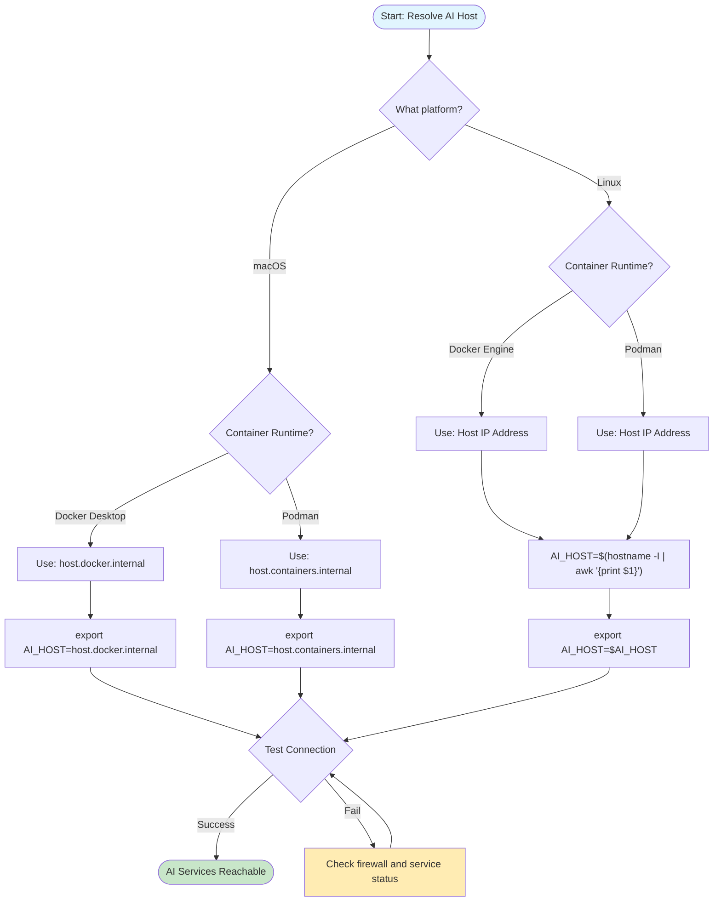
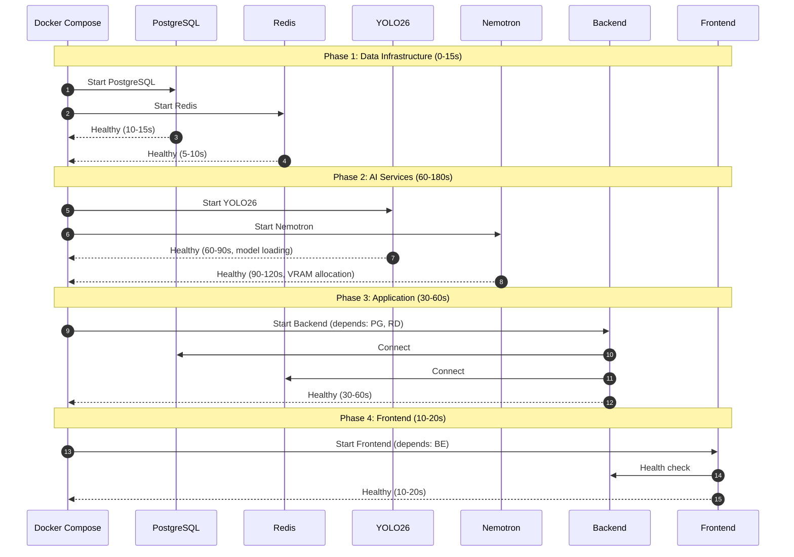

# Deployment Guide

> Complete guide for deploying Home Security Intelligence with Docker/Podman and GPU-accelerated AI services.

---

## Table of Contents

- [Quick Start](#quick-start)
- [Prerequisites](#prerequisites)
- [Container Runtime Setup](#container-runtime-setup)
- [GPU Passthrough](#gpu-passthrough)
- [Compose Files](#compose-files)
- [Deployment Options](#deployment-options)
- [AI Services Setup](#ai-services-setup)
- [Service Dependencies](#service-dependencies)
- [Deployment Checklist](#deployment-checklist)
- [Upgrade Procedures](#upgrade-procedures)
- [Rollback Procedures](#rollback-procedures)
- [Troubleshooting](#troubleshooting)

---

## Quick Start

```bash
# 1. Clone repository
git clone https://github.com/your-org/home-security-intelligence.git
cd home-security-intelligence

# 2. Run setup (generates .env with secure passwords)
./setup.sh              # Quick mode
./setup.sh --guided     # Guided mode with explanations

# 3. Download AI models (~2.7GB)
./ai/download_models.sh

# 4. Start services
docker compose -f docker-compose.prod.yml up -d

# 5. Verify deployment
curl http://localhost:8000/api/system/health/ready
```

---

## Prerequisites

### Hardware Requirements

| Resource       | Minimum | Recommended | Purpose                             |
| -------------- | ------- | ----------- | ----------------------------------- |
| CPU            | 4 cores | 8 cores     | Backend workers, AI inference       |
| RAM            | 16 GB   | 32 GB       | Services + AI model loading         |
| GPU VRAM       | 8 GB    | 24 GB       | YOLO26 + Nemotron + optional models |
| Disk Space     | 100 GB  | 500 GB      | Database, logs, media files         |
| Camera Storage | 50 GB   | 200 GB      | FTP upload directory                |

### Software Requirements

| Software                 | Version | Purpose                 | Installation                                            |
| ------------------------ | ------- | ----------------------- | ------------------------------------------------------- |
| Docker or Podman         | 20.10+  | Container runtime       | See [Container Runtime Setup](#container-runtime-setup) |
| NVIDIA Driver            | 535+    | GPU support             | `apt install nvidia-driver-535`                         |
| nvidia-container-toolkit | 1.13+   | GPU passthrough         | See [GPU Passthrough](#gpu-passthrough)                 |
| PostgreSQL Client        | 15+     | Database administration | `apt install postgresql-client`                         |

### Network Requirements

| Port    | Service     | Protocol | Access             |
| ------- | ----------- | -------- | ------------------ |
| 80/5173 | Frontend    | HTTP     | Browser            |
| 8000    | Backend API | HTTP/WS  | Frontend           |
| 8090    | YOLO26      | HTTP     | Backend            |
| 8091    | Nemotron    | HTTP     | Backend            |
| 8092    | Florence-2  | HTTP     | Backend (optional) |
| 8093    | CLIP        | HTTP     | Backend (optional) |
| 8094    | Enrichment  | HTTP     | Backend (optional) |
| 5432    | PostgreSQL  | TCP      | Backend            |
| 6379    | Redis       | TCP      | Backend            |

---

## Container Runtime Setup

This project supports Docker Engine, Docker Desktop, and Podman.

| Runtime        | Platform              | License           | Installation                                  |
| -------------- | --------------------- | ----------------- | --------------------------------------------- |
| Docker Engine  | Linux                 | Free              | `apt install docker.io`                       |
| Docker Desktop | macOS, Windows, Linux | Commercial        | [docker.com](https://docker.com)              |
| Podman         | Linux, macOS          | Free (Apache 2.0) | `brew install podman` or `dnf install podman` |

### Docker Setup

```bash
# Install Docker Engine (Linux)
sudo apt install docker.io docker-compose-plugin

# Verify installation
docker --version
docker compose version
```

### Podman Setup

```bash
# macOS
brew install podman podman-compose
podman machine init
podman machine start

# Linux (Fedora/RHEL)
sudo dnf install podman podman-compose

# Verify installation
podman info
```

### Command Equivalents

| Docker                 | Podman                 |
| ---------------------- | ---------------------- |
| `docker compose up -d` | `podman-compose up -d` |
| `docker compose down`  | `podman-compose down`  |
| `docker compose logs`  | `podman-compose logs`  |
| `docker ps`            | `podman ps`            |
| `docker build`         | `podman build`         |

---

## GPU Passthrough

AI services require NVIDIA GPU access via Container Device Interface (CDI).

### Prerequisites

1. NVIDIA driver 535+
2. NVIDIA Container Toolkit

### Verify GPU Access

```bash
# Verify NVIDIA driver
nvidia-smi

# Test Docker GPU access
docker run --rm --gpus all nvidia/cuda:12.0-base-ubuntu22.04 nvidia-smi

# Test Podman GPU access (CDI)
podman run --rm --device nvidia.com/gpu=all nvidia/cuda:12.0-base-ubuntu22.04 nvidia-smi
```

### Install NVIDIA Container Toolkit

```bash
# Ubuntu/Debian
curl -fsSL https://nvidia.github.io/libnvidia-container/gpgkey | sudo gpg --dearmor -o /usr/share/keyrings/nvidia-container-toolkit-keyring.gpg
curl -s -L https://nvidia.github.io/libnvidia-container/stable/deb/nvidia-container-toolkit.list | \
  sed 's#deb https://#deb [signed-by=/usr/share/keyrings/nvidia-container-toolkit-keyring.gpg] https://#g' | \
  sudo tee /etc/apt/sources.list.d/nvidia-container-toolkit.list
sudo apt update
sudo apt install -y nvidia-container-toolkit

# Configure Docker
sudo nvidia-ctk runtime configure --runtime=docker
sudo systemctl restart docker
```

---

## Compose Files

| File                      | Purpose     | AI Services   | Use Case                      |
| ------------------------- | ----------- | ------------- | ----------------------------- |
| `docker-compose.yml`      | Development | Host (native) | Local development, hot reload |
| `docker-compose.prod.yml` | Production  | Containerized | Full deployment with GPU      |
| `docker-compose.ghcr.yml` | Pre-built   | External      | Fast deploy from GHCR images  |

### Deployment Mode Selection Guide

Choose your deployment mode based on your needs:

| Question                                           | Recommended Mode                             |
| -------------------------------------------------- | -------------------------------------------- |
| **First time deploying / Want simplest setup?**    | Production (`docker-compose.prod.yml`)       |
| **Developing locally with code hot-reload?**       | Development (`docker-compose.yml` + host AI) |
| **Need GPU debugging / AI runs better on host?**   | Hybrid (container backend + host AI)         |
| **Have a dedicated GPU server?**                   | Remote AI host mode                          |
| **Want fastest deployment from pre-built images?** | GHCR (`docker-compose.ghcr.yml`)             |

**Decision flowchart:**

1. **Production deployment?** Use `docker-compose.prod.yml` - everything containerized, no networking complexity
2. **Active development?** Use `docker-compose.yml` with host AI for hot-reload and easier debugging
3. **GPU issues in containers?** Run AI services on host, backend in container (see [Deployment Modes](../deployment-modes.md))

> **Tip:** If AI services are unreachable, it's usually a networking mode mismatch. See [Deployment Modes & AI Networking](../deployment-modes.md) for URL configuration by mode.

### Production Deployment

```bash
# Start all services
docker compose -f docker-compose.prod.yml up -d

# View logs
docker compose -f docker-compose.prod.yml logs -f

# Stop services
docker compose -f docker-compose.prod.yml down
```

### Development with Host AI

```bash
# Terminal 1: Start YOLO26
./ai/start_detector.sh

# Terminal 2: Start Nemotron
./ai/start_llm.sh

# Terminal 3: Start application stack
docker compose up -d
```

### Deploy from GHCR

```bash
# Set image location
export GHCR_OWNER=your-org
export GHCR_REPO=home-security-intelligence
export IMAGE_TAG=latest

# Authenticate (requires GitHub token with read:packages)
echo $GITHUB_TOKEN | docker login ghcr.io -u YOUR_USERNAME --password-stdin

# Deploy
docker compose -f docker-compose.ghcr.yml up -d
```

---

## Deployment Options

### Cross-Platform Host Resolution

When backend is containerized but AI runs on the host:

| Platform | Container Runtime | Host Resolution                  |
| -------- | ----------------- | -------------------------------- |
| macOS    | Docker Desktop    | `host.docker.internal` (default) |
| macOS    | Podman            | `host.containers.internal`       |
| Linux    | Docker Engine     | Host IP address                  |
| Linux    | Podman            | Host IP address                  |

#### Container Networking Resolution Flowchart



```bash
# macOS with Docker Desktop (default, no action needed)
docker compose up -d

# macOS with Podman
export AI_HOST=host.containers.internal
podman-compose up -d

# Linux (Docker or Podman)
export AI_HOST=$(hostname -I | awk '{print $1}')
docker compose up -d
```

### AI Service URLs by Deployment Mode

**Production (docker-compose.prod.yml):**

```bash
# AI services on compose network (internal DNS)
YOLO26_URL=http://ai-yolo26:8095
NEMOTRON_URL=http://ai-llm:8091
FLORENCE_URL=http://ai-florence:8092
CLIP_URL=http://ai-clip:8093
ENRICHMENT_URL=http://ai-enrichment:8094
```

**Development with host AI:**

```bash
YOLO26_URL=http://localhost:8095
NEMOTRON_URL=http://localhost:8091
```

**Docker Desktop (macOS/Windows):**

```bash
YOLO26_URL=http://host.docker.internal:8095
NEMOTRON_URL=http://host.docker.internal:8091
```

---

## AI Services Setup

### AI Architecture

The system supports a multi-service AI stack:

| Service    | Port | VRAM                      | Purpose                         |
| ---------- | ---- | ------------------------- | ------------------------------- |
| YOLO26     | 8090 | ~4GB                      | Object detection                |
| Nemotron   | 8091 | ~3GB (4B) / ~14.7GB (30B) | Risk reasoning                  |
| Florence-2 | 8092 | ~2GB                      | Vision extraction (optional)    |
| CLIP       | 8093 | ~2GB                      | Re-identification (optional)    |
| Enrichment | 8094 | ~4GB                      | Vehicle/pet/clothing (optional) |

### Model Downloads

```bash
# Automated download
./ai/download_models.sh

# What it downloads:
# - Nemotron Mini 4B (~2.5GB) for development
# - YOLO26 auto-downloads on first use via HuggingFace
```

### Production Model Specifications

| Model                          | File                                    | Size    | VRAM     | Context |
| ------------------------------ | --------------------------------------- | ------- | -------- | ------- |
| NVIDIA Nemotron-3-Nano-30B-A3B | `Nemotron-3-Nano-30B-A3B-Q4_K_M.gguf`   | ~18 GB  | ~14.7 GB | 131,072 |
| Nemotron Mini 4B (dev)         | `nemotron-mini-4b-instruct-q4_k_m.gguf` | ~2.5 GB | ~3 GB    | 4,096   |

### Verify AI Services

```bash
# Health checks
curl http://localhost:8095/health   # YOLO26
curl http://localhost:8091/health   # Nemotron
curl http://localhost:8092/health   # Florence-2 (optional)
curl http://localhost:8093/health   # CLIP (optional)
curl http://localhost:8094/health   # Enrichment (optional)
```

---

## Service Dependencies

### Startup Order

Services start in dependency order via Docker Compose health checks.

#### Service Startup Sequence Diagram



**Phase 1: Data Infrastructure (0-15s)**

- PostgreSQL (~10-15s)
- Redis (~5-10s)

**Phase 2: AI Services (60-180s)**

- YOLO26 (~60-90s, model loading)
- Nemotron (~90-120s, VRAM allocation)
- Florence-2, CLIP, Enrichment (optional)

**Phase 3: Application (30-60s)**

- Backend (~30-60s, waits for DB + Redis)

**Phase 4: Frontend (10-20s)**

- Frontend (~10-20s, waits for Backend)

### Health Check Configuration

```yaml
# docker-compose.prod.yml example
backend:
  healthcheck:
    test:
      [
        'CMD',
        'python',
        '-c',
        "import httpx; r = httpx.get('http://localhost:8000/api/system/health/ready'); exit(0 if r.status_code == 200 else 1)",
      ]
    interval: 10s
    timeout: 5s
    retries: 3
    start_period: 30s
  depends_on:
    postgres:
      condition: service_healthy
    redis:
      condition: service_healthy
```

### Dependency Matrix

| Service    | Hard Dependencies | Soft Dependencies | Auto-Recovers  |
| ---------- | ----------------- | ----------------- | -------------- |
| PostgreSQL | None              | None              | N/A            |
| Redis      | None              | None              | N/A            |
| YOLO26     | GPU               | None              | No             |
| Nemotron   | GPU               | None              | No             |
| Backend    | PostgreSQL, Redis | AI Services       | AI via monitor |
| Frontend   | Backend           | None              | No             |

---

## Deployment Checklist

### Pre-Deployment

- [ ] Docker/Podman installed and running
- [ ] NVIDIA driver and container toolkit installed (`nvidia-smi` works)
- [ ] Camera FTP directory exists and is accessible
- [ ] AI models downloaded (`./ai/download_models.sh`)
- [ ] Network ports are not in use by other services
- [ ] Firewall rules allow required traffic
- [ ] `.env` file created via `./setup.sh`

### Deployment Steps

1. **Start services:**

   ```bash
   docker compose -f docker-compose.prod.yml up -d
   ```

2. **Monitor startup:**

   ```bash
   docker compose -f docker-compose.prod.yml logs -f
   ```

3. **Verify health:**

   ```bash
   # Wait for services (Redis: ~5s, Postgres: ~15s, AI: ~120s, Backend: ~60s)
   curl http://localhost:8000/api/system/health/ready
   ```

4. **Test AI pipeline:**

   ```bash
   # Copy test image
   cp backend/data/test_images/sample.jpg /export/foscam/test_camera/test_$(date +%s).jpg

   # Monitor processing
   docker compose -f docker-compose.prod.yml logs -f backend | grep -E "detect|batch|analyze"
   ```

5. **Access dashboard:**
   - Open browser to `http://localhost:5173` (dev) or `http://localhost` (prod)
   - Verify WebSocket connection status
   - Check camera grid and activity feed

### Post-Deployment

- [ ] Dashboard accessible
- [ ] Health endpoint returns healthy
- [ ] WebSocket connection working
- [ ] Test image processed successfully
- [ ] GPU metrics displaying

---

## Upgrade Procedures

### Pre-Upgrade

- [ ] Read release notes for breaking changes
- [ ] Backup database
- [ ] Check disk space (at least 10 GB free)
- [ ] Review new environment variables in `.env.example`

### Upgrade Steps

```bash
# 1. Backup
docker compose -f docker-compose.prod.yml exec -T postgres pg_dump -U security -d security -F c > backup-pre-upgrade-$(date +%Y%m%d).dump
cp .env .env.backup-$(date +%Y%m%d)

# 2. Pull updates
git fetch origin
git pull origin main

# 3. Review config changes
diff .env.example .env

# 4. Stop services
docker compose -f docker-compose.prod.yml down

# 5. Apply database migrations
docker compose -f docker-compose.prod.yml up -d postgres
until docker compose -f docker-compose.prod.yml exec postgres pg_isready -U security; do sleep 1; done
docker compose -f docker-compose.prod.yml run --rm backend alembic upgrade head

# 6. Rebuild and start
docker compose -f docker-compose.prod.yml build --no-cache
docker compose -f docker-compose.prod.yml up -d

# 7. Verify
curl http://localhost:8000/api/system/health/ready
```

---

## Rollback Procedures

### Application Rollback (Database Intact)

```bash
# 1. Stop current version
docker compose -f docker-compose.prod.yml down

# 2. Checkout previous version
git checkout <previous-commit-sha>

# 3. Restore config if needed
cp .env.backup-<date> .env

# 4. Restart
docker compose -f docker-compose.prod.yml up -d

# 5. Verify
curl http://localhost:8000/api/system/health/ready
```

### Database Rollback

```bash
# 1. Stop all services
docker compose -f docker-compose.prod.yml down

# 2. Start only PostgreSQL
docker compose -f docker-compose.prod.yml up -d postgres
until docker compose -f docker-compose.prod.yml exec postgres pg_isready -U security; do sleep 1; done

# 3. Drop and recreate database
docker compose -f docker-compose.prod.yml exec postgres psql -U security -d postgres -c "DROP DATABASE security;"
docker compose -f docker-compose.prod.yml exec postgres psql -U security -d postgres -c "CREATE DATABASE security;"

# 4. Restore from backup
docker compose -f docker-compose.prod.yml exec -T postgres pg_restore -U security -d security < backup-pre-upgrade-<date>.dump

# 5. Checkout previous code and restart
git checkout <previous-commit>
docker compose -f docker-compose.prod.yml up -d
```

### Rollback Decision Matrix

| Symptom                 | Action                            | Downtime  |
| ----------------------- | --------------------------------- | --------- |
| Frontend UI broken      | Rollback frontend only            | 1-2 min   |
| API errors, DB intact   | Rollback backend only             | 2-5 min   |
| Database corruption     | Restore DB backup + rollback code | 10-30 min |
| AI service crash loop   | Check GPU, restart AI services    | 5-10 min  |
| Complete system failure | Full rollback (all services + DB) | 15-45 min |

---

## Troubleshooting

### Service Won't Start

```bash
# Check container status
docker compose -f docker-compose.prod.yml ps

# Check logs for specific service
docker compose -f docker-compose.prod.yml logs backend
docker compose -f docker-compose.prod.yml logs ai-yolo26

# Check health endpoint
curl -v http://localhost:8000/health
```

### AI Services Unreachable

1. **Check AI container status:**

   ```bash
   docker ps --filter name=ai-
   ```

2. **Test health endpoints directly:**

   ```bash
   curl http://localhost:8095/health
   curl http://localhost:8091/health
   ```

3. **Check GPU access:**

   ```bash
   nvidia-smi
   docker compose -f docker-compose.prod.yml exec ai-yolo26 nvidia-smi
   ```

4. **Verify URL configuration:**
   - Check [Deployment Modes](../deployment-modes.md) for correct URLs

### GPU Out of Memory

```bash
# Check GPU usage
nvidia-smi

# Kill GPU processes
nvidia-smi --query-compute-apps=pid --format=csv,noheader | xargs kill

# Restart AI services
docker compose -f docker-compose.prod.yml restart ai-yolo26 ai-llm
```

### Database Connection Failed

```bash
# Check PostgreSQL status
docker compose -f docker-compose.prod.yml exec postgres pg_isready -U security

# Check logs
docker compose -f docker-compose.prod.yml logs postgres

# Verify DATABASE_URL in .env
grep DATABASE_URL .env
```

### Health Check Timeout

```bash
# Increase start_period for slow model loading
# Edit docker-compose.prod.yml:
# healthcheck:
#   start_period: 120s  # Increase from 60s
```

---

## See Also

- [Operator Hub](../) - Main operator documentation
- [GPU Setup Guide](../gpu-setup.md) - Detailed GPU configuration
- [AI Services](../ai-overview.md) - AI architecture and configuration
- [Monitoring Guide](../monitoring/) - Health checks and metrics
- [Administration Guide](../admin/) - Configuration and secrets
