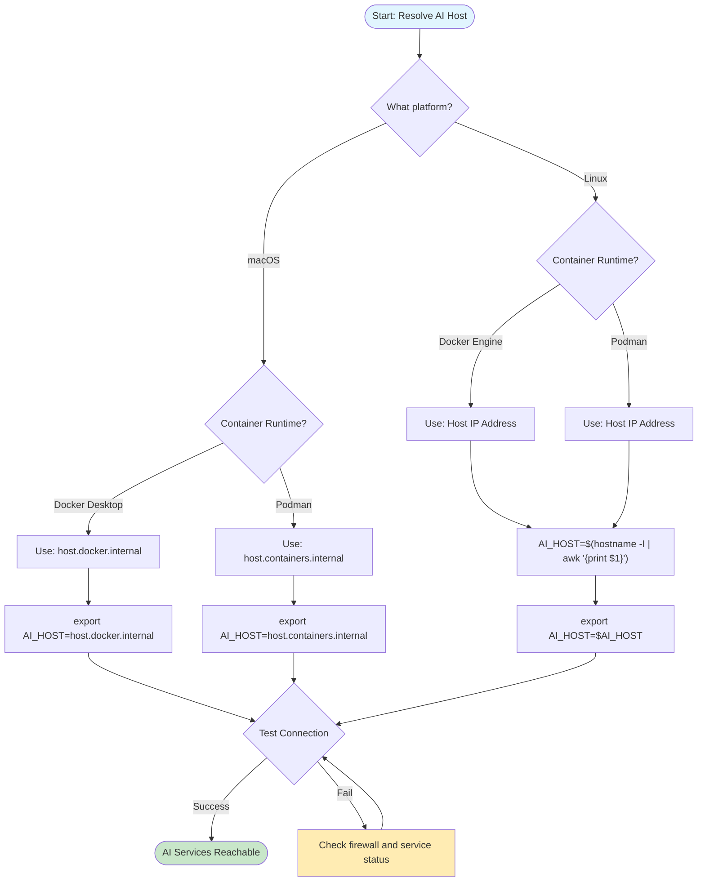
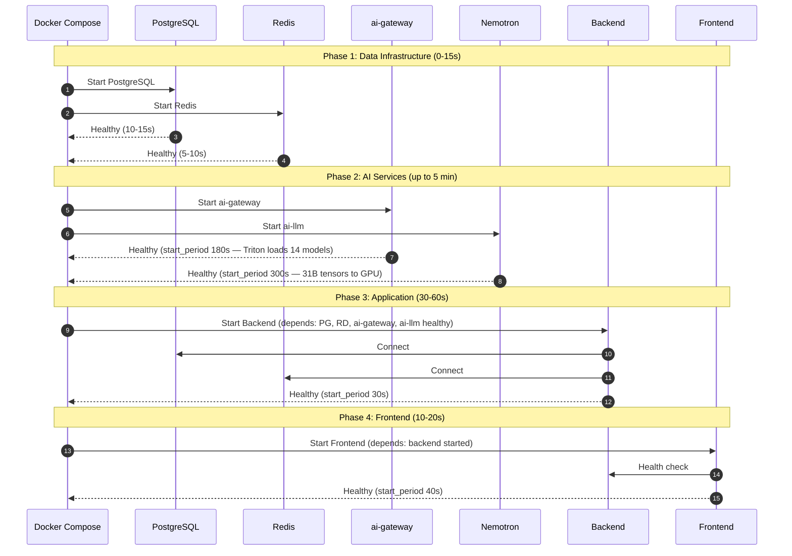

# Deployment Guide

> Complete guide for deploying Home Security Intelligence with Docker/Podman and GPU-accelerated AI services.

---

## Table of Contents

- [Quick Start](#quick-start)
- [Prerequisites](#prerequisites)
- [Container Runtime Setup](#container-runtime-setup)
- [GPU Passthrough](#gpu-passthrough)
- [Compose Files](#compose-files)
- [Deployment Options](#deployment-options)
- [AI Services Setup](#ai-services-setup)
- [Service Dependencies](#service-dependencies)
- [Deployment Checklist](#deployment-checklist)
- [Upgrade Procedures](#upgrade-procedures)
- [Rollback Procedures](#rollback-procedures)
- [Troubleshooting](#troubleshooting)

---

## Deployment Architecture

The following diagram shows the complete production deployment topology with all containers, their connections, ports, and GPU assignments.


```mermaid
%%{init: {
  'theme': 'dark',
  'themeVariables': {
    'primaryColor': '#3B82F6',
    'primaryTextColor': '#FFFFFF',
    'primaryBorderColor': '#60A5FA',
    'secondaryColor': '#A855F7',
    'tertiaryColor': '#009688',
    'background': '#121212',
    'mainBkg': '#1a1a2e',
    'lineColor': '#666666'
  }
}}%%
flowchart TB
    subgraph External["External Access Points"]
        direction LR
        USER["User Browser"]
        CAM["Foscam Cameras<br/>(FTP Upload)"]
        ADMN["Admin/Ops"]
    end

    subgraph Network["security-net (Bridge Network)"]
        subgraph FrontendLayer["Frontend Layer"]
            FE["<b>frontend</b><br/>nginx-unprivileged<br/>Internal: 8080 (HTTP), 8443 (HTTPS)<br/>Host: 8080 (HTTP), 8444 (HTTPS)<br/>Memory: 512M"]
        end

        subgraph BackendLayer["Backend Layer"]
            BE["<b>backend</b><br/>FastAPI + Uvicorn<br/>Port: 8000<br/>Memory: 10G<br/>CPU: 2 cores"]
        end

        subgraph AILayer["AI Services Layer (GPU Required)"]
            direction LR
            subgraph GPU0["GPU 0 (Primary - High VRAM)"]
                LLM["<b>ai-llm</b><br/>Nemotron 30B (llama.cpp)<br/>Port: 8091<br/>~14.7GB VRAM"]
            end
            subgraph GPU1["GPU 1 (Secondary)"]
                GW["<b>ai-gateway</b><br/>Triton + FastAPI<br/>Port: 8090 (metrics 8002)<br/>/yolo26 /florence /clip<br/>/enrichment /enrich-lt<br/>Memory limit: 20G"]
            end
        end

        subgraph DataLayer["Data Layer"]
            PG[("<b>postgres</b><br/>PostgreSQL 16-alpine<br/>Port: 5432<br/>Memory: 1G")]
            RD[("<b>redis</b><br/>Redis 7-alpine<br/>Port: 6379<br/>Memory: 512M")]
        end

        subgraph MonitoringLayer["Monitoring & Observability"]
            direction TB
            subgraph MetricsTracing["Metrics & Tracing"]
                PROM["<b>prometheus</b><br/>Host port: 9090<br/>Memory: 512M"]
                TEMPO["<b>tempo</b><br/>Port: 3200<br/>Memory: 1G"]
                GRAF["<b>grafana</b><br/>Host port: 3002<br/>Served at /grafana/<br/>Memory: 512M"]
            end
            subgraph LogsProfiling["Logs & Profiling"]
                LOKI["<b>loki</b><br/>Port: 3100<br/>Memory: 1G"]
                PYRO["<b>pyroscope</b><br/>Port: 4040<br/>Memory: 512M"]
                ALLOY["<b>alloy</b><br/>UI port: 12345<br/>Memory: 768M"]
            end
            subgraph Exporters["Exporters & Alerting"]
                AM["<b>alertmanager</b><br/>Port: 9093<br/>Memory: 128M"]
                BB["<b>blackbox-exporter</b><br/>Port: 9115"]
                RE["<b>redis-exporter</b><br/>Port: 9121"]
                JE["<b>json-exporter</b><br/>Port: 7979"]
            end
        end
    end

    %% External connections
    USER -->|"HTTP :8080<br/>HTTPS :8444"| FE
    CAM -->|"FTP to<br/>/cameras mount"| BE
    ADMN -->|"Grafana via /grafana/<br/>Prometheus :9090"| MonitoringLayer

    %% Frontend to Backend
    FE -->|"Proxy /api, /ws, /grafana/"| BE

    %% Backend to Data
    BE -->|"asyncpg"| PG
    BE -->|"aioredis"| RD

    %% Backend to AI (HTTP inference calls)
    BE -->|"POST /yolo26/detect"| GW
    BE -->|"POST /v1/completions"| LLM
    BE -->|"POST /florence/extract"| GW
    BE -->|"POST /clip/embed"| GW
    BE -->|"POST /enrichment/enrich"| GW
    BE -->|"POST /enrich-lt/*"| GW

    %% Monitoring data flows
    PROM -.->|"scrape /metrics"| BE
    PROM -.->|"ai-gateway:8002"| GW
    PROM -.->|"scrape"| LLM
    PROM -.->|"scrape"| RE
    PROM -.->|"scrape"| BB
    PROM -.->|"scrape"| JE
    PROM -->|"alert rules"| AM
    AM -->|"webhooks"| BE

    GRAF -->|"query"| PROM
    GRAF -->|"query"| LOKI
    GRAF -->|"query"| TEMPO
    GRAF -->|"query"| PYRO

    ALLOY -->|"push logs"| LOKI
    ALLOY -->|"push profiles"| PYRO
    ALLOY -->|"OTLP traces"| TEMPO
    BE -->|"OTLP traces"| ALLOY

    %% Health check dependencies (startup order)
    BE -.->|"depends_on<br/>healthy"| PG
    BE -.->|"depends_on<br/>healthy"| RD
    BE -.->|"depends_on<br/>healthy"| GW
    BE -.->|"depends_on<br/>healthy"| LLM
    FE -.->|"depends_on<br/>started"| BE
    PROM -.->|"depends_on<br/>healthy"| AM
```

### Architecture Summary

| Layer           | Services                                                                    | Resource Profile                             |
| --------------- | --------------------------------------------------------------------------- | -------------------------------------------- |
| **Frontend**    | nginx reverse proxy                                                         | 512M RAM limit, 1 CPU                        |
| **Backend**     | FastAPI application server                                                  | 10G RAM limit, 2 CPUs, GPU access            |
| **AI Services** | ai-gateway (YOLO26, Florence-2, CLIP, enrichment light+heavy), Nemotron     | GPU required; gateway 20G RAM limit, LLM 12G |
| **Data**        | PostgreSQL, Redis                                                           | 1G + 512M RAM limits                         |
| **Monitoring**  | Prometheus, Grafana, Tempo, Loki, Pyroscope, Alloy, Alertmanager, exporters | ~4G RAM limits total                         |

### GPU Assignment Strategy

The default assignment puts the LLM on one GPU and everything else on another:

| GPU   | Services                                      | Env var               | Typical GPU        |
| ----- | --------------------------------------------- | --------------------- | ------------------ |
| GPU 0 | `ai-llm` (Nemotron via llama.cpp)             | `GPU_LLM` (0)         | RTX A5500/RTX 4090 |
| GPU 1 | `ai-gateway` (all Triton models, light+heavy) | `GPU_AI_SERVICES` (1) | RTX A400/RTX 3060  |

Per-model placement inside the gateway is set in `models.yml` (the live manifest),
which `ai/gateway/patch_triton_configs.py` applies to each Triton `config.pbtxt`
at startup. There is no separate `GPU_ENRICHMENT` / `GPU_FLORENCE` / `GPU_CLIP`
placement any more — those `.env.example` variables are not referenced by
`docker-compose.prod.yml`.

---

## Quick Start

```bash
# 1. Clone repository
git clone https://github.com/mikesvoboda/nemotron-v3-home-security-intelligence.git
cd nemotron-v3-home-security-intelligence

# 2. Run setup (generates .env with secure passwords)
python setup.py              # Quick mode
python setup.py --guided     # Guided mode with explanations

# 3. Download AI models (~33GB total; Nemotron GGUF alone is ~15GB)
./ai/download_models.sh

# 4. Start services
podman compose -f docker-compose.prod.yml up -d

# 5. Verify deployment
curl http://localhost:8000/api/system/health/ready
```

---

## Prerequisites

### Hardware Requirements

| Resource       | Minimum | Recommended | Purpose                             |
| -------------- | ------- | ----------- | ----------------------------------- |
| CPU            | 4 cores | 8 cores     | Backend workers, AI inference       |
| RAM            | 16 GB   | 32 GB       | Services + AI model loading         |
| GPU VRAM       | 8 GB    | 24 GB       | YOLO26 + Nemotron + optional models |
| Disk Space     | 100 GB  | 500 GB      | Database, logs, media files         |
| Camera Storage | 50 GB   | 200 GB      | FTP upload directory                |

### Software Requirements

| Software                 | Version | Purpose                 | Installation                                            |
| ------------------------ | ------- | ----------------------- | ------------------------------------------------------- |
| Docker or Podman         | 20.10+  | Container runtime       | See [Container Runtime Setup](#container-runtime-setup) |
| NVIDIA Driver            | 535+    | GPU support             | `apt install nvidia-driver-535`                         |
| nvidia-container-toolkit | 1.13+   | GPU passthrough         | See [GPU Passthrough](#gpu-passthrough)                 |
| PostgreSQL Client        | 15+     | Database administration | `apt install postgresql-client`                         |

### Network Requirements

All ports come from `.env`. Everything except `frontend` binds `127.0.0.1` on the
host, so the browser only ever needs the frontend ports — nginx proxies `/api`,
`/ws` and `/grafana/` internally.

| Host port | Env var               | Service              | Protocol | Access                       |
| --------- | --------------------- | -------------------- | -------- | ---------------------------- |
| 8080      | `FRONTEND_HTTP_PORT`  | Frontend             | HTTP     | Browser (tunnel / LAN)       |
| 8444      | `FRONTEND_HTTPS_PORT` | Frontend (TLS)       | HTTPS    | Browser                      |
| 8000      | `API_PORT`            | Backend API          | HTTP/WS  | localhost / nginx proxy      |
| 8090      | `AI_GATEWAY_PORT`     | ai-gateway (all AI)  | HTTP     | localhost / backend          |
| 8091      | `LLM_PORT`            | Nemotron (llama.cpp) | HTTP     | localhost / backend          |
| 5432      | `POSTGRES_PORT`       | PostgreSQL           | TCP      | localhost                    |
| 6379      | `REDIS_PORT`          | Redis                | TCP      | localhost                    |
| 3002      | `GRAFANA_PORT`        | Grafana              | HTTP     | localhost (or via /grafana/) |
| 9090      | `PROMETHEUS_PORT`     | Prometheus           | HTTP     | localhost                    |

---

## Container Runtime Setup

This project supports Docker Engine, Docker Desktop, and Podman.

| Runtime        | Platform              | License           | Installation                                  |
| -------------- | --------------------- | ----------------- | --------------------------------------------- |
| Docker Engine  | Linux                 | Free              | `apt install docker.io`                       |
| Docker Desktop | macOS, Windows, Linux | Commercial        | [docker.com](https://docker.com)              |
| Podman         | Linux, macOS          | Free (Apache 2.0) | `brew install podman` or `dnf install podman` |

### Docker Setup

```bash
# Install Docker Engine (Linux)
sudo apt install docker.io docker-compose-plugin

# Verify installation
docker --version
docker compose version
```

### Podman Setup

```bash
# macOS
brew install podman podman-compose
podman machine init
podman machine start

# Linux (Fedora/RHEL)
sudo dnf install podman podman-compose

# Verify installation
podman info
```

### Command Equivalents

This project's runbook uses **Podman** (`podman compose` delegates to
podman-compose or the docker-compose plugin). Every command below works with
`docker` substituted for `podman`.

| Docker                           | Podman                           |
| -------------------------------- | -------------------------------- |
| `docker compose ps`              | `podman compose ps`              |
| `docker compose up -d`           | `podman compose up -d`           |
| `docker compose down`            | `podman compose down`            |
| `docker compose logs -f backend` | `podman compose logs -f backend` |
| `docker ps`                      | `podman ps -a`                   |
| `docker inspect <name>`          | `podman inspect <name>`          |

---

## GPU Passthrough

AI services require NVIDIA GPU access via Container Device Interface (CDI).

### Prerequisites

1. NVIDIA driver 535+
2. NVIDIA Container Toolkit

### Verify GPU Access

```bash
# Verify NVIDIA driver
nvidia-smi

# Test Docker GPU access
docker run --rm --gpus all nvidia/cuda:12.0-base-ubuntu22.04 nvidia-smi

# Test Podman GPU access (CDI)
podman run --rm --device nvidia.com/gpu=all nvidia/cuda:12.0-base-ubuntu22.04 nvidia-smi
```

### Install NVIDIA Container Toolkit

```bash
# Ubuntu/Debian
curl -fsSL https://nvidia.github.io/libnvidia-container/gpgkey | sudo gpg --dearmor -o /usr/share/keyrings/nvidia-container-toolkit-keyring.gpg
curl -s -L https://nvidia.github.io/libnvidia-container/stable/deb/nvidia-container-toolkit.list | \
  sed 's#deb https://#deb [signed-by=/usr/share/keyrings/nvidia-container-toolkit-keyring.gpg] https://#g' | \
  sudo tee /etc/apt/sources.list.d/nvidia-container-toolkit.list
sudo apt update
sudo apt install -y nvidia-container-toolkit

# Configure Docker
sudo nvidia-ctk runtime configure --runtime=docker
sudo systemctl restart docker
```

---

## Compose Files

| File                      | Purpose       | AI Services   | Use Case                                |
| ------------------------- | ------------- | ------------- | --------------------------------------- |
| `docker-compose.prod.yml` | Production    | Containerized | Full deployment with GPU                |
| `docker-compose.ghcr.yml` | Pre-built     | Containerized | Fast deploy from GHCR images            |
| `docker-compose.test.yml` | Test DB/cache | None          | Local Postgres/Redis on ports 5433/6380 |
| `docker-compose.ci.yml`   | CI smoke      | Mocked        | GitHub Actions runners (no GPU)         |

There is no `docker-compose.yml` in the repository. For development you run the
backend natively (`uv run uvicorn …`) against the containers you need, or against
`docker-compose.test.yml` for a throwaway Postgres/Redis.

### Deployment Mode Selection Guide

Choose your deployment mode based on your needs:

| Question                                           | Recommended Mode                       |
| -------------------------------------------------- | -------------------------------------- |
| **First time deploying / Want simplest setup?**    | Production (`docker-compose.prod.yml`) |
| **Developing locally with code hot-reload?**       | Native backend + host AI services      |
| **Need GPU debugging / AI runs better on host?**   | Hybrid (container backend + host AI)   |
| **Have a dedicated GPU server?**                   | Remote AI host mode                    |
| **Want fastest deployment from pre-built images?** | GHCR (`docker-compose.ghcr.yml`)       |

**Decision flowchart:**

1. **Production deployment?** Use `docker-compose.prod.yml` - everything containerized, no networking complexity
2. **Active development?** Run the backend on the host for hot-reload; point `AI_GATEWAY_URL` / `NEMOTRON_URL` at the host services
3. **GPU issues in containers?** Run AI services on host, backend in container (see [Deployment Modes](../deployment-modes.md))

> **Tip:** If AI services are unreachable, it's usually a networking mode mismatch. See [Deployment Modes & AI Networking](../deployment-modes.md) for URL configuration by mode.

### Production Deployment

```bash
# Start all services
podman compose -f docker-compose.prod.yml up -d

# View logs
podman compose -f docker-compose.prod.yml logs -f

# Stop services
podman compose -f docker-compose.prod.yml down
```

### Development with Host AI

The repo ships no development compose file. Start only the infrastructure
containers you need, then run the AI services and backend on the host:

```bash
# Terminal 1: Infrastructure containers only
podman compose -f docker-compose.prod.yml up -d postgres redis

# Terminal 2: AI gateway (Triton, host port 8090)
./ai/start_detector.sh

# Terminal 3: Nemotron via llama.cpp (host port 8091)
./ai/start_llm.sh

# Terminal 4: Backend on the host, pointed at the host AI services
export AI_GATEWAY_URL=http://localhost:8090
export NEMOTRON_URL=http://localhost:8091
uv run uvicorn backend.main:app --reload --port 8000
```

### Deploy from GHCR

```bash
# Set image location (defaults match this repo, so you can skip these)
export GHCR_OWNER=mikesvoboda
export GHCR_REPO=nemotron-v3-home-security-intelligence
export IMAGE_TAG=latest

# Authenticate (requires GitHub token with read:packages)
echo $GITHUB_TOKEN | docker login ghcr.io -u YOUR_USERNAME --password-stdin

# Deploy
docker compose -f docker-compose.ghcr.yml up -d
```

---

## Deployment Options

### Cross-Platform Host Resolution

When backend is containerized but AI runs on the host:

| Platform | Container Runtime | Host Resolution                  |
| -------- | ----------------- | -------------------------------- |
| macOS    | Docker Desktop    | `host.docker.internal` (default) |
| macOS    | Podman            | `host.containers.internal`       |
| Linux    | Docker Engine     | Host IP address                  |
| Linux    | Podman            | Host IP address                  |

#### Container Networking Resolution Flowchart


```mermaid
flowchart TD
    Start([Start: Resolve AI Host]) --> Platform{What platform?}

    Platform -->|macOS| MacRuntime{Container Runtime?}
    Platform -->|Linux| LinuxRuntime{Container Runtime?}

    MacRuntime -->|Docker Desktop| MacDocker[Use: host.docker.internal]
    MacRuntime -->|Podman| MacPodman[Use: host.containers.internal]

    LinuxRuntime -->|Docker Engine| LinuxDocker[Use: Host IP Address]
    LinuxRuntime -->|Podman| LinuxPodman[Use: Host IP Address]

    MacDocker --> SetEnv1["export AI_HOST=host.docker.internal"]
    MacPodman --> SetEnv2["export AI_HOST=host.containers.internal"]
    LinuxDocker --> GetIP["AI_HOST=$(hostname -I | awk '{print $1}')"]
    LinuxPodman --> GetIP

    SetEnv1 --> Verify{Test Connection}
    SetEnv2 --> Verify
    GetIP --> SetEnv3["export AI_HOST=$AI_HOST"] --> Verify

    Verify -->|Success| Done([AI Services Reachable])
    Verify -->|Fail| Debug[Check firewall and service status]
    Debug --> Verify

    style Start fill:#e1f5fe
    style Done fill:#c8e6c9
    style Debug fill:#ffecb3
```

```bash
# macOS with Docker Desktop — AI services on the host
export AI_GATEWAY_URL=http://host.docker.internal:8090
export NEMOTRON_URL=http://host.docker.internal:8091

# macOS with Podman
export AI_GATEWAY_URL=http://host.containers.internal:8090
export NEMOTRON_URL=http://host.containers.internal:8091

# Linux (Docker or Podman) — substitute your host LAN address
HOST_IP=$(hostname -I | awk '{print $1}')
export AI_GATEWAY_URL=http://$HOST_IP:8090
export NEMOTRON_URL=http://$HOST_IP:8091
```

These are the `.env` values the backend container reads; there is no `AI_HOST`
variable in the codebase or in any compose file.

### AI Service URLs by Deployment Mode

**Production (docker-compose.prod.yml):**

```bash
# AI services on compose network (internal DNS) — set by docker-compose.prod.yml
USE_AI_GATEWAY=true
AI_GATEWAY_URL=http://ai-gateway:8090
YOLO26_URL=http://ai-gateway:8090/yolo26
FLORENCE_URL=http://ai-gateway:8090/florence
CLIP_URL=http://ai-gateway:8090/clip
ENRICHMENT_URL=http://ai-gateway:8090/enrichment
ENRICHMENT_LIGHT_URL=http://ai-gateway:8090/enrich-lt
NEMOTRON_URL=http://ai-llm:8091
```

**Development with host AI:**

```bash
YOLO26_URL=http://localhost:8090/yolo26
NEMOTRON_URL=http://localhost:8091
```

**Docker Desktop (macOS/Windows):**

```bash
YOLO26_URL=http://host.docker.internal:8090/yolo26
NEMOTRON_URL=http://host.docker.internal:8091
```

---

## AI Services Setup

### AI Architecture

All vision models are consolidated into one `ai-gateway` container (Triton
Inference Server behind a FastAPI router, host port `AI_GATEWAY_PORT`, default
8090). Only the LLM runs as a separate container.

| Router        | Port | Models / purpose                                          |
| ------------- | ---- | --------------------------------------------------------- |
| `/yolo26`     | 8090 | YOLO26 (TensorRT) object detection                        |
| `/florence`   | 8090 | Florence-2 captions, OCR, region grounding                |
| `/clip`       | 8090 | SigLIP 2 embeddings, re-ID similarity, anomaly score      |
| `/enrichment` | 8090 | Heavy enrichment: vehicle, clothing, demographics, action |
| `/enrich-lt`  | 8090 | Light enrichment: pose, threat, person ReID, pet, depth   |
| `ai-llm`      | 8091 | Nemotron 30B risk reasoning (llama.cpp)                   |

Triton's Prometheus metrics are on a second gateway port (`AI_GATEWAY_METRICS_PORT`,
default 8002), scraped by the `triton-metrics` job.

### Model Downloads

`models.yml` at the repo root is the live model manifest. `./ai/download_models.sh`
implements the download phases it declares (see the file's own header for the
`download_phase` ordering).

```bash
# Automated download (manifest: models.yml)
./ai/download_models.sh
```

Total manifest size is ~33GB, of which the required set (Nemotron GGUF + YOLO26 +
Florence-2 + SigLIP 2) is ~16GB.

### Production Model Specifications

| Model                          | File                                  | Size   | VRAM     | Context |
| ------------------------------ | ------------------------------------- | ------ | -------- | ------- |
| NVIDIA Nemotron-3-Nano-30B-A3B | `Nemotron-3-Nano-30B-A3B-Q4_K_M.gguf` | ~15 GB | ~14.7 GB | 262,144 |

`CTX_SIZE` in `.env` defaults to 262144 (8 parallel slots × 32768 tokens each).

### Verify AI Services

```bash
# Health checks
curl http://localhost:8090/health            # ai-gateway (aggregate across Triton models)
curl http://localhost:8090/yolo26/health     # per-router
curl http://localhost:8090/florence/health
curl http://localhost:8090/clip/health
curl http://localhost:8090/enrichment/health
curl http://localhost:8090/enrich-lt/health
curl http://localhost:8091/health            # Nemotron
```

---

## Service Dependencies

### Startup Order

Services start in dependency order via Docker Compose health checks.

#### Service Startup Sequence Diagram


```mermaid
sequenceDiagram
    autonumber
    participant DC as Docker Compose
    participant PG as PostgreSQL
    participant RD as Redis
    participant GW as ai-gateway
    participant NM as Nemotron
    participant BE as Backend
    participant FE as Frontend

    Note over DC,FE: Phase 1: Data Infrastructure (0-15s)
    DC->>PG: Start PostgreSQL
    DC->>RD: Start Redis
    PG-->>DC: Healthy (10-15s)
    RD-->>DC: Healthy (5-10s)

    Note over DC,FE: Phase 2: AI Services (up to 5 min)
    DC->>GW: Start ai-gateway
    DC->>NM: Start ai-llm
    GW-->>DC: Healthy (start_period 180s — Triton loads 14 models)
    NM-->>DC: Healthy (start_period 300s — 31B tensors to GPU)

    Note over DC,FE: Phase 3: Application (30-60s)
    DC->>BE: Start Backend (depends: PG, RD, ai-gateway, ai-llm healthy)
    BE->>PG: Connect
    BE->>RD: Connect
    BE-->>DC: Healthy (start_period 30s)

    Note over DC,FE: Phase 4: Frontend (10-20s)
    DC->>FE: Start Frontend (depends: backend started)
    FE->>BE: Health check
    FE-->>DC: Healthy (start_period 40s)
```

**Phase 1: Data Infrastructure (0-15s)**

- PostgreSQL (~10-15s)
- Redis (~5-10s)

**Phase 2: AI Services (up to 5 min)**

- ai-gateway — `start_period: 180s` (Triton loads 14 models — the compose comment still says 13, stale since NEM-5563 retired `xclip_action`)
- ai-llm — `start_period: 300s` (31B parameter model loads tensors to GPU)

**Phase 3: Application (30-60s)**

- Backend (`start_period: 30s`, waits for Postgres, Redis, ai-gateway and ai-llm healthy)

**Phase 4: Frontend (10-20s)**

- Frontend (`start_period: 40s`, waits for Backend to start)

### Health Check Configuration

Straight from `docker-compose.prod.yml`:

```yaml
backend:
  healthcheck:
    test:
      [
        'CMD-SHELL',
        'python -c "import httpx; r = httpx.get(''http://localhost:8000/api/system/health/ready''); exit(0 if r.status_code == 200 else 1)"',
      ]
    interval: 10s
    timeout: 5s
    retries: 3
    start_period: 30s
  depends_on:
    postgres:
      condition: service_healthy
    redis:
      condition: service_healthy
    ai-gateway:
      condition: service_healthy
    ai-llm:
      condition: service_healthy
```

### Dependency Matrix

| Service    | Hard Dependencies                                          | Soft Dependencies | Auto-Recovers  |
| ---------- | ---------------------------------------------------------- | ----------------- | -------------- |
| PostgreSQL | None                                                       | None              | N/A            |
| Redis      | None                                                       | None              | N/A            |
| ai-gateway | GPU                                                        | None              | No             |
| ai-llm     | GPU                                                        | None              | No             |
| Backend    | PostgreSQL, Redis, ai-gateway, ai-llm, go2rtc, foscam-init | None              | AI via monitor |
| Frontend   | Backend (started, not healthy)                             | None              | No             |
| Prometheus | Alertmanager (healthy)                                     | None              | No             |
| Grafana    | Prometheus (healthy)                                       | None              | No             |
| Alloy      | Loki, Pyroscope                                            | None              | No             |

---

## Deployment Checklist

### Pre-Deployment

- [ ] Docker/Podman installed and running
- [ ] NVIDIA driver and container toolkit installed (`nvidia-smi` works)
- [ ] Camera FTP directory exists and is accessible
- [ ] AI models downloaded (`./ai/download_models.sh`)
- [ ] Network ports are not in use by other services
- [ ] Firewall rules allow required traffic
- [ ] `.env` file created via `python setup.py`

### Deployment Steps

1. **Start services:**

   ```bash
   podman compose -f docker-compose.prod.yml up -d
   ```

2. **Monitor startup:**

   ```bash
   podman compose -f docker-compose.prod.yml logs -f
   ```

3. **Verify health:**

   ```bash
   # Wait for services (Redis: ~5s, Postgres: ~15s, AI: ~120s, Backend: ~60s)
   curl http://localhost:8000/api/system/health/ready
   ```

4. **Test AI pipeline:**

   ```bash
   # Drop any JPEG into a camera directory under FOSCAM_BASE_PATH
   mkdir -p /export/foscam/test_camera
   cp /path/to/any-image.jpg /export/foscam/test_camera/test_$(date +%s).jpg

   # Monitor processing
   podman compose -f docker-compose.prod.yml logs -f backend | grep -E "detect|batch|analyze"
   ```

5. **Access dashboard:**
   - Open `http://localhost:8080` (or `https://localhost:8444` when `SSL_ENABLED=true`)
   - Complete first-time admin registration at `/setup` — until then every API
     call returns 503 from the setup guard
   - Verify WebSocket connection status, camera grid and activity feed

### Post-Deployment

- [ ] Dashboard accessible
- [ ] Health endpoint returns healthy
- [ ] WebSocket connection working
- [ ] Test image processed successfully
- [ ] GPU metrics displaying

---

## Upgrade Procedures

### Pre-Upgrade

- [ ] Read release notes for breaking changes
- [ ] Backup database
- [ ] Check disk space (at least 10 GB free)
- [ ] Review new environment variables in `.env.example`

### Upgrade Steps

```bash
# 1. Backup
podman compose -f docker-compose.prod.yml exec -T postgres pg_dump -U security -d security -F c > backup-pre-upgrade-$(date +%Y%m%d).dump
cp .env .env.backup-$(date +%Y%m%d)

# 2. Pull updates
git fetch origin
git pull origin main

# 3. Review config changes
diff .env.example .env

# 4. Stop services
podman compose -f docker-compose.prod.yml down

# 5. Rebuild and start (always --no-cache: cached layers hold stale code)
podman compose -f docker-compose.prod.yml build --no-cache
podman compose -f docker-compose.prod.yml up -d

# 6. Verify
curl http://localhost:8000/api/system/health/ready
```

There is no Alembic step. This project has no Alembic migrations (the tree was
removed in PR #4465); `init_db()` runs `create_all` at backend startup, which adds
new tables and columns but never alters existing ones. Apply destructive schema
changes by hand against the running database, see
[Migrations](../../architecture/data-model/migrations.md).

---

## Rollback Procedures

### Application Rollback (Database Intact)

```bash
# 1. Stop current version
podman compose -f docker-compose.prod.yml down

# 2. Checkout previous version
git checkout <previous-commit-sha>

# 3. Restore config if needed
cp .env.backup-<date> .env

# 4. Restart
podman compose -f docker-compose.prod.yml up -d

# 5. Verify
curl http://localhost:8000/api/system/health/ready
```

### Database Rollback

```bash
# 1. Stop all services
podman compose -f docker-compose.prod.yml down

# 2. Start only PostgreSQL
podman compose -f docker-compose.prod.yml up -d postgres
until podman compose -f docker-compose.prod.yml exec postgres pg_isready -U security; do sleep 1; done

# 3. Drop and recreate database
podman compose -f docker-compose.prod.yml exec postgres psql -U security -d postgres -c "DROP DATABASE security;"
podman compose -f docker-compose.prod.yml exec postgres psql -U security -d postgres -c "CREATE DATABASE security;"

# 4. Restore from backup
podman compose -f docker-compose.prod.yml exec -T postgres pg_restore -U security -d security < backup-pre-upgrade-<date>.dump

# 5. Checkout previous code and restart
git checkout <previous-commit>
podman compose -f docker-compose.prod.yml up -d
```

### Rollback Decision Matrix

| Symptom                 | Action                            | Downtime  |
| ----------------------- | --------------------------------- | --------- |
| Frontend UI broken      | Rollback frontend only            | 1-2 min   |
| API errors, DB intact   | Rollback backend only             | 2-5 min   |
| Database corruption     | Restore DB backup + rollback code | 10-30 min |
| AI service crash loop   | Check GPU, restart AI services    | 5-10 min  |
| Complete system failure | Full rollback (all services + DB) | 15-45 min |

---

## Troubleshooting

### Service Won't Start

```bash
# Check container status
podman compose -f docker-compose.prod.yml ps

# Check logs for specific service
podman compose -f docker-compose.prod.yml logs backend
podman compose -f docker-compose.prod.yml logs ai-gateway

# Check health endpoint
curl -v http://localhost:8000/health
```

### AI Services Unreachable

1. **Check AI container status:**

   ```bash
   podman ps --filter name=ai-
   ```

2. **Test health endpoints directly:**

   ```bash
   curl http://localhost:8090/health
   curl http://localhost:8091/health
   ```

3. **Check GPU access:**

   ```bash
   nvidia-smi
   podman compose -f docker-compose.prod.yml exec ai-gateway nvidia-smi
   ```

4. **Verify URL configuration:**
   - Check [Deployment Modes](../deployment-modes.md) for correct URLs

### GPU Out of Memory

```bash
# Check GPU usage
nvidia-smi

# Kill GPU processes
nvidia-smi --query-compute-apps=pid --format=csv,noheader | xargs kill

# Restart AI services
podman compose -f docker-compose.prod.yml restart ai-gateway ai-llm
```

### Database Connection Failed

```bash
# Check PostgreSQL status
podman compose -f docker-compose.prod.yml exec postgres pg_isready -U security

# Check logs
podman compose -f docker-compose.prod.yml logs postgres

# Verify DATABASE_URL in .env
grep DATABASE_URL .env
```

### Health Check Timeout

```bash
# Increase start_period for slow model loading
# Edit docker-compose.prod.yml:
# healthcheck:
#   start_period: 120s  # Increase from 60s
```

---

## See Also

- [Operator Hub](../README.md) - Main operator documentation
- [GPU Setup Guide](../gpu-setup.md) - Detailed GPU configuration
- [AI Services](../ai-overview.md) - AI architecture and configuration
- [Monitoring Guide](../monitoring/README.md) - Health checks and metrics
- [Administration Guide](../admin/README.md) - Configuration and secrets
