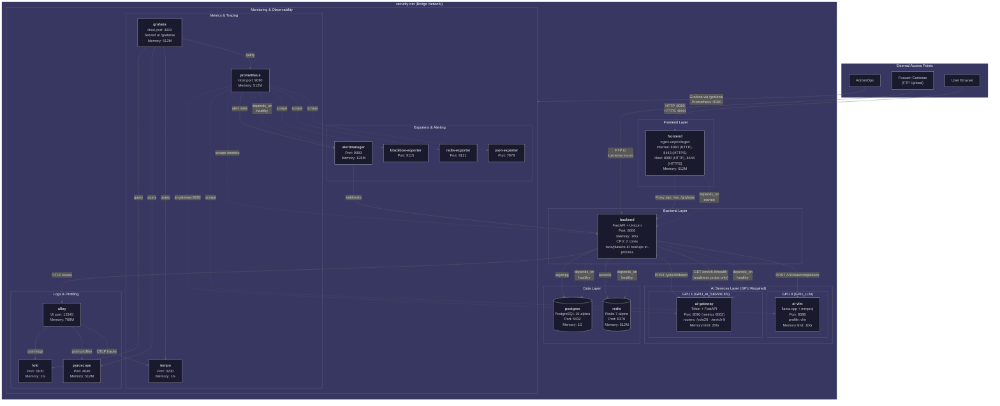
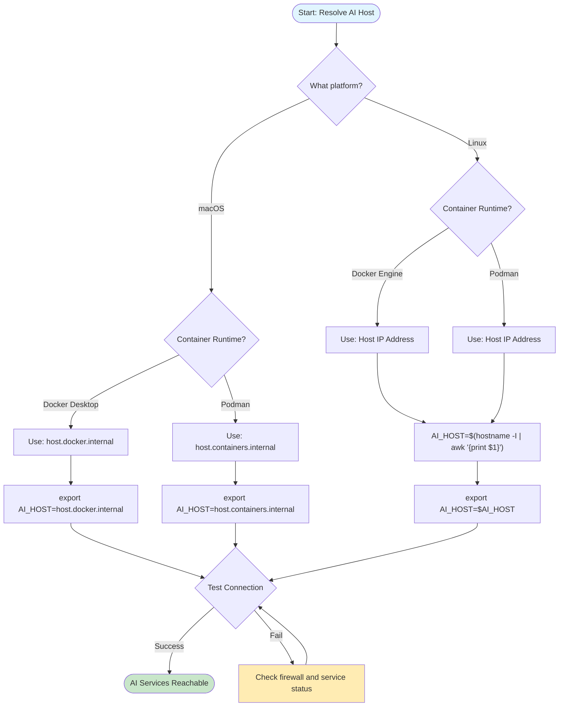

# Deployment Guide

> Complete guide for deploying Home Security Intelligence with Docker/Podman and GPU-accelerated AI services.

---

## Table of Contents

- [Quick Start](#quick-start)
- [Prerequisites](#prerequisites)
- [Container Runtime Setup](#container-runtime-setup)
- [GPU Passthrough](#gpu-passthrough)
- [Compose Files](#compose-files)
- [Deployment Options](#deployment-options)
- [AI Services Setup](#ai-services-setup)
- [Service Dependencies](#service-dependencies)
- [Deployment Checklist](#deployment-checklist)
- [Upgrade Procedures](#upgrade-procedures)
- [Rollback Procedures](#rollback-procedures)
- [Troubleshooting](#troubleshooting)

---

## Deployment Architecture

The following diagram shows the complete production deployment topology with all containers, their connections, ports, and GPU assignments.


```mermaid
%%{init: {
  'theme': 'dark',
  'themeVariables': {
    'primaryColor': '#3B82F6',
    'primaryTextColor': '#FFFFFF',
    'primaryBorderColor': '#60A5FA',
    'secondaryColor': '#A855F7',
    'tertiaryColor': '#009688',
    'background': '#121212',
    'mainBkg': '#1a1a2e',
    'lineColor': '#666666'
  }
}}%%
flowchart TB
    subgraph External["External Access Points"]
        direction LR
        USER["User Browser"]
        CAM["Foscam Cameras<br/>(FTP Upload)"]
        ADMN["Admin/Ops"]
    end

    subgraph Network["security-net (Bridge Network)"]
        subgraph FrontendLayer["Frontend Layer"]
            FE["<b>frontend</b><br/>nginx-unprivileged<br/>Internal: 8080 (HTTP), 8443 (HTTPS)<br/>Host: 8080 (HTTP), 8444 (HTTPS)<br/>Memory: 512M"]
        end

        subgraph BackendLayer["Backend Layer"]
            BE["<b>backend</b><br/>FastAPI + Uvicorn<br/>Port: 8000<br/>Memory: 10G<br/>CPU: 2 cores<br/>face/plate/re-ID lookups in-process"]
        end

        subgraph AILayer["AI Services Layer (GPU Required)"]
            direction LR
            subgraph GPU0["GPU 0 (GPU_LLM)"]
                VLM["<b>ai-vlm</b><br/>llama.cpp + mmproj<br/>Port: 8098<br/>profile: vlm<br/>Memory limit: 10G"]
            end
            subgraph GPU1["GPU 1 (GPU_AI_SERVICES)"]
                GW["<b>ai-gateway</b><br/>Triton + FastAPI<br/>Port: 8090 (metrics 8002)<br/>routers: /yolo26 · /enrich-lt<br/>Memory limit: 20G"]
            end
        end

        subgraph DataLayer["Data Layer"]
            PG[("<b>postgres</b><br/>PostgreSQL 16-alpine<br/>Port: 5432<br/>Memory: 1G")]
            RD[("<b>redis</b><br/>Redis 7-alpine<br/>Port: 6379<br/>Memory: 512M")]
        end

        subgraph MonitoringLayer["Monitoring & Observability"]
            direction TB
            subgraph MetricsTracing["Metrics & Tracing"]
                PROM["<b>prometheus</b><br/>Host port: 9090<br/>Memory: 512M"]
                TEMPO["<b>tempo</b><br/>Port: 3200<br/>Memory: 1G"]
                GRAF["<b>grafana</b><br/>Host port: 3002<br/>Served at /grafana/<br/>Memory: 512M"]
            end
            subgraph LogsProfiling["Logs & Profiling"]
                LOKI["<b>loki</b><br/>Port: 3100<br/>Memory: 1G"]
                PYRO["<b>pyroscope</b><br/>Port: 4040<br/>Memory: 512M"]
                ALLOY["<b>alloy</b><br/>UI port: 12345<br/>Memory: 768M"]
            end
            subgraph Exporters["Exporters & Alerting"]
                AM["<b>alertmanager</b><br/>Port: 9093<br/>Memory: 128M"]
                BB["<b>blackbox-exporter</b><br/>Port: 9115"]
                RE["<b>redis-exporter</b><br/>Port: 9121"]
                JE["<b>json-exporter</b><br/>Port: 7979"]
            end
        end
    end

    %% External connections
    USER -->|"HTTP :8080<br/>HTTPS :8444"| FE
    CAM -->|"FTP to<br/>/cameras mount"| BE
    ADMN -->|"Grafana via /grafana/<br/>Prometheus :9090"| MonitoringLayer

    %% Frontend to Backend
    FE -->|"Proxy /api, /ws, /grafana/"| BE

    %% Backend to Data
    BE -->|"asyncpg"| PG
    BE -->|"aioredis"| RD

    %% Backend to AI (HTTP inference calls)
    BE -->|"POST /yolo26/detect"| GW
    BE -->|"GET /enrich-lt/health<br/>(readiness probe only)"| GW
    BE -->|"POST /v1/chat/completions"| VLM

    %% Monitoring data flows
    PROM -.->|"scrape /metrics"| BE
    PROM -.->|"ai-gateway:8002"| GW
    PROM -.->|"scrape"| VLM
    PROM -.->|"scrape"| RE
    PROM -.->|"scrape"| BB
    PROM -.->|"scrape"| JE
    PROM -->|"alert rules"| AM
    AM -->|"webhooks"| BE

    GRAF -->|"query"| PROM
    GRAF -->|"query"| LOKI
    GRAF -->|"query"| TEMPO
    GRAF -->|"query"| PYRO

    ALLOY -->|"push logs"| LOKI
    ALLOY -->|"push profiles"| PYRO
    ALLOY -->|"OTLP traces"| TEMPO
    BE -->|"OTLP traces"| ALLOY

    %% Health check dependencies (startup order)
    BE -.->|"depends_on<br/>healthy"| PG
    BE -.->|"depends_on<br/>healthy"| RD
    BE -.->|"depends_on<br/>healthy"| GW
    FE -.->|"depends_on<br/>started"| BE
    PROM -.->|"depends_on<br/>healthy"| AM
```

### Architecture Summary

`docker-compose.prod.yml` defines 21 services; three sit behind compose profiles
(`vlm` → `ai-vlm`, `vllm` → `ai-llm-vllm`, `gpu-rootful` → `dcgm-exporter`), so a plain
`up -d` starts 18 and runs **without the reasoning engine**.

| Layer           | Services                                                                    | Resource Profile                               |
| --------------- | --------------------------------------------------------------------------- | ---------------------------------------------- |
| **Frontend**    | nginx reverse proxy                                                         | 512M RAM limit, 1 CPU                          |
| **Backend**     | FastAPI application server + the face / plate / person-re-ID lookups        | 10G RAM limit, 2 CPUs, GPU access              |
| **AI Services** | `ai-gateway` (Triton: `yolo26`, `reid`, `threat`) and `ai-vlm` (llama.cpp)  | GPU required; gateway 20G/8 CPU, vlm 10G/4 CPU |
| **Data**        | PostgreSQL, Redis                                                           | 1G + 512M RAM limits                           |
| **Monitoring**  | Prometheus, Grafana, Tempo, Loki, Pyroscope, Alloy, Alertmanager, exporters | ~4G RAM limits total                           |

### GPU Assignment Strategy

The default assignment puts the reasoning engine on one GPU and detection on another:

| GPU   | Service                                           | Env var               | Notes                                                      |
| ----- | ------------------------------------------------- | --------------------- | ---------------------------------------------------------- |
| GPU 0 | `ai-vlm` (llama.cpp + mmproj, profile `vlm`)      | `GPU_LLM` (0)         | Single CDI device                                          |
| GPU 1 | `ai-gateway` (Triton: `yolo26`, `reid`, `threat`) | `GPU_AI_SERVICES` (1) | All GPUs passed, then restricted by `CUDA_VISIBLE_DEVICES` |

The backend's own lookup weights (osnet, face recognizer, ALPR) load on the GPU the
backend container holds, and only when `BACKEND_MODEL_PRELOAD=true` — which `setup.py`
writes at >= 24 GB VRAM.

Per-model residency inside the gateway is set in `models.yml` (the live manifest), which
`ai/gateway/patch_triton_configs.py` applies to each Triton `config.pbtxt` at startup —
it rewrites `instance_group` kind/count/GPU index from each entry's `triton_kind`.

---

## Quick Start

```bash
# 1. Clone repository
git clone https://github.com/mikesvoboda/nemotron-v3-home-security-intelligence.git
cd nemotron-v3-home-security-intelligence

# 2. Run setup (generates .env with secure passwords)
python setup.py              # Quick mode
python setup.py --guided     # Guided mode with explanations

# 3. Download AI models (5 manifest entries, 763 MB)
./ai/download_models.sh

# 3b. Place the VLM weights yourself — no script fetches them. BOTH files:
#   ${AI_MODELS_PATH}/vlm/Qwen3VL-8B-Instruct-Q4_K_M.gguf
#   ${AI_MODELS_PATH}/vlm/mmproj-Qwen3VL-8B-Instruct-Q8_0.gguf   (Q8_0, not F16)
#   chmod 644 both — the service runs as uid 1000

# 4. Start services. --profile vlm is what starts the reasoning engine
podman compose -f docker-compose.prod.yml --profile vlm up -d

# 5. Verify deployment
curl http://localhost:8000/api/system/health/ready
curl http://localhost:8098/props | jq      # served model + build
podman logs ai-vlm 2>&1 | grep -i mmproj   # the serve can see images
```

Skipping step 3b leaves you with a reasoning engine that answers `/health` and cannot see
images; skipping `--profile vlm` leaves the container absent altogether. Both failures
leave Events landing, so nothing looks broken.

---

## Prerequisites

### Hardware Requirements

| Resource       | Minimum | Recommended | Purpose                                |
| -------------- | ------- | ----------- | -------------------------------------- |
| CPU            | 4 cores | 8 cores     | Backend workers, AI inference          |
| RAM            | 16 GB   | 32 GB       | Services + AI model loading            |
| GPU VRAM       | 8 GB    | 24 GB       | Triton residency + the VLM's GGUF pair |
| Disk Space     | 100 GB  | 500 GB      | Database, logs, media files            |
| Camera Storage | 50 GB   | 200 GB      | FTP upload directory                   |

24 GB is also the threshold `setup.py` uses to decide `BACKEND_MODEL_PRELOAD`, so it is
the point where the `faces` and `person_reid` lookup legs stop reporting `unavailable`.

### Software Requirements

| Software                 | Version | Purpose                 | Installation                                            |
| ------------------------ | ------- | ----------------------- | ------------------------------------------------------- |
| Docker or Podman         | 20.10+  | Container runtime       | See [Container Runtime Setup](#container-runtime-setup) |
| NVIDIA Driver            | 535+    | GPU support             | `apt install nvidia-driver-535`                         |
| nvidia-container-toolkit | 1.13+   | GPU passthrough         | See [GPU Passthrough](#gpu-passthrough)                 |
| PostgreSQL Client        | 15+     | Database administration | `apt install postgresql-client`                         |

### Network Requirements

All ports come from `.env`. Everything except `frontend` binds `127.0.0.1` on the
host, so the browser only ever needs the frontend ports — nginx proxies `/api`,
`/ws` and `/grafana/` internally.

| Host port | Env var                   | Service                           | Protocol | Access                       |
| --------- | ------------------------- | --------------------------------- | -------- | ---------------------------- |
| 8080      | `FRONTEND_HTTP_PORT`      | Frontend                          | HTTP     | Browser (tunnel / LAN)       |
| 8444      | `FRONTEND_HTTPS_PORT`     | Frontend (TLS)                    | HTTPS    | Browser                      |
| 8000      | `API_PORT`                | Backend API                       | HTTP/WS  | localhost / nginx proxy      |
| 8090      | `AI_GATEWAY_PORT`         | ai-gateway (detection routers)    | HTTP     | localhost / backend          |
| 8002      | `AI_GATEWAY_METRICS_PORT` | Triton Prometheus metrics         | HTTP     | localhost                    |
| 8098      | `AI_VLM_PORT`             | ai-vlm (reasoning, profile `vlm`) | HTTP     | localhost / backend          |
| 5432      | `POSTGRES_PORT`           | PostgreSQL                        | TCP      | localhost                    |
| 6379      | `REDIS_PORT`              | Redis                             | TCP      | localhost                    |
| 3002      | `GRAFANA_PORT`            | Grafana                           | HTTP     | localhost (or via /grafana/) |
| 9090      | `PROMETHEUS_PORT`         | Prometheus                        | HTTP     | localhost                    |

---

## Container Runtime Setup

This project supports Docker Engine, Docker Desktop, and Podman.

| Runtime        | Platform              | License           | Installation                                  |
| -------------- | --------------------- | ----------------- | --------------------------------------------- |
| Docker Engine  | Linux                 | Free              | `apt install docker.io`                       |
| Docker Desktop | macOS, Windows, Linux | Commercial        | [docker.com](https://docker.com)              |
| Podman         | Linux, macOS          | Free (Apache 2.0) | `brew install podman` or `dnf install podman` |

### Docker Setup

```bash
# Install Docker Engine (Linux)
sudo apt install docker.io docker-compose-plugin

# Verify installation
docker --version
docker compose version
```

### Podman Setup

```bash
# macOS
brew install podman podman-compose
podman machine init
podman machine start

# Linux (Fedora/RHEL)
sudo dnf install podman podman-compose

# Verify installation
podman info
```

### Command Equivalents

This project's runbook uses **Podman** (`podman compose` delegates to
podman-compose or the docker-compose plugin). Every command below works with
`docker` substituted for `podman`.

| Docker                           | Podman                           |
| -------------------------------- | -------------------------------- |
| `docker compose ps`              | `podman compose ps`              |
| `docker compose up -d`           | `podman compose up -d`           |
| `docker compose down`            | `podman compose down`            |
| `docker compose logs -f backend` | `podman compose logs -f backend` |
| `docker ps`                      | `podman ps -a`                   |
| `docker inspect <name>`          | `podman inspect <name>`          |

Profiled services keep the profile flag on every verb:

| Correct                                          | Silently wrong                     |
| ------------------------------------------------ | ---------------------------------- |
| `podman compose -f … --profile vlm up -d ai-vlm` | `podman compose -f … up -d ai-vlm` |
| `podman compose -f … --profile vlm logs ai-vlm`  | `podman compose -f … logs ai-vlm`  |
| `podman compose -f … --profile vlm build ai-vlm` | `podman compose -f … build ai-vlm` |

podman-compose drops a service whose profile is inactive **before** it resolves the
names on your command line, so the right-hand column reports success and does nothing.

---

## GPU Passthrough

AI services require NVIDIA GPU access via Container Device Interface (CDI).

### Prerequisites

1. NVIDIA driver 535+
2. NVIDIA Container Toolkit

### Verify GPU Access

```bash
# Verify NVIDIA driver
nvidia-smi

# Test Docker GPU access
docker run --rm --gpus all nvidia/cuda:12.0-base-ubuntu22.04 nvidia-smi

# Test Podman GPU access (CDI)
podman run --rm --device nvidia.com/gpu=all nvidia/cuda:12.0-base-ubuntu22.04 nvidia-smi
```

### Install NVIDIA Container Toolkit

```bash
# Ubuntu/Debian
curl -fsSL https://nvidia.github.io/libnvidia-container/gpgkey | sudo gpg --dearmor -o /usr/share/keyrings/nvidia-container-toolkit-keyring.gpg
curl -s -L https://nvidia.github.io/libnvidia-container/stable/deb/nvidia-container-toolkit.list | \
  sed 's#deb https://#deb [signed-by=/usr/share/keyrings/nvidia-container-toolkit-keyring.gpg] https://#g' | \
  sudo tee /etc/apt/sources.list.d/nvidia-container-toolkit.list
sudo apt update
sudo apt install -y nvidia-container-toolkit

# Configure Docker
sudo nvidia-ctk runtime configure --runtime=docker
sudo systemctl restart docker

# Generate the CDI spec Podman needs
sudo nvidia-ctk cdi generate --output=/etc/cdi/nvidia.yaml
```

---

## Compose Files

| File                      | Purpose       | AI Services    | Use Case                                |
| ------------------------- | ------------- | -------------- | --------------------------------------- |
| `docker-compose.prod.yml` | Production    | Containerized  | Full deployment with GPU                |
| `docker-compose.ghcr.yml` | Pre-built     | Detection only | GHCR pull path — see note below         |
| `docker-compose.test.yml` | Test DB/cache | None           | Local Postgres/Redis on ports 5433/6380 |
| `docker-compose.ci.yml`   | CI smoke      | Mocked         | GitHub Actions runners (no GPU)         |

There is no `docker-compose.yml` in the repository. For development you run the
backend natively (`uv run uvicorn …`) against the containers you need, or against
`docker-compose.test.yml` for a throwaway Postgres/Redis.

`docker-compose.ghcr.yml` declares 19 services with **no profiles and no `ai-vlm`
service**, and CI publishes only the `backend` and `frontend` images. Treat it as the
detection-only surface and read
[AI GHCR Deployment](../ai-ghcr-deployment.md#read-this-first-what-ghcr-actually-ships)
before using it for anything that must produce a verdict.

### Deployment Mode Selection Guide

Choose your deployment mode based on your needs:

| Question                                         | Recommended Mode                       |
| ------------------------------------------------ | -------------------------------------- |
| **First time deploying / Want simplest setup?**  | Production (`docker-compose.prod.yml`) |
| **Developing locally with code hot-reload?**     | Native backend + host AI services      |
| **Need GPU debugging / AI runs better on host?** | Hybrid (container backend + host AI)   |
| **Have a dedicated GPU server?**                 | Remote AI host mode                    |
| **Want the pre-built application images?**       | GHCR (detection only)                  |

**Decision flowchart:**

1. **Production deployment?** Use `docker-compose.prod.yml` - everything containerized, no networking complexity
2. **Active development?** Run the backend on the host for hot-reload; point `AI_GATEWAY_URL` / `AI_VLM_URL` at the host services
3. **GPU issues in containers?** Run AI services on host, backend in container (see [Deployment Modes](../deployment-modes.md))

> **Tip:** If AI services are unreachable, it's usually a networking mode mismatch. See [Deployment Modes & AI Networking](../deployment-modes.md) for URL configuration by mode.

### Production Deployment

```bash
# Start all services (add --profile vlm for the reasoning engine)
podman compose -f docker-compose.prod.yml --profile vlm up -d

# View logs
podman compose -f docker-compose.prod.yml logs -f

# Stop services
podman compose -f docker-compose.prod.yml down
```

### Development with Host AI

The repo ships no development compose file. Start only the infrastructure
containers you need, then run the AI services and backend on the host:

```bash
# Terminal 1: Infrastructure containers only
podman compose -f docker-compose.prod.yml up -d postgres redis

# Terminal 2: Detection stand-in (host port 8090 collides with ai-gateway —
# run it with ai-gateway down, or set YOLO26_PORT)
./ai/start_detector.sh

# Terminal 3: The reasoning engine. There is no host-run script for it in this
# repository — llama.cpp is built inside ai/vlm/Dockerfile. Start llama-server
# with the same pair compose passes it:
llama-server \
  --model  "${AI_MODELS_PATH:-/export/ai_models}/vlm/Qwen3VL-8B-Instruct-Q4_K_M.gguf" \
  --mmproj "${AI_MODELS_PATH:-/export/ai_models}/vlm/mmproj-Qwen3VL-8B-Instruct-Q8_0.gguf" \
  --host 0.0.0.0 --port 8098 --ctx-size 32768 --parallel 2

# Terminal 4: Backend on the host, pointed at the host AI services
export AI_GATEWAY_URL=http://localhost:8090
export AI_VLM_URL=http://localhost:8098
uv run uvicorn backend.main:app --reload --port 8000
```

The `--mmproj` flag is not decoration: without it the serve is text-only and still
answers `/health`.

### Deploy from GHCR

```bash
# Set image location (defaults match this repo, so you can skip these)
export GHCR_OWNER=mikesvoboda
export GHCR_REPO=nemotron-v3-home-security-intelligence
export IMAGE_TAG=latest

# Authenticate (requires GitHub token with read:packages)
echo $GITHUB_TOKEN | docker login ghcr.io -u YOUR_USERNAME --password-stdin

# Deploy — detection only; see the Compose Files note above
docker compose -f docker-compose.ghcr.yml up -d
```

---

## Deployment Options

### Cross-Platform Host Resolution

When backend is containerized but AI runs on the host:

| Platform | Container Runtime | Host Resolution                  |
| -------- | ----------------- | -------------------------------- |
| macOS    | Docker Desktop    | `host.docker.internal` (default) |
| macOS    | Podman            | `host.containers.internal`       |
| Linux    | Docker Engine     | Host IP address                  |
| Linux    | Podman            | Host IP address                  |

#### Container Networking Resolution Flowchart


```mermaid
flowchart TD
    Start([Start: Resolve AI Host]) --> Platform{What platform?}

    Platform -->|macOS| MacRuntime{Container Runtime?}
    Platform -->|Linux| LinuxRuntime{Container Runtime?}

    MacRuntime -->|Docker Desktop| MacDocker[Use: host.docker.internal]
    MacRuntime -->|Podman| MacPodman[Use: host.containers.internal]

    LinuxRuntime -->|Docker Engine| LinuxDocker[Use: Host IP Address]
    LinuxRuntime -->|Podman| LinuxPodman[Use: Host IP Address]

    MacDocker --> SetEnv1["export AI_HOST=host.docker.internal"]
    MacPodman --> SetEnv2["export AI_HOST=host.containers.internal"]
    LinuxDocker --> GetIP["AI_HOST=$(hostname -I | awk '{print $1}')"]
    LinuxPodman --> GetIP

    SetEnv1 --> Verify{Test Connection}
    SetEnv2 --> Verify
    GetIP --> SetEnv3["export AI_HOST=$AI_HOST"] --> Verify

    Verify -->|Success| Done([AI Services Reachable])
    Verify -->|Fail| Debug[Check firewall and service status]
    Debug --> Verify

    style Start fill:#e1f5fe
    style Done fill:#c8e6c9
    style Debug fill:#ffecb3
```

```bash
# macOS with Docker Desktop — AI services on the host
export AI_GATEWAY_URL=http://host.docker.internal:8090
export AI_VLM_URL=http://host.docker.internal:8098

# macOS with Podman
export AI_GATEWAY_URL=http://host.containers.internal:8090
export AI_VLM_URL=http://host.containers.internal:8098

# Linux (Docker or Podman) — substitute your host LAN address
HOST_IP=$(hostname -I | awk '{print $1}')
export AI_GATEWAY_URL=http://$HOST_IP:8090
export AI_VLM_URL=http://$HOST_IP:8098
```

These are the `.env` values the backend container reads; there is no `AI_HOST`
variable in the codebase or in any compose file.

### AI Service URLs by Deployment Mode

**Production (docker-compose.prod.yml):**

```bash
# AI services on compose network (internal DNS) — set by docker-compose.prod.yml
USE_AI_GATEWAY=true
AI_GATEWAY_URL=http://ai-gateway:8090
YOLO26_URL=http://ai-gateway:8090/yolo26
ENRICHMENT_LIGHT_URL=http://ai-gateway:8090/enrich-lt
AI_VLM_URL=http://ai-vlm:8098
```

`YOLO26_URL` and `ENRICHMENT_LIGHT_URL` carry a router path on the gateway's single
port; they are not separate services. `ENRICHMENT_LIGHT_URL` is a **readiness** probe
target only — the live re-ID leg is `osnet_loader`, in-process in the backend.

**Development with host AI:**

```bash
YOLO26_URL=http://localhost:8090/yolo26
AI_VLM_URL=http://localhost:8098
```

**Docker Desktop (macOS/Windows):**

```bash
YOLO26_URL=http://host.docker.internal:8090/yolo26
AI_VLM_URL=http://host.docker.internal:8098
```

> [!IMPORTANT]
> `AI_VLM_URL` is the value that gets missed. The backend's code default is
> `http://localhost:8098`, which inside a container is the container itself: every
> verdict lands `verification_failed` with a NULL `risk_score` while events keep
> arriving. Compose closes the hole with `AI_VLM_URL=${AI_VLM_URL:-http://ai-vlm:8098}`;
> a host-run or remote AI setup must set it explicitly.

---

## AI Services Setup

### AI Architecture

Production AI is **two containers**:

| Service      | Port          | What it serves                                                                   |
| ------------ | ------------- | -------------------------------------------------------------------------------- |
| `ai-gateway` | 8090 (m 8002) | Triton + FastAPI. Routers `/yolo26` (detection) and `/enrich-lt` (readiness)     |
| `ai-vlm`     | 8098          | llama.cpp + mmproj, OpenAI-compatible `POST /v1/chat/completions`, profile `vlm` |

Gateway Triton residency is `yolo26` + `reid`, plus `threat` when
`GATEWAY_ENABLE_THREAT=true` (the shipped default is `false`). Both
`GATEWAY_MODEL_SET` and `PIPELINE_MODE` accept only `vlm` and raise at boot on anything
else.

Triton's Prometheus metrics are on a second gateway port (`AI_GATEWAY_METRICS_PORT`,
default 8002), scraped by the `triton-metrics` job.

The face, plate and person-re-ID lookups are **not** services. They run in-process in
the backend (`face_recognizer_loader`, `fast_alpr_loader`, `osnet_loader`) and are
gated by `BACKEND_MODEL_PRELOAD`, which ships `false`. Read
`hsi_specialist_unavailable_total` on `:8000/metrics` rather than probing a port.

### Model Downloads

`models.yml` at the repo root is the live model manifest. `./ai/download_models.sh`
implements the download phases it declares (see the file's own header for the
`download_phase` ordering).

```bash
# Automated download (manifest: models.yml)
./ai/download_models.sh
```

The rule selects **5 of the manifest's 10 entries — 763 MB** by the manifest's own
`size_mb` estimates (the full catalogue sums to 1,483 MB). **The VLM's GGUF pair is not
among them**: nothing in this repository fetches those weights, and the model check only
reads the env string, so a fabricated env naming nonexistent files still passes. Place
them per [AI Installation](../ai-installation.md).

### Production Model Specifications

| Model                         | File                                   | Size on disk    | Slot math                                                              |
| ----------------------------- | -------------------------------------- | --------------- | ---------------------------------------------------------------------- |
| Qwen3-VL 8B Instruct (Q4_K_M) | `Qwen3VL-8B-Instruct-Q4_K_M.gguf`      | 5,027,784,800 B | `VLM_CTX_SIZE=32768` split across `VLM_PARALLEL=2` ⇒ 16,384-token slot |
| Its projector (Q8_0)          | `mmproj-Qwen3VL-8B-Instruct-Q8_0.gguf` | 752,289,728 B   | Empty `VLM_MMPROJ_PATH` ⇒ a text-only serve                            |

The four settings `VLM_MODEL_ID`, `VLM_MODEL_PATH`, `VLM_MMPROJ_PATH` and
`VLM_MODEL_ALIAS` are one identity in four spellings, pinned together by
`test_ai_vlm_compose_service.py` — change them as a set.

`CTX_SIZE=262144` / `PARALLEL=8` in `.env.example` belong to the backend's separate
legacy budget field and are **not** what the `ai-vlm` container runs on; the server and
the backend's prompt fitter both read `VLM_CTX_SIZE` / `VLM_PARALLEL`.

### Verify AI Services

```bash
# Health checks
curl http://localhost:8090/health            # ai-gateway (aggregate across Triton models)
curl http://localhost:8090/yolo26/health     # per-router
curl http://localhost:8090/enrich-lt/health  # readiness lane
curl http://localhost:8098/health            # ai-vlm is UP — does NOT prove multimodal
curl http://localhost:8098/props | jq         # served model + build string

# The actual multimodal proof
podman logs ai-vlm 2>&1 | grep -i mmproj
```

---

## Service Dependencies

### Startup Order

Services start in dependency order via Docker Compose health checks.

#### Service Startup Sequence Diagram

```mermaid
sequenceDiagram
    autonumber
    participant DC as Docker Compose
    participant PG as PostgreSQL
    participant RD as Redis
    participant GW as ai-gateway
    participant VLM as ai-vlm
    participant BE as Backend
    participant FE as Frontend

    Note over DC,FE: Phase 1: Data Infrastructure (0-15s)
    DC->>PG: Start PostgreSQL
    DC->>RD: Start Redis
    PG-->>DC: Healthy (start_period 10s)
    RD-->>DC: Healthy

    Note over DC,FE: Phase 2: AI Services
    DC->>GW: Start ai-gateway
    DC->>VLM: Start ai-vlm (only if --profile vlm was passed)
    GW-->>DC: Healthy (start_period 180s — Triton loads its resident models)
    VLM-->>DC: Healthy (start_period 120s — GGUF pair to GPU)

    Note over DC,FE: Phase 3: Application (30-60s)
    DC->>BE: Start Backend (depends: foscam-init completed; PG, RD, ai-gateway, go2rtc healthy)
    BE->>PG: Connect
    BE->>RD: Connect
    BE-->>DC: Healthy (start_period 30s)

    Note over DC,FE: Phase 4: Frontend (10-20s)
    DC->>FE: Start Frontend (depends: backend started)
    FE->>BE: Health check
    FE-->>DC: Healthy (start_period 40s)
```

**Phase 1: Data Infrastructure (0-15s)**

- PostgreSQL — `start_period: 10s`
- Redis — healthcheck on `redis-cli ping`

**Phase 2: AI Services**

- `ai-gateway` — `start_period: 180s`. Triton initialises the resident model set from
  the repository `GATEWAY_MODEL_SET` keeps.
- `ai-vlm` — `start_period: 120s`, mirroring the image's own
  `HEALTHCHECK --start-period=120s`. **`backend` does not depend on it**, which is why a
  missing profile yields a green stack and a stalling pipeline.

**Phase 3: Application (30-60s)**

- Backend — `start_period: 30s`, waits for `foscam-init` (completed), and Postgres,
  Redis, `ai-gateway` and `go2rtc` to report healthy.

**Phase 4: Frontend (10-20s)**

- Frontend — `start_period: 40s`, waits for Backend to start (not healthy).

### Health Check Configuration

Straight from `docker-compose.prod.yml`:

```yaml
backend:
  healthcheck:
    test:
      [
        'CMD-SHELL',
        'python -c "import httpx; r = httpx.get(''http://localhost:8000/api/system/health/ready''); exit(0 if r.status_code == 200 else 1)"',
      ]
    interval: 10s
    timeout: 5s
    retries: 3
    start_period: 30s
  depends_on:
    foscam-init:
      condition: service_completed_successfully
    postgres:
      condition: service_healthy
    redis:
      condition: service_healthy
    ai-gateway:
      condition: service_healthy
    go2rtc:
      condition: service_healthy
```

### Dependency Matrix

| Service    | Hard Dependencies                                  | Soft Dependencies         | Auto-Recovers  |
| ---------- | -------------------------------------------------- | ------------------------- | -------------- |
| PostgreSQL | None                                               | None                      | N/A            |
| Redis      | None                                               | None                      | N/A            |
| ai-gateway | GPU                                                | None                      | No             |
| ai-vlm     | GPU, compose profile `vlm`                         | None                      | No             |
| Backend    | foscam-init, PostgreSQL, Redis, ai-gateway, go2rtc | ai-vlm (via `AI_VLM_URL`) | AI via monitor |
| Frontend   | Backend (started, not healthy)                     | None                      | No             |
| Prometheus | Alertmanager (healthy)                             | None                      | No             |
| Grafana    | Prometheus (healthy)                               | None                      | No             |
| Alloy      | Loki, Pyroscope                                    | None                      | No             |

`ai-vlm` being a soft dependency is the shape of the failure: the backend starts and
serves the dashboard whether or not anything can produce a verdict.

---

## Deployment Checklist

### Pre-Deployment

- [ ] Docker/Podman installed and running
- [ ] NVIDIA driver and container toolkit installed (`nvidia-smi` works)
- [ ] CDI spec exists (`ls /etc/cdi/nvidia.yaml`)
- [ ] Camera FTP directory exists and is accessible
- [ ] AI models downloaded (`./ai/download_models.sh`)
- [ ] **VLM GGUF pair placed by hand in `${AI_MODELS_PATH}/vlm` and `chmod 644`**
- [ ] Network ports are not in use by other services
- [ ] Firewall rules allow required traffic
- [ ] `.env` file created via `python setup.py`

### Deployment Steps

1. **Start services:**

   ```bash
   podman compose -f docker-compose.prod.yml --profile vlm up -d
   ```

2. **Monitor startup:**

   ```bash
   podman compose -f docker-compose.prod.yml logs -f
   ```

3. **Verify health:**

   ```bash
   # Gateway needs ~3 min for Triton; check the profile actually took
   curl http://localhost:8000/api/system/health/ready
   podman ps -a --filter name=ai-vlm
   ```

4. **Test AI pipeline:**

   ```bash
   # Drop any JPEG into a camera directory under FOSCAM_BASE_PATH
   mkdir -p /export/foscam/test_camera
   cp /path/to/any-image.jpg /export/foscam/test_camera/test_$(date +%s).jpg

   # Monitor processing
   podman compose -f docker-compose.prod.yml logs -f backend | grep -E "detect|batch|analyze"
   ```

   Then read the verdict, not the alerts table — **no event auto-creates an Alert on
   this path**:

   ```sql
   SELECT verdict, count(*), max(created_at)
   FROM events e JOIN event_verifications ev ON ev.event_id = e.id
   GROUP BY verdict ORDER BY max(created_at) DESC;
   ```

5. **Access dashboard:**
   - Open `http://localhost:8080` (or `https://localhost:8444` when `SSL_ENABLED=true`)
   - Complete first-time admin registration at `/setup` — until then every API
     call returns 503 from the setup guard
   - Verify WebSocket connection status, camera grid and activity feed

### Post-Deployment

- [ ] Dashboard accessible
- [ ] Health endpoint returns healthy
- [ ] `events` rows carry a populated `risk_score` (not NULL `verification_failed`)
- [ ] WebSocket connection working
- [ ] Test image processed successfully
- [ ] GPU metrics displaying

---

## Upgrade Procedures

### Pre-Upgrade

- [ ] Read release notes for breaking changes
- [ ] Backup database
- [ ] Check disk space (at least 10 GB free)
- [ ] Review new environment variables in `.env.example`

### Upgrade Steps

```bash
# 1. Backup
podman compose -f docker-compose.prod.yml exec -T postgres pg_dump -U security -d security -F c > backup-pre-upgrade-$(date +%Y%m%d).dump
cp .env .env.backup-$(date +%Y%m%d)

# 2. Pull updates
git fetch origin
git pull origin main

# 3. Review config changes
diff .env.example .env

# 4. Stop services
podman compose -f docker-compose.prod.yml down

# 5. Rebuild and start (always --no-cache: cached layers hold stale code)
podman compose -f docker-compose.prod.yml build --no-cache
podman compose -f docker-compose.prod.yml --profile vlm build --no-cache ai-vlm
podman compose -f docker-compose.prod.yml --profile vlm up -d

# 6. Verify
curl http://localhost:8000/api/system/health/ready
```

There is no Alembic step. This project has no Alembic migrations (the tree was
removed in PR #4465); `init_db()` runs `create_all` at backend startup, which adds
new tables and columns but never alters existing ones. Apply destructive schema
changes by hand against the running database, see
[Migrations](../../architecture/data-model/migrations.md).

---

## Rollback Procedures

### Application Rollback (Database Intact)

```bash
# 1. Stop current version
podman compose -f docker-compose.prod.yml down

# 2. Checkout previous version
git checkout <previous-commit-sha>

# 3. Restore config if needed
cp .env.backup-<date> .env

# 4. Restart
podman compose -f docker-compose.prod.yml --profile vlm up -d

# 5. Verify
curl http://localhost:8000/api/system/health/ready
```

### Database Rollback

```bash
# 1. Stop all services
podman compose -f docker-compose.prod.yml down

# 2. Start only PostgreSQL
podman compose -f docker-compose.prod.yml up -d postgres
until podman compose -f docker-compose.prod.yml exec postgres pg_isready -U security; do sleep 1; done

# 3. Drop and recreate database
podman compose -f docker-compose.prod.yml exec postgres psql -U security -d postgres -c "DROP DATABASE security;"
podman compose -f docker-compose.prod.yml exec postgres psql -U security -d postgres -c "CREATE DATABASE security;"

# 4. Restore from backup
podman compose -f docker-compose.prod.yml exec -T postgres pg_restore -U security -d security < backup-pre-upgrade-<date>.dump

# 5. Checkout previous code and restart
git checkout <previous-commit>
podman compose -f docker-compose.prod.yml --profile vlm up -d
```

### Rollback Decision Matrix

| Symptom                 | Action                            | Downtime  |
| ----------------------- | --------------------------------- | --------- |
| Frontend UI broken      | Rollback frontend only            | 1-2 min   |
| API errors, DB intact   | Rollback backend only             | 2-5 min   |
| Database corruption     | Restore DB backup + rollback code | 10-30 min |
| AI service crash loop   | Check GPU, restart AI services    | 5-10 min  |
| Complete system failure | Full rollback (all services + DB) | 15-45 min |

---

## Troubleshooting

### Service Won't Start

```bash
# Check container status
podman compose -f docker-compose.prod.yml ps

# Check logs for specific service
podman compose -f docker-compose.prod.yml logs backend
podman compose -f docker-compose.prod.yml logs ai-gateway
podman compose -f docker-compose.prod.yml --profile vlm logs ai-vlm

# Check health endpoint
curl -v http://localhost:8000/health
```

### AI Services Unreachable

1. **Check AI container status** — note whether `ai-vlm` is **absent** (profile never
   applied) or stopped (a crash):

   ```bash
   podman ps -a --filter name=ai-gateway --filter name=ai-vlm
   ```

2. **Test health endpoints directly:**

   ```bash
   curl http://localhost:8090/health
   curl http://localhost:8098/health
   curl http://localhost:8098/props
   ```

3. **Check GPU access:**

   ```bash
   nvidia-smi
   podman compose -f docker-compose.prod.yml exec ai-gateway nvidia-smi
   ```

4. **Verify URL configuration:**
   - Check [Deployment Modes](../deployment-modes.md) for correct URLs

### GPU Out of Memory

```bash
# Check GPU usage
nvidia-smi

# Restart AI services (name each one; the profile has to be on the command line)
podman compose -f docker-compose.prod.yml restart ai-gateway
podman compose -f docker-compose.prod.yml --profile vlm up -d --force-recreate ai-vlm
```

Prefer letting the VLM release its VRAM between bursts (lower
`VLM_SLEEP_IDLE_SECONDS`, default 300) over shrinking the model. `VLM_GPU_LAYERS=auto`
already fits what the card allows.

### Database Connection Failed

```bash
# Check PostgreSQL status
podman compose -f docker-compose.prod.yml exec postgres pg_isready -U security

# Check logs
podman compose -f docker-compose.prod.yml logs postgres

# Verify DATABASE_URL in .env
grep DATABASE_URL .env
```

### Health Check Timeout

Both AI services have a deliberate warm-up window before a failure is counted:
`ai-gateway` 180s (Triton model load), `ai-vlm` 120s (GGUF copy). An `unhealthy`
report inside that window means early, not broken — wait it out before editing the
compose file, and if you must raise `ai-vlm`'s number, raise the image's own
`HEALTHCHECK --start-period` with it so the two stay in agreement.

---

## See Also

- [Operator Hub](../README.md) - Main operator documentation
- [GPU Setup Guide](../gpu-setup.md) - Detailed GPU configuration
- [AI Services Overview](../ai-overview.md) - AI architecture and configuration
- [AI GHCR Deployment](../ai-ghcr-deployment.md) - What the GHCR surface actually ships
- [Monitoring Guide](../monitoring/README.md) - Health checks and metrics
- [Administration Guide](../admin/README.md) - Configuration and secrets
