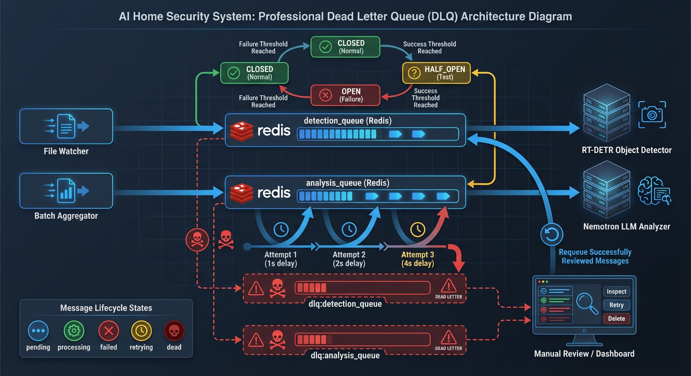

# Dead Letter Queue Management

> Monitor and recover failed AI pipeline jobs through the DLQ dashboard.

**Time to read:** ~8 min
**Prerequisites:** System running, access to dashboard

---

## Overview

The Dead Letter Queue (DLQ) is a holding area for jobs that have failed processing in the AI pipeline after exhausting all retry attempts. This guide covers how to monitor, investigate, and recover failed jobs using the DLQ dashboard.

### Why Jobs End Up in the DLQ

Jobs move to the DLQ when they fail repeatedly. Common causes include:

| Failure Type            | Description                           | Queue Affected  |
| ----------------------- | ------------------------------------- | --------------- |
| AI Service Unavailable  | YOLO26 or Nemotron container is down  | Both queues     |
| Service Timeout         | AI processing took too long           | Both queues     |
| GPU Memory Exhausted    | VRAM full, model cannot process       | Both queues     |
| File Not Found          | Image deleted before processing       | Detection queue |
| Invalid Image Format    | Corrupted or unsupported image        | Detection queue |
| Context Length Exceeded | Too many detections in analysis batch | Analysis queue  |

### DLQ Architecture



_Dead Letter Queue flow showing message lifecycle, retry mechanism, and manual review path._

```
┌─────────────────┐     ┌─────────────────┐     ┌─────────────────┐
│  File Watcher   │────▶│ detection_queue │────▶│    YOLO26      │
└─────────────────┘     └─────────────────┘     │   Detector      │
                                │               └─────────────────┘
                                │ (after 3 failed retries)
                                ▼
                        ┌─────────────────┐
                        │ dlq:detection_  │
                        │ queue           │
                        └─────────────────┘

┌─────────────────┐     ┌─────────────────┐     ┌─────────────────┐
│ Batch           │────▶│ analysis_queue  │────▶│   Nemotron      │
│ Aggregator      │     └─────────────────┘     │     LLM         │
└─────────────────┘             │               └─────────────────┘
                                │ (after 3 failed retries)
                                ▼
                        ┌─────────────────┐
                        │ dlq:analysis_   │
                        │ queue           │
                        └─────────────────┘
```

---

## Retry Behavior

Before a job reaches the DLQ, the system attempts processing with exponential backoff:

| Setting          | Default | Description                                |
| ---------------- | ------- | ------------------------------------------ |
| Max Retries      | 3       | Number of attempts before DLQ              |
| Base Delay       | 1s      | Initial delay between retries              |
| Max Delay        | 30s     | Maximum delay between retries              |
| Exponential Base | 2.0     | Multiplier for delay (1s, 2s, 4s...)       |
| Jitter           | 0-25%   | Random variance to prevent thundering herd |

---

## DLQ Dashboard

The DLQ Monitor is available in the Settings page of the dashboard. It provides real-time visibility into failed jobs.

### Accessing the Dashboard

1. Navigate to **Settings** in the main navigation
2. Scroll to the **Dead Letter Queue** section
3. The monitor auto-refreshes every 30 seconds

### Dashboard Features

**Total Failed Badge**

- Shows aggregate count of failed jobs across all queues
- Red badge indicates attention needed

**Queue Panels**

- Expandable panels for each queue (Detection and Analysis)
- Shows count per queue
- Click to expand and view individual jobs

**Job Details**
Each failed job displays:

- **Error Message**: The last error that caused failure
- **Attempt Count**: Number of processing attempts made
- **First Failed At**: When the job first failed
- **Last Failed At**: When the job most recently failed
- **Original Payload**: Expandable view of the original job data

---

## Viewing Failed Items

### Via Dashboard

1. Expand a queue panel to see individual jobs
2. Review error messages to understand failure causes
3. Click "View payload" to inspect the original job data
4. Look for patterns: same camera, similar timestamps, common errors

### Via API

```bash
# Get DLQ statistics
curl http://localhost:8000/api/dlq/stats

# List jobs in detection DLQ (first 100)
curl "http://localhost:8000/api/dlq/jobs/dlq:detection_queue?limit=100"

# List jobs in analysis DLQ with pagination
curl "http://localhost:8000/api/dlq/jobs/dlq:analysis_queue?start=100&limit=50"
```

### Error Context (Enhanced Debugging)

Each DLQ job includes enriched error context for faster debugging:

| Field           | Description                                    |
| --------------- | ---------------------------------------------- |
| `error_type`    | Exception class name (e.g., `ConnectionError`) |
| `stack_trace`   | Truncated stack trace (max 4KB)                |
| `http_status`   | HTTP status code if network error              |
| `response_body` | Truncated AI service response (max 2KB)        |
| `retry_delays`  | Actual delays applied between retries          |
| `context`       | System state at failure (queue depths, etc.)   |

---

## Retry Functionality

### Requeue All Jobs

The "Requeue All" button moves all jobs from a DLQ back to their original processing queue for retry.

**Via Dashboard:**

1. Expand the queue panel
2. Click "Requeue All"
3. Confirm the action in the dialog
4. Jobs are moved to the processing queue

**Via API:**

```bash
# Requeue all detection failures
curl -X POST http://localhost:8000/api/dlq/requeue-all/dlq:detection_queue \
  -H "X-API-Key: your-api-key"

# Requeue all analysis failures
curl -X POST http://localhost:8000/api/dlq/requeue-all/dlq:analysis_queue \
  -H "X-API-Key: your-api-key"
```

**Limits:**

- Maximum 10,000 jobs requeued per call (configurable via `MAX_REQUEUE_ITERATIONS`)
- If more jobs exist, the response indicates the limit was hit

### Requeue Single Job

```bash
# Requeue oldest job from DLQ
curl -X POST http://localhost:8000/api/dlq/requeue/dlq:detection_queue \
  -H "X-API-Key: your-api-key"
```

---

## Clearing/Purging the DLQ

### When to Clear

Clear the DLQ when jobs are:

- From deleted cameras (no longer relevant)
- Old files that no longer exist
- Known invalid data that shouldn't be reprocessed

### Via Dashboard

1. Expand the queue panel
2. Click "Clear All"
3. Confirm the destructive action
4. All jobs are permanently deleted

### Via API

```bash
# Clear detection DLQ
curl -X DELETE http://localhost:8000/api/dlq/dlq:detection_queue \
  -H "X-API-Key: your-api-key"

# Clear analysis DLQ
curl -X DELETE http://localhost:8000/api/dlq/dlq:analysis_queue \
  -H "X-API-Key: your-api-key"
```

> **Warning:** Clearing the DLQ permanently deletes all jobs. This cannot be undone. Always review jobs before clearing.

---

## Monitoring DLQ Health

### Dashboard Indicators

- **Badge Color**: Red indicates failed jobs present
- **Queue Count**: Number next to each queue name
- **Auto-Refresh**: Dashboard updates every 30 seconds

### API Monitoring

```bash
# Quick health check
curl http://localhost:8000/api/dlq/stats | jq '.total_count'

# Watch DLQ growth
watch -n 10 'curl -s http://localhost:8000/api/dlq/stats | jq'
```

### Prometheus Metrics (NEM-3891)

The DLQ depth is exposed as a Prometheus gauge metric for alerting and dashboards:

| Metric                               | Labels       | Description                   |
| ------------------------------------ | ------------ | ----------------------------- |
| `hsi_dlq_depth`                      | `queue_name` | Current number of jobs in DLQ |
| `hsi_queue_items_moved_to_dlq_total` | `queue_name` | Cumulative jobs moved to DLQ  |

**Example PromQL Queries:**

```promql
# Total jobs in all DLQs
sum(hsi_dlq_depth)

# Jobs in detection DLQ only
hsi_dlq_depth{queue_name="dlq:detection_queue"}

# Rate of jobs moving to DLQ per minute
rate(hsi_queue_items_moved_to_dlq_total[5m]) * 60
```

### Prometheus Alerts

The following alerts are pre-configured in `monitoring/prometheus_rules.yml`:

| Alert            | Threshold   | Severity | Description                                 |
| ---------------- | ----------- | -------- | ------------------------------------------- |
| AIDLQHasMessages | > 0 for 5m  | Warning  | DLQ has failed messages requiring attention |
| AIDLQGrowing     | +5 in 15m   | Warning  | DLQ growing rapidly (systemic issue)        |
| AIDLQCritical    | > 50 for 2m | Critical | DLQ critically large (data loss risk)       |

### Circuit Breaker Protection

The DLQ has circuit breaker protection to prevent cascading failures when Redis is overloaded:

| State     | Behavior                                     |
| --------- | -------------------------------------------- |
| CLOSED    | Normal operation, jobs written to DLQ        |
| OPEN      | DLQ writes skipped, jobs logged as DATA LOSS |
| HALF_OPEN | Testing recovery, limited writes             |

**Configuration:**

| Variable                                  | Default | Description                   |
| ----------------------------------------- | ------- | ----------------------------- |
| `DLQ_CIRCUIT_BREAKER_FAILURE_THRESHOLD`   | 5       | Failures before circuit opens |
| `DLQ_CIRCUIT_BREAKER_RECOVERY_TIMEOUT`    | 60s     | Wait before testing recovery  |
| `DLQ_CIRCUIT_BREAKER_HALF_OPEN_MAX_CALLS` | 3       | Test calls in half-open state |
| `DLQ_CIRCUIT_BREAKER_SUCCESS_THRESHOLD`   | 2       | Successes needed to close     |

When the circuit is open, check logs for `CRITICAL DATA LOSS` entries.

---

## Recovery Workflows

### After AI Service Outage

1. **Verify services are healthy**

   ```bash
   curl http://localhost:8000/api/system/health
   curl http://localhost:8090/health  # YOLO26
   curl http://localhost:8091/health  # Nemotron
   ```

2. **Check DLQ size**

   ```bash
   curl http://localhost:8000/api/dlq/stats
   ```

3. **Requeue all jobs for retry**

   ```bash
   curl -X POST http://localhost:8000/api/dlq/requeue-all/dlq:detection_queue \
     -H "X-API-Key: your-api-key"
   curl -X POST http://localhost:8000/api/dlq/requeue-all/dlq:analysis_queue \
     -H "X-API-Key: your-api-key"
   ```

4. **Monitor for new failures**
   ```bash
   watch -n 5 'curl -s http://localhost:8000/api/dlq/stats'
   ```

### Investigating Recurring Failures

1. **List failed jobs**

   ```bash
   curl "http://localhost:8000/api/dlq/jobs/dlq:detection_queue?limit=20" | jq
   ```

2. **Look for patterns**

   - Same camera_id: Camera configuration issue
   - Same error: Systemic problem
   - Clustered timestamps: Transient outage

3. **Check error context**
   - `error_type`: Category of failure
   - `http_status`: Network/service issues
   - `context`: System state at failure time

### Handling Stale Jobs

Jobs may become stale when:

- Source files were deleted
- Camera was removed from system
- Retention policy cleaned up data

**Identify stale jobs:**

```bash
# List jobs and check file_path existence
curl "http://localhost:8000/api/dlq/jobs/dlq:detection_queue" | \
  jq '.jobs[] | .original_job.file_path'
```

**Clear if confirmed stale:**

```bash
curl -X DELETE http://localhost:8000/api/dlq/dlq:detection_queue \
  -H "X-API-Key: your-api-key"
```

---

## Authentication

Destructive operations (requeue, clear) require API key authentication when `API_KEY_ENABLED=true`:

**HTTP Header (preferred):**

```
X-API-Key: your-api-key
```

**Query Parameter (fallback):**

```
?api_key=your-api-key
```

Read-only operations (stats, list jobs) do not require authentication.

---

## Configuration Reference

| Variable                 | Default | Description                      |
| ------------------------ | ------- | -------------------------------- |
| `MAX_REQUEUE_ITERATIONS` | 10000   | Max jobs requeued in single call |
| `API_KEY_ENABLED`        | false   | Require auth for destructive ops |
| `API_KEYS`               | []      | Valid API keys (JSON array)      |

---

## Related Documentation

- [DLQ API Reference](../developer/api/ai-pipeline.md) - Complete API documentation
- [Architecture: Resilience](../architecture/resilience.md) - Retry and circuit breaker patterns
- [AI Troubleshooting](ai-troubleshooting.md) - Diagnosing AI service issues
- [Monitoring Guide](monitoring.md) - System health monitoring

---

[Back to Operator Hub](./)
